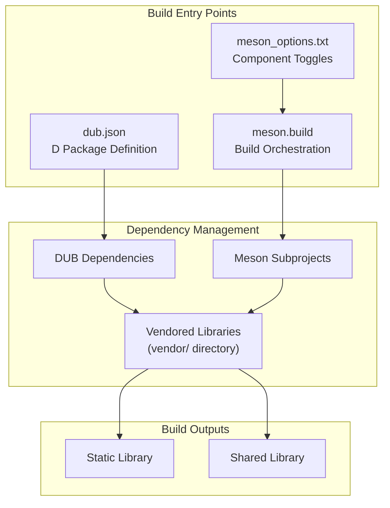
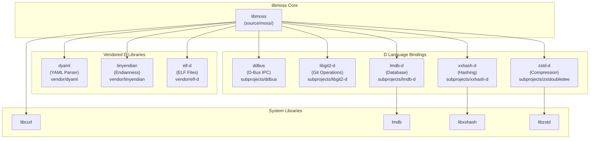
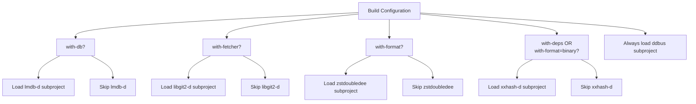

# Overview

Relevant source files

* [README.md](../README.md)
* [dub.json](../dub.json)
* [meson.build](../meson.build)
* [meson\_options.txt](../meson_options.txt)

## Purpose and Scope

This document provides a high-level introduction to libmoss, a unified library for moss internal components developed for Serpent OS. It covers the project's architecture philosophy, modular component structure, and technology stack. For detailed information about building the library, see [Building libmoss](2-building-libmoss). For in-depth documentation of individual components, see [Library Components](3-library-components).

**Important**: As noted in the project README, **this project is no longer active**. This documentation is maintained for historical reference and for those working with existing installations.

Sources: [README.md1-9](../README.md#L1-L9)

## Project Status

libmoss is an inactive project that served as the unified library foundation for Serpent OS's internal tooling. The last release was version 1.2.1, with development activity spanning from 2020 to 2023.

Sources: [README.md1](../README.md#L1-L1) [dub.json5-8](../dub.json#L5-L8)

## What is libmoss?

libmoss is a D language library that provides a unified collection of internal libraries for the moss package manager and related Serpent OS tooling. The project consolidates functionality for configuration management, database operations, dependency resolution, data format handling, and content fetching into a single, modular library with selective compilation support.

The library is licensed under the Zlib license and requires the LDC D compiler version 1.31.0 or later.

Sources: [dub.json1-12](../dub.json#L1-L12) [meson.build1-8](../meson.build#L1-L8)

## Architecture Philosophy

libmoss follows a **modular architecture** where functionality is divided into independent components that can be selectively enabled or disabled at build time. This design allows consumers to compile only the functionality they need, reducing binary size and compilation time.

### Core Design Principles

| Principle | Implementation |
| --- | --- |
| **Mandatory Core** | `moss-core` is always included and provides foundational functionality |
| **Optional Modules** | Five optional modules can be independently enabled: `moss-config`, `moss-db`, `moss-deps`, `moss-format`, `moss-fetcher` |
| **Sub-component Granularity** | Some modules offer finer-grained selection (e.g., binary vs. source format, HTTP vs. Git fetching) |
| **Build-time Configuration** | Component selection happens at build time via Meson options or DUB configuration |

Sources: [meson.build14-52](../meson.build#L14-L52) [meson\_options.txt1-5](../meson_options.txt#L1-L5)

## Component Structure

libmoss consists of six primary components organized under the `source/moss/` directory structure. The following diagram maps the conceptual components to their actual code organization:

### Component Architecture

```mermaid
flowchart TD

CORE["moss-core<br>(source/moss/core/)"]
CONFIG["moss-config<br>(source/moss/config/)"]
DB["moss-db<br>(source/moss/db/)"]
DEPS["moss-deps<br>(source/moss/deps/)"]
FORMAT["moss-format<br>(source/moss/format/)"]
FETCHER["moss-fetcher<br>(source/moss/fetcher/)"]
CORE_BUILD["Always Included"]
CONFIG_BUILD["--with-config<br>(default: true)"]
DB_BUILD["--with-db<br>(default: true)"]
DEPS_BUILD["--with-deps<br>(default: true)"]
FORMAT_BUILD["--with-format<br>(binary|source|true|false)<br>(default: true)"]
FETCHER_BUILD["--with-fetcher<br>(http|git|true|false)<br>(default: http)"]
FORMAT_BINARY["Binary Format Support<br>with-format=binary"]
FORMAT_SOURCE["Source Format Support<br>with-format=source"]
FETCHER_HTTP["HTTP Fetching Support<br>with-fetcher=http"]
FETCHER_GIT["Git Fetching Support<br>with-fetcher=git"]

CORE --> CORE_BUILD
CONFIG --> CONFIG_BUILD
DB --> DB_BUILD
DEPS --> DEPS_BUILD
FORMAT --> FORMAT_BUILD
FETCHER --> FETCHER_BUILD
FORMAT --> FORMAT_BINARY
FORMAT --> FORMAT_SOURCE
FETCHER --> FETCHER_HTTP
FETCHER --> FETCHER_GIT

subgraph subGraph1 ["Build Configuration"]
    CORE_BUILD
    CONFIG_BUILD
    DB_BUILD
    DEPS_BUILD
    FORMAT_BUILD
    FETCHER_BUILD
end

subgraph subGraph0 ["libmoss Components"]
    CORE
    CONFIG
    DB
    DEPS
    FORMAT
    FETCHER
end
```

Sources: [meson.build14-52](../meson.build#L14-L52) [meson.build102-117](../meson.build#L102-L117) [meson\_options.txt1-5](../meson_options.txt#L1-L5)

### Component Summary

| Component | Purpose | Build Option | Default State |
| --- | --- | --- | --- |
| `moss-core` | Core functionality, foundational types and utilities | N/A | Always enabled |
| `moss-config` | Layered YAML-based configuration management | `--with-config` | Enabled |
| `moss-db` | LMDB-based embedded database operations | `--with-db` | Enabled |
| `moss-deps` | Dependency resolution and tracking with xxHash | `--with-deps` | Enabled |
| `moss-format` | Binary and source format handling with compression | `--with-format` | Enabled (both) |
| `moss-fetcher` | HTTP and Git content fetching | `--with-fetcher` | HTTP only |

Sources: [meson.build102-117](../meson.build#L102-L117)

## Build System Overview

libmoss employs a **dual build system architecture** that supports both DUB (D's native package manager) and Meson (a universal build system). This approach enables integration with D-native projects while also supporting broader C/C++ ecosystem tooling.

### Build System Coordination

Sources: [dub.json1-46](../dub.json#L1-L46) [meson.build1-118](../meson.build#L1-L118) [meson\_options.txt1-5](../meson_options.txt#L1-L5)

### Build System Responsibilities

| Build System | Responsibilities |
| --- | --- |
| **DUB** | Manages D package dependencies, defines metadata (version, license, authors), specifies toolchain requirements (LDC >=1.31.0), provides quick `dub test` integration |
| **Meson** | Orchestrates compilation with component selection, configures conditional subproject inclusion, handles C library linkage, generates build reports, supports both static and shared library outputs |

Sources: [dub.json10-12](../dub.json#L10-L12) [meson.build1-118](../meson.build#L1-L118)

## Technology Stack

libmoss leverages a multi-layered technology stack combining D language packages with high-performance C libraries:

### Dependency Architecture

Sources: [dub.json14-45](../dub.json#L14-L45) [meson.build54-95](../meson.build#L54-L95)

### Dependency Categories

| Category | Libraries | Purpose |
| --- | --- | --- |
| **D-Bus Integration** | `ddbus` | Inter-process communication (always included) |
| **Git Operations** | `libgit2-d` | Git protocol support (conditional: `with-fetcher=git`) |
| **Database** | `lmdb-d`, system `lmdb` | Embedded key-value storage (conditional: `with-db`) |
| **Hashing** | `xxhash-d`, system `libxxhash` | Fast hashing for content addressing (conditional: `with-deps` or `with-format=binary`) |
| **Compression** | `zstd-d`, system `libzstd` | High-ratio compression (conditional: `with-format=binary`) |
| **HTTP** | system `libcurl` | Network fetching (always linked) |
| **Parsing** | `dyaml` (vendored) | YAML configuration parsing |
| **Binary Utilities** | `tinyendian` (vendored), `elf-d` (vendored) | Cross-platform binary handling and ELF inspection |

Sources: [dub.json14-45](../dub.json#L14-L45) [meson.build54-95](../meson.build#L54-L95)

## Conditional Dependency Loading

The build system intelligently loads dependencies based on enabled components. The following shows how build options control dependency inclusion:

Sources: [meson.build62-95](../meson.build#L62-L95)

## Relationship to Serpent OS Ecosystem

libmoss serves as the foundational library layer for Serpent OS's package management ecosystem. While the project is no longer active, it was designed to provide shared functionality for:

* **moss package manager**: The primary consumer of libmoss components
* **Configuration tools**: Leveraging `moss-config` for system configuration management
* **Build tools**: Using `moss-format` for package format handling
* **Repository management**: Utilizing `moss-fetcher` and `moss-db` for content management

The library's architecture reflects typical system management patterns with vendor/admin configuration layering, D-Bus integration for system services, and emphasis on performance through strategic use of C libraries.

Sources: [dub.json1-9](../dub.json#L1-L9) [meson.build1-8](../meson.build#L1-L8)

## Next Steps

For detailed information on:

* **Building the library**: See [Building libmoss](2-building-libmoss)
* **Individual component documentation**: See [Library Components](3-library-components)
* **Contributing to the codebase**: See [Development Guide](5-development-guide)
* **Understanding dependencies**: See [External Dependencies](6-external-dependencies)
