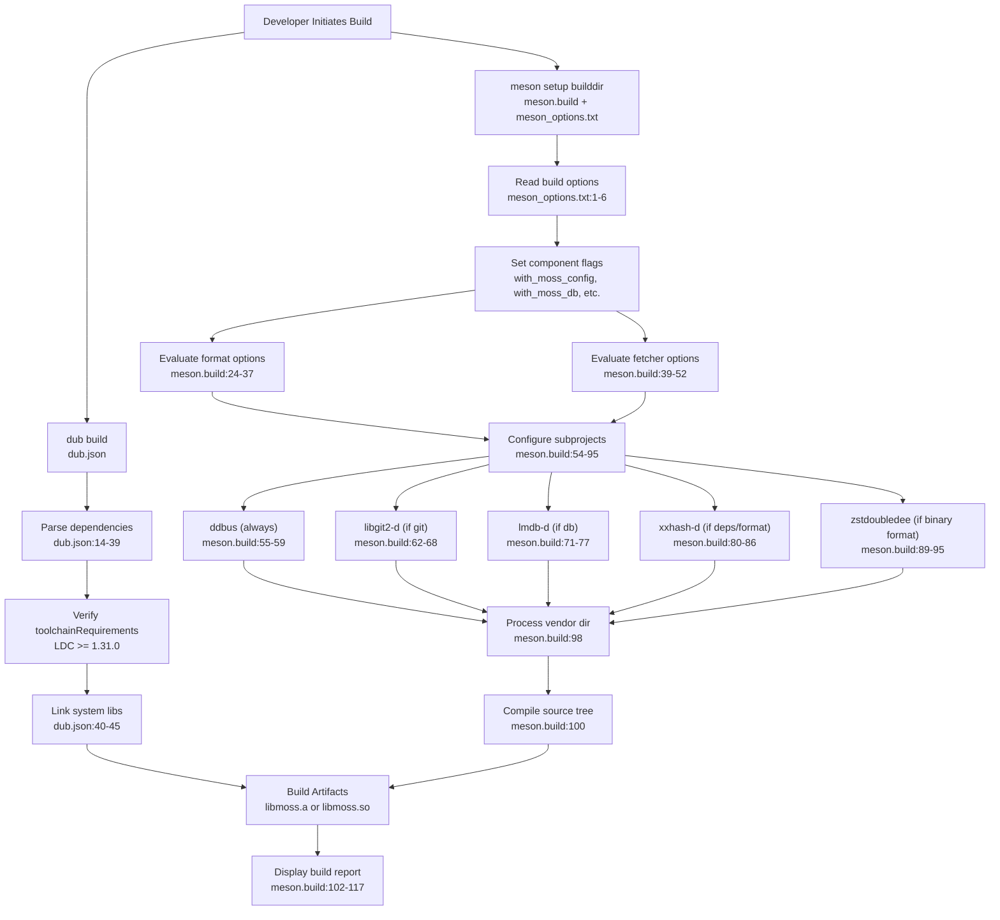
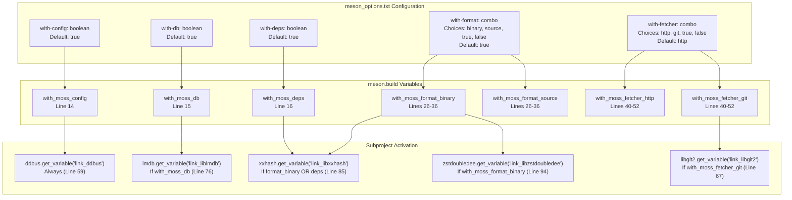

# Building libmoss

Relevant source files

* [dub.json](../dub.json)
* [meson.build](../meson.build)
* [meson\_options.txt](../meson_options.txt)

This page provides a comprehensive guide to building the libmoss library from source. It covers toolchain requirements, build system selection, quick start instructions, and an overview of the modular component selection system.

For detailed information about how the DUB and Meson build systems coordinate, see [Build System Architecture](2.1-build-system-architecture). For specifics on selecting which components to compile, see [Component Selection](2.2-component-selection). For complete dependency installation instructions, see [Dependencies and Requirements](2.3-dependencies-and-requirements).

---

## Prerequisites

libmoss requires specific toolchain components before building:

| Requirement | Minimum Version | Purpose |
| --- | --- | --- |
| **LDC** | 1.31.0 | D compiler (LLVM-based) |
| **DUB** | Latest | D package manager (if using DUB build) |
| **Meson** | Latest | Build system (if using Meson build) |
| **System Libraries** | See [Dependencies and Requirements](2.3-dependencies-and-requirements) | Runtime dependencies |

The LDC version requirement is enforced in [dub.json10-12](../dub.json#L10-L12) via the `toolchainRequirements` field.

**Sources:** [dub.json10-12](../dub.json#L10-L12)

---

## Build System Overview

libmoss supports two build systems:

### DUB (D's Native Package Manager)

* **File:** [dub.json1-46](../dub.json#L1-L46)
* **Usage:** Primarily for D developers integrating libmoss as a dependency
* **Advantage:** Simple integration with other D projects
* **Limitation:** Less control over component selection

### Meson (Cross-language Build System)

* **Files:** [meson.build1-118](../meson.build#L1-L118) [meson\_options.txt1-6](../meson_options.txt#L1-L6)
* **Usage:** Production builds with fine-grained component control
* **Advantage:** Modular component selection via build options
* **Limitation:** Requires Meson installation

The dual build system approach allows libmoss to serve both D-native consumers (via DUB) and projects requiring selective compilation (via Meson).

**Sources:** [dub.json1-46](../dub.json#L1-L46) [meson.build1-118](../meson.build#L1-L118) [meson\_options.txt1-6](../meson_options.txt#L1-L6)

---

## Quick Start

### Building with DUB

```
# Build all components
dub build

# Run tests
dub test
```

DUB automatically resolves dependencies declared in [dub.json14-39](../dub.json#L14-L39) and links system libraries specified in [dub.json40-45](../dub.json#L40-L45)

**Sources:** [dub.json1-46](../dub.json#L1-L46)

### Building with Meson

```
# Setup build directory with default options
meson setup builddir

# Compile
meson compile -C builddir

# Custom component selection
meson setup builddir \
    -Dwith-config=true \
    -Dwith-db=true \
    -Dwith-deps=true \
    -Dwith-format=binary \
    -Dwith-fetcher=http
```

Meson reads configuration from [meson.build1-118](../meson.build#L1-L118) and options from [meson\_options.txt1-6](../meson_options.txt#L1-L6)

**Sources:** [meson.build1-118](../meson.build#L1-L118) [meson\_options.txt1-6](../meson_options.txt#L1-L6)

---

## Build Process Flow

The following diagram shows the complete build process, from configuration to output artifacts:

### Build Process Flow Diagram



This diagram illustrates the divergence between DUB (simple, all-inclusive) and Meson (configurable, conditional). The Meson path evaluates build options to conditionally configure subprojects before compilation.

**Sources:** [dub.json1-46](../dub.json#L1-L46) [meson.build1-118](../meson.build#L1-L118) [meson\_options.txt1-6](../meson_options.txt#L1-L6)

---

## Component Configuration Logic

The Meson build system uses conditional logic to determine which components to compile. The following diagram shows how build options map to internal flags and subproject configurations:

### Component Selection Logic



**Key Logic Patterns:**

1. **Format Option Evaluation** [meson.build24-37](../meson.build#L24-L37):

   * `true` → enables both `binary` and `source`
   * `binary` → only `with_moss_format_binary = true`
   * `source` → only `with_moss_format_source = true`
   * `false` → disables both
2. **Fetcher Option Evaluation** [meson.build39-52](../meson.build#L39-L52):

   * `true` → enables both `http` and `git`
   * `http` → only `with_moss_fetcher_http = true`
   * `git` → only `with_moss_fetcher_git = true`
   * `false` → disables both
3. **Conditional Subproject Loading:**

   * `ddbus` is **always** configured [meson.build54-59](../meson.build#L54-L59)
   * Other subprojects are wrapped in conditionals [meson.build62-95](../meson.build#L62-L95)

**Sources:** [meson.build14-95](../meson.build#L14-L95) [meson\_options.txt1-6](../meson_options.txt#L1-L6)

---

## Build Configuration Report

After setup, Meson displays a build configuration report showing enabled components:

```
Build configuration:
====================

moss-core:                              always
moss-config:                            true
moss-db:                                true
moss-deps:                              true
moss-format (binary):                   true
moss-format (source):                   true
moss-fetcher (http):                    true
moss-fetcher (git):                     false
```

This report is generated by [meson.build102-117](../meson.build#L102-L117) and reflects the evaluated component flags.

**Sources:** [meson.build102-117](../meson.build#L102-L117)

---

## Build Output

Both build systems produce a library artifact:

| Build System | Output Type | Location |
| --- | --- | --- |
| DUB | Static or shared library | Project directory |
| Meson | Configurable via `default_library` | `builddir/` |

The `targetType` field in [dub.json13](../dub.json#L13-L13) is set to `"autodetect"`, allowing DUB to choose based on consumer requirements. Meson defaults can be overridden via command-line options.

**Sources:** [dub.json13](../dub.json#L13-L13) [meson.build1-8](../meson.build#L1-L8)

---

## Debugging Flags

The Meson build system configures debugging support for code mixins:

[meson.build10-11](../meson.build#L10-L11) adds the project argument `--mixin=mixin_generated_code.txt` to enable debugging of generated code during compilation. This is particularly useful when working with D's compile-time code generation features.

**Sources:** [meson.build10-11](../meson.build#L10-L11)

---

## Next Steps

* For detailed build system coordination, see [Build System Architecture](2.1-build-system-architecture)
* For component selection examples and use cases, see [Component Selection](2.2-component-selection)
* For dependency installation instructions, see [Dependencies and Requirements](2.3-dependencies-and-requirements)
* For contribution workflow including pre-commit checks, see [Development Guide](5-development-guide)