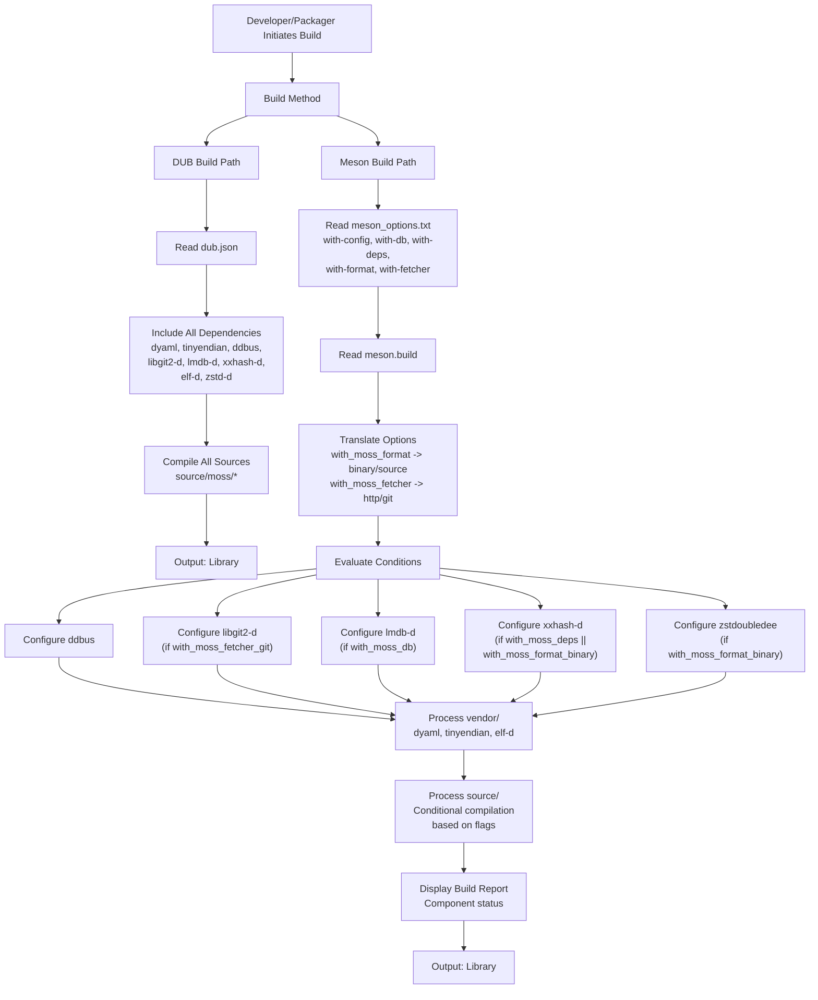

# Build System Architecture

Relevant source files

* [dub.json](../dub.json)
* [meson.build](../meson.build)

## Purpose and Scope

This document explains libmoss's dual build system architecture, covering how DUB and Meson are used together to build the library. It details the responsibilities of each build system, how they coordinate during the build process, and the architectural rationale for this approach.

For information about selecting which components to build, see [Component Selection](2.2-component-selection). For details on external dependencies and toolchain requirements, see [Dependencies and Requirements](2.3-dependencies-and-requirements).

## Overview of the Dual Build System

libmoss employs two complementary build systems: **DUB** (D's native package manager and build tool) and **Meson** (a cross-language build system). This dual approach serves different aspects of the build process:

| Build System | Primary Responsibility | Target Audience |
| --- | --- | --- |
| DUB | Dependency declaration and D ecosystem integration | D developers using the library directly |
| Meson | Build orchestration and component configuration | System integrators and distribution packagers |

The separation enables libmoss to function both as a standard D library (consumable via DUB) and as a system library that can be built with traditional build tools used in Linux distributions.

Sources: [dub.json](../dub.json) [meson.build](../meson.build)

## DUB Configuration

### Purpose and Metadata

The `dub.json` file serves as the canonical source for project metadata and dependency declarations. It defines:

* **Project Identity**: Name (`libmoss`), version (`1.2.1`), license (Zlib), and copyright information [dub.json1-8](../dub.json#L1-L8)
* **Toolchain Requirements**: Minimum LDC compiler version (1.31.0) [dub.json10-12](../dub.json#L10-L12)
* **Target Type**: Set to `autodetect`, allowing DUB to determine whether to build a static library, shared library, or executable based on usage context [dub.json13](../dub.json#L13-L13)

Sources: [dub.json1-13](../dub.json#L1-L13)

### Dependency Management

DUB declares all dependencies required by libmoss, using two distinct sourcing strategies:

#### Vendored Dependencies

Dependencies located in the `vendor/` directory are directly included in the repository:

```
dyaml          -> vendor/dyaml
tinyendian     -> vendor/tinyendian
elf-d          -> vendor/elf-d
```

These are typically pure D libraries that are stable and require minimal updates [dub.json15-35](../dub.json#L15-L35)

#### Subproject Dependencies

Dependencies in the `subprojects/` directory are managed as separate submodules:

```
ddbus          -> subprojects/ddbus
libgit2-d      -> subprojects/libgit2-d
lmdb-d         -> subprojects/lmdb-d
xxhash-d       -> subprojects/xxhash-d
zstd-d         -> subprojects/zstdoubledee
```

These are D bindings to C libraries that may receive more frequent updates [dub.json21-38](../dub.json#L21-L38)

#### System Library Linkage

DUB specifies system libraries that must be linked:

```
libcurl        # HTTP client functionality
lmdb           # LMDB database engine
libxxhash      # xxHash hashing library
libzstd        # Zstandard compression
```

These are C libraries expected to be available on the system [dub.json40-45](../dub.json#L40-L45)

Sources: [dub.json14-46](../dub.json#L14-L46)

## Meson Configuration

### Build Orchestration

The `meson.build` file orchestrates the actual compilation process and provides fine-grained control over which components are included in the build. Unlike DUB, which includes all dependencies, Meson conditionally configures subprojects based on component selection.

The project is declared with multiple languages:

```
project('libmoss', ['c', 'd'], version: '1.2.1', license: ['Zlib'])
```

This multi-language declaration is necessary because some dependencies include C code [meson.build1-8](../meson.build#L1-L8)

Sources: [meson.build1-8](../meson.build#L1-L8)

### Component Configuration Logic

Meson reads build options and translates high-level component selections into specific sub-component flags. This two-stage translation occurs for modular components:

#### moss-format Configuration

The `with-format` option accepts four values: `false`, `true`, `binary`, or `source`. Meson translates these into boolean flags:

| Option Value | `with_moss_format_binary` | `with_moss_format_source` |
| --- | --- | --- |
| `false` | false | false |
| `true` | true | true |
| `binary` | true | false |
| `source` | false | true |

This logic is implemented at [meson.build24-37](../meson.build#L24-L37)

#### moss-fetcher Configuration

Similarly, `with-fetcher` accepts `false`, `true`, `http`, or `git`:

| Option Value | `with_moss_fetcher_http` | `with_moss_fetcher_git` |
| --- | --- | --- |
| `false` | false | false |
| `true` | true | true |
| `http` | true | false |
| `git` | false | true |

This logic is implemented at [meson.build39-52](../meson.build#L39-L52)

Sources: [meson.build14-52](../meson.build#L14-L52)

### Conditional Subproject Configuration

Meson conditionally configures subprojects based on which components are enabled. Each subproject is built as a static library and exposes a link target:

#### Always Configured

```
ddbus -> link_ddbus
```

The D-Bus binding is always included [meson.build54-59](../meson.build#L54-L59)

#### Conditionally Configured

```
with_moss_fetcher_git  -> libgit2-d  -> link_libgit2
with_moss_db           -> lmdb-d     -> link_lmdb
with_moss_deps or      -> xxhash-d   -> link_xxhash
  with_moss_format_binary
with_moss_format_binary -> zstdoubledee -> link_zstd
```

Each subproject is configured only when needed, reducing build time and minimizing dependencies [meson.build61-95](../meson.build#L61-L95)

Sources: [meson.build54-95](../meson.build#L54-L95)

### Build Report Generation

After configuration, Meson generates a human-readable build report showing which components are enabled:

```
Build configuration:
====================

moss-core:                              always
moss-config:                            true/false
moss-db:                                true/false
moss-deps:                              true/false
moss-format (binary):                   true/false
moss-format (source):                   true/false
moss-fetcher (http):                    true/false
moss-fetcher (git):                     true/false
```

This report is displayed during the configuration phase [meson.build102-117](../meson.build#L102-L117)

Sources: [meson.build102-117](../meson.build#L102-L117)

## Build System Coordination

### Dual Build System Architecture

The following diagram illustrates how DUB and Meson fulfill complementary roles in the build process:

Sources: [dub.json](../dub.json) [meson.build](../meson.build)

### Responsibility Separation

The two build systems operate with clear separation of concerns:

#### DUB Responsibilities

1. **Dependency Declaration**: Declares all dependencies that libmoss uses, regardless of component selection
2. **Ecosystem Integration**: Allows D projects to consume libmoss using standard D tooling
3. **Metadata Management**: Maintains canonical project metadata (version, license, authors)
4. **Direct Building**: Enables `dub build` for quick development iteration

#### Meson Responsibilities

1. **Component Selection**: Implements logic for including/excluding optional components
2. **Conditional Compilation**: Translates high-level options into specific compiler flags
3. **Subproject Orchestration**: Configures only necessary subprojects to minimize build scope
4. **Cross-Language Support**: Handles coordination between D and C code compilation
5. **Installation**: Provides standard installation targets for system integration

Sources: [dub.json](../dub.json) [meson.build](../meson.build)

## Build Configuration Flow

The following diagram shows the complete build configuration flow from user input through compilation:



Sources: [dub.json](../dub.json) [meson.build](../meson.build)

### Key Coordination Points

1. **Dependency Consistency**: Both systems reference the same dependency sources (`vendor/`, `subprojects/`), ensuring that regardless of build method, the same code is compiled
2. **Version Synchronization**: The version number is maintained in both `dub.json:8` and `meson.build:4`, requiring manual synchronization when releasing new versions
3. **Compiler Requirements**: DUB specifies minimum compiler version [dub.json10-12](../dub.json#L10-L12) while Meson relies on the system-provided D compiler
4. **Build Output**: Both systems produce compatible library artifacts that expose the same API, allowing downstream projects to choose their preferred build method

Sources: [dub.json4-12](../dub.json#L4-L12) [meson.build1-8](../meson.build#L1-L8)

## Why Both Systems Exist

The dual build system approach addresses different use cases:

### DUB for Development

* **Rapid Iteration**: D developers can use `dub build` and `dub test` for quick development cycles
* **Ecosystem Integration**: Projects using DUB can add libmoss as a dependency with a single line in their `dub.json`
* **Simplicity**: No need to manually configure build options; all components are included by default

### Meson for Distribution

* **Fine-Grained Control**: System packagers can select exactly which components to build, reducing binary size and dependencies
* **Cross-Language**: Meson's support for multiple languages simplifies integration with C libraries
* **Standard Installation**: Provides conventional installation paths and pkg-config file generation
* **Reproducible Builds**: Explicit configuration makes builds more deterministic for distribution packaging

Sources: [dub.json](../dub.json) [meson.build](../meson.build)

## Compilation Debug Support

Both build systems enable mixin debugging support. Meson explicitly adds the flag:

```
add_project_arguments('--mixin=mixin_generated_code.txt', language : 'd')
```

This instructs the D compiler to output generated mixin code to `mixin_generated_code.txt`, facilitating debugging of code generation in the source tree [meson.build11](../meson.build#L11-L11)

Sources: [meson.build10-11](../meson.build#L10-L11)