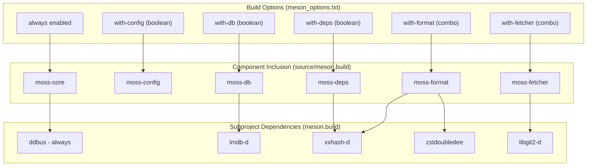
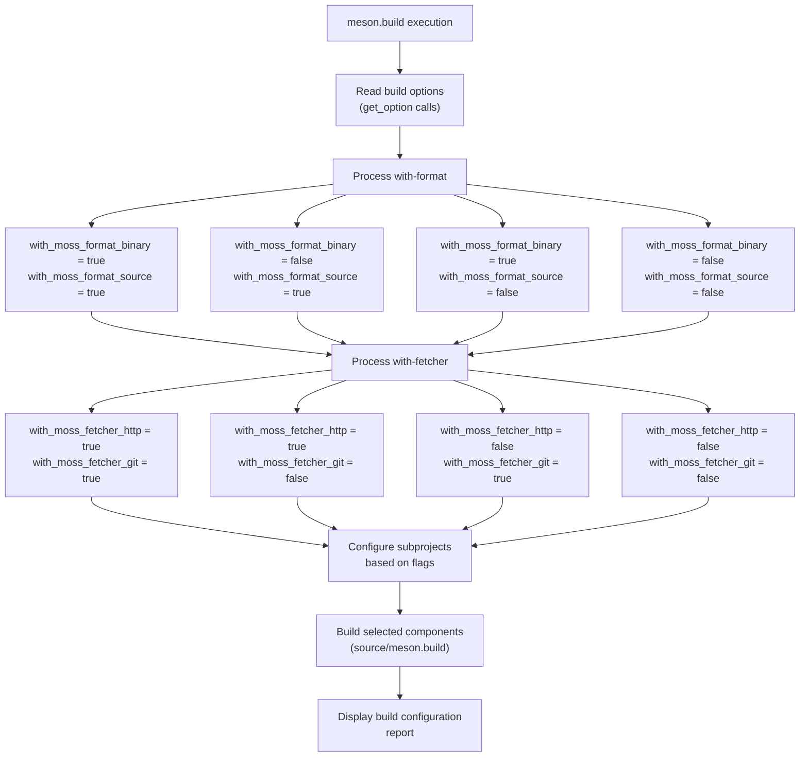
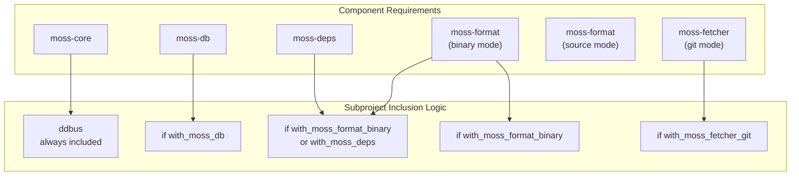
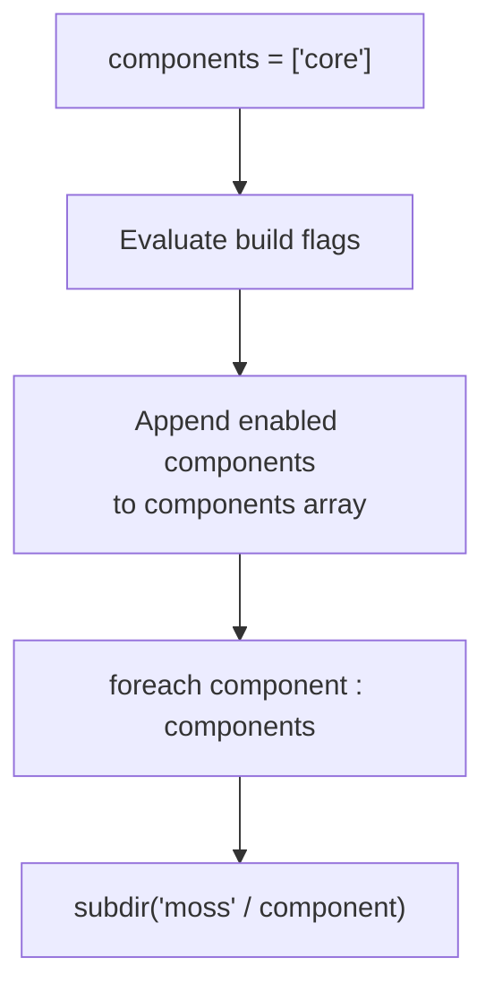

# Component Selection

Relevant source files

* [meson.build](../meson.build)
* [meson\_options.txt](../meson_options.txt)
* [source/meson.build](../source/meson.build)

This document details libmoss's modular build system and the options available for selective compilation of library components. libmoss is designed with a modular architecture where only `moss-core` is mandatory, and all other components can be independently enabled or disabled at build time to minimize binary size and compilation time.

For information about the build system architecture and how DUB and Meson coordinate, see [Build System Architecture](2.1-build-system-architecture). For details on external dependencies required by each component, see [Dependencies and Requirements](2.3-dependencies-and-requirements).

## Build Options Overview

The libmoss build system provides five primary build options that control component inclusion. These options are defined in [meson\_options.txt1-5](../meson_options.txt#L1-L5) and processed in [meson.build14-52](../meson.build#L14-L52)

| Option | Type | Choices | Default | Description |
| --- | --- | --- | --- | --- |
| `with-config` | boolean | true, false | true | Enable moss-config library |
| `with-db` | boolean | true, false | true | Enable moss-db library |
| `with-deps` | boolean | true, false | true | Enable moss-deps library |
| `with-fetcher` | combo | http, git, true, false | http | Enable moss-fetcher library |
| `with-format` | combo | binary, source, true, false | true | Enable moss-format library |

**Sources:** [meson\_options.txt1-5](../meson_options.txt#L1-L5)

### Multi-Mode Options

Two components support multiple operational modes through combo options:

**moss-format** - Data format handling:

* `binary` - Binary format only
* `source` - Source format only
* `true` - Both binary and source formats
* `false` - Format component disabled

**moss-fetcher** - Data fetching:

* `http` - HTTP fetching only
* `git` - Git fetching only
* `true` - Both HTTP and Git protocols
* `false` - Fetcher component disabled

**Sources:** [meson.build24-52](../meson.build#L24-L52)

## Component Selection Architecture

The following diagram shows how build options map to actual library components and their associated subprojects:



**Sources:** [meson\_options.txt1-5](../meson_options.txt#L1-L5) [meson.build14-95](../meson.build#L14-L95) [source/meson.build11-39](../source/meson.build#L11-L39)

## Build Configuration Flow

This diagram illustrates how the Meson build system processes component selection options:



**Sources:** [meson.build14-118](../meson.build#L14-L118) [source/meson.build11-39](../source/meson.build#L11-L39)

## Conditional Subproject Inclusion

Subprojects (external D library bindings) are only configured when their dependent components are enabled. This reduces build time and avoids unnecessary dependencies:



**Sources:** [meson.build54-95](../meson.build#L54-L95)

The conditional inclusion logic from [meson.build62-95](../meson.build#L62-L95):

| Condition | Subproject | Purpose |
| --- | --- | --- |
| Always | `ddbus` | D-Bus IPC support for moss-core |
| `with_moss_fetcher_git` | `libgit2-d` | Git protocol support |
| `with_moss_db` | `lmdb-d` | LMDB database bindings |
| `with_moss_format_binary` OR `with_moss_deps` | `xxhash-d` | Fast hashing for content addressing |
| `with_moss_format_binary` | `zstdoubledee` | Zstandard compression for binary archives |

## Component Descriptions

### moss-core (Always Included)

The foundational component that provides core functionality required by all other components. This component cannot be disabled and is always present in the `components` array at [source/meson.build12](../source/meson.build#L12-L12)

**Key features:**

* Basic data structures and utilities
* D-Bus integration via `ddbus` subproject
* Always compiled regardless of build options

### moss-config (Optional)

Configuration management system supporting layered YAML-based configuration files. Enabled by default with `with-config=true`.

**Build flag:** [meson\_options.txt1](../meson_options.txt#L1-L1)
**Inclusion logic:** [source/meson.build14-16](../source/meson.build#L14-L16)
**Dependencies:** Vendored `dyaml` library

For detailed information about the configuration system architecture, see [Configuration Management Deep Dive](4-configuration-management-deep-dive).

### moss-db (Optional)

High-performance embedded database component using LMDB (Lightning Memory-Mapped Database). Enabled by default with `with-db=true`.

**Build flag:** [meson\_options.txt2](../meson_options.txt#L2-L2)
**Inclusion logic:** [source/meson.build18-20](../source/meson.build#L18-L20)
**Dependencies:** `lmdb-d` subproject [meson.build71-77](../meson.build#L71-L77)

### moss-deps (Optional)

Dependency resolution and tracking system. Enabled by default with `with-deps=true`.

**Build flag:** [meson\_options.txt3](../meson_options.txt#L3-L3)
**Inclusion logic:** [source/meson.build22-24](../source/meson.build#L22-L24)
**Dependencies:** `xxhash-d` subproject for content-addressable hashing [meson.build80-86](../meson.build#L80-L86)

### moss-format (Multi-Mode)

Data format handling component supporting binary archives and source specifications. Operates in three modes:

**Build flag:** [meson\_options.txt5](../meson_options.txt#L5-L5)
**Inclusion logic:** [source/meson.build30-32](../source/meson.build#L30-L32)
**Mode processing:** [meson.build24-37](../meson.build#L24-L37)

| Mode | Binary Format | Source Format | Use Case |
| --- | --- | --- | --- |
| `binary` | ✓ | ✗ | Package archive handling only |
| `source` | ✗ | ✓ | Recipe/spec parsing only |
| `true` | ✓ | ✓ | Full package management (default) |
| `false` | ✗ | ✗ | Component disabled |

**Binary mode dependencies:**

* `xxhash-d` for integrity verification [meson.build80-86](../meson.build#L80-L86)
* `zstdoubledee` for compression [meson.build89-95](../meson.build#L89-L95)

**Source mode dependencies:**

* Vendored `dyaml` for YAML parsing

### moss-fetcher (Multi-Mode)

Remote data fetching component supporting HTTP and Git protocols. Defaults to HTTP-only mode.

**Build flag:** [meson\_options.txt4](../meson_options.txt#L4-L4)
**Inclusion logic:** [source/meson.build26-28](../source/meson.build#L26-L28)
**Mode processing:** [meson.build39-52](../meson.build#L39-L52)

| Mode | HTTP | Git | Use Case |
| --- | --- | --- | --- |
| `http` | ✓ | ✗ | Download from HTTP servers (default) |
| `git` | ✗ | ✓ | Clone from Git repositories |
| `true` | ✓ | ✓ | Full remote fetching support |
| `false` | ✗ | ✗ | Component disabled |

**HTTP mode dependencies:**

* System `libcurl` library

**Git mode dependencies:**

* `libgit2-d` subproject [meson.build62-68](../meson.build#L62-L68)
* System `libgit2` library

## Build Configuration Report

The build system generates a configuration report displaying all enabled components. This report is output at [meson.build102-117](../meson.build#L102-L117) after all options have been processed:

```
Build configuration:
====================

moss-core:                              always
moss-config:                            true
moss-db:                                true
moss-deps:                              true
moss-format (binary):                   true
moss-format (source):                   true
moss-fetcher (http):                    true
moss-fetcher (git):                     false
```

**Sources:** [meson.build102-117](../meson.build#L102-L117)

## Usage Examples

### Minimal Build (Core Only)

To build only `moss-core` with minimal dependencies:

```
meson setup build \
    -Dwith-config=false \
    -Dwith-db=false \
    -Dwith-deps=false \
    -Dwith-format=false \
    -Dwith-fetcher=false
```

This configuration only includes the `ddbus` subproject.

### Package Manager Build

For a full package manager with all features:

```
meson setup build \
    -Dwith-config=true \
    -Dwith-db=true \
    -Dwith-deps=true \
    -Dwith-format=true \
    -Dwith-fetcher=true
```

This is equivalent to the default configuration.

### Binary-Only Package Handler

For tools that only work with binary packages and HTTP downloads:

```
meson setup build \
    -Dwith-config=true \
    -Dwith-db=true \
    -Dwith-deps=true \
    -Dwith-format=binary \
    -Dwith-fetcher=http
```

This reduces dependencies by excluding Git support and source format parsing.

### Source Package Builder

For tools that build packages from source specifications:

```
meson setup build \
    -Dwith-config=true \
    -Dwith-db=false \
    -Dwith-deps=false \
    -Dwith-format=source \
    -Dwith-fetcher=git
```

This configuration prioritizes Git fetching and source format handling while excluding database and dependency resolution features.

## Component Iteration Implementation

The build system uses a `foreach` loop to process selected components in [source/meson.build37-39](../source/meson.build#L37-L39) Components are added to the `components` array based on build flags, then each component directory is processed:



This design allows each component's `meson.build` file to be self-contained, processing its own source files and dependencies independently.

**Sources:** [source/meson.build11-39](../source/meson.build#L11-L39)