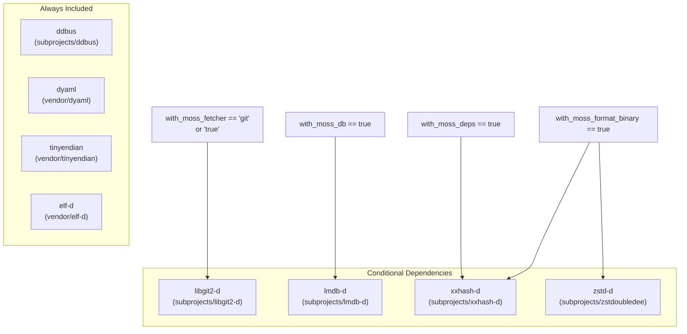
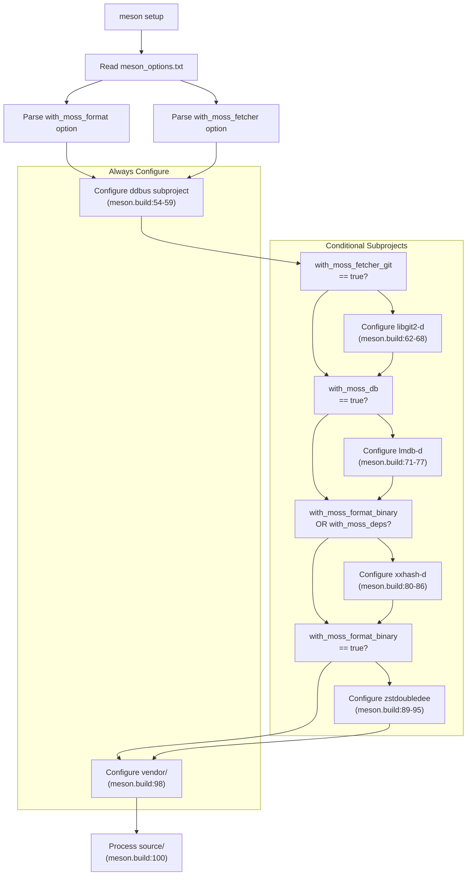

# Dependencies and Requirements

Relevant source files

* [.github/workflows/d.yml](../.github/workflows/d.yml)
* [dub.json](../dub.json)
* [meson.build](../meson.build)

This page documents all external dependencies required to build libmoss, including compiler version requirements, D language packages, and system libraries. Dependencies are categorized by whether they are always required or conditionally included based on component selection.

For information about selecting which components to build, see [Component Selection](2.2-component-selection). For detailed documentation of each dependency's functionality, see [External Dependencies](6-external-dependencies).

---

## Compiler Requirements

libmoss requires the LDC (LLVM D Compiler) with specific minimum version constraints.

**Minimum Version**: LDC >= 1.31.0

The minimum compiler version is enforced through the `toolchainRequirements` field in [dub.json10-12](../dub.json#L10-L12):

```
"toolchainRequirements": {
    "ldc": ">=1.31.0"
}
```

The CI system uses LDC 1.32.0 as specified in [.github/workflows/d.yml21](../.github/workflows/d.yml#L21-L21) which serves as the tested and recommended version. LDC is chosen over other D compilers (DMD, GDC) because it:

* Provides LLVM-based optimization for performance-critical code
* Offers better cross-platform support
* Generates more efficient machine code for system-level operations

**Sources**: [dub.json10-12](../dub.json#L10-L12) [.github/workflows/d.yml19-21](../.github/workflows/d.yml#L19-L21)

---

## D Language Dependencies

libmoss depends on eight D language packages. Some are always required, while others are conditionally included based on component selection.

### Always Required Dependencies

The following D packages are required regardless of component selection:

| Package | Location | Purpose |
| --- | --- | --- |
| `dyaml` | `vendor/dyaml` | YAML parsing for configuration files |
| `tinyendian` | `vendor/tinyendian` | Endianness handling for binary formats |
| `ddbus` | `subprojects/ddbus` | D-Bus IPC communication |
| `elf-d` | `vendor/elf-d` | ELF binary format parsing |

The `ddbus` dependency is always configured in [meson.build54-59](../meson.build#L54-L59) regardless of component selection:

```
ddbus = subproject('ddbus',
    default_options: [
        'default_library=static'
    ])
```

**Sources**: [dub.json15-35](../dub.json#L15-L35) [meson.build54-59](../meson.build#L54-L59)

### Conditionally Required Dependencies

The following dependencies are only included when specific components are enabled:

| Package | Location | Required When | Meson Condition |
| --- | --- | --- | --- |
| `libgit2-d` | `subprojects/libgit2-d` | Git fetcher enabled | `with_moss_fetcher_git` |
| `lmdb-d` | `subprojects/lmdb-d` | Database enabled | `with_moss_db` |
| `xxhash-d` | `subprojects/xxhash-d` | Binary format OR dependencies enabled | `with_moss_format_binary` OR `with_moss_deps` |
| `zstd-d` | `subprojects/zstdoubledee` | Binary format enabled | `with_moss_format_binary` |

The conditional loading logic is implemented in [meson.build62-95](../meson.build#L62-L95) where each dependency is only configured if the corresponding build option is enabled.

**Sources**: [dub.json24-38](../dub.json#L24-L38) [meson.build62-95](../meson.build#L62-L95)

### Dependency Resolution Diagram



**Sources**: [meson.build54-95](../meson.build#L54-L95)

---

## System Library Dependencies

libmoss links against several C system libraries. These must be installed on the build system before compilation.

### Required System Libraries

| Library | DUB Declaration | Ubuntu/Debian Package | Purpose |
| --- | --- | --- | --- |
| `libcurl` | `"libcurl"` | `libcurl4-openssl-dev` | HTTP networking for moss-fetcher |
| `lmdb` | `"lmdb"` | `liblmdb-dev` | LMDB database engine for moss-db |
| `libxxhash` | `"libxxhash"` | `libxxhash-dev` | xxHash algorithm for checksums |
| `libzstd` | `"libzstd"` | `libzstd-dev` | Zstandard compression |
| `libgit2` | (implicit) | `libgit2-dev` | Git operations for moss-fetcher |
| `libdbus-1` | (implicit) | `libdbus-1-dev` | D-Bus system bus communication |

The first four libraries are explicitly declared in [dub.json40-45](../dub.json#L40-L45) The `libgit2` and `libdbus-1` libraries are implicitly linked through their D binding packages (`libgit2-d` and `ddbus` respectively).

### Installation Command

The CI workflow demonstrates the complete installation command for Ubuntu/Debian systems in [.github/workflows/d.yml24-25](../.github/workflows/d.yml#L24-L25):

```
sudo apt-get install libcurl4-openssl-dev liblmdb-dev libxxhash-dev \
    libzstd-dev libgit2-dev libdbus-1-dev
```

**Sources**: [dub.json40-45](../dub.json#L40-L45) [.github/workflows/d.yml24-25](../.github/workflows/d.yml#L24-L25)

---

## Dependency-to-Component Mapping

The table below shows which system libraries and D bindings are required for each optional component:

| Component | D Binding | System Library | Notes |
| --- | --- | --- | --- |
| moss-core | `dyaml`, `tinyendian`, `ddbus`, `elf-d` | `libdbus-1` | Always included |
| moss-config | (uses core deps) | (none additional) | No extra dependencies |
| moss-db | `lmdb-d` | `lmdb` | LMDB for data storage |
| moss-deps | `xxhash-d` | `libxxhash` | Hash-based dependency tracking |
| moss-format (binary) | `xxhash-d`, `zstd-d` | `libxxhash`, `libzstd` | Compression and checksums |
| moss-format (source) | (uses core deps) | (none additional) | Source format parsing only |
| moss-fetcher (http) | (uses core deps) | `libcurl` | HTTP download support |
| moss-fetcher (git) | `libgit2-d` | `libgit2` | Git clone and fetch |

**Sources**: [meson.build54-95](../meson.build#L54-L95) [dub.json14-45](../dub.json#L14-L45)

---

## Build-Time Dependency Resolution

The Meson build system conditionally configures subprojects based on component selection. This diagram illustrates the dependency resolution flow:



**Sources**: [meson.build14-100](../meson.build#L14-L100)

---

## Vendored vs Subproject Dependencies

libmoss manages D language dependencies in two different ways:

**Vendored Dependencies** (located in `vendor/`):

* `dyaml` - [vendor/dyaml](../vendor/dyaml)
* `tinyendian` - [vendor/tinyendian](../vendor/tinyendian)
* `elf-d` - [vendor/elf-d](../vendor/elf-d)

These dependencies are copied directly into the repository. They are stable libraries that rarely require updates.

**Subproject Dependencies** (located in `subprojects/`):

* `ddbus` - [subprojects/ddbus](../subprojects/ddbus)
* `libgit2-d` - [subprojects/libgit2-d](../subprojects/libgit2-d)
* `lmdb-d` - [subprojects/lmdb-d](../subprojects/lmdb-d)
* `xxhash-d` - [subprojects/xxhash-d](../subprojects/xxhash-d)
* `zstdoubledee` - [subprojects/zstdoubledee](../subprojects/zstdoubledee)

These dependencies are managed as Meson subprojects, typically using git submodules or wrap files. They wrap external C libraries and may receive more frequent updates.

For more details on dependency management strategies, see [Vendored vs Subproject Dependencies](6.3-vendored-vs-subproject-dependencies).

**Sources**: [dub.json15-38](../dub.json#L15-L38) [meson.build54-98](../meson.build#L54-L98)

---

## Summary Table

This table provides a quick reference of all dependencies:

| Dependency Type | Name | Version Requirement | Always Required |
| --- | --- | --- | --- |
| Compiler | LDC | >= 1.31.0 | Yes |
| D Package | dyaml | (vendored) | Yes |
| D Package | tinyendian | (vendored) | Yes |
| D Package | ddbus | (subproject) | Yes |
| D Package | elf-d | (vendored) | Yes |
| D Package | libgit2-d | (subproject) | Conditional |
| D Package | lmdb-d | (subproject) | Conditional |
| D Package | xxhash-d | (subproject) | Conditional |
| D Package | zstd-d | (subproject) | Conditional |
| System Library | libcurl | (any) | Yes |
| System Library | lmdb | (any) | Conditional |
| System Library | libxxhash | (any) | Conditional |
| System Library | libzstd | (any) | Conditional |
| System Library | libgit2 | (any) | Conditional |
| System Library | libdbus-1 | (any) | Yes |

**Sources**: [dub.json10-45](../dub.json#L10-L45) [meson.build54-95](../meson.build#L54-L95) [.github/workflows/d.yml24-25](../.github/workflows/d.yml#L24-L25)