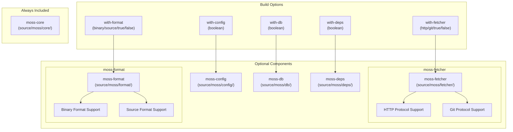
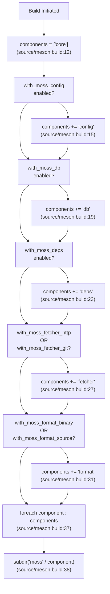
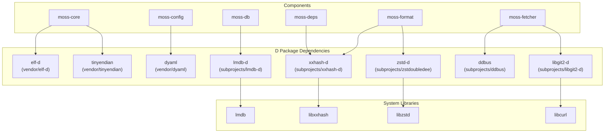

# Library Components

Relevant source files

* [dub.json](../dub.json)
* [meson\_options.txt](../meson_options.txt)
* [source/meson.build](../source/meson.build)

This document provides an overview of libmoss's modular component architecture and describes how the six main components interact and can be selectively enabled at build time. For detailed documentation of each individual component's functionality, see pages [3.1](3.1-moss-core) through [3.6](3.6-moss-fetcher).

## Component Architecture Overview

libmoss is designed as a modular library where only the core component is mandatory. All other components are optional and can be enabled or disabled at build time through Meson build options. This design allows consumers to build only the functionality they need, reducing binary size and compilation time.

The library consists of six primary components:

| Component | Directory | Mandatory | Build Option | Purpose |
| --- | --- | --- | --- | --- |
| moss-core | `source/moss/core/` | Yes | Always included | Foundational functionality required by all other components |
| moss-config | `source/moss/config/` | No | `--with-config` | Configuration management with layered YAML configuration |
| moss-db | `source/moss/db/` | No | `--with-db` | LMDB-based embedded database functionality |
| moss-deps | `source/moss/deps/` | No | `--with-deps` | Dependency resolution and tracking using xxHash |
| moss-format | `source/moss/format/` | No | `--with-format={binary,source,true,false}` | Binary and source format handling with compression |
| moss-fetcher | `source/moss/fetcher/` | No | `--with-fetcher={http,git,true,false}` | Data fetching via HTTP and Git protocols |

**Sources:** [meson\_options.txt1-5](../meson_options.txt#L1-L5) [source/meson.build1-39](../source/meson.build#L1-L39)

## Modular Component Selection

The following diagram illustrates how components are conditionally included based on build options:

**Sources:** [meson\_options.txt1-5](../meson_options.txt#L1-L5) [source/meson.build12-32](../source/meson.build#L12-L32)

## Build System Component Evaluation

The Meson build system evaluates component inclusion through a series of conditional checks. The following diagram shows the exact build variable names and control flow:

**Sources:** [source/meson.build12-39](../source/meson.build#L12-L39)

## Component Categories

### Mandatory Component

Only `moss-core` is unconditionally included in every build configuration. It is added to the `components` array at the beginning of the build process and provides foundational functionality required by all other components.

**Sources:** [source/meson.build12](../source/meson.build#L12-L12)

### Boolean Option Components

Three components use simple boolean flags for inclusion:

* **moss-config**: Enabled with `with-config` option (default: `true`)
* **moss-db**: Enabled with `with-db` option (default: `true`)
* **moss-deps**: Enabled with `with-deps` option (default: `true`)

**Sources:** [meson\_options.txt1-3](../meson_options.txt#L1-L3) [source/meson.build14-24](../source/meson.build#L14-L24)

### Combo Option Components

Two components provide sub-options for fine-grained control:

#### moss-format

The `with-format` option accepts multiple values:

* `'binary'`: Enable binary format support only
* `'source'`: Enable source format support only
* `'true'`: Enable all format support
* `'false'`: Disable format component entirely

Default value: `'true'`

The component is included if either `with_moss_format_binary` or `with_moss_format_source` evaluates to true.

**Sources:** [meson\_options.txt5](../meson_options.txt#L5-L5) [source/meson.build30-32](../source/meson.build#L30-L32)

#### moss-fetcher

The `with-fetcher` option accepts multiple values:

* `'http'`: Enable HTTP fetching only
* `'git'`: Enable Git fetching only
* `'true'`: Enable all fetcher support
* `'false'`: Disable fetcher component entirely

Default value: `'http'`

The component is included if either `with_moss_fetcher_http` or `with_moss_fetcher_git` evaluates to true.

**Sources:** [meson\_options.txt4](../meson_options.txt#L4-L4) [source/meson.build26-28](../source/meson.build#L26-L28)

## External Dependencies by Component

Different components require different external dependencies. The following table maps components to their primary external dependencies:

| Component | D Package Dependencies | System Library Dependencies | Purpose |
| --- | --- | --- | --- |
| moss-core | `tinyendian`, `elf-d` | - | Core data structures and ELF handling |
| moss-config | `dyaml` | - | YAML configuration parsing |
| moss-db | `lmdb-d` | `lmdb` | Embedded database operations |
| moss-deps | `xxhash-d` | `libxxhash` | Hash-based dependency tracking |
| moss-format | `zstd-d`, `xxhash-d` | `libzstd`, `libxxhash` | Compression and format integrity |
| moss-fetcher | `libgit2-d`, `ddbus` | `libcurl`, `libgit2` | Network and Git operations |

**Sources:** [dub.json14-45](../dub.json#L14-L45)

## Component Interdependencies

The following diagram shows the external dependencies required by each optional component, mapping to the actual dependency declarations:

**Sources:** [dub.json14-45](../dub.json#L14-L45)

## Component Build Process

When the build system processes the components, it iterates through the `components` array and includes each component's subdirectory using `subdir('moss' / component)`. This means:

1. Core component directory `source/moss/core/` is always processed
2. Optional component directories are processed only if their conditions are met
3. Each component directory contains its own `meson.build` file defining compilation units

The iteration occurs at [source/meson.build37-39](../source/meson.build#L37-L39) using a foreach loop over the dynamically constructed `components` array.

**Sources:** [source/meson.build37-39](../source/meson.build#L37-L39)

## Component Documentation

Detailed documentation for each component is available in the following pages:

* **moss-core**: See [3.1](3.1-moss-core) for core functionality documentation
* **moss-config**: See [3.2](3.2-moss-config) for configuration management details
* **moss-db**: See [3.3](3.3-moss-db) for database component documentation
* **moss-deps**: See [3.4](3.4-moss-deps) for dependency management details
* **moss-format**: See [3.5](3.5-moss-format) for format handling documentation
* **moss-fetcher**: See [3.6](3.6-moss-fetcher) for fetcher component documentation

For information about building with specific component selections, see [2.2](2.2-component-selection) (Component Selection). For dependency details, see [6](6-external-dependencies) (External Dependencies).