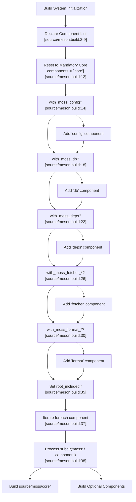
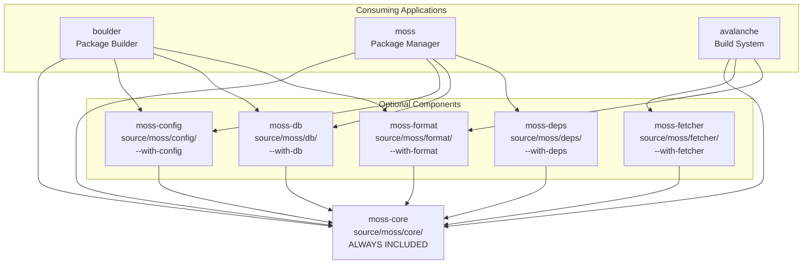

# moss-core

Relevant source files

* [dub.json](../dub.json)
* [source/meson.build](../source/meson.build)

## Purpose and Scope

This document covers the `moss-core` component, which is the mandatory foundation of libmoss. Unlike all other components in the library, `moss-core` is **always included** in every build and cannot be disabled through build options. It provides the essential utilities, data structures, and abstractions that other libmoss components depend on.

For information about the optional components that build on moss-core, see:

* Configuration management: [moss-config](3.2-moss-config)
* Database functionality: [moss-db](3.3-moss-db)
* Dependency tracking: [moss-deps](3.4-moss-deps)
* Data format handling: [moss-format](3.5-moss-format)
* Data fetching: [moss-fetcher](3.6-moss-fetcher)

For the overall component architecture, see [Library Components](3-library-components).

---

## Component Role and Architecture

`moss-core` serves as the foundational layer for all libmoss functionality. While other components are optional and can be selectively compiled based on build flags, `moss-core` is **unconditionally included** in every libmoss build.

### Mandatory Component Status

The build system explicitly marks `moss-core` as mandatory. After initially declaring all possible components [source/meson.build2-9](../source/meson.build#L2-L9) the build script immediately resets the list to include only `core`:

```
components = ['core']
```

This is then conditionally expanded based on build options [source/meson.build14-32](../source/meson.build#L14-L32) but `core` always remains in the component list.

**Sources:** [source/meson.build1-40](../source/meson.build#L1-L40)

---

## Build System Integration

### Component Declaration and Processing

The following diagram illustrates how `moss-core` is processed by the Meson build system:



**Sources:** [source/meson.build1-40](../source/meson.build#L1-L40)

---

## Component Dependency Architecture

### Core as Foundation Layer

The following diagram shows how `moss-core` serves as the foundational dependency for all other libmoss components:



**Sources:** [source/meson.build1-40](../source/meson.build#L1-L40)

---

## Source Organization

### Directory Structure

The `moss-core` component resides in the `source/moss/core/` directory. Based on the build system configuration [source/meson.build37-39](../source/meson.build#L37-L39) the component is processed by iterating through each component name and executing:

```
subdir('moss' / component)
```

For the `core` component, this evaluates to `subdir('moss/core')`, which processes the Meson build file at `source/moss/core/meson.build`.

### Include Path Configuration

The build system establishes the root include directory [source/meson.build35](../source/meson.build#L35-L35):

```
root_includedir = include_directories('.')
```

This allows source files in `moss-core` to be imported using the module path `moss.core.*` by D code.

**Sources:** [source/meson.build35-39](../source/meson.build#L35-L39)

---

## Package Dependencies

### DUB Configuration

While the DUB configuration [dub.json1-46](../dub.json#L1-L46) declares multiple dependencies for the entire libmoss project, `moss-core` uses a subset of these based on its foundational role:

| Dependency Category | Package | Location | Purpose |
| --- | --- | --- | --- |
| **Vendored** | `dyaml` | `vendor/dyaml` | YAML parsing utilities |
| **Vendored** | `tinyendian` | `vendor/tinyendian` | Endianness conversion |
| **Vendored** | `elf-d` | `vendor/elf-d` | ELF file format handling |
| **System Libraries** | `libcurl` | System | HTTP operations |

The specific dependencies used by `moss-core` are those that provide foundational functionality needed across all components.

**Sources:** [dub.json1-46](../dub.json#L1-L46)

---

## Build Configuration

### Toolchain Requirements

`moss-core` shares the toolchain requirements specified for the entire libmoss project [dub.json10-12](../dub.json#L10-L12):

```
"toolchainRequirements": {
    "ldc": ">=1.31.0"
}
```

The LDC (LLVM D Compiler) version 1.31.0 or higher is required to build `moss-core`.

### Library Linkage

The following system libraries are linked when building libmoss, with `moss-core` potentially using those needed for basic operations [dub.json40-45](../dub.json#L40-L45):

```
"libs": [
    "libcurl",
    "lmdb",
    "libxxhash",
    "libzstd"
]
```

**Sources:** [dub.json10-12](../dub.json#L10-L12) [dub.json40-45](../dub.json#L40-L45)

---

## Integration with Build Systems

### DUB Integration

When using DUB to build projects that depend on libmoss, `moss-core` is automatically included as it's part of the base libmoss package [dub.json9](../dub.json#L9-L9):

```
"name": "libmoss"
```

The package version [dub.json8](../dub.json#L8-L8) is `1.2.1`, and the entire package (including `moss-core`) is licensed under Zlib [dub.json7](../dub.json#L7-L7)

### Meson Integration

For projects using Meson, the component is always included in the build iteration [source/meson.build37-39](../source/meson.build#L37-L39):

```
foreach component : components
    subdir('moss' / component)
endforeach
```

Since `components` always contains `'core'`, the `source/moss/core/` subdirectory is always processed.

**Sources:** [dub.json7-9](../dub.json#L7-L9) [source/meson.build37-39](../source/meson.build#L37-L39)

---

## Usage in Downstream Projects

### Component Selection Matrix

The following table illustrates the component inclusion behavior:

| Build Configuration | moss-core | moss-config | moss-db | moss-deps | moss-format | moss-fetcher |
| --- | --- | --- | --- | --- | --- | --- |
| **Minimal Build** | ✓ Always | ✗ | ✗ | ✗ | ✗ | ✗ |
| **With Config** | ✓ Always | ✓ | ✗ | ✗ | ✗ | ✗ |
| **With DB** | ✓ Always | ✗ | ✓ | ✗ | ✗ | ✗ |
| **Full Build** | ✓ Always | ✓ | ✓ | ✓ | ✓ | ✓ |

Regardless of which optional components are enabled, `moss-core` is included in every configuration.

**Sources:** [source/meson.build12-32](../source/meson.build#L12-L32)

---

## Summary

`moss-core` is the mandatory foundation of libmoss that:

1. **Cannot be disabled** - Always included regardless of build options [source/meson.build12](../source/meson.build#L12-L12)
2. **Provides base functionality** - Foundation for all other components
3. **Establishes module structure** - Resides at `source/moss/core/`
4. **Sets compiler requirements** - Requires LDC ≥1.31.0 [dub.json10-12](../dub.json#L10-L12)
5. **Defines include paths** - Enables `moss.core.*` imports [source/meson.build35](../source/meson.build#L35-L35)

For information on specific optional components that build upon moss-core, refer to their dedicated pages ([moss-config](3.2-moss-config), [moss-db](3.3-moss-db), [moss-deps](3.4-moss-deps), [moss-format](3.5-moss-format), [moss-fetcher](3.6-moss-fetcher)).

**Sources:** [source/meson.build1-40](../source/meson.build#L1-L40) [dub.json1-46](../dub.json#L1-L46)