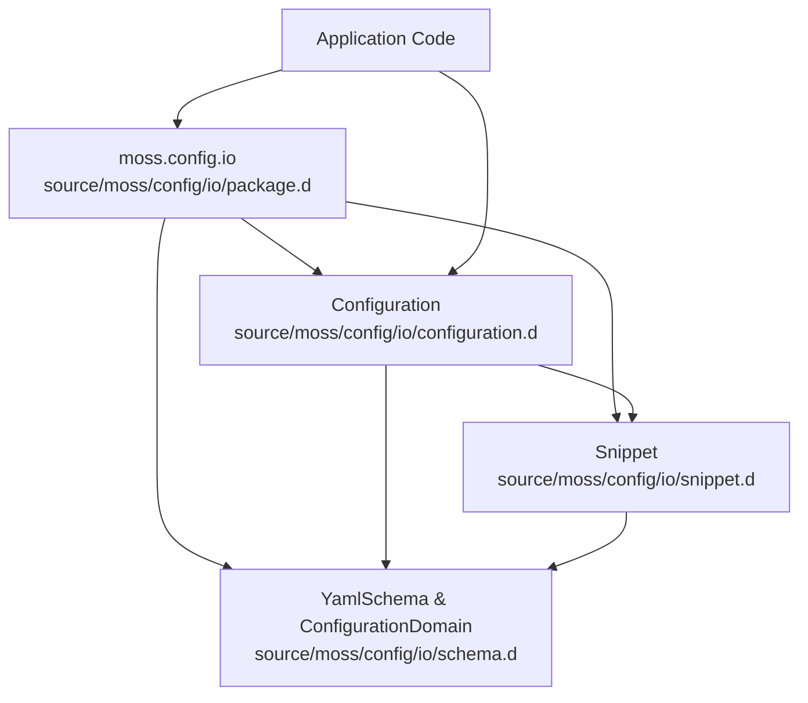
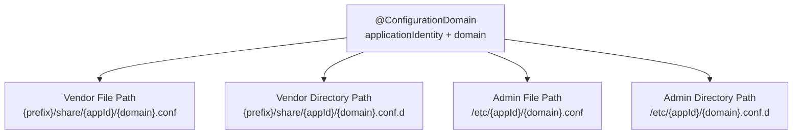
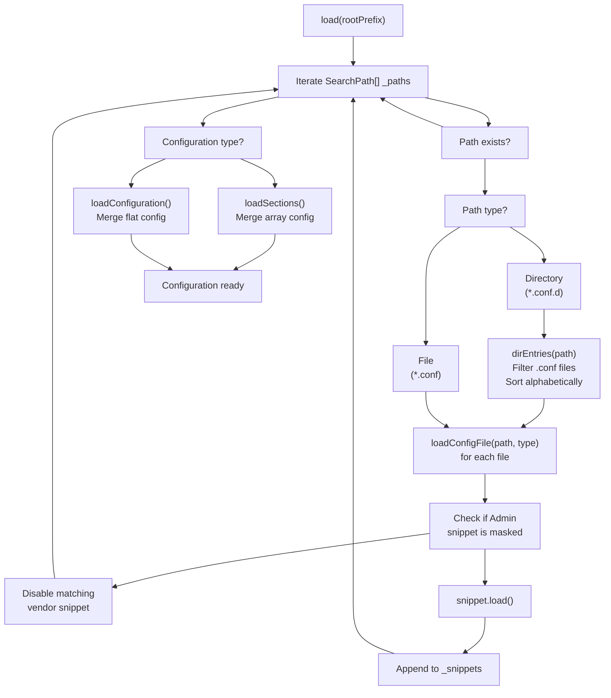
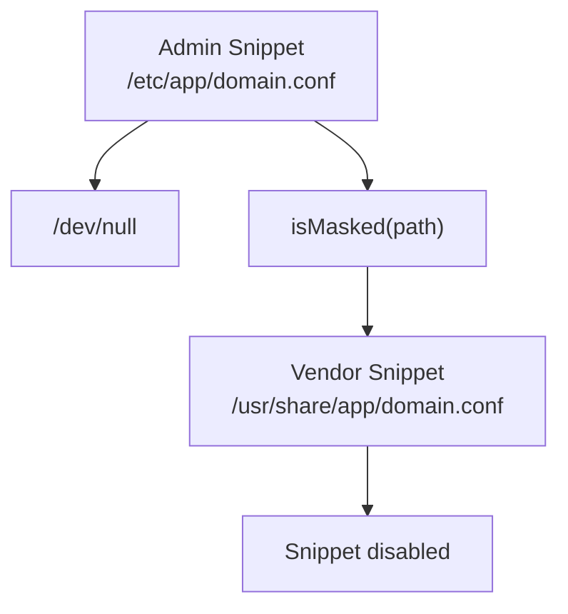
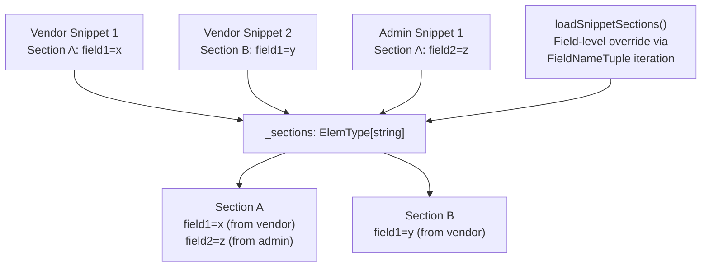
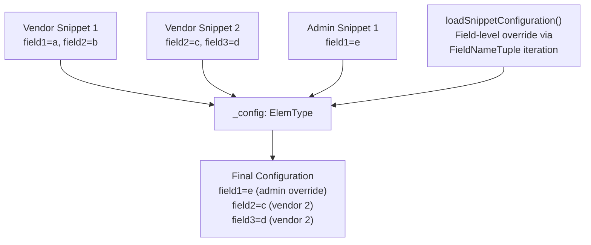
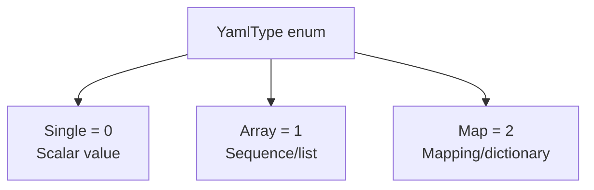
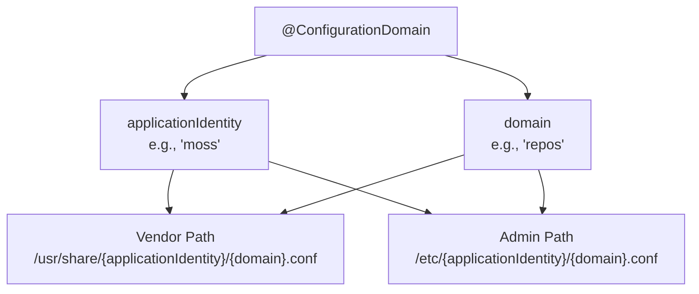
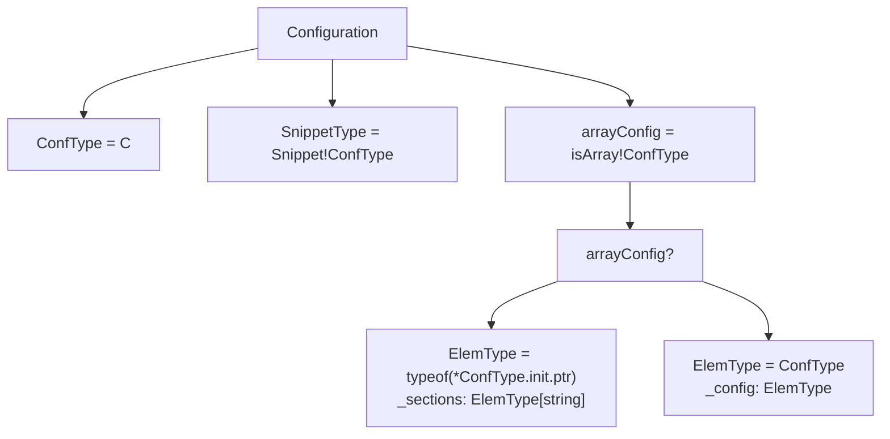
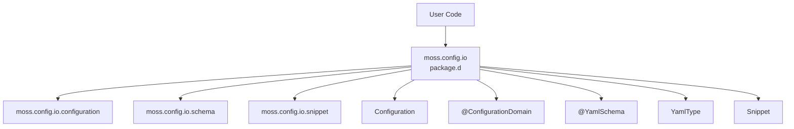

# moss-config

Relevant source files

* [meson\_options.txt](../meson_options.txt)
* [source/moss/config/io/configuration.d](../source/moss/config/io/configuration.d)
* [source/moss/config/io/package.d](../source/moss/config/io/package.d)
* [source/moss/config/io/schema.d](../source/moss/config/io/schema.d)

## Purpose and Scope

The `moss-config` component provides a sophisticated configuration management system for Serpent OS applications. It implements a layered configuration model where vendor-provided defaults can be overridden by administrator settings, supports YAML-based configuration files organized as snippets, and includes configuration masking capabilities. This component is optional and can be enabled via the `--with-config` build option (see [Component Selection](2.2-component-selection)).

For comprehensive details about the configuration system architecture, layering mechanics, schema validation, and snippet management, see [Configuration Management Deep Dive](4-configuration-management-deep-dive).

## Component Architecture

The `moss-config` component consists of three primary modules that work together to provide flexible configuration management:



**Sources:** [source/moss/config/io/package.d1-20](../source/moss/config/io/package.d#L1-L20) [source/moss/config/io/configuration.d1-385](../source/moss/config/io/configuration.d#L1-L385) [source/moss/config/io/schema.d1-54](../source/moss/config/io/schema.d#L1-L54)

## Template-Based Configuration

The `Configuration<C>` class is a template that operates on user-defined configuration structures. The template parameter `C` determines the configuration style:

| Configuration Style | Template Type | Behavior |
| --- | --- | --- |
| **Array Configuration** | `Configuration<T[]>` | Multiple sections with unique IDs; sections can override each other |
| **Flat Configuration** | `Configuration<T>` | Single configuration object; fields can be overridden |

The configuration style is automatically detected at compile-time via `isArray!ConfType` [source/moss/config/io/configuration.d266](../source/moss/config/io/configuration.d#L266-L266)

**Sources:** [source/moss/config/io/configuration.d87-88](../source/moss/config/io/configuration.d#L87-L88) [source/moss/config/io/configuration.d264-266](../source/moss/config/io/configuration.d#L264-L266)

## Configuration Paths and Search Order

### Path Structure

The `Configuration<C>` class constructs search paths based on a `ConfigurationDomain` UDA that must be attached to the configuration structure:



**Sources:** [source/moss/config/io/configuration.d92-119](../source/moss/config/io/configuration.d#L92-L119) [source/moss/config/io/schema.d31-35](../source/moss/config/io/schema.d#L31-L35)

### Directory Constants

The system uses two base directory constants defined in the `Directories` enum:

* `Directories.Vendor = "share"` - Vendor configuration base path [source/moss/config/io/configuration.d77](../source/moss/config/io/configuration.d#L77-L77)
* `Directories.Admin = "etc"` - Administrator configuration base path [source/moss/config/io/configuration.d78](../source/moss/config/io/configuration.d#L78-L78)

The vendor prefix defaults to `"usr"` but can be customized via the `Configuration<C>` constructor [source/moss/config/io/configuration.d92](../source/moss/config/io/configuration.d#L92-L92)

**Sources:** [source/moss/config/io/configuration.d75-79](../source/moss/config/io/configuration.d#L75-L79)

## Configuration Loading Process

### Load Flow

The `load(string rootPrefix)` method orchestrates the configuration loading process:



**Sources:** [source/moss/config/io/configuration.d140-186](../source/moss/config/io/configuration.d#L140-L186) [source/moss/config/io/configuration.d238-262](../source/moss/config/io/configuration.d#L238-L262)

### Configuration Masking

Configuration files can be "masked" by creating a symbolic link to `/dev/null` [source/moss/config/io/configuration.d31](../source/moss/config/io/configuration.d#L31-L31) When an admin snippet is masked, the system disables any matching vendor snippet with the same name:



**Sources:** [source/moss/config/io/configuration.d246-253](../source/moss/config/io/configuration.d#L246-L253) [source/moss/config/io/configuration.d366-374](../source/moss/config/io/configuration.d#L366-L374)

## Configuration Merging Strategies

### Array Configuration (Sections)

For array-style configurations (`Configuration<T[]>`), the system maintains a dictionary of sections keyed by their ID:



The `loadSnippetSections()` method iterates through `FieldNameTuple!ElemType` to perform field-level overrides [source/moss/config/io/configuration.d301-312](../source/moss/config/io/configuration.d#L301-L312)

**Sources:** [source/moss/config/io/configuration.d272-324](../source/moss/config/io/configuration.d#L272-L324)

### Flat Configuration (Single Object)

For flat configurations (`Configuration<T>`), all snippets contribute fields to a single `_config` object:



The `loadSnippetConfiguration()` method uses `explicitlyDefined(name)` to determine which fields were explicitly set in each snippet [source/moss/config/io/configuration.d344](../source/moss/config/io/configuration.d#L344-L344)

**Sources:** [source/moss/config/io/configuration.d327-360](../source/moss/config/io/configuration.d#L327-L360)

## Schema Validation

### YamlSchema UDA

The `YamlSchema` struct is a User-Defined Attribute (UDA) that provides field-level validation metadata:

| Field | Type | Purpose |
| --- | --- | --- |
| `name` | `string` | YAML key name (may differ from struct field name) |
| `required` | `bool` | Whether this field must be present |
| `type` | `YamlType` | Expected YAML value type (Single, Array, or Map) |
| `acceptableValues` | `string[]` | Whitelist of valid string values |

**Sources:** [source/moss/config/io/schema.d40-53](../source/moss/config/io/schema.d#L40-L53)

### YamlType Enumeration

The `YamlType` enum defines the three supported YAML value types:



**Sources:** [source/moss/config/io/schema.d21-26](../source/moss/config/io/schema.d#L21-L26)

### ConfigurationDomain UDA

Every configuration structure must be annotated with `@ConfigurationDomain`:



The `Configuration<C>` constructor validates that exactly one `ConfigurationDomain` UDA is present and that both fields are non-empty [source/moss/config/io/configuration.d94-99](../source/moss/config/io/configuration.d#L94-L99)

**Sources:** [source/moss/config/io/schema.d31-35](../source/moss/config/io/schema.d#L31-L35) [source/moss/config/io/configuration.d94-100](../source/moss/config/io/configuration.d#L94-L100)

## Key Configuration Class Members

### Type Aliases and Properties

The `Configuration<C>` class defines several internal type aliases based on the template parameter:



**Sources:** [source/moss/config/io/configuration.d264-266](../source/moss/config/io/configuration.d#L264-L266) [source/moss/config/io/configuration.d273](../source/moss/config/io/configuration.d#L273-L273) [source/moss/config/io/configuration.d330](../source/moss/config/io/configuration.d#L330-L330)

### Public API Methods and Properties

| Member | Return Type | Description |
| --- | --- | --- |
| `paths` | `const(SearchPath[])` | Returns the search paths used for configuration loading [source/moss/config/io/configuration.d124-127](../source/moss/config/io/configuration.d#L124-L127) |
| `domain` | `const(ConfigurationDomain)` | Returns the configuration domain metadata [source/moss/config/io/configuration.d132-135](../source/moss/config/io/configuration.d#L132-L135) |
| `load(string)` | `void` | Loads configuration from the specified root prefix [source/moss/config/io/configuration.d140](../source/moss/config/io/configuration.d#L140-L140) |
| `snippets` | `auto` | Returns all enabled snippets [source/moss/config/io/configuration.d191-194](../source/moss/config/io/configuration.d#L191-L194) |
| `ids` | `auto` | (Array config only) Returns unique section IDs [source/moss/config/io/configuration.d202-210](../source/moss/config/io/configuration.d#L202-L210) |
| `sections` | `auto` | (Array config only) Returns all merged sections [source/moss/config/io/configuration.d215-218](../source/moss/config/io/configuration.d#L215-L218) |
| `config` | `auto` | (Flat config only) Returns the merged configuration object [source/moss/config/io/configuration.d227-230](../source/moss/config/io/configuration.d#L227-L230) |

**Sources:** [source/moss/config/io/configuration.d124-231](../source/moss/config/io/configuration.d#L124-L231)

## Build Integration

The `moss-config` component is controlled by the `with-config` build option:

```
option('with-config', type: 'boolean', value: true, description: 'Enable moss-config library')
```

This option defaults to `true`, meaning the component is included by default unless explicitly disabled. To disable during build: `meson configure -Dwith-config=false`.

**Sources:** [meson\_options.txt1](../meson_options.txt#L1-L1)

## Usage Pattern

### Typical Usage Flow

**Sources:** [source/moss/config/io/configuration.d92-119](../source/moss/config/io/configuration.d#L92-L119) [source/moss/config/io/configuration.d140-186](../source/moss/config/io/configuration.d#L140-L186)

## Module Structure

The `moss.config.io` package provides a clean public API by re-exporting all major types:



Applications typically only need to import `moss.config.io` to access all configuration functionality [source/moss/config/io/package.d15-19](../source/moss/config/io/package.d#L15-L19)

**Sources:** [source/moss/config/io/package.d1-20](../source/moss/config/io/package.d#L1-L20)

---

For detailed information about configuration class implementation, snippet processing, schema validation rules, and advanced features like configuration masking, see [Configuration Management Deep Dive](4-configuration-management-deep-dive) and its subsections.