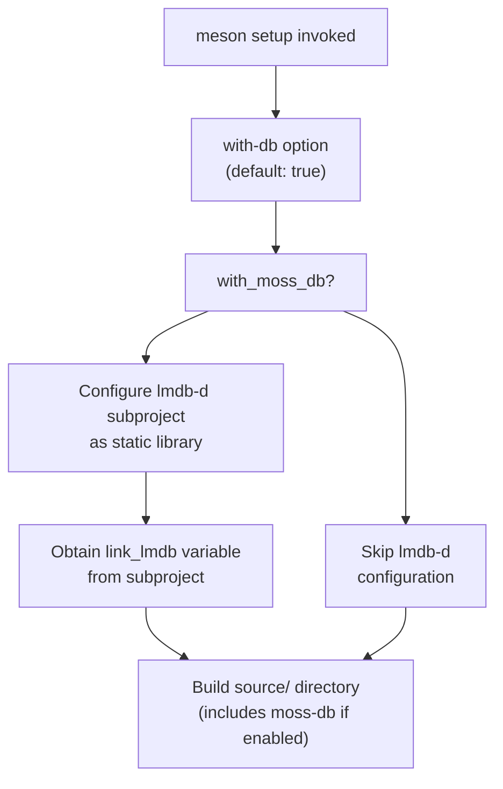
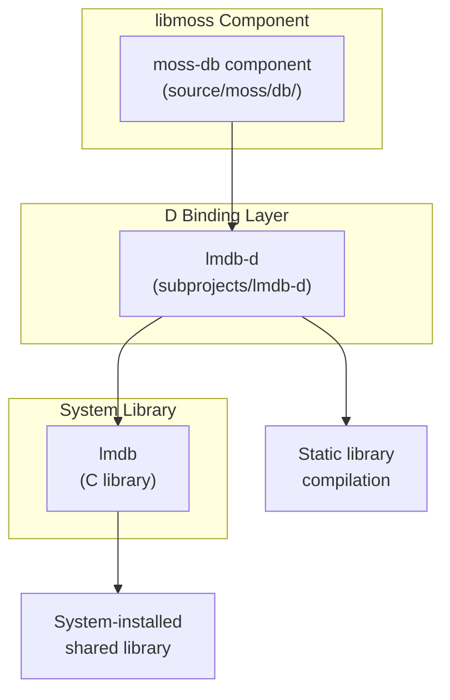
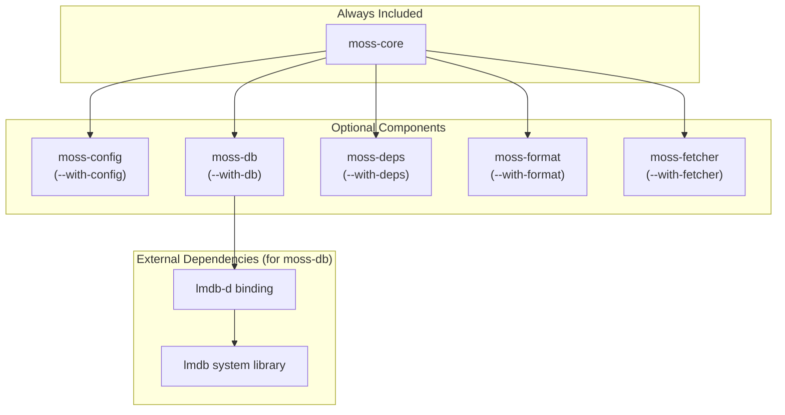
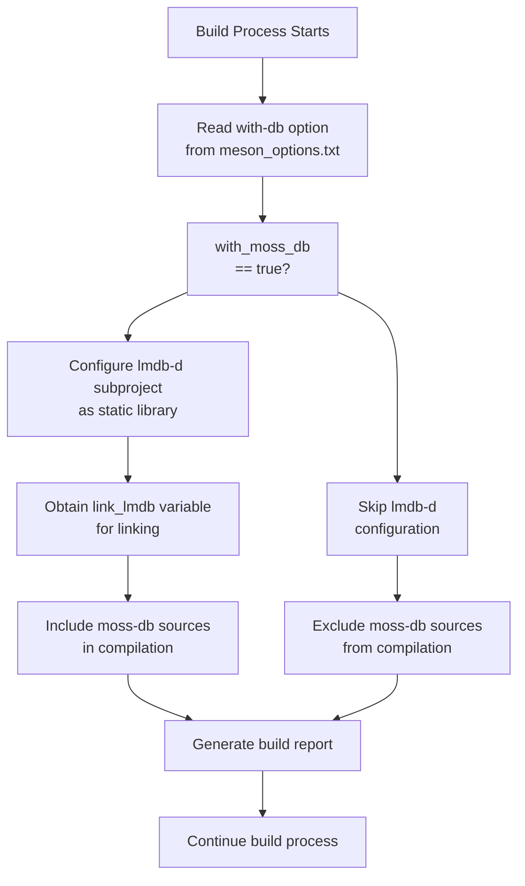

# moss-db

Relevant source files

* [dub.json](../dub.json)
* [meson.build](../meson.build)
* [meson\_options.txt](../meson_options.txt)

## Purpose and Scope

The `moss-db` component provides high-performance embedded database functionality for libmoss, built on top of LMDB (Lightning Memory-Mapped Database). This component is optional and can be selectively included during the build process via the `--with-db` build option.

This page documents the moss-db component's build configuration, dependencies, and integration within the libmoss ecosystem. For information about configuring libmoss applications, see [moss-config](3.2-moss-config). For details about building libmoss with different component selections, see [Component Selection](2.2-component-selection).

**Sources:** [meson\_options.txt2](../meson_options.txt#L2-L2) [dub.json27-29](../dub.json#L27-L29) [meson.build71-77](../meson.build#L71-L77)

---

## LMDB: The Underlying Database Engine

The moss-db component leverages LMDB, a high-performance embedded transactional database. LMDB is designed as a key-value store with the following characteristics:

| Feature | Description |
| --- | --- |
| **Memory-Mapped I/O** | Files are mapped directly into memory, eliminating buffer management overhead |
| **Zero-Copy Reads** | Read operations return direct pointers to mapped memory, avoiding data copying |
| **ACID Transactions** | Full ACID compliance with MVCC (Multi-Version Concurrency Control) |
| **Copy-on-Write** | Updates create new versions without modifying existing data in-place |
| **Lock-Free Reads** | Multiple readers can operate concurrently without blocking |
| **Compact Size** | Minimal code footprint (32KB compiled) |

LMDB is particularly well-suited for system management tools like moss where:

* Fast read performance is critical
* Data integrity must be guaranteed
* Embedded operation (no separate database server) is required
* Concurrent read access is common

**Sources:** [dub.json27-42](../dub.json#L27-L42)

---

## Build Configuration

### Enabling moss-db

The moss-db component is controlled by the `with-db` build option, which is a boolean option defaulting to `true`. This means moss-db is included by default unless explicitly disabled.

**Meson Build Option:**

```
meson setup build -Dwith-db=true   # Enable moss-db (default)
meson setup build -Dwith-db=false  # Disable moss-db
```

When moss-db is enabled, the build system conditionally configures the lmdb-d subproject:

[meson.build71-77](../meson.build#L71-L77)

### Build System Integration

The following diagram shows how the build system conditionally includes moss-db based on the configuration:



**Sources:** [meson.build14-77](../meson.build#L14-L77) [meson\_options.txt2](../meson_options.txt#L2-L2)

---

## Dependency Chain

The moss-db component has a two-layer dependency structure: a D language binding layer and the underlying C library.

### Dependency Architecture



**Sources:** [meson.build71-77](../meson.build#L71-L77) [dub.json27-42](../dub.json#L27-L42)

### lmdb-d: D Language Binding

The `lmdb-d` dependency is managed as a Meson subproject and configured to build as a static library. The binding provides idiomatic D interfaces to LMDB's C API, including:

* D-style error handling (exceptions instead of error codes)
* Memory-safe wrappers for LMDB pointers
* Type-safe key-value pair handling
* RAII (Resource Acquisition Is Initialization) for automatic cleanup

**Subproject Location:** `subprojects/lmdb-d/`

**Build Configuration:**

* Default library type: `static`
* Linked variable: `link_lmdb` (obtained from subproject)

**Sources:** [dub.json27-29](../dub.json#L27-L29) [meson.build72-77](../meson.build#L72-L77)

### lmdb: System Library Dependency

The underlying LMDB library must be installed on the build system. This is a system-level dependency declared in the DUB configuration.

**Library Name:** `lmdb` (typically `liblmdb.so` on Linux systems)

**Required Functionality:**

* Key-value storage with B+ tree indexing
* ACID transaction support
* Memory-mapped file I/O
* Multi-version concurrency control (MVCC)

**Sources:** [dub.json42](../dub.json#L42-L42)

---

## Component Relationships

The following diagram shows how moss-db fits into the larger libmoss component ecosystem:



**Sources:** [meson.build14-77](../meson.build#L14-L77) [meson\_options.txt1-5](../meson_options.txt#L1-L5)

### Relationship to Other Components

moss-db is one of six modular components in libmoss:

| Component | Purpose | Depends on moss-db? |
| --- | --- | --- |
| **moss-core** | Foundation (always included) | No |
| **moss-config** | Configuration management | No |
| **moss-db** | Database storage | N/A (self) |
| **moss-deps** | Dependency tracking | No |
| **moss-format** | Binary/source format handling | No (direct) |
| **moss-fetcher** | HTTP/Git fetching | No (direct) |

While moss-db doesn't have direct compile-time dependencies on other libmoss components (besides moss-core), it may be used by higher-level components for persistent storage needs.

**Sources:** [meson.build14-114](../meson.build#L14-L114)

---

## Build Report

When building libmoss with Meson, the build system outputs a configuration report showing which components are enabled:

```
    Build configuration:
    ====================

    moss-core:                              always
    moss-config:                            true
    moss-db:                                true      ← moss-db status
    moss-deps:                              true
    moss-format (binary):                   true
    moss-format (source):                   true
    moss-fetcher (http):                    true
    moss-fetcher (git):                     false
```

The moss-db line indicates whether the component was included in the build. This is determined by the `with_moss_db` variable which is set based on the `--with-db` option.

**Sources:** [meson.build102-117](../meson.build#L102-L117)

---

## Conditional Compilation

The moss-db component uses conditional compilation based on build options. The following flowchart illustrates the build decision process:



**Sources:** [meson.build15-108](../meson.build#L15-L108) [meson\_options.txt2](../meson_options.txt#L2-L2)

---

## DUB Package Manager Integration

In addition to Meson, libmoss supports building with DUB (D's native package manager). The DUB configuration declares the lmdb-d dependency and lmdb system library:

**DUB Dependencies:**

```
"lmdb-d": {
    "path": "subprojects/lmdb-d"
}
```

**System Libraries:**

```
"libs": [
    "libcurl",
    "lmdb",        ← LMDB system library
    "libxxhash",
    "libzstd"
]
```

The DUB configuration uses path-based dependencies, meaning lmdb-d is expected to be present in the `subprojects/lmdb-d/` directory relative to the libmoss root.

**Sources:** [dub.json27-45](../dub.json#L27-L45)

---

## Toolchain Requirements

moss-db, as part of libmoss, requires:

| Requirement | Minimum Version | Purpose |
| --- | --- | --- |
| **LDC** | 1.31.0 | D compiler (LLVM-based) |
| **lmdb** | System-dependent | LMDB C library |
| **Meson** | Project-dependent | Build system orchestration |

The LDC version requirement is specified at the project level and applies to all libmoss components, including moss-db.

**Sources:** [dub.json10-12](../dub.json#L10-L12)

---

## Summary

moss-db is an optional libmoss component that provides embedded database functionality through LMDB. Key characteristics:

1. **Optional Component**: Enabled by default via `--with-db=true`, can be disabled for minimal builds
2. **Two-Layer Dependencies**: Uses lmdb-d (D binding) which wraps lmdb (C library)
3. **Static Linking**: The lmdb-d subproject is compiled as a static library for portability
4. **High Performance**: Leverages LMDB's memory-mapped I/O and zero-copy reads
5. **Build System Support**: Integrates with both Meson and DUB build systems

The component's modular design allows consumers to exclude database functionality when not needed, reducing binary size and compilation complexity.

**Sources:** [meson.build71-117](../meson.build#L71-L117) [meson\_options.txt2](../meson_options.txt#L2-L2) [dub.json27-42](../dub.json#L27-L42)