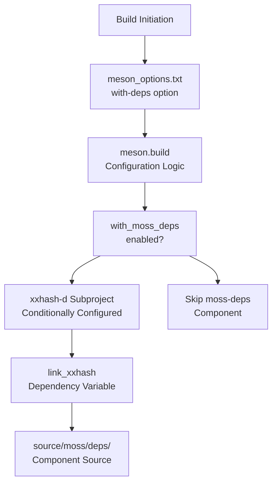
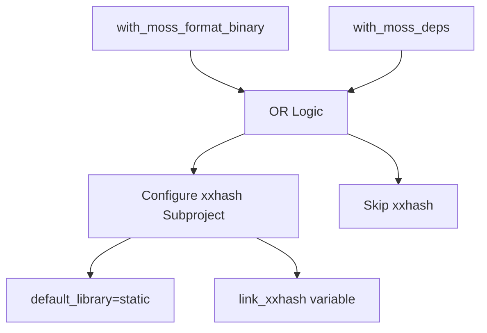
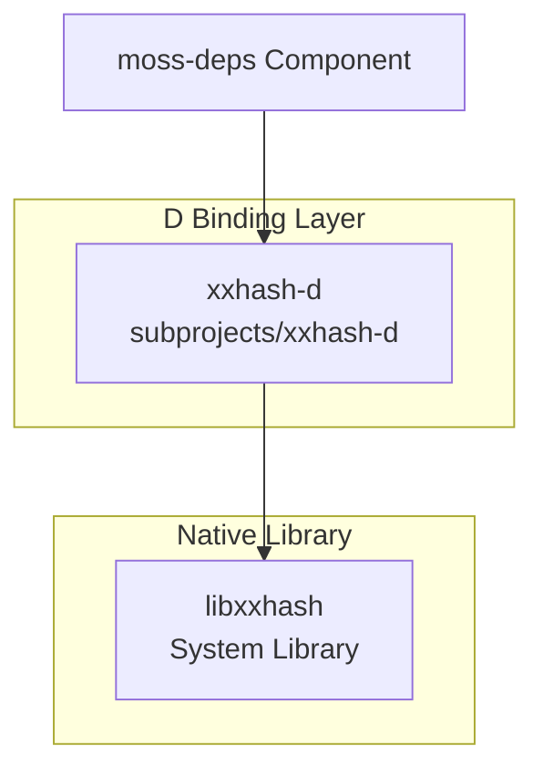
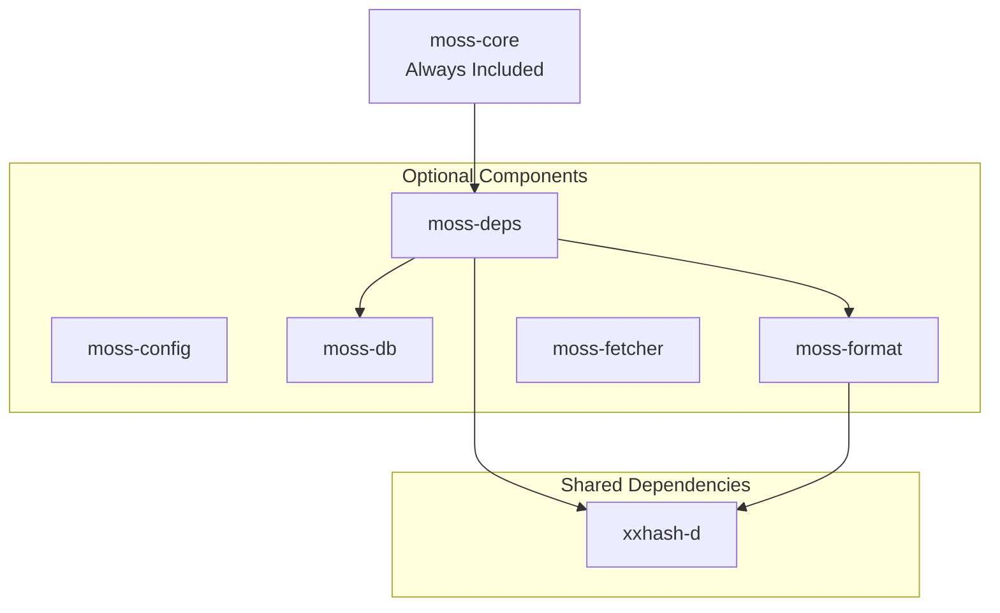

# moss-deps

Relevant source files

* [dub.json](../dub.json)
* [meson.build](../meson.build)
* [meson\_options.txt](../meson_options.txt)

## Purpose and Scope

The `moss-deps` component provides dependency management functionality for the libmoss library. It is responsible for tracking and managing dependencies efficiently using xxHash-based hashing. This component is optional and can be enabled or disabled at build time.

For information about the database storage component, see [moss-db](3.3-moss-db). For information about the binary and source format handling that may work with dependency data, see [moss-format](3.5-moss-format).

---

## Component Overview

The `moss-deps` component is one of six modular components in libmoss's architecture. Unlike `moss-core` which is always included, `moss-deps` is optional and must be explicitly enabled during the build process. The component leverages xxHash, a high-performance hashing algorithm, for efficient dependency tracking operations.

The dependency management system is designed to work alongside other libmoss components, particularly in scenarios where package dependencies, version tracking, or relationship mapping between software components is required.

**Sources:** [meson.build16](../meson.build#L16-L16) [meson\_options.txt3](../meson_options.txt#L3-L3) [dub.json6](../dub.json#L6-L6)

---

## Build Configuration

### Build System Integration

The `moss-deps` component integrates into both DUB and Meson build systems through a unified configuration approach:



**Sources:** [meson.build16](../meson.build#L16-L16) [meson.build80-86](../meson.build#L80-L86) [meson\_options.txt3](../meson_options.txt#L3-L3)

### Meson Build Options

The component is controlled by a boolean build option defined in the Meson configuration:

| Option | Type | Default | Description |
| --- | --- | --- | --- |
| `with-deps` | boolean | `true` | Enable moss-deps library |

This option is evaluated at [meson.build16](../meson.build#L16-L16) and stored in the `with_moss_deps` variable, which controls whether the component is compiled and linked into the final library.

**Sources:** [meson\_options.txt3](../meson_options.txt#L3-L3) [meson.build16](../meson.build#L16-L16)

### Conditional Dependency Configuration

The xxHash binding is conditionally configured based on whether `moss-deps` or `moss-format` (binary mode) are enabled:



The configuration logic at [meson.build80-86](../meson.build#L80-L86) demonstrates shared dependency optimization: if either `moss-deps` or binary format support requires xxHash, the subproject is configured once and the resulting `link_xxhash` variable is available to both components.

**Sources:** [meson.build80-86](../meson.build#L80-L86)

---

## Dependencies

### xxHash Integration

The `moss-deps` component has a direct dependency on the xxHash hashing library through the D language binding `xxhash-d`:



**Dependency Details:**

| Component | Type | Location | Purpose |
| --- | --- | --- | --- |
| `xxhash-d` | D Binding | `subprojects/xxhash-d` | Provides D interface to xxHash |
| `libxxhash` | System Library | System-provided | High-performance hashing algorithm |

The xxHash library is known for its exceptional speed, making it ideal for dependency tracking scenarios where hash computation needs to be performed frequently on package metadata, file contents, or dependency graphs.

**Sources:** [dub.json30-32](../dub.json#L30-L32) [dub.json43](../dub.json#L43-L43) [meson.build80-86](../meson.build#L80-L86)

### Subproject Configuration

When enabled, the xxHash subproject is configured as a static library:

```
xxhash = subproject('xxhash-d',
    default_options: [
        'default_library=static'
    ])
link_xxhash = xxhash.get_variable('link_libxxhash')
```

The static library configuration ensures that the xxHash functionality is directly embedded into the libmoss library, eliminating runtime dependency resolution for this component.

**Sources:** [meson.build80-86](../meson.build#L80-L86)

---

## Component Relationships

### Integration with Other Components

The `moss-deps` component operates as part of the modular libmoss architecture:



The diagram illustrates key relationships:

* **moss-core**: Provides foundational functionality that `moss-deps` builds upon
* **moss-db**: May store dependency information managed by `moss-deps`
* **moss-format**: May use dependency data when processing package formats
* **xxhash-d**: Shared dependency used by both `moss-deps` and binary format handling

**Sources:** [meson.build14-18](../meson.build#L14-L18) [meson.build80-86](../meson.build#L80-L86)

### Build Configuration Matrix

The following table shows how `moss-deps` relates to other component build options:

| Component | Build Option | Shared Dependencies |
| --- | --- | --- |
| moss-deps | `with-deps` | xxhash-d |
| moss-format (binary) | `with-format=binary` | xxhash-d |
| moss-db | `with-db` | lmdb-d |
| moss-config | `with-config` | (none) |
| moss-fetcher (http) | `with-fetcher=http` | (none) |
| moss-fetcher (git) | `with-fetcher=git` | libgit2-d |

The shared xxhash-d dependency between `moss-deps` and binary format support demonstrates the build system's optimization strategy: dependencies are configured once and shared across multiple components when both are enabled.

**Sources:** [meson.build14-18](../meson.build#L14-L18) [meson.build70-95](../meson.build#L70-L95) [meson\_options.txt1-5](../meson_options.txt#L1-L5)

---

## Build Report Output

When the library is built, the configuration system reports whether `moss-deps` is enabled:

```
Build configuration:
====================

moss-core:                              always
moss-config:                            true
moss-db:                                true
moss-deps:                              true
moss-format (binary):                   true
moss-format (source):                   true
moss-fetcher (http):                    true
moss-fetcher (git):                     false
```

This report is generated at [meson.build102-117](../meson.build#L102-L117) and provides confirmation of which components are included in the build, with `moss-deps` appearing in the fourth line of the component list.

**Sources:** [meson.build102-117](../meson.build#L102-L117)

---

## System Library Requirements

When building with `moss-deps` enabled, the following system library must be available:

| Library | Purpose | DUB Configuration |
| --- | --- | --- |
| `libxxhash` | xxHash implementation | Listed in `libs` array |

The system library requirement is declared at [dub.json43](../dub.json#L43-L43) as part of the `libs` array, which instructs the linker to link against the native xxHash library when building with DUB.

**Sources:** [dub.json40-45](../dub.json#L40-L45)