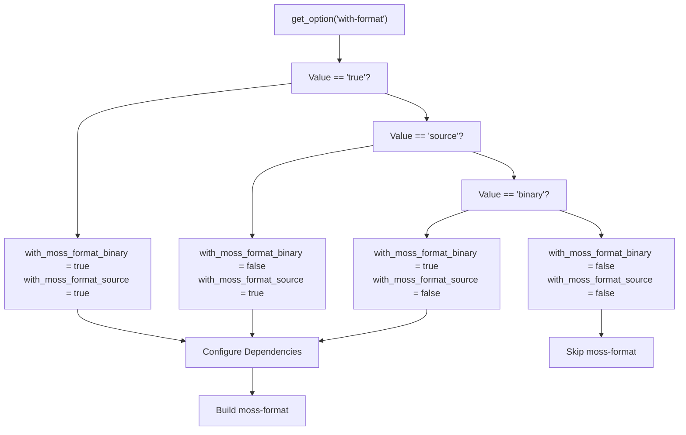
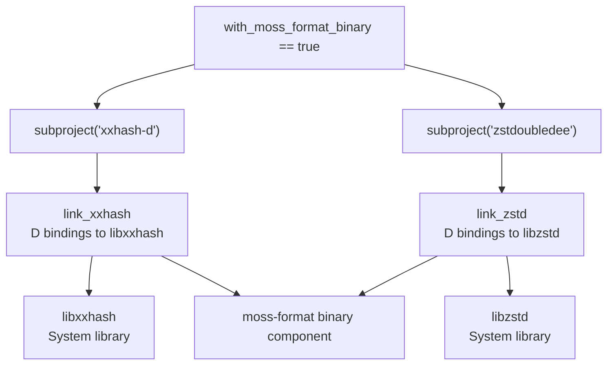
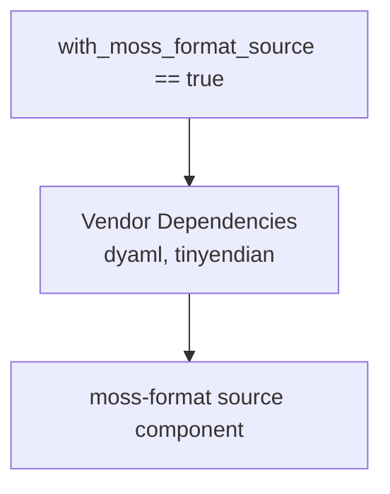
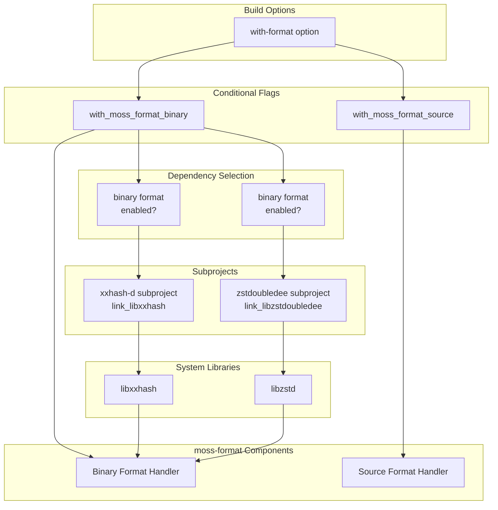
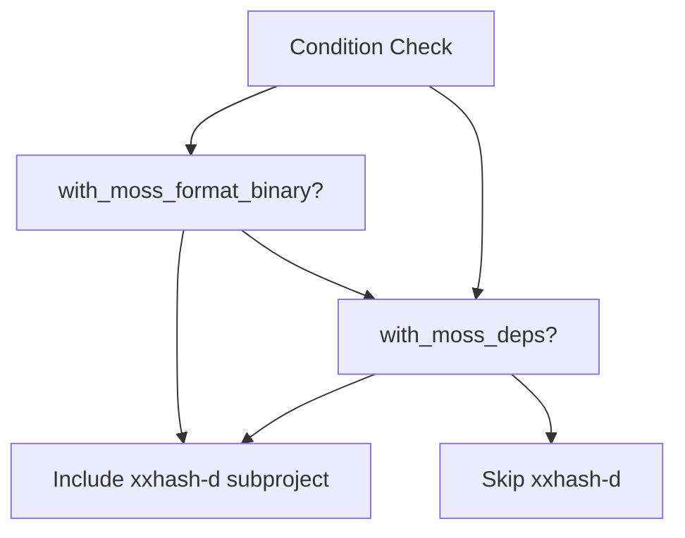
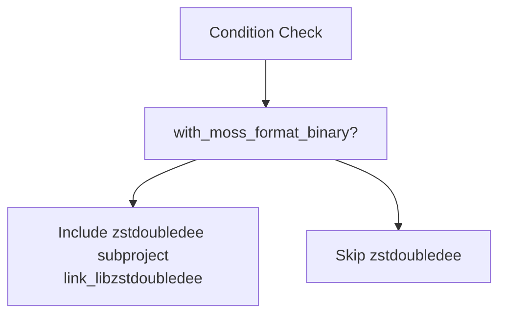

# moss-format

Relevant source files

* [dub.json](../dub.json)
* [meson.build](../meson.build)
* [meson\_options.txt](../meson_options.txt)

The `moss-format` component provides data format handling capabilities for the libmoss library. This component is responsible for reading and writing moss package formats, supporting both binary packages (compiled software) and source packages (recipe definitions). The component is modular and can be selectively enabled at build time to include only the format types needed.

For information about building and enabling this component, see [Component Selection](2.2-component-selection). For details on the dependencies required by moss-format, see [Dependencies and Requirements](2.3-dependencies-and-requirements).

## Purpose and Scope

The `moss-format` component handles serialization and deserialization of moss package formats. It provides two distinct subsystems:

* **Binary Format**: Handles compiled package archives with compression support
* **Source Format**: Handles source package definitions and recipe files

Both subsystems can be independently enabled or disabled through build configuration, allowing consumers to minimize binary size and compilation time by including only the format handling they need.

## Build Configuration

The moss-format component is controlled through the `with-format` build option, which accepts four possible values that determine which format handlers are compiled into the library.

### Format Selection Matrix

| Option Value | Binary Format | Source Format | Use Case |
| --- | --- | --- | --- |
| `true` | ✓ Enabled | ✓ Enabled | Full package management tools |
| `binary` | ✓ Enabled | ✗ Disabled | Package installation tools |
| `source` | ✗ Disabled | ✓ Enabled | Build recipe processors |
| `false` | ✗ Disabled | ✗ Disabled | Tools not handling packages |

**Sources:** [meson\_options.txt5](../meson_options.txt#L5-L5) [meson.build24-37](../meson.build#L24-L37)

### Build Option Processing

The build system evaluates the `with-format` option to set conditional compilation flags that determine which format subsystems are included:



**Sources:** [meson.build24-37](../meson.build#L24-L37)

## Binary Format Subsystem

The binary format subsystem handles compiled package archives. These packages contain the compiled binaries, libraries, and associated files that are installed on target systems.

### Binary Format Dependencies

The binary format requires two external libraries for its operation:

1. **zstd Compression**: High-performance compression algorithm via `zstd-d` bindings
2. **xxHash**: Fast non-cryptographic hash algorithm via `xxhash-d` bindings

These dependencies are conditionally included only when the binary format is enabled:



**Sources:** [meson.build79-95](../meson.build#L79-L95) [dub.json30-44](../dub.json#L30-L44)

### Compression Strategy

Binary packages use zstd compression to minimize storage and transfer overhead while maintaining fast decompression speeds. The zstd algorithm was chosen for its excellent compression ratios and decompression performance, which are critical for package installation operations.

### Hash Algorithm

The xxHash algorithm provides fast integrity verification and content-addressing capabilities. This non-cryptographic hash is used for quickly verifying package contents and supporting deduplication.

**Sources:** [meson.build79-95](../meson.build#L79-L95)

## Source Format Subsystem

The source format subsystem handles source package definitions, which typically contain build recipes, metadata, and instructions for building software from source.

### Source Format Characteristics

Unlike the binary format, the source format subsystem has minimal external dependencies. It does not require compression or hashing libraries because source packages are typically human-readable recipe files rather than compressed archives.

The source format is enabled independently from the binary format, allowing tools that only process build recipes to avoid linking against compression and hashing libraries:



**Sources:** [meson.build28-37](../meson.build#L28-L37)

## Component Architecture

The moss-format component integrates with the broader libmoss architecture through conditional compilation. The following diagram shows how the build configuration determines which dependencies are linked:



**Sources:** [meson.build14-95](../meson.build#L14-L95)

## Dependency Conditional Logic

The moss-format component demonstrates a key architectural principle in libmoss: dependencies are only pulled in when the features that require them are enabled. This conditional dependency management is implemented in the Meson build configuration:

### xxHash Dependency

The xxHash library is required by both `moss-format` (binary) and `moss-deps` components:



**Sources:** [meson.build79-86](../meson.build#L79-L86)

### zstd Dependency

The zstd library is exclusively used by the binary format subsystem:



**Sources:** [meson.build88-95](../meson.build#L88-L95)

## Integration with Other Components

The moss-format component works in conjunction with other libmoss components to provide complete package management functionality:

| Component | Relationship to moss-format |
| --- | --- |
| **moss-deps** | Shares xxHash dependency; processes dependency information from packages |
| **moss-db** | Stores package metadata extracted from formats |
| **moss-fetcher** | Downloads package files that moss-format then parses |
| **moss-core** | Provides foundational types and utilities used by format handlers |

For detailed information about these components, see:

* moss-deps: [#3.4](3.4-moss-deps)
* moss-db: [#3.3](3.3-moss-db)
* moss-fetcher: [#3.6](3.6-moss-fetcher)
* moss-core: [#3.1](3.1-moss-core)

## Build Configuration Report

When building libmoss, the Meson configuration outputs a report showing which format subsystems are enabled. This report is generated after processing all build options:

```
Build configuration:
====================

moss-core:                              always
moss-config:                            true
moss-db:                                true
moss-deps:                              true
moss-format (binary):                   true
moss-format (source):                   true
moss-fetcher (http):                    true
moss-fetcher (git):                     false
```

The `moss-format (binary)` and `moss-format (source)` lines indicate which format subsystems have been enabled based on the `with-format` option value.

**Sources:** [meson.build102-117](../meson.build#L102-L117)

## Usage Scenarios

The modular nature of moss-format enables different usage scenarios:

### Scenario 1: Full Package Manager

* **Format Options**: `with-format=true`
* **Enabled**: Binary + Source formats
* **Dependencies**: xxhash, zstd
* **Use Case**: Complete package management tool that builds from source and installs binary packages

### Scenario 2: Installation Tool

* **Format Options**: `with-format=binary`
* **Enabled**: Binary format only
* **Dependencies**: xxhash, zstd
* **Use Case**: Package installation tool that only handles pre-built packages

### Scenario 3: Build System

* **Format Options**: `with-format=source`
* **Enabled**: Source format only
* **Dependencies**: None (beyond vendor dependencies)
* **Use Case**: Build recipe processor or source package validator

### Scenario 4: Minimal Tool

* **Format Options**: `with-format=false`
* **Enabled**: Neither format
* **Dependencies**: None
* **Use Case**: Tools that use other libmoss components but don't handle packages directly

**Sources:** [meson.build24-37](../meson.build#L24-L37) [meson\_options.txt5](../meson_options.txt#L5-L5)

## Summary

The moss-format component exemplifies libmoss's modular design philosophy. By providing independently selectable binary and source format subsystems, it allows applications to include only the functionality they need while avoiding unnecessary dependencies. The component's smart dependency management ensures that expensive dependencies like compression libraries are only linked when the features requiring them are enabled.