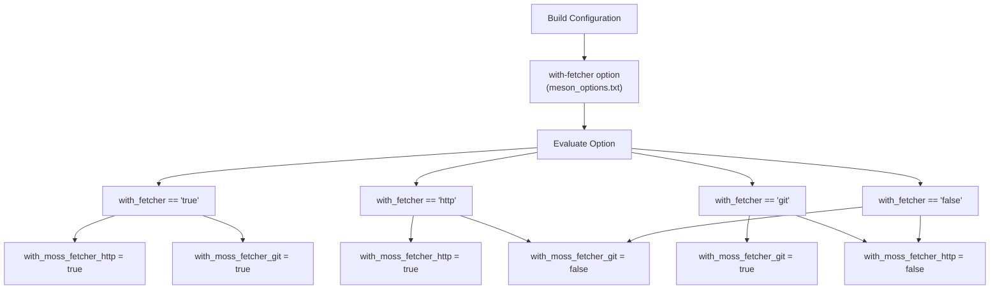
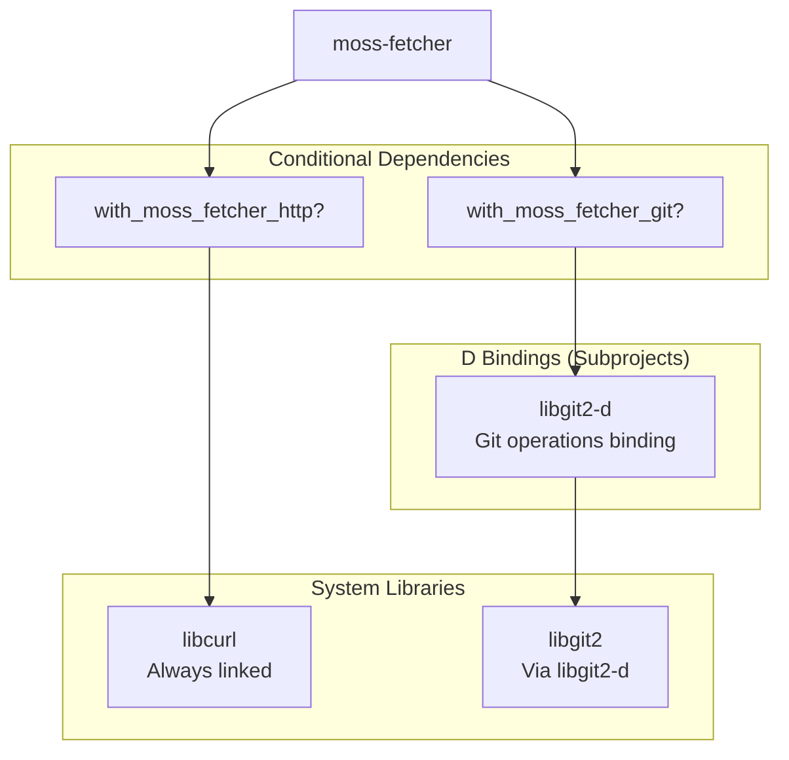
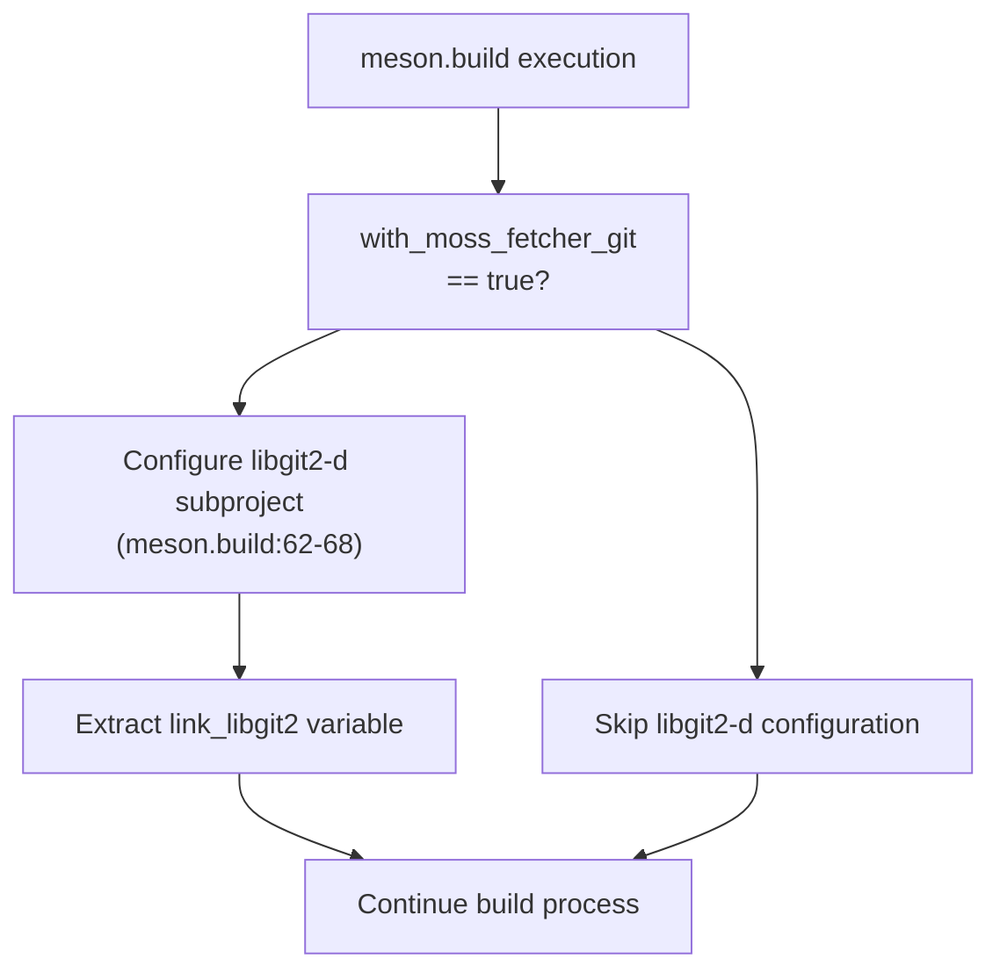
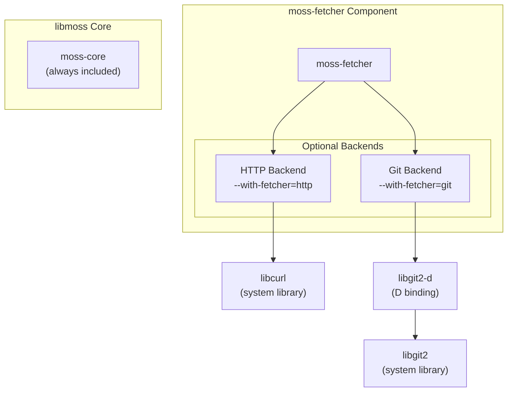
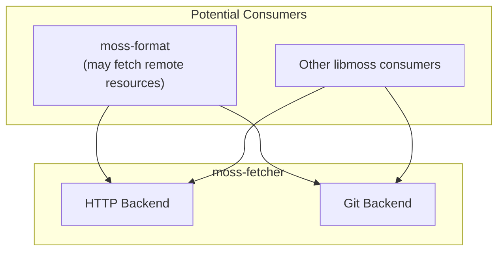

# moss-fetcher

Relevant source files

* [dub.json](../dub.json)
* [meson.build](../meson.build)
* [meson\_options.txt](../meson_options.txt)

## Purpose and Scope

The `moss-fetcher` component provides data fetching capabilities for libmoss, supporting retrieval of resources via HTTP and Git protocols. This optional component can be selectively compiled to include only the protocols required by the consuming application. Unlike the database and configuration components, moss-fetcher is designed around protocol-specific backends that can be independently enabled.

For information about the overall modular architecture of libmoss, see [Library Components](3-library-components). For details on building libmoss with specific component selections, see [Component Selection](2.2-component-selection).

**Sources:** [meson.build39-52](../meson.build#L39-L52) [meson\_options.txt4](../meson_options.txt#L4-L4) [dub.json14-45](../dub.json#L14-L45)

## Build Configuration

The moss-fetcher component is controlled by the `with-fetcher` build option, which accepts four possible values:

| Option Value | HTTP Backend | Git Backend | Use Case |
| --- | --- | --- | --- |
| `'http'` (default) | Enabled | Disabled | HTTP-only fetching |
| `'git'` | Disabled | Enabled | Git-only operations |
| `'true'` | Enabled | Enabled | Full protocol support |
| `'false'` | Disabled | Disabled | No fetching capability |

The build system translates the `with-fetcher` option into two internal flags: `with_moss_fetcher_http` and `with_moss_fetcher_git`, which control conditional compilation and dependency resolution.

**Sources:** [meson.build17-21](../meson.build#L17-L21) [meson.build39-52](../meson.build#L39-L52) [meson\_options.txt4](../meson_options.txt#L4-L4)



**Build Configuration Flow**
*This diagram shows how the with-fetcher option is evaluated into backend-specific flags*

**Sources:** [meson.build39-52](../meson.build#L39-L52)

## Fetcher Backends

### HTTP Fetcher Backend

When `with_moss_fetcher_http` is enabled, the component provides HTTP/HTTPS fetching capabilities via libcurl. This backend supports standard HTTP operations for retrieving resources from remote servers.

**Dependency:** The HTTP backend requires the `libcurl` system library, which is unconditionally linked when building libmoss.

**Sources:** [dub.json40-44](../dub.json#L40-L44) [meson.build19](../meson.build#L19-L19) [meson.build43-45](../meson.build#L43-L45)

### Git Fetcher Backend

When `with_moss_fetcher_git` is enabled, the component provides Git repository cloning and fetching operations via libgit2 bindings. This backend enables retrieval of source code and data from Git repositories.

**Dependency:** The Git backend requires the `libgit2-d` D binding library, which is conditionally built as a subproject when Git support is enabled.

**Sources:** [meson.build20](../meson.build#L20-L20) [meson.build46-48](../meson.build#L46-L48) [meson.build62-68](../meson.build#L62-L68) [dub.json24-26](../dub.json#L24-L26)

## Dependency Resolution

The moss-fetcher component's dependencies are resolved conditionally based on the enabled backends:



**Dependency Graph**
*This diagram illustrates conditional dependency resolution for fetcher backends*

**Sources:** [meson.build62-68](../meson.build#L62-L68) [dub.json24-26](../dub.json#L24-L26) [dub.json40-44](../dub.json#L40-L44)

### Build System Integration

The Meson build system conditionally configures the libgit2-d subproject only when Git fetcher support is enabled:



**Conditional Subproject Configuration**
*This flow shows how libgit2-d is only built when Git support is enabled*

**Sources:** [meson.build62-68](../meson.build#L62-L68)

## Component Architecture

The moss-fetcher component follows libmoss's modular design philosophy, where protocol backends are independently selectable at build time:



**Component Structure**
*This diagram shows the relationship between moss-fetcher and its protocol backends*

**Sources:** [meson.build17-21](../meson.build#L17-L21) [meson.build39-52](../meson.build#L39-L52) [meson.build112-113](../meson.build#L112-L113)

## Build Report Integration

When building libmoss, the configuration report displays the status of each fetcher backend:

```
Build configuration:
====================

moss-core:                              always
moss-config:                            true
moss-db:                                true
moss-deps:                              true
moss-format (binary):                   true
moss-format (source):                   true
moss-fetcher (http):                    true
moss-fetcher (git):                     false
```

The report clearly indicates which protocol backends are compiled into the final library build.

**Sources:** [meson.build102-117](../meson.build#L102-L117)

## Relationship to Other Components



**Integration Context**
*This diagram shows potential relationships with other libmoss components*

**Sources:** Inferred from architectural patterns

## DUB Integration

When using DUB as the build system, the moss-fetcher dependencies are managed through the main `dub.json` configuration. The libgit2-d binding is declared as a subproject dependency, making it available when the full component set is built:

| Dependency | Path | Purpose |
| --- | --- | --- |
| `libgit2-d` | `subprojects/libgit2-d` | D bindings for Git operations |

The libcurl system library is listed in the `libs` array, ensuring it's linked during the final binary creation.

**Sources:** [dub.json24-26](../dub.json#L24-L26) [dub.json40-44](../dub.json#L40-L44)

## Summary

The moss-fetcher component provides a flexible, modular approach to resource fetching:

* **Protocol Flexibility:** Backends can be independently enabled/disabled
* **Reduced Binary Size:** Applications need only compile the protocols they use
* **Clean Dependencies:** Each backend brings only its required dependencies
* **Consistent Interface:** Both backends presumably implement a common fetching interface (implementation details not visible in build configuration)

The default configuration (`--with-fetcher=http`) suggests that HTTP fetching is the most common use case, with Git support being optional for specialized scenarios.

**Sources:** [meson\_options.txt4](../meson_options.txt#L4-L4) [meson.build39-52](../meson.build#L39-L52)