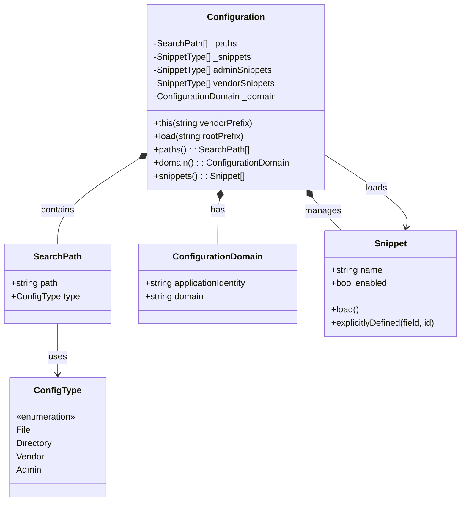
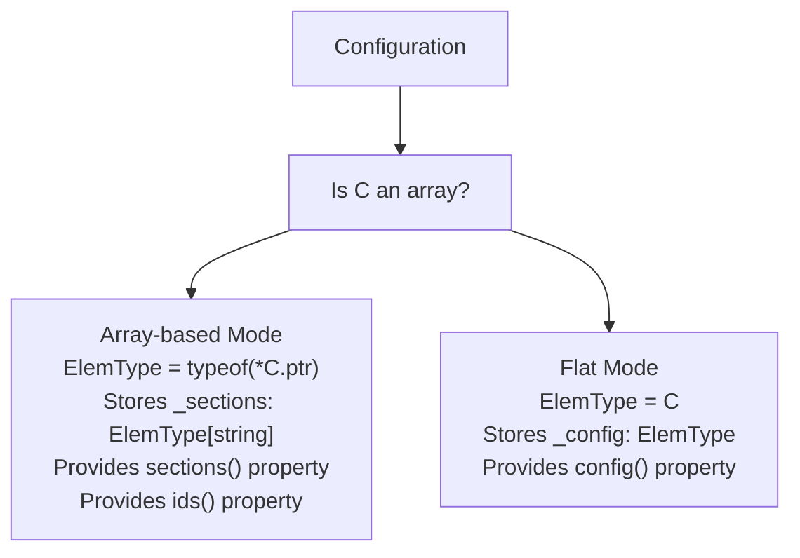
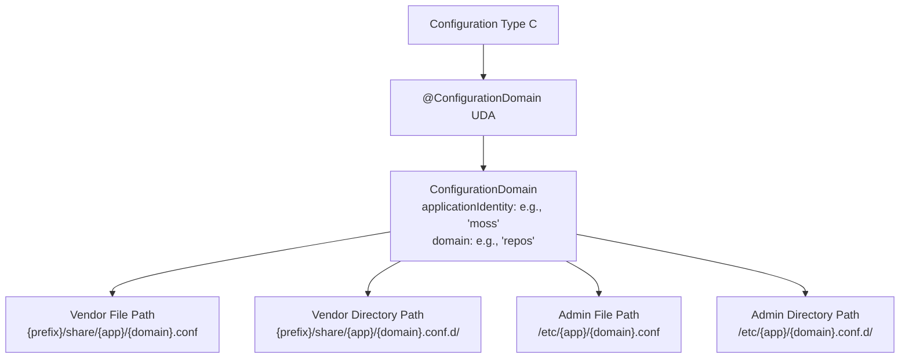
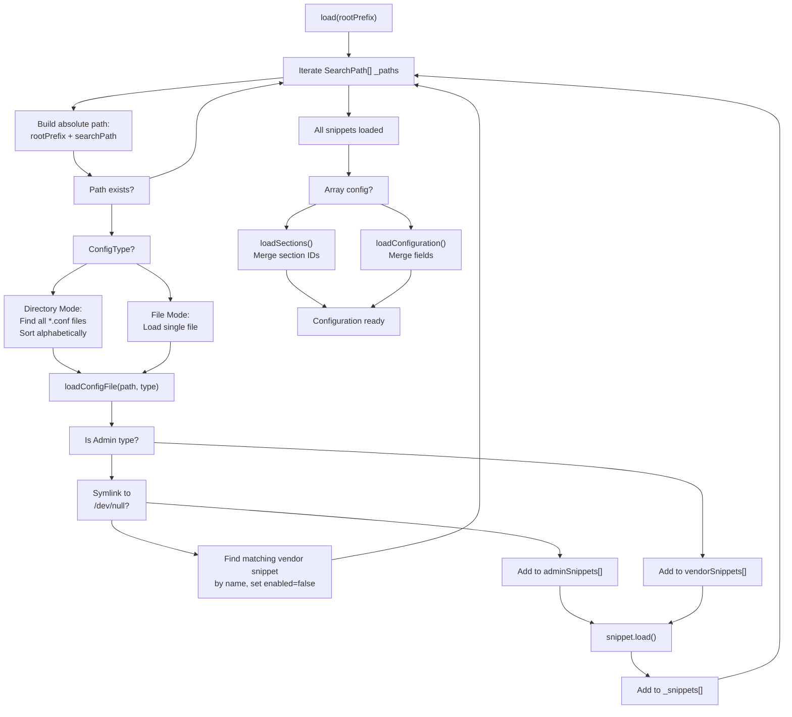
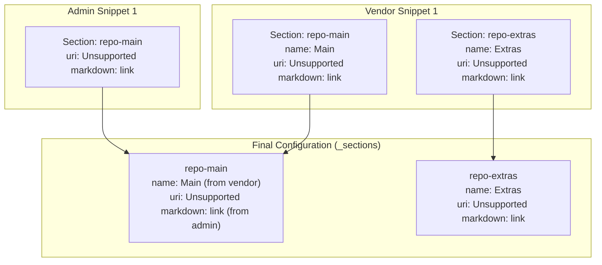
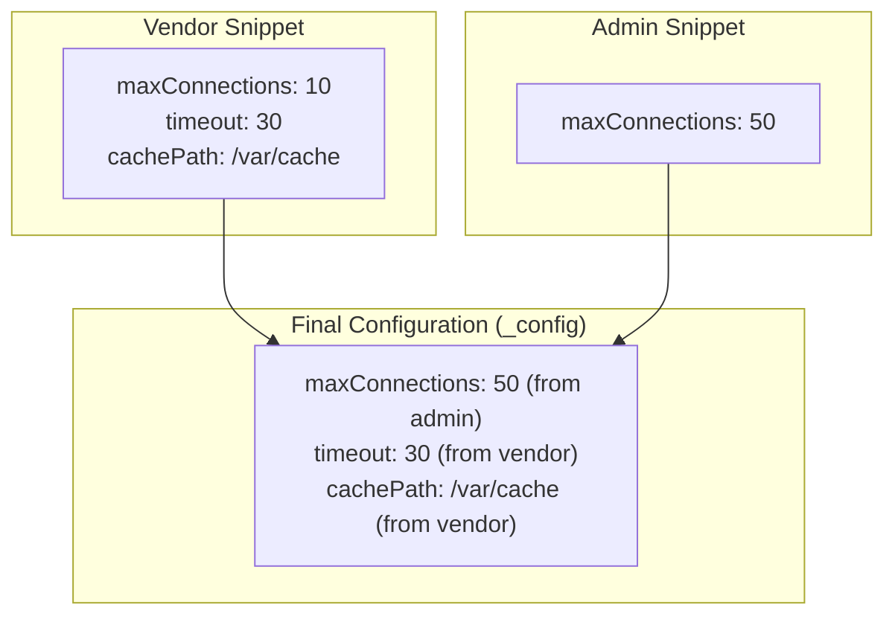
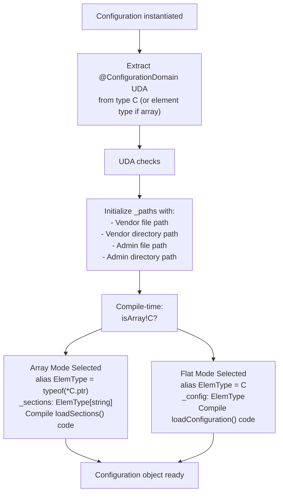

# Configuration Management Deep Dive

Relevant source files

* [source/moss/config/io/configuration.d](../source/moss/config/io/configuration.d)
* [source/moss/config/io/package.d](../source/moss/config/io/package.d)
* [source/moss/config/io/schema.d](../source/moss/config/io/schema.d)

## Purpose and Scope

This document provides comprehensive technical documentation of the configuration management system implemented in the `moss-config` component. The system provides a sophisticated, layered configuration architecture that allows vendor-provided defaults to be overridden by administrator settings, with support for configuration masking, snippet-based composition, and YAML schema validation.

This page covers the internal architecture, class structure, and operational mechanics of the configuration system. For general information about the `moss-config` component itself, see [moss-config](3.2-moss-config). For details on child pages configuration loading, schema validation, and masking behavior, see sections [4.1](4.1-configuration-class-and-layering), [4.2](4.2-yaml-schema-and-validation), and [4.3](4.3-configuration-snippets-and-masking).

## System Architecture

The configuration system is built around a generic `Configuration<C>` class template that provides layered configuration management for any configuration type `C`. The system distinguishes between two primary configuration sources with different privilege levels:

| Source Type | Base Path | Purpose | Override Priority |
| --- | --- | --- | --- |
| Vendor | `/usr/share/` | Distribution-provided defaults | Lower (loaded first) |
| Admin | `/etc/` | System administrator customizations | Higher (loaded second, overrides vendor) |

The configuration system supports two structural patterns:

1. **Array-based configuration**: Configuration type `C` is an array (e.g., `C[]`), where each element has an identifier and configuration sections can be added or overridden
2. **Flat configuration**: Configuration type `C` is a struct, where individual fields are merged from multiple sources

Sources: [source/moss/config/io/configuration.d87-119](../source/moss/config/io/configuration.d#L87-L119) [source/moss/config/io/configuration.d75-79](../source/moss/config/io/configuration.d#L75-L79)

## Configuration Class Template Structure



**Configuration Type Specialization**

The `Configuration<C>` class uses compile-time introspection to determine the configuration structure:



Sources: [source/moss/config/io/configuration.d266-273](../source/moss/config/io/configuration.d#L266-L273) [source/moss/config/io/configuration.d196-231](../source/moss/config/io/configuration.d#L196-L231)

## Configuration Domain and Search Paths

Each configuration must declare a `ConfigurationDomain` via a User Defined Attribute (UDA) on the configuration type:



The `Configuration` constructor validates that the domain is properly set and constructs four potential search paths:

| Path Type | Pattern | ConfigType Flags | Example |
| --- | --- | --- | --- |
| Vendor File | `{prefix}/share/{app}/{domain}.conf` | `File | Vendor` | `/usr/share/moss/repos.conf` |
| Vendor Directory | `{prefix}/share/{app}/{domain}.conf.d/` | `Directory | Vendor` | `/usr/share/moss/repos.conf.d/` |
| Admin File | `/etc/{app}/{domain}.conf` | `File | Admin` | `/etc/moss/repos.conf` |
| Admin Directory | `/etc/{app}/{domain}.conf.d/` | `Directory | Admin` | `/etc/moss/repos.conf.d/` |

Sources: [source/moss/config/io/schema.d29-35](../source/moss/config/io/schema.d#L29-L35) [source/moss/config/io/configuration.d92-119](../source/moss/config/io/configuration.d#L92-L119) [source/moss/config/io/configuration.d33-54](../source/moss/config/io/configuration.d#L33-L54)

## Configuration Loading Process



Sources: [source/moss/config/io/configuration.d140-186](../source/moss/config/io/configuration.d#L140-L186) [source/moss/config/io/configuration.d238-262](../source/moss/config/io/configuration.d#L238-L262)

## Configuration Masking Mechanism

Configuration masking allows administrators to disable vendor-provided configurations without deleting them. When a file or symlink in an admin path points to `/dev/null`, it masks any vendor configuration with the same name:

```mermaid
sequenceDiagram
  participant Admin Path
  participant /etc/moss/repos.conf.d/
  participant Configuration Loader
  participant Vendor Path
  participant /usr/share/moss/repos.conf.d/

  note over Vendor Path,/usr/share/moss/repos.conf.d/: vendor1.conf loaded
  Admin Path->>Configuration Loader: Load admin/vendor2.conf
  Configuration Loader->>Configuration Loader: Check if symlink to /dev/null
  loop [Is masked (symlink → /dev/null)]
    Configuration Loader->>Vendor Path: Find snippet named "vendor2"
    Configuration Loader->>Vendor Path: Set snippet.enabled = false
    note over Configuration Loader: Admin snippet not added to _snippets
    Configuration Loader->>Admin Path: Load snippet normally
    note over Configuration Loader: Admin snippet overrides vendor
  end
```

The masking check is performed in `loadConfigFile`:

* If the admin path is a symlink pointing to `/dev/null` ([source/moss/config/io/configuration.d366-374](../source/moss/config/io/configuration.d#L366-L374)), the loader searches for a vendor snippet with the same name
* The matching vendor snippet's `enabled` property is set to `false` ([source/moss/config/io/configuration.d248-253](../source/moss/config/io/configuration.d#L248-L253))
* The masked admin snippet is not added to the active snippet list
* During final configuration assembly, only snippets with `enabled == true` are processed ([source/moss/config/io/configuration.d192-194](../source/moss/config/io/configuration.d#L192-L194))

Sources: [source/moss/config/io/configuration.d28-31](../source/moss/config/io/configuration.d#L28-L31) [source/moss/config/io/configuration.d238-262](../source/moss/config/io/configuration.d#L238-L262) [source/moss/config/io/configuration.d366-374](../source/moss/config/io/configuration.d#L366-L374)

## Array-Based Configuration (Sections)

When the configuration type `C` is an array, the system manages **sections** identified by unique IDs. Each snippet can define multiple sections, and sections with the same ID are merged across snippets using field-level override logic:



The merge process in `loadSnippetSections`:

1. For each section in the snippet, extract its `id` ([source/moss/config/io/configuration.d285](../source/moss/config/io/configuration.d#L285-L285))
2. If the section doesn't exist in `_sections`, initialize it with default values ([source/moss/config/io/configuration.d289-294](../source/moss/config/io/configuration.d#L289-L294))
3. For each field in the section type, check if it was explicitly defined in the snippet using `snip.explicitlyDefined(name, id)` ([source/moss/config/io/configuration.d307](../source/moss/config/io/configuration.d#L307-L307))
4. If explicitly defined, override the stored section's field with the snippet's value ([source/moss/config/io/configuration.d309](../source/moss/config/io/configuration.d#L309-L309))

This approach ensures that:

* Sections from vendor snippets provide default values
* Admin snippets can override specific fields while inheriting others
* Each field is independently overridable

Sources: [source/moss/config/io/configuration.d271-324](../source/moss/config/io/configuration.d#L271-L324)

## Flat Configuration

When the configuration type `C` is a struct (not an array), the system manages a single configuration object with field-level merging:



The merge process in `loadSnippetConfiguration`:

1. Iterate through all fields of the configuration type `ElemType` ([source/moss/config/io/configuration.d339](../source/moss/config/io/configuration.d#L339-L339))
2. For each field, check if it was explicitly defined in the snippet using `snip.explicitlyDefined(name)` ([source/moss/config/io/configuration.d344](../source/moss/config/io/configuration.d#L344-L344))
3. If explicitly defined, override the stored configuration's field ([source/moss/config/io/configuration.d347](../source/moss/config/io/configuration.d#L347-L347))

The distinction between array and flat configuration is determined at compile time using `isArray!ConfType` ([source/moss/config/io/configuration.d266](../source/moss/config/io/configuration.d#L266-L266)).

Sources: [source/moss/config/io/configuration.d327-361](../source/moss/config/io/configuration.d#L327-L361)

## Configuration Access API

The `Configuration<C>` class provides different public APIs depending on the configuration type:

**Common Properties:**

| Property | Return Type | Description |
| --- | --- | --- |
| `paths()` | `const(SearchPath[])` | Returns all configured search paths |
| `domain()` | `const(ConfigurationDomain)` | Returns the configuration domain (app identity and domain name) |
| `snippets()` | Filtered snippet range | Returns all enabled snippets in load order |

**Array Configuration API:**

| Property | Return Type | Description |
| --- | --- | --- |
| `ids()` | Unique ID range | Returns all unique section identifiers across all enabled snippets |
| `sections()` | Section value range | Returns all merged configuration sections as objects |

**Flat Configuration API:**

| Property | Return Type | Description |
| --- | --- | --- |
| `config()` | `ElemType` | Returns the merged configuration object |

Sources: [source/moss/config/io/configuration.d124-231](../source/moss/config/io/configuration.d#L124-L231)

## Configuration Type Determination Flow



Sources: [source/moss/config/io/configuration.d92-119](../source/moss/config/io/configuration.d#L92-L119) [source/moss/config/io/configuration.d266-273](../source/moss/config/io/configuration.d#L266-L273)

## Key Implementation Details

**SearchPath Structure:**

The `SearchPath` private struct combines a filesystem path with configuration type flags ([source/moss/config/io/configuration.d56-60](../source/moss/config/io/configuration.d#L56-L60)):

* `path`: The relative path from root prefix
* `type`: Bitwise combination of `ConfigType` flags indicating whether it's a file/directory and vendor/admin

**Configuration Constants:**

| Constant | Value | Usage |
| --- | --- | --- |
| `configSuffix` | `".conf"` | File extension for configuration files |
| `configDir` | `".conf.d"` | Directory suffix for snippet directories |
| `maskTarget` | `"/dev/null"` | Symlink target that indicates masking |

**Snippet Ordering:**

When loading directories, snippets are:

1. Found using `dirEntries` with `SpanMode.shallow` ([source/moss/config/io/configuration.d163-166](../source/moss/config/io/configuration.d#L163-L166))
2. Filtered to only include files ending with `configSuffix` ([source/moss/config/io/configuration.d165](../source/moss/config/io/configuration.d#L165-L165))
3. Sorted alphabetically ([source/moss/config/io/configuration.d167](../source/moss/config/io/configuration.d#L167-L167))
4. Loaded in that sorted order

This ensures deterministic configuration assembly regardless of filesystem ordering.

**Merge Order:**

Final configuration assembly processes snippets in this order ([source/moss/config/io/configuration.d322-323](../source/moss/config/io/configuration.d#L322-L323) [source/moss/config/io/configuration.d358-359](../source/moss/config/io/configuration.d#L358-L359)):

1. All enabled vendor snippets (in discovery order)
2. All enabled admin snippets (in discovery order)

This guarantees that admin settings always override vendor settings when the same field/section is defined in both.

Sources: [source/moss/config/io/configuration.d65-70](../source/moss/config/io/configuration.d#L65-L70) [source/moss/config/io/configuration.d28-31](../source/moss/config/io/configuration.d#L28-L31) [source/moss/config/io/configuration.d163-168](../source/moss/config/io/configuration.d#L163-L168) [source/moss/config/io/configuration.d322-323](../source/moss/config/io/configuration.d#L322-L323) [source/moss/config/io/configuration.d358-359](../source/moss/config/io/configuration.d#L358-L359)