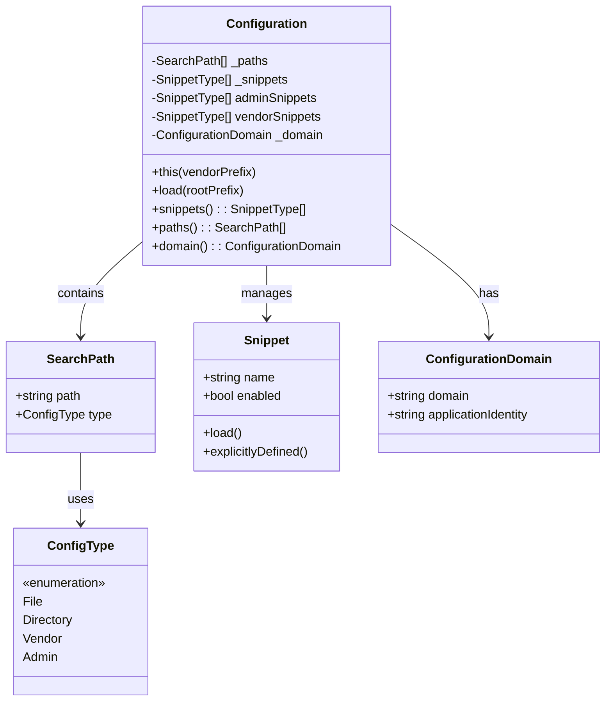
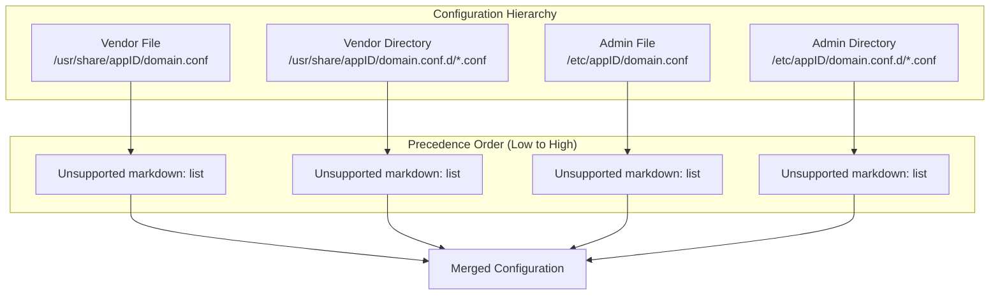
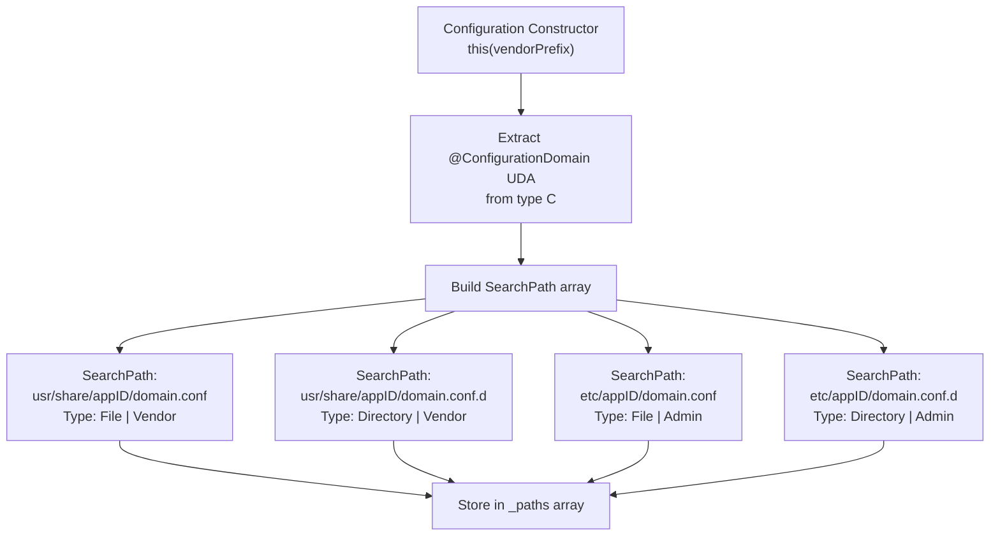
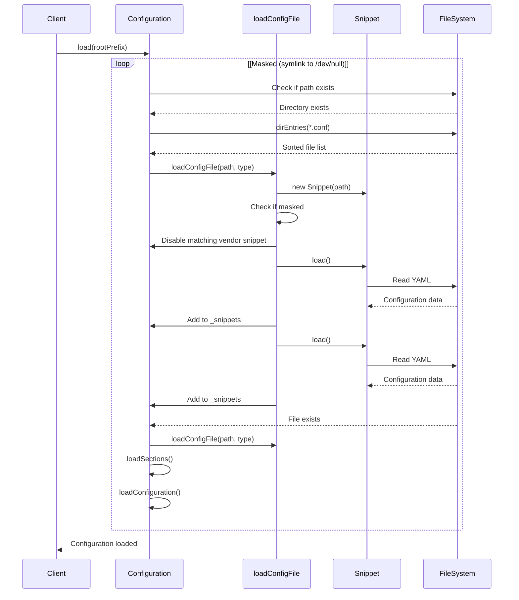
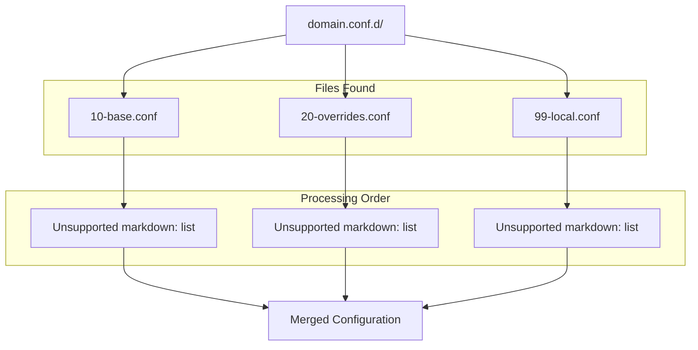
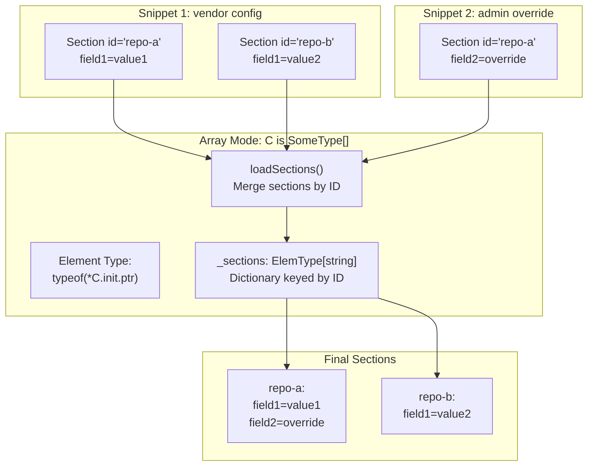
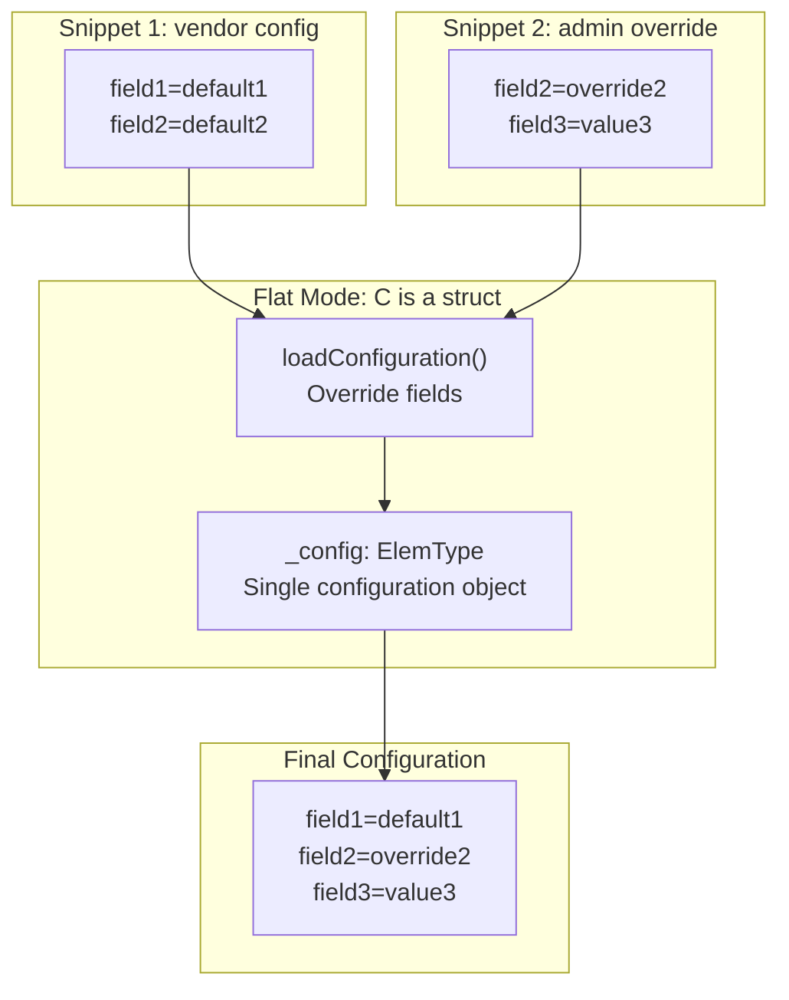
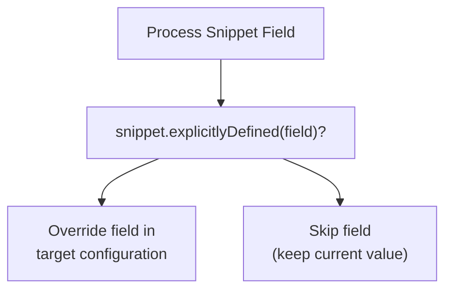
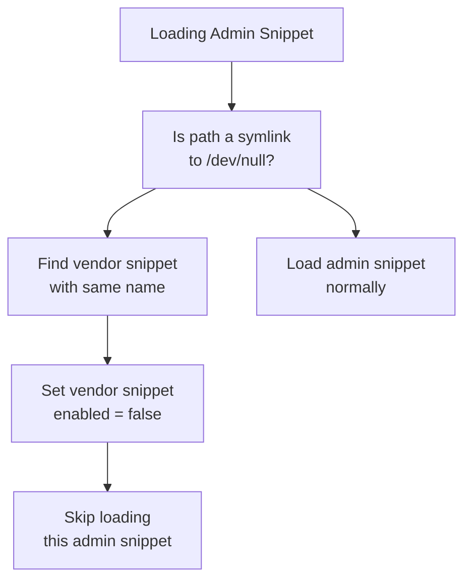
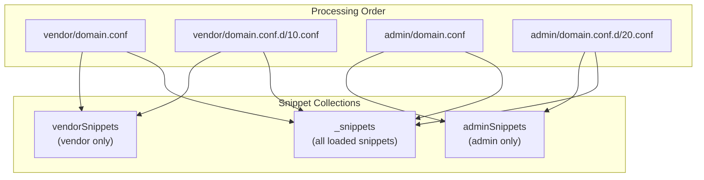

# Configuration Class and Layering

Relevant source files

* [source/moss/config/io/configuration.d](../source/moss/config/io/configuration.d)

This document explains the `Configuration` class, which implements libmoss's layered configuration system. It covers how configuration files are discovered, loaded, and merged from vendor and administrator locations, and how the masking mechanism allows administrators to disable vendor-provided configurations.

For information about YAML schema validation and the `YamlSchema` UDA system, see [YAML Schema and Validation](4.2-yaml-schema-and-validation). For details about snippet implementation and configuration masking behavior, see [Configuration Snippets and Masking](4.3-configuration-snippets-and-masking).

## Purpose and Scope

The `Configuration` class is the central component of moss-config that manages hierarchical configuration loading. It discovers configuration files from multiple search paths, applies precedence rules (vendor configurations are overridden by admin configurations), and merges them into a final configuration object or collection of sections.

## Configuration Class Architecture

The `Configuration` class is defined as a generic template `Configuration(C)` where `C` represents the configuration data structure type. The class automatically determines whether to operate in array mode (for configurations with multiple sections) or flat mode (for single-object configurations) based on whether `C` is an array type.



**Sources:** [source/moss/config/io/configuration.d87-384](../source/moss/config/io/configuration.d#L87-L384)

## Configuration Path Hierarchy

The configuration system uses a two-tier hierarchy: vendor-provided defaults and administrator overrides. The search paths are constructed based on the `ConfigurationDomain` UDA attached to the configuration data structure.

| Path Type | Location Template | Purpose |
| --- | --- | --- |
| Vendor File | `{vendorPrefix}/share/{appID}/{domain}.conf` | Default configuration file |
| Vendor Directory | `{vendorPrefix}/share/{appID}/{domain}.conf.d/` | Default configuration snippets |
| Admin File | `/etc/{appID}/{domain}.conf` | System administrator overrides |
| Admin Directory | `/etc/{appID}/{domain}.conf.d/` | System administrator override snippets |

The `vendorPrefix` defaults to `"usr"`, making the full vendor path typically `/usr/share/{appID}/{domain}.conf`.



**Sources:** [source/moss/config/io/configuration.d75-79](../source/moss/config/io/configuration.d#L75-L79) [source/moss/config/io/configuration.d102-119](../source/moss/config/io/configuration.d#L102-L119)

## Search Path Construction

The constructor builds an array of `SearchPath` structures that define where configuration files may be located. Each `SearchPath` combines a file system path with a `ConfigType` bitmask indicating whether it's a file or directory and whether it's vendor or admin controlled.



The `ConfigType` enum uses bitflags to represent multiple properties simultaneously:

| Flag | Value | Meaning |
| --- | --- | --- |
| `ConfigType.File` | `1 << 0` | Path represents a file |
| `ConfigType.Directory` | `1 << 1` | Path represents a directory |
| `ConfigType.Vendor` | `1 << 2` | Path is vendor-controlled |
| `ConfigType.Admin` | `1 << 3` | Path is admin-controlled |

**Sources:** [source/moss/config/io/configuration.d92-119](../source/moss/config/io/configuration.d#L92-L119) [source/moss/config/io/configuration.d33-54](../source/moss/config/io/configuration.d#L33-L54) [source/moss/config/io/configuration.d56-60](../source/moss/config/io/configuration.d#L56-L60)

## Configuration Loading Process

The `load()` method performs the actual configuration discovery and merging. It iterates through the search paths in order, loading snippets from vendor locations first, then admin locations, allowing admin configurations to override vendor defaults.



**Sources:** [source/moss/config/io/configuration.d140-186](../source/moss/config/io/configuration.d#L140-L186) [source/moss/config/io/configuration.d238-262](../source/moss/config/io/configuration.d#L238-L262)

## Directory Processing Details

When a search path represents a directory (with the `.conf.d` suffix), the loader finds all files ending in `.conf` within that directory, sorts them alphabetically, and processes them in order. This allows for predictable layering when multiple snippet files exist.



**Sources:** [source/moss/config/io/configuration.d160-169](../source/moss/config/io/configuration.d#L160-L169)

## Array vs Flat Configuration Modes

The `Configuration` class supports two operational modes determined by whether the template parameter `C` is an array type:

### Array Configuration Mode

When `C` is an array type (e.g., `RepositoryDefinition[]`), the configuration manages sections identified by an `id` field. Each section can be independently defined or overridden across multiple snippets.



The `loadSections()` method iterates through enabled snippets and merges sections with matching IDs. For each explicitly defined field in a snippet's section, it overwrites the corresponding field in the stored section.

**Sources:** [source/moss/config/io/configuration.d196-219](../source/moss/config/io/configuration.d#L196-L219) [source/moss/config/io/configuration.d271-324](../source/moss/config/io/configuration.d#L271-L324)

### Flat Configuration Mode

When `C` is not an array type, the configuration manages a single object where fields are overridden sequentially as snippets are processed.



The `loadConfiguration()` method processes enabled snippets and for each explicitly defined field, overwrites the value in the single `_config` object.

**Sources:** [source/moss/config/io/configuration.d220-231](../source/moss/config/io/configuration.d#L220-L231) [source/moss/config/io/configuration.d327-361](../source/moss/config/io/configuration.d#L327-L361)

## Field Override Logic

The configuration system only overwrites fields that are explicitly defined in a snippet. This is determined by calling `snippet.explicitlyDefined(fieldName)` (for flat mode) or `snippet.explicitlyDefined(fieldName, sectionId)` (for array mode).



This logic is implemented using compile-time introspection with `FieldNameTuple` to iterate over all fields:

```
static foreach (idx, name; FieldNameTuple!ElemType)
{
    mixin("auto candidateFieldValue = candidateSection." ~ name ~ ";");
    if (snip.explicitlyDefined(name, id))
    {
        mixin("storedSection." ~ name ~ " = candidateFieldValue;");
    }
}
```

**Sources:** [source/moss/config/io/configuration.d301-312](../source/moss/config/io/configuration.d#L301-L312) [source/moss/config/io/configuration.d339-350](../source/moss/config/io/configuration.d#L339-L350)

## Configuration Masking

Admin configurations can mask (disable) vendor configurations by creating a symlink to `/dev/null` with the same name as the vendor configuration file. When the loader encounters a masked admin snippet, it disables the corresponding vendor snippet by name.



The masking check is performed in the `isMasked()` static method, which reads the symlink target and compares it to the constant `maskTarget = "/dev/null"`.

**Sources:** [source/moss/config/io/configuration.d243-254](../source/moss/config/io/configuration.d#L243-L254) [source/moss/config/io/configuration.d366-374](../source/moss/config/io/configuration.d#L366-L374) [source/moss/config/io/configuration.d29-31](../source/moss/config/io/configuration.d#L29-L31)

## Snippet Management

The `Configuration` class maintains three separate snippet collections:

| Collection | Type | Purpose |
| --- | --- | --- |
| `_snippets` | `SnippetType[]` | All loaded snippets in load order |
| `vendorSnippets` | `SnippetType[]` | Vendor-controlled snippets only |
| `adminSnippets` | `SnippetType[]` | Admin-controlled snippets only |

Separating vendor and admin snippets allows the masking mechanism to efficiently disable vendor snippets when corresponding admin masks are encountered.



The `snippets` property returns only enabled snippets from the `_snippets` collection, filtering out any that have been masked.

**Sources:** [source/moss/config/io/configuration.d376-383](../source/moss/config/io/configuration.d#L376-L383) [source/moss/config/io/configuration.d191-194](../source/moss/config/io/configuration.d#L191-L194)

## Configuration Domain

The `ConfigurationDomain` UDA must be attached to the configuration data type `C`. It specifies two pieces of information:

* `domain`: The configuration domain name (e.g., "repos", "triggers")
* `applicationIdentity`: The application identifier (e.g., "moss")

These values are extracted via compile-time reflection and used to construct the search paths. The constructor enforces that exactly one `@ConfigurationDomain` UDA is present and that neither field is empty.

**Sources:** [source/moss/config/io/configuration.d94-100](../source/moss/config/io/configuration.d#L94-L100) [source/moss/config/io/configuration.d132-135](../source/moss/config/io/configuration.d#L132-L135)

## Public API Summary

| Method/Property | Return Type | Description |
| --- | --- | --- |
| `this(vendorPrefix)` | Constructor | Initialize with custom vendor prefix (default: "usr") |
| `load(rootPrefix)` | `void` | Load configuration from filesystem under root prefix |
| `paths` | `const(SearchPath[])` | Return configured search paths |
| `domain` | `const(ConfigurationDomain)` | Return configuration domain information |
| `snippets` | Filtered range | Return all enabled snippets |
| `ids` | Range (array mode) | Return unique section IDs across all snippets |
| `sections` | Range (array mode) | Return all merged configuration sections |
| `config` | `ElemType` (flat mode) | Return merged configuration object |

**Sources:** [source/moss/config/io/configuration.d87-384](../source/moss/config/io/configuration.d#L87-L384)