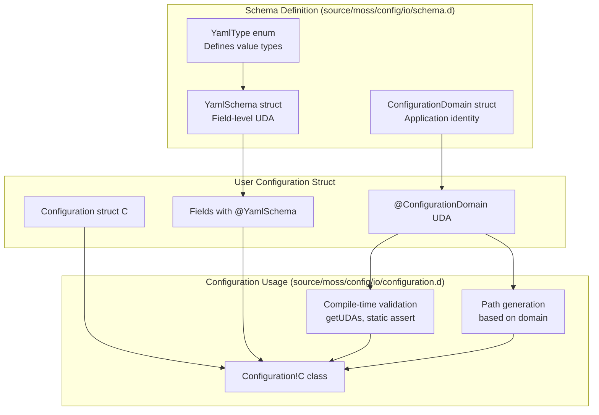
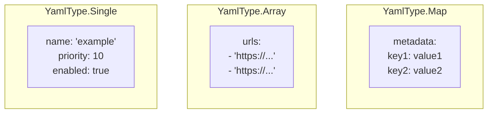
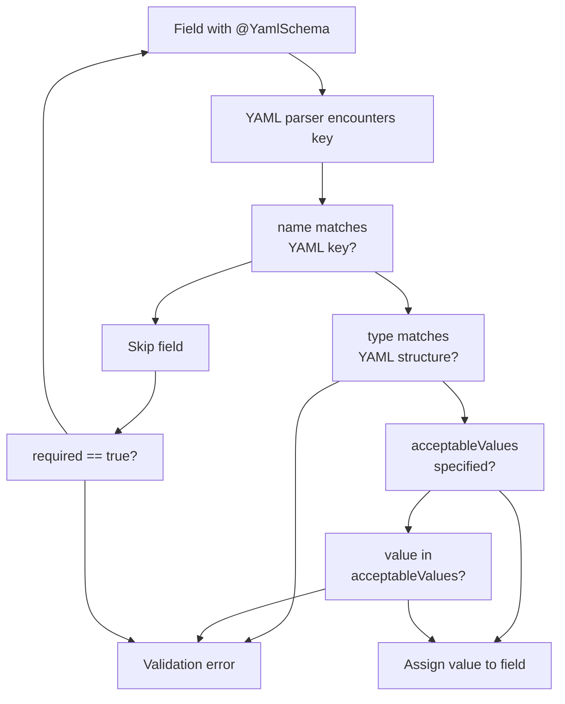
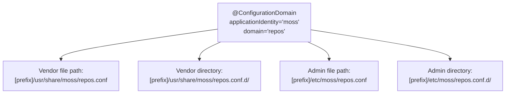
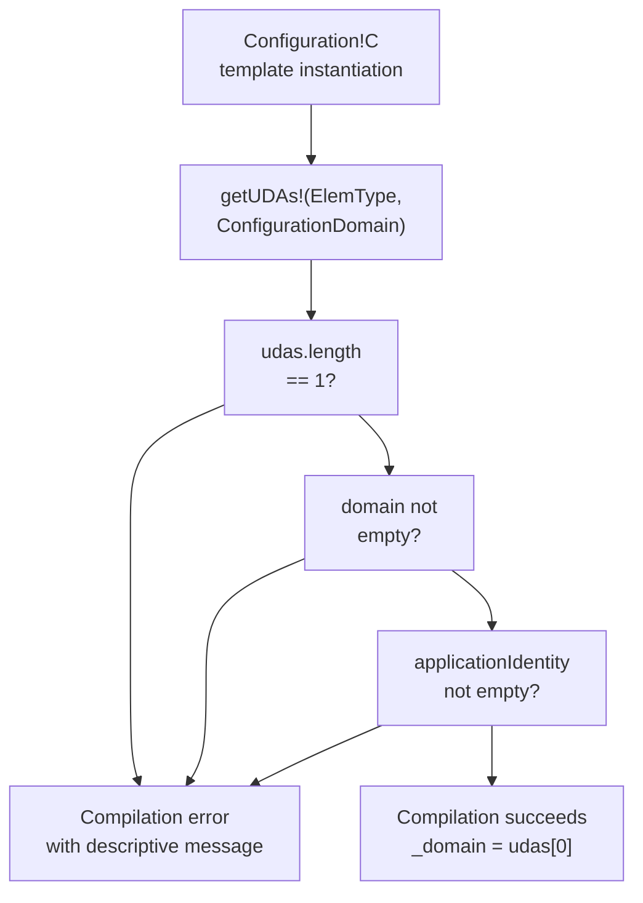
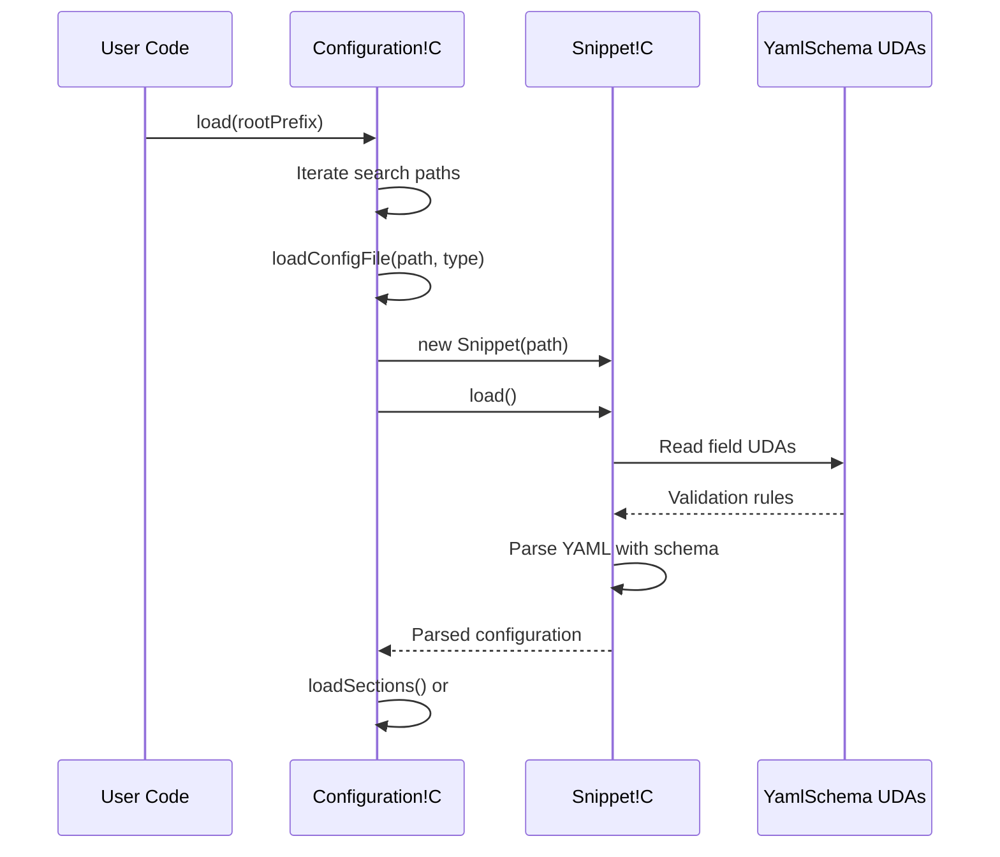
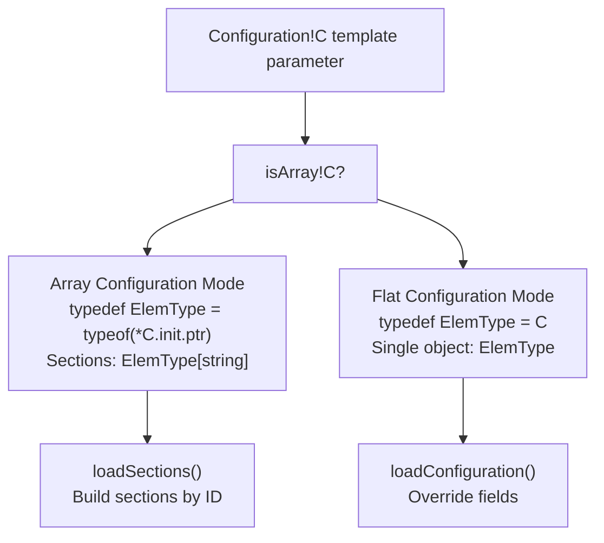

# YAML Schema and Validation

Relevant source files

* [source/moss/config/io/configuration.d](../source/moss/config/io/configuration.d)
* [source/moss/config/io/schema.d](../source/moss/config/io/schema.d)

This document covers the schema definition and validation system for YAML-based configuration in libmoss. The schema system uses User-Defined Attributes (UDAs) to annotate configuration struct fields with metadata that guides YAML parsing, type validation, and requirement enforcement. For information about how configurations are loaded and layered, see [Configuration Class and Layering](4.1-configuration-class-and-layering). For snippet-level configuration handling, see [Configuration Snippets and Masking](4.3-configuration-snippets-and-masking).

## System Overview

The YAML schema system provides compile-time and runtime validation for configuration data through three core components: the `YamlSchema` UDA for field-level metadata, the `YamlType` enumeration for specifying YAML value types, and the `ConfigurationDomain` struct for establishing configuration identity and search paths.



**Diagram: Schema System Component Relationships**

Sources: [source/moss/config/io/schema.d1-54](../source/moss/config/io/schema.d#L1-L54) [source/moss/config/io/configuration.d87-119](../source/moss/config/io/configuration.d#L87-L119)

## YamlType Enumeration

The `YamlType` enumeration defines three fundamental categories of YAML values that configuration fields can contain. This classification guides the unmarshalling process by indicating the expected structure of YAML data.

| YamlType Value | Numeric Value | Description |
| --- | --- | --- |
| `Single` | 0 | Scalar value (string, number, boolean) |
| `Array` | 1 | Sequential collection of values |
| `Map` | 2 | Key-value associative structure |

The enumeration is defined in [source/moss/config/io/schema.d21-26](../source/moss/config/io/schema.d#L21-L26) and serves as a field within the `YamlSchema` UDA.

### Type Classification Examples



**Diagram: YAML Structure Types**

Sources: [source/moss/config/io/schema.d21-26](../source/moss/config/io/schema.d#L21-L26)

## YamlSchema UDA

The `YamlSchema` struct is a User-Defined Attribute that annotates configuration struct fields with parsing and validation metadata. Each field in a configuration struct can be decorated with `@YamlSchema` to specify how it should be loaded from YAML files.

### YamlSchema Fields

The struct contains four fields that control field behavior:

| Field | Type | Default | Purpose |
| --- | --- | --- | --- |
| `name` | `string` | (none) | YAML key name to match during parsing |
| `required` | `bool` | `false` | Whether the field must be present in YAML |
| `type` | `YamlType` | `YamlType.Single` | Expected YAML value structure |
| `acceptableValues` | `string[]` | `null` | Whitelist of permitted string values |

The complete definition is at [source/moss/config/io/schema.d40-53](../source/moss/config/io/schema.d#L40-L53)

### Field Validation Mechanism



**Diagram: YamlSchema Field Validation Flow**

Sources: [source/moss/config/io/schema.d40-53](../source/moss/config/io/schema.d#L40-L53)

### Usage Example Pattern

Fields in configuration structs are annotated as follows (example pattern, not actual code):

```
struct RepositoryConfiguration
{
    @YamlSchema("id", true)
    string id;

    @YamlSchema("uri", true, YamlType.Single)
    string uri;

    @YamlSchema("priority")
    int priority = 0;

    @YamlSchema("urls", false, YamlType.Array)
    string[] urls;

    @YamlSchema("status", false, YamlType.Single, ["enabled", "disabled"])
    string status = "enabled";
}
```

In this pattern:

* `id` is a required single-value field
* `uri` is explicitly marked as a single-value field
* `priority` is optional with a default value
* `urls` is an optional array
* `status` has constrained acceptable values

Sources: [source/moss/config/io/schema.d40-53](../source/moss/config/io/schema.d#L40-L53)

## ConfigurationDomain Struct

The `ConfigurationDomain` struct is a UDA applied at the struct level (not field level) to establish the identity and file system paths for a configuration domain. It must be present on any type used with `Configuration!C`.

### Domain Fields

| Field | Type | Purpose |
| --- | --- | --- |
| `applicationIdentity` | `string` | Application name used in path construction (e.g., "moss") |
| `domain` | `string` | Configuration domain name (e.g., "repos", "config") |

The struct is defined at [source/moss/config/io/schema.d31-35](../source/moss/config/io/schema.d#L31-L35)

### Path Construction from Domain

The `Configuration` class uses domain information to construct search paths for configuration files:



**Diagram: Domain-Based Path Generation**

The path construction logic is implemented in [source/moss/config/io/configuration.d102-118](../source/moss/config/io/configuration.d#L102-L118) combining:

* Vendor prefix (default: "usr")
* Directory type (`Directories.Vendor` = "share" or `Directories.Admin` = "etc")
* Application identity from domain
* Domain name
* Configuration suffix (`.conf`) or directory suffix (`.conf.d`)

Sources: [source/moss/config/io/configuration.d102-118](../source/moss/config/io/configuration.d#L102-L118) [source/moss/config/io/schema.d31-35](../source/moss/config/io/schema.d#L31-L35)

## Compile-Time Validation

The `Configuration!C` class template performs compile-time validation to ensure that configuration types are properly annotated with `ConfigurationDomain`. This validation occurs during compilation, preventing misconfigured types from being used.

### Validation Assertions

Three compile-time assertions enforce domain requirements:

| Line | Assertion | Validation |
| --- | --- | --- |
| [95-96](../95-96) | `udas.length == 1` | Exactly one `@ConfigurationDomain` UDA must be present |
| [97](../97) | `!udas[0].domain.empty` | Domain name must not be empty |
| [98-99](../98-99) | `!udas[0].applicationIdentity.empty` | Application identity must not be empty |



**Diagram: Compile-Time Domain Validation Process**

The validation code is located in [source/moss/config/io/configuration.d94-100](../source/moss/config/io/configuration.d#L94-L100) The `getUDAs` template function from `std.traits` extracts the `ConfigurationDomain` UDA from the element type, and static assertions ensure it is properly configured.

Sources: [source/moss/config/io/configuration.d94-100](../source/moss/config/io/configuration.d#L94-L100)

## Schema Integration with Configuration Loading

The schema definitions integrate with the snippet loading system to provide runtime validation and type-safe unmarshalling. While the schema itself is defined statically, validation occurs during the `load()` operation when YAML files are parsed.

### Schema to Snippet Flow



**Diagram: Schema Application During Configuration Load**

The configuration loading process ([source/moss/config/io/configuration.d140-186](../source/moss/config/io/configuration.d#L140-L186)) creates `Snippet` instances that use the `YamlSchema` UDAs to guide YAML parsing. Each snippet validates fields according to their schema annotations during the `load()` call.

Sources: [source/moss/config/io/configuration.d140-186](../source/moss/config/io/configuration.d#L140-L186) [source/moss/config/io/configuration.d238-262](../source/moss/config/io/configuration.d#L238-L262)

## Type Safety and Array Configuration

The schema system supports two configuration modes based on whether the configuration type `C` is an array:

| Mode | Type Condition | Behavior |
| --- | --- | --- |
| Array Configuration | `isArray!C` is `true` | Multiple sections with identifiers, overridable by ID |
| Flat Configuration | `isArray!C` is `false` | Single configuration object, fields overridable |

This distinction is determined at compile time using `isArray!ConfType` at [source/moss/config/io/configuration.d266](../source/moss/config/io/configuration.d#L266-L266)

### Configuration Type Determination



**Diagram: Configuration Type Mode Selection**

In array configuration mode ([source/moss/config/io/configuration.d271-325](../source/moss/config/io/configuration.d#L271-L325)), the system extracts element types and builds a `_sections` map indexed by ID. In flat mode ([source/moss/config/io/configuration.d327-361](../source/moss/config/io/configuration.d#L327-L361)), it maintains a single `_config` object that accumulates field overrides.

Sources: [source/moss/config/io/configuration.d266-361](../source/moss/config/io/configuration.d#L266-L361)

## Summary

The YAML schema and validation system provides:

* **Type-safe YAML parsing** through `YamlType` classification
* **Field-level validation** via `@YamlSchema` UDAs with required/optional semantics and value constraints
* **Application identity** through `@ConfigurationDomain` for file path construction
* **Compile-time validation** ensuring proper domain configuration
* **Dual configuration modes** supporting both array-based sections and flat field override patterns

The system is implemented across two primary files: [source/moss/config/io/schema.d](../source/moss/config/io/schema.d) defines the schema types, and [source/moss/config/io/configuration.d](../source/moss/config/io/configuration.d) implements the validation and loading logic.

Sources: [source/moss/config/io/schema.d1-54](../source/moss/config/io/schema.d#L1-L54) [source/moss/config/io/configuration.d1-384](../source/moss/config/io/configuration.d#L1-L384)