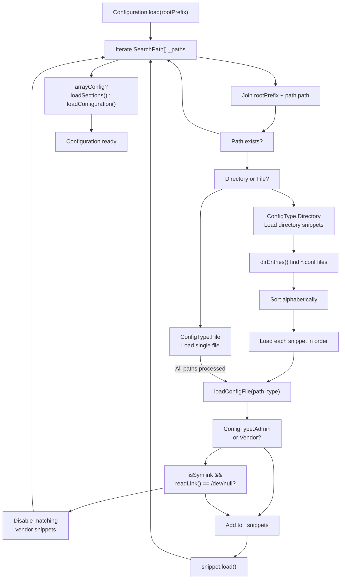
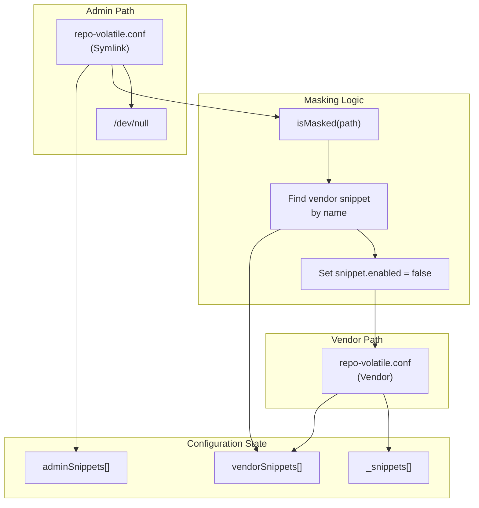
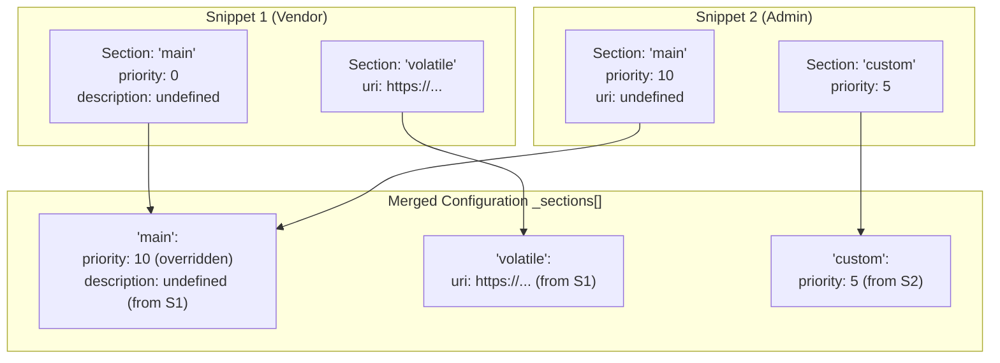
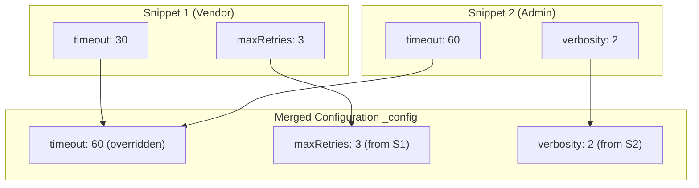
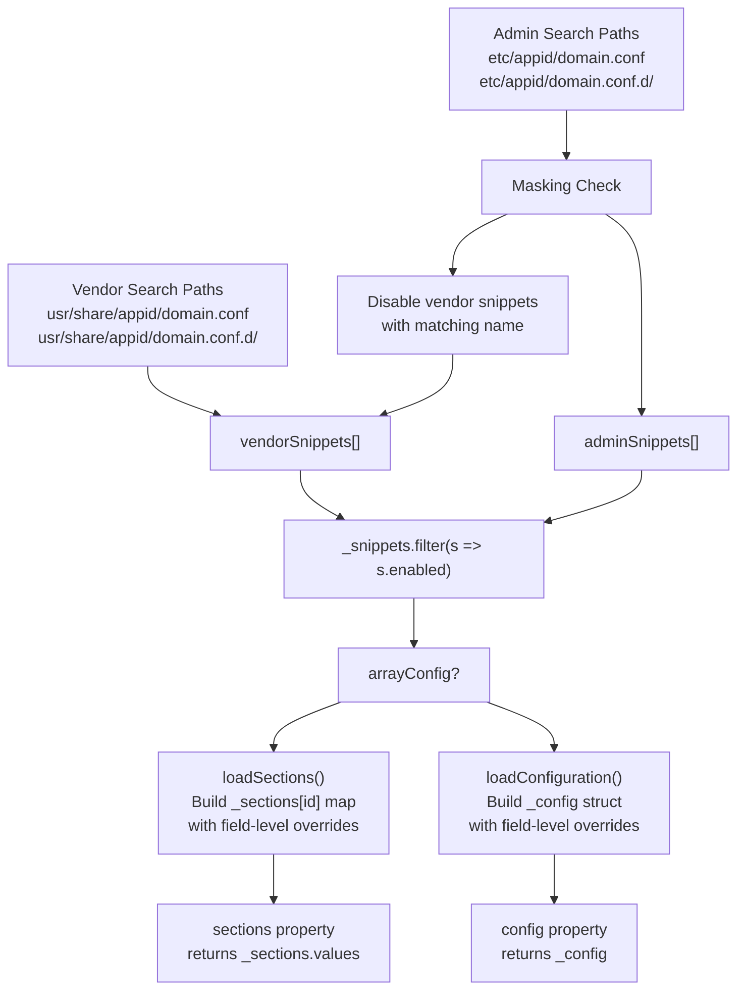

# Configuration Snippets and Masking

Relevant source files

* [source/moss/config/io/configuration.d](../source/moss/config/io/configuration.d)
* [source/moss/config/io/schema.d](../source/moss/config/io/schema.d)

This document explains the snippet-based configuration system in libmoss, covering how configuration files and directories are loaded, merged, and how administrators can mask vendor-provided configurations. For general configuration architecture and layering concepts, see [Configuration Class and Layering](4.1-configuration-class-and-layering). For schema validation details, see [YAML Schema and Validation](4.2-yaml-schema-and-validation).

## Purpose and Scope

Configuration snippets enable modular configuration management where multiple configuration files can contribute to a unified configuration state. This page documents:

* The `.conf` file and `.conf.d` directory naming conventions
* Snippet discovery and loading order
* The masking mechanism using `/dev/null` symlinks
* Override behavior for array-based and flat configurations
* Vendor vs admin snippet separation

## Configuration Snippet Format

Configuration snippets are individual YAML files that contribute to the final configuration. The system recognizes two formats:

| Format | Extension | Description |
| --- | --- | --- |
| Individual File | `.conf` | Single configuration file at a fixed path |
| Directory | `.conf.d` | Directory containing multiple `.conf` files |

The naming conventions are defined as constants:

```
configSuffix = ".conf"
configDir = ".conf.d"
```

When searching for configurations, the system constructs paths by combining the application identity, domain name, and these suffixes.

**Sources:** [source/moss/config/io/configuration.d65-70](../source/moss/config/io/configuration.d#L65-L70)

## Snippet Discovery and Loading



### Discovery Process

The `Configuration.load()` method searches for snippets in predefined vendor and admin paths:

1. **Path Construction**: Each `SearchPath` combines the domain and naming conventions
2. **Existence Check**: Paths are tested with `exists()`
3. **Type Determination**: Paths are classified as `ConfigType.File` or `ConfigType.Directory`

For directory-based configurations, the system:

1. Uses `dirEntries()` to enumerate files in the `.conf.d` directory
2. Filters for files ending with `.conf` that are not directories
3. Sorts results alphabetically using `sort!((a, b) => a < b)`
4. Loads each file sequentially

This alphabetical ordering ensures deterministic configuration layering when multiple snippets define the same configuration sections.

**Sources:** [source/moss/config/io/configuration.d140-186](../source/moss/config/io/configuration.d#L140-L186)

## Configuration Masking

Masking allows administrators to disable vendor-provided configuration snippets without deleting them. This is implemented using symlinks to `/dev/null`.



### Masking Implementation

The masking mechanism is implemented in `loadConfigFile()`:

1. **Admin Snippet Detection**: When `ConfigType.Admin` flag is set, the snippet is checked for masking
2. **Symlink Check**: `isMasked()` tests if the path is a symlink pointing to `/dev/null`
3. **Vendor Disabling**: If masked, vendor snippets with matching names have their `enabled` flag set to `false`
4. **Early Return**: Masked admin snippets are not loaded into the configuration

The `isMasked()` function:

```
static bool isMasked(in string path)
{
    if (!path.isSymlink)
        return false;
    auto target = path.readLink();
    return target == maskTarget;  // "/dev/null"
}
```

**Key Properties:**

* Only admin snippets can mask vendor snippets
* Masking is name-based: `snippet.name` must match
* Masked vendor snippets remain in `vendorSnippets[]` but are excluded from final configuration
* The filtered view is provided via `snippets()` property: `_snippets.filter!((ref s) => s.enabled)`

**Sources:** [source/moss/config/io/configuration.d238-262](../source/moss/config/io/configuration.d#L238-L262) [source/moss/config/io/configuration.d366-374](../source/moss/config/io/configuration.d#L366-L374) [source/moss/config/io/configuration.d28-31](../source/moss/config/io/configuration.d#L28-L31)

## Override Behavior

The configuration system supports two distinct configuration styles, each with different override semantics:

| Configuration Style | Type Check | Override Scope | Use Case |
| --- | --- | --- | --- |
| Array Config | `isArray!ConfType` | Per-section by ID | Repository lists, plugin configurations |
| Flat Config | `!isArray!ConfType` | Per-field | Global settings, system preferences |

### Array Configuration Override



For array configurations (e.g., `RepositoryDefinition[]`):

1. **Section Identification**: Each configuration element has an `id` field
2. **Section Storage**: Sections are stored in `_sections[id]` map
3. **Field-Level Merging**: Within each section, only explicitly defined fields are overridden
4. **Processing Order**: Vendor snippets processed first, then admin snippets

The merge logic in `loadSnippetSections()`:

* If section ID doesn't exist: create new section with `ElemType.init`
* If section ID exists: retrieve existing section reference
* For each field in `FieldNameTuple!ElemType`: override only if `snippet.explicitlyDefined(name, id)` returns true

This allows partial updates where an admin snippet can change only specific fields (e.g., `priority`) while preserving other fields (e.g., `description`) from vendor definitions.

**Sources:** [source/moss/config/io/configuration.d271-324](../source/moss/config/io/configuration.d#L271-L324)

### Flat Configuration Override



For flat configurations (e.g., global settings struct):

1. **Single Instance**: Configuration stored in `_config` of type `ElemType`
2. **Field-Level Merging**: Each snippet can override individual fields
3. **No Section Concept**: All snippets contribute to the same configuration object
4. **Processing Order**: Vendor snippets processed first, then admin snippets

The merge logic in `loadSnippetConfiguration()`:

* Iterate through all fields in `FieldNameTuple!ElemType`
* For each field: if `snippet.explicitlyDefined(name)` returns true, copy field value to `_config`
* Later snippets override earlier values for the same field

**Sources:** [source/moss/config/io/configuration.d327-361](../source/moss/config/io/configuration.d#L327-L361)

## Snippet Processing Pipeline



### Processing Phases

**Phase 1: Discovery**

* Enumerate vendor paths, load snippets into `vendorSnippets[]`
* Enumerate admin paths, check for masking, load into `adminSnippets[]`

**Phase 2: Masking**

* For each admin snippet that is a `/dev/null` symlink
* Find vendor snippets with matching `name` property
* Set `enabled = false` on matched vendor snippets

**Phase 3: Merging**

* Filter all snippets by `enabled` flag
* For array configs: call `loadSections()` to build section map
* For flat configs: call `loadConfiguration()` to build single config object

**Phase 4: Access**

* Array configs: access via `sections` property returning `_sections.values`
* Flat configs: access via `config` property returning `_config`
* Raw snippets: access via `snippets` property (filtered by enabled flag)

**Sources:** [source/moss/config/io/configuration.d140-186](../source/moss/config/io/configuration.d#L140-L186) [source/moss/config/io/configuration.d320-324](../source/moss/config/io/configuration.d#L320-L324) [source/moss/config/io/configuration.d356-360](../source/moss/config/io/configuration.d#L356-L360)

## Code Entity Reference

| Entity | Type | Location | Purpose |
| --- | --- | --- | --- |
| `Configuration!C` | Template Class | [source/moss/config/io/configuration.d87-384](../source/moss/config/io/configuration.d#L87-L384) | Main configuration management class |
| `Snippet!ConfType` | Template Class | Referenced in [source/moss/config/io/configuration.d265](../source/moss/config/io/configuration.d#L265-L265) | Individual configuration snippet |
| `ConfigType` | Enum | [source/moss/config/io/configuration.d33-54](../source/moss/config/io/configuration.d#L33-L54) | Flags for file/directory and vendor/admin classification |
| `SearchPath` | Struct | [source/moss/config/io/configuration.d56-60](../source/moss/config/io/configuration.d#L56-L60) | Path and type tuple for configuration discovery |
| `loadConfigFile()` | Method | [source/moss/config/io/configuration.d238-262](../source/moss/config/io/configuration.d#L238-L262) | Loads individual snippet and handles masking |
| `isMasked()` | Static Method | [source/moss/config/io/configuration.d366-374](../source/moss/config/io/configuration.d#L366-L374) | Checks if path is symlink to `/dev/null` |
| `loadSections()` | Method | [source/moss/config/io/configuration.d320-324](../source/moss/config/io/configuration.d#L320-L324) | Merges array configuration sections |
| `loadConfiguration()` | Method | [source/moss/config/io/configuration.d356-360](../source/moss/config/io/configuration.d#L356-L360) | Merges flat configuration fields |
| `loadSnippetSections()` | Method | [source/moss/config/io/configuration.d281-314](../source/moss/config/io/configuration.d#L281-L314) | Per-snippet section merge logic |
| `loadSnippetConfiguration()` | Method | [source/moss/config/io/configuration.d337-350](../source/moss/config/io/configuration.d#L337-L350) | Per-snippet flat config merge logic |
| `configSuffix` | Constant | [source/moss/config/io/configuration.d65](../source/moss/config/io/configuration.d#L65-L65) | Value: `".conf"` |
| `configDir` | Constant | [source/moss/config/io/configuration.d70](../source/moss/config/io/configuration.d#L70-L70) | Value: `".conf.d"` |
| `maskTarget` | Constant | [source/moss/config/io/configuration.d31](../source/moss/config/io/configuration.d#L31-L31) | Value: `"/dev/null"` |