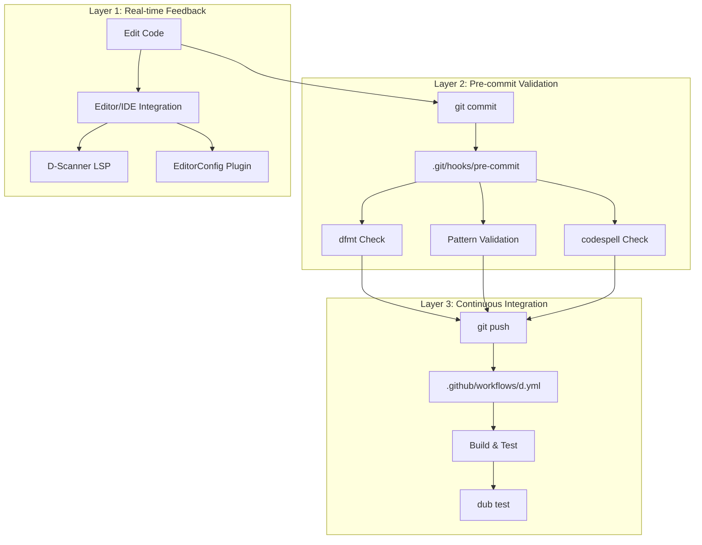
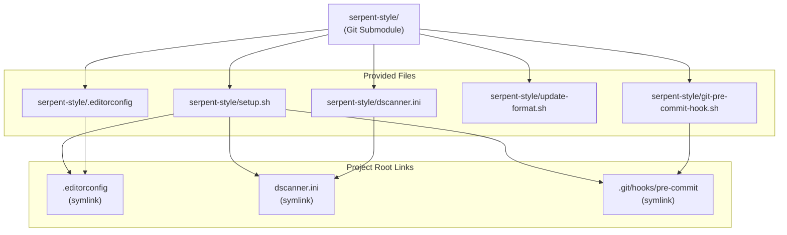
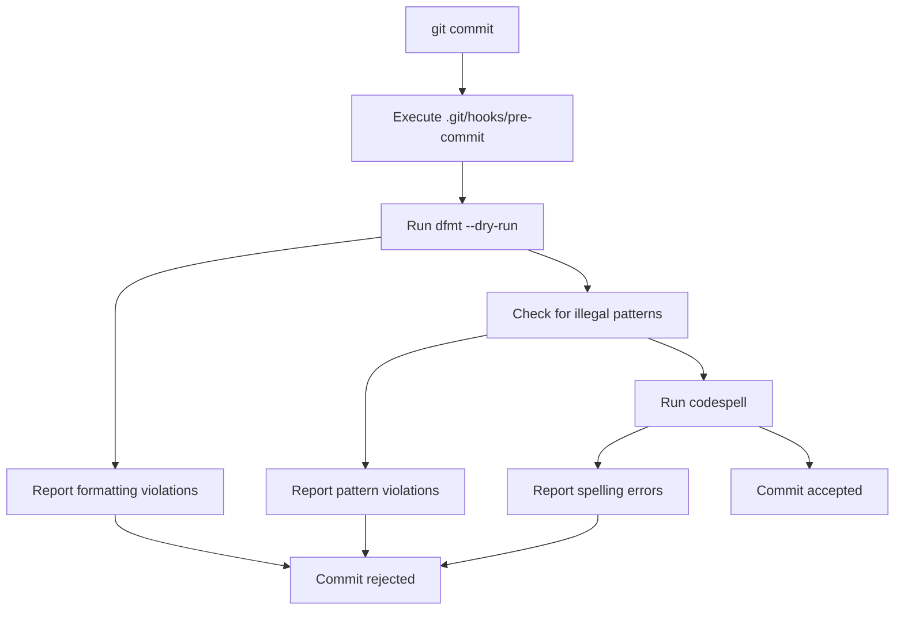

# Development Guide

Relevant source files

* [.editorconfig](../.editorconfig)
* [dscanner.ini](../dscanner.ini)
* [serpent-style/README.md](../serpent-style/README.md)

## Purpose and Scope

This document provides a comprehensive guide for contributors to libmoss, covering the development workflow, code quality standards, and tooling infrastructure. It explains how to set up a development environment, maintain code quality during development, and navigate the project's multi-layered validation system.

For detailed information about specific tools and processes:

* Code style rules and formatting standards: see [Code Style Standards](5.1-code-style-standards)
* Static analysis configuration and checks: see [Static Analysis with D-Scanner](5.2-static-analysis-with-d-scanner)
* Git hook installation and validation: see [Git Hooks and Pre-commit Checks](5.3-git-hooks-and-pre-commit-checks)
* Formatting tools and spell-checking: see [Code Formatting Tools](5.4-code-formatting-tools)
* Continuous integration pipeline: see [Continuous Integration](5.5-continuous-integration)
* File header templates: see [File Templates](5.6-file-templates)

## Development Workflow Overview

libmoss employs a defense-in-depth approach to code quality with three distinct validation layers. Each layer catches different types of issues at different stages of the development process, ensuring that problems are identified as early as possible.



**Sources:** [.editorconfig](../.editorconfig) [dscanner.ini](../dscanner.ini) [serpent-style/README.md](../serpent-style/README.md)

## Quality Assurance Strategy

### Three-Layer Validation System

The validation system operates at three distinct stages, each with increasing scope and execution time:

| Layer | Stage | Tools | Execution Time | Scope |
| --- | --- | --- | --- | --- |
| **1** | Real-time | EditorConfig, D-Scanner LSP | Milliseconds | Individual file |
| **2** | Pre-commit | `dfmt`, `codespell`, pattern checks | Seconds | Changed files |
| **3** | CI/CD | Full build, `dub test` | Minutes | Entire codebase |

**Layer 1: Real-time Feedback** provides immediate validation as code is written. The `.editorconfig` file ([.editorconfig1-69](../.editorconfig#L1-L69)) defines formatting rules that compatible editors apply automatically, while `dscanner.ini` ([dscanner.ini1-96](../dscanner.ini#L1-L96)) configures the D-Scanner language server for real-time static analysis.

**Layer 2: Pre-commit Validation** prevents commits that violate style or quality standards. This layer is managed by the serpent-style submodule.

**Layer 3: Continuous Integration** performs comprehensive validation including compilation and testing against the full dependency tree.

**Sources:** [.editorconfig](../.editorconfig) [dscanner.ini](../dscanner.ini) [serpent-style/README.md1-75](../serpent-style/README.md#L1-L75)

## The serpent-style System

libmoss uses the `serpent-style` git submodule to manage code quality standards. This submodule provides a standardized, reusable configuration for Serpent OS D projects.



### serpent-style Setup Process

The `setup.sh` script performs the following operations:

1. **Symlink `.editorconfig`**: Links `serpent-style/.editorconfig` to project root
2. **Symlink `dscanner.ini`**: Links `serpent-style/dscanner.ini` to project root
3. **Install Git Hook**: Links `serpent-style/git-pre-commit-hook.sh` to `.git/hooks/pre-commit`
4. **Remove Legacy Scripts**: Removes `scripts/update_format.sh` if present
5. **Format Codebase**: Runs `serpent-style/update-format.sh` to apply standards

**Sources:** [serpent-style/README.md11-20](../serpent-style/README.md#L11-L20)

## EditorConfig Integration

The `.editorconfig` file defines language-specific formatting rules that are enforced both by editors and by the `dfmt` tool. The configuration follows a hierarchical structure with global defaults overridden by language-specific rules.

### Global Settings

All source files inherit these base settings:

| Setting | Value | Purpose |
| --- | --- | --- |
| `charset` | `utf-8` | Unicode support ([.editorconfig9](../.editorconfig#L9-L9)) |
| `end_of_line` | `lf` | Unix line endings ([.editorconfig10](../.editorconfig#L10-L10)) |
| `insert_final_newline` | `true` | POSIX compliance ([.editorconfig11](../.editorconfig#L11-L11)) |
| `trim_trailing_whitespace` | `true` | Clean diffs ([.editorconfig12](../.editorconfig#L12-L12)) |
| `tab_width` | `8` | Visual distinction ([.editorconfig15](../.editorconfig#L15-L15)) |

### D Language Configuration

D source files (`*.d`) use specific `dfmt` settings defined in [.editorconfig18-29](../.editorconfig#L18-L29):

| Setting | Value | Effect |
| --- | --- | --- |
| `dfmt_brace_style` | `allman` | Braces on new line |
| `dfmt_align_switch_statements` | `true` | Align switch labels |
| `dfmt_outdent_attributes` | `true` | Dedent attributes |
| `dfmt_soft_max_line_length` | `80` | Preferred line length |
| `max_line_length` | `120` | Hard limit |
| `indent_style` | `space` | No tabs |
| `indent_size` | `4` | Four-space indent |

**Sources:** [.editorconfig1-69](../.editorconfig#L1-L69)

## D-Scanner Static Analysis

The `dscanner.ini` file configures 42 distinct static analysis checks. All checks are enabled except `opequals_tohash_check` (disabled at [dscanner.ini32](../dscanner.ini#L32-L32)) and `imports_sortedness` (disabled at [dscanner.ini79](../dscanner.ini#L79-L79)).

### Critical Checks

Key enabled checks include:

| Check | Purpose | Configuration Line |
| --- | --- | --- |
| `style_check` | Phobos naming conventions | [dscanner.ini5](../dscanner.ini#L5-L5) |
| `unused_variable_check` | Detect unused variables | [dscanner.ini26](../dscanner.ini#L26-L26) |
| `could_be_immutable_check` | Identify immutability opportunities | [dscanner.ini51](../dscanner.ini#L51-L51) |
| `long_line_check` | Enforce line length limit | [dscanner.ini61](../dscanner.ini#L61-L61) |
| `allman_braces_check` | Enforce brace style | [dscanner.ini91](../dscanner.ini#L91-L91) |
| `properly_documented_public_functions` | Require documentation | [dscanner.ini83](../dscanner.ini#L83-L83) |

The maximum line length is configured at [dscanner.ini63](../dscanner.ini#L63-L63) as 120 characters, matching the EditorConfig setting.

**Sources:** [dscanner.ini1-96](../dscanner.ini#L1-L96)

## Setting Up the Development Environment

### Initial Setup

1. **Clone the repository with submodules:**

   ```
   git clone --recursive https://github.com/serpent-os/libmoss
   cd libmoss
   ```
2. **Run serpent-style setup:**

   ```
   ./serpent-style/setup.sh
   ```
3. **Verify tool availability:**

   * `dfmt` must be in `$PATH` ([serpent-style/README.md33-34](../serpent-style/README.md#L33-L34))
   * `codespell` must be in `$PATH` ([serpent-style/README.md42-48](../serpent-style/README.md#L42-L48))

### Editor Configuration

Configure your editor to:

1. **Enable EditorConfig support** - Most modern editors support this through plugins
2. **Install D-Scanner LSP** - For real-time static analysis
3. **Configure dfmt integration** - For format-on-save functionality

The `.editorconfig` file at the project root (symlinked from serpent-style) will automatically configure supported editors.

**Sources:** [serpent-style/README.md1-75](../serpent-style/README.md#L1-L75)

## Pre-commit Validation Flow

The git pre-commit hook performs three sequential checks. If any check fails, the commit is rejected.



### Check Details

**Check 1: dfmt Format Validation**

* Runs `dfmt --dry-run` on all staged `.d` files
* Reports formatting violations without modifying files
* Based on `.editorconfig` settings

**Check 2: Illegal Pattern Detection**

* Searches for runtime format strings (security concern)
* Validates against project-specific patterns
* Prevents common anti-patterns

**Check 3: Spell Checking**

* Runs `codespell` on all staged files
* Catches typos in comments, documentation, and strings
* Uses default codespell dictionary

**Sources:** [serpent-style/README.md11-20](../serpent-style/README.md#L11-L20)

## Comment Formatting Standards

Since `dfmt` cannot parse or format comments, manual formatting is required. The serpent-style system defines specific comment formats:

```
/**
 * Multi-line documentation comment.
 *
 * Contains properly punctuated sentences. Each line starts with
 * a space, asterisk, and another space.
 */

/** Single-line documentation comment (acceptable) */

/* Single-line comment without punctuation */

// Only use for FIXME/TODO/etc. markers (discouraged otherwise)
```

Documentation comments must:

* Use `/** */` delimiters for public declarations
* Include proper punctuation for multi-line comments
* Align asterisks on continuation lines
* Avoid single-line `//` comments except for markers

**Sources:** [serpent-style/README.md50-74](../serpent-style/README.md#L50-L74)

## Language-Specific Style Rules

The EditorConfig system defines formatting for multiple languages used in the project:

### D Language Files

Configuration: [.editorconfig18-29](../.editorconfig#L18-L29)

* **Indent**: 4 spaces
* **Brace style**: Allman (braces on new line)
* **Line length**: 120 characters (hard), 80 characters (soft)

### Meson Build Files

Configuration: [.editorconfig32-34](../.editorconfig#L32-L34)

* **Indent**: 4 spaces
* Applies to `*.build` files

### Python Scripts

Configuration: [.editorconfig44-46](../.editorconfig#L44-L46)

* **Indent**: 4 spaces
* Follows PEP 8 standard

### Shell Scripts

Configuration: [.editorconfig48-50](../.editorconfig#L48-L50)

* **Indent**: 4 spaces
* Applies to `*.sh` files

### YAML Configuration

Configuration: [.editorconfig66-68](../.editorconfig#L66-L68)

* **Indent**: 4 spaces
* Applies to `*.yml` and `stone.yml` ([.editorconfig56-58](../.editorconfig#L56-L58))

### Markdown Documentation

Configuration: [.editorconfig37-41](../.editorconfig#L37-L41)

* **Indent**: 4 spaces
* **Special**: Trailing whitespace preserved (Markdown linebreak syntax)

**Sources:** [.editorconfig1-69](../.editorconfig#L1-L69)

## Required Development Tools

The development workflow depends on several external tools:

| Tool | Purpose | Requirement |
| --- | --- | --- |
| `dfmt` | D code formatting | Must be in `$PATH` |
| `codespell` | Spell checking | Must be in `$PATH` |
| `dscanner` | Static analysis (LSP) | Optional but recommended |
| `dub` | D package management | Required for testing |
| `meson` | Build system | Required for building |

### Tool Installation

**dfmt** - D language formatter:

```
dub fetch dfmt
dub run dfmt
```

**codespell** - Python spell checker:

```
pip install codespell
```

**dscanner** - D language analyzer:

```
dub fetch dscanner
dub build dscanner
```

**Sources:** [serpent-style/README.md32-48](../serpent-style/README.md#L32-L48)

## Daily Development Workflow

A typical development session follows this pattern:

1. **Edit code** - Editor applies EditorConfig rules automatically
2. **Save file** - D-Scanner LSP provides real-time feedback
3. **Stage changes** - `git add` modified files
4. **Attempt commit** - Pre-commit hook validates changes
5. **Fix violations** - If hook fails, correct issues and retry
6. **Push changes** - CI pipeline performs full validation

### Handling Pre-commit Failures

When the pre-commit hook fails:

**For formatting violations:**

```
# Run update-format.sh to auto-fix
./serpent-style/update-format.sh
git add .
git commit
```

**For spelling errors:**

```
# Review codespell output
# Fix typos manually
git add .
git commit
```

**For illegal patterns:**

```
# Review reported violations
# Refactor code to eliminate patterns
git add .
git commit
```

**Sources:** [serpent-style/README.md1-75](../serpent-style/README.md#L1-L75)

## Submitting Changes

Before submitting a pull request:

1. **Ensure all pre-commit checks pass** - The hook must approve your commits
2. **Verify local build** - Run `dub test` to confirm tests pass
3. **Check documentation** - Update relevant wiki pages if needed
4. **Review CI logs** - After pushing, verify GitHub Actions succeed

The CI pipeline will perform comprehensive validation including:

* Full codebase compilation
* Execution of all unit tests
* Validation against latest dependency versions
* Cross-platform compatibility checks (if configured)

**Sources:** [serpent-style/README.md1-75](../serpent-style/README.md#L1-L75)