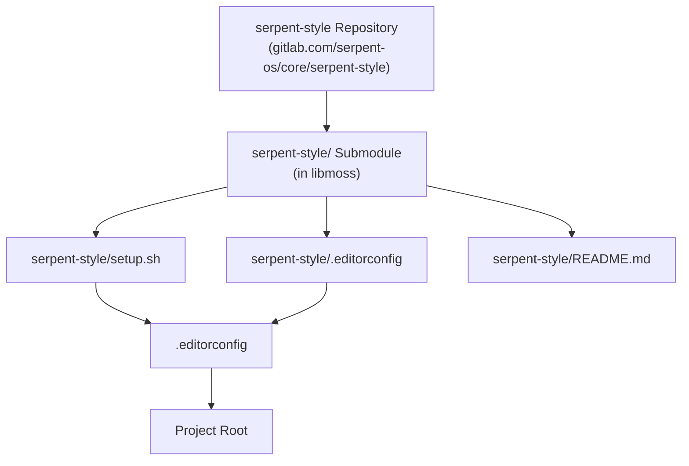
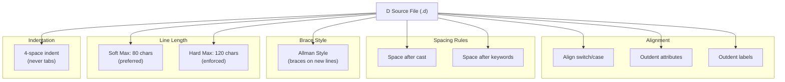
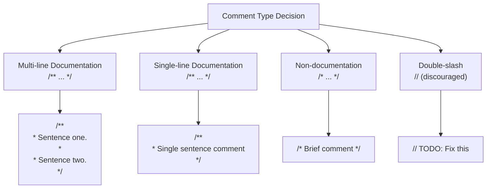
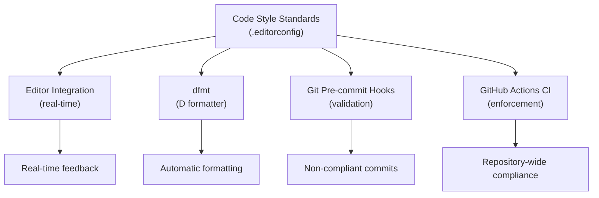

# Code Style Standards

Relevant source files

* [.editorconfig](../.editorconfig)
* [serpent-style/.editorconfig](../serpent-style/.editorconfig)
* [serpent-style/README.md](../serpent-style/README.md)

## Purpose and Scope

This document details the code style standards enforced in libmoss through the **serpent-style** system. It covers the EditorConfig-based configuration, language-specific formatting rules, and comment formatting conventions. This page focuses exclusively on the declarative style standards themselves; for information about the tools that enforce these standards, see [Code Formatting Tools](5.4-code-formatting-tools). For pre-commit validation of these standards, see [Git Hooks and Pre-commit Checks](5.3-git-hooks-and-pre-commit-checks). For static analysis beyond formatting, see [Static Analysis with D-Scanner](5.2-static-analysis-with-d-scanner).

## The serpent-style System

libmoss uses a centralized code style definition maintained in the `serpent-style` git submodule. This submodule is shared across all Serpent OS D language projects to ensure consistent formatting standards.



**Sources:** [serpent-style/README.md1-19](../serpent-style/README.md#L1-L19)

The `serpent-style` submodule provides a reference implementation for D language code style. When added to a project, it signifies that the project adheres to Serpent OS formatting standards. The `setup.sh` script creates symbolic links to integrate the style configuration into the project root.

### Integration Points

| Component | Source Location | Symlinked To | Purpose |
| --- | --- | --- | --- |
| EditorConfig | `serpent-style/.editorconfig` | `.editorconfig` | Editor and dfmt configuration |
| D-Scanner Config | `serpent-style/dscanner.ini` | `dscanner.ini` | LSP static analysis rules |
| Git Hook | `serpent-style/git-pre-commit-hook.sh` | `.git/hooks/pre-commit` | Pre-commit validation |

**Sources:** [serpent-style/README.md13-19](../serpent-style/README.md#L13-L19)

## EditorConfig Configuration

libmoss uses [EditorConfig](https://editorconfig.org) to define and enforce formatting rules across all file types. The `.editorconfig` file at the project root is a symlink to `serpent-style/.editorconfig`, ensuring consistency with the centralized standard.

```mermaid
flowchart TD

EDITOR["EditorConfig System"]
CHARSET["charset = utf-8"]
EOL["end_of_line = lf"]
FINAL_NL["insert_final_newline = true"]
TRIM_WS["trim_trailing_whitespace = true"]
TAB_WIDTH["tab_width = 8"]
D_LANG["[*.d]<br>D Language"]
MESON["[*.build]<br>Meson"]
PYTHON["[*.py]<br>Python"]
SHELL["[*.sh]<br>Shell"]
YAML["[*.yml]<br>YAML"]
MARKDOWN["[*.md]<br>Markdown"]
C_FILES["[*.{c,h}]<br>C/Headers"]
MAKEFILE["[makefile]<br>Makefiles"]

EDITOR --> CHARSET
EDITOR --> EOL
EDITOR --> FINAL_NL
EDITOR --> TRIM_WS
EDITOR --> TAB_WIDTH
EDITOR --> D_LANG
EDITOR --> MESON
EDITOR --> PYTHON
EDITOR --> SHELL
EDITOR --> YAML
EDITOR --> MARKDOWN
EDITOR --> C_FILES
EDITOR --> MAKEFILE

subgraph subGraph1 ["Language-Specific Overrides"]
    D_LANG
    MESON
    PYTHON
    SHELL
    YAML
    MARKDOWN
    C_FILES
    MAKEFILE
end

subgraph subGraph0 ["Universal Settings [*]"]
    CHARSET
    EOL
    FINAL_NL
    TRIM_WS
    TAB_WIDTH
end
```



**Sources:** [.editorconfig1-69](../.editorconfig#L1-L69) [serpent-style/.editorconfig1-69](../serpent-style/.editorconfig#L1-L69)

### Universal Settings

All files in the libmoss repository follow these baseline standards:

| Setting | Value | Rationale |
| --- | --- | --- |
| `charset` | `utf-8` | Serpent OS exclusively uses UTF-8 for source code |
| `end_of_line` | `lf` | Unix-style line endings for cross-platform consistency |
| `insert_final_newline` | `true` | POSIX compliance and cleaner diffs |
| `trim_trailing_whitespace` | `true` | Prevents whitespace-only changes in diffs |
| `tab_width` | `8` | Makes spaces vs. tabs distinction visually obvious |

**Sources:** [.editorconfig7-15](../.editorconfig#L7-L15)

The `tab_width` setting of 8 spaces is intentionally wide to make it immediately apparent when tabs are used instead of spaces (which would be incorrect for most file types in this project).

## Language-Specific Formatting Standards

### D Language Files (`*.d`)

D source files use a comprehensive set of formatting rules, with both EditorConfig properties and `dfmt`-specific directives:

| Property | Value | Description |
| --- | --- | --- |
| `indent_style` | `space` | Use spaces, never tabs |
| `indent_size` | `4` | Four-space indentation |
| `max_line_length` | `120` | Hard maximum line length |
| `dfmt_soft_max_line_length` | `80` | Preferred line length (soft limit) |
| `dfmt_brace_style` | `allman` | Opening braces on new lines |
| `dfmt_align_switch_statements` | `true` | Align `case` with `switch` |
| `dfmt_outdent_attributes` | `true` | Outdent attributes like `@safe` |
| `dfmt_outdent_labels` | `true` | Outdent labels |
| `dfmt_space_after_cast` | `true` | Add space after cast expressions |
| `dfmt_space_after_keywords` | `true` | Add space after keywords like `if`, `for` |
| `dfmt_split_operator_at_line_end` | `false` | Split before operators, not after |

**Sources:** [.editorconfig18-29](../.editorconfig#L18-L29)



**Sources:** [.editorconfig18-29](../.editorconfig#L18-L29)

#### Brace Style Example

The `allman` brace style places opening braces on their own line:

```
// Correct: Allman style
void myFunction()
{
    if (condition)
    {
        // code
    }
}

// Incorrect: K&R style
void myFunction() {
    if (condition) {
        // code
    }
}
```

### Meson Build Files (`*.build`)

Meson build files use the same formatting rules as the Meson project itself:

| Property | Value |
| --- | --- |
| `indent_style` | `space` |
| `indent_size` | `4` |

**Sources:** [.editorconfig32-34](../.editorconfig#L32-L34)

### Python Files (`*.py`)

Python files follow PEP 8 standards:

| Property | Value | Authority |
| --- | --- | --- |
| `indent_style` | `space` | PEP 8 |
| `indent_size` | `4` | PEP 8 |

**Sources:** [.editorconfig44-46](../.editorconfig#L44-L46)

### Shell Scripts (`*.sh`)

Shell scripts use 4-space indentation:

| Property | Value |
| --- | --- |
| `indent_style` | `space` |
| `indent_size` | `4` |

**Sources:** [.editorconfig48-50](../.editorconfig#L48-L50)

### YAML Files (`*.yml`, `stone.yml`)

YAML files use 4-space indentation. The `stone.yml` file (Serpent OS package definition) has an explicit section to ensure this:

| Property | Value |
| --- | --- |
| `indent_style` | `space` |
| `indent_size` | `4` |

**Sources:** [.editorconfig56-58](../.editorconfig#L56-L58) [.editorconfig66-68](../.editorconfig#L66-L68)

### Markdown Files (`*.md`)

Markdown files have special handling for trailing whitespace:

| Property | Value | Rationale |
| --- | --- | --- |
| `indent_style` | `space` |  |
| `indent_size` | `4` |  |
| `trim_trailing_whitespace` | `false` | Markdown uses two trailing spaces for line breaks |

**Sources:** [.editorconfig37-41](../.editorconfig#L37-L41)

### C and Header Files (`*.c`, `*.h`)

C source files use 8-space indentation, following traditional C formatting:

| Property | Value |
| --- | --- |
| `indent_style` | `space` |
| `indent_size` | `8` |

**Sources:** [.editorconfig60-62](../.editorconfig#L60-L62)

### Makefiles

Makefiles are the only file type that uses tab indentation (as required by Make syntax):

| Property | Value |
| --- | --- |
| `indent_style` | `tab` |

**Sources:** [.editorconfig52-53](../.editorconfig#L52-L53)

## Comment Formatting Standards

The serpent-style system defines specific conventions for comments in D code, as `dfmt` cannot automatically format comments. These standards ensure readability and maintainability.



**Sources:** [serpent-style/README.md50-74](../serpent-style/README.md#L50-L74)

### Multi-line Documentation Comments

Multi-line documentation comments use the `/** */` syntax with asterisks aligned on each line. They must contain properly punctuated sentences:

```
/**
 * This is a multi-line documentation comment.
 *
 * Multi-line documentation comments are expected to contain properly punctuated sentences.
 *
 */
```

### Single-line Documentation Comments

Single-line documentation comments use a vertical format with proper punctuation:

```
/**
 * This is a single sentence documentation comment
 */
```

The horizontal single-line format is discouraged:

```
/** Single-line documentation comments such as this are frowned upon */
```

### Non-documentation Comments

Brief explanatory comments that are not documentation use the `/* */` syntax without punctuation:

```
/* This is a single-line comment without punctuation */
```

### Double-slash Comments

Double-slash comments (`//`) are generally discouraged and reserved primarily for flagging issues:

```
// FIXME: This needs refactoring
// TODO: Implement caching
```

**Sources:** [serpent-style/README.md50-74](../serpent-style/README.md#L50-L74)

## Format Consistency Matrix

The following table summarizes the formatting standards across all file types in libmoss:

| File Type | Pattern | Indent Style | Indent Size | Line Ending | Special Rules |
| --- | --- | --- | --- | --- | --- |
| D Language | `*.d` | space | 4 | LF | dfmt rules, Allman braces |
| Meson | `*.build` | space | 4 | LF | - |
| Python | `*.py` | space | 4 | LF | PEP 8 |
| Shell | `*.sh` | space | 4 | LF | - |
| YAML | `*.yml` | space | 4 | LF | - |
| Markdown | `*.md` | space | 4 | LF | Keep trailing spaces |
| C/Headers | `*.{c,h}` | space | 8 | LF | Traditional C style |
| Makefile | `makefile` | tab | - | LF | Tab-based (required) |

**Sources:** [.editorconfig1-69](../.editorconfig#L1-L69)

## Tool Integration

The code style standards defined in this document are enforced through several integrated tools:



**Sources:** [serpent-style/README.md11-19](../serpent-style/README.md#L11-L19)

For detailed information about these tools:

* **dfmt and code formatting**: See [Code Formatting Tools](5.4-code-formatting-tools)
* **Pre-commit validation**: See [Git Hooks and Pre-commit Checks](5.3-git-hooks-and-pre-commit-checks)
* **CI enforcement**: See [Continuous Integration](5.5-continuous-integration)