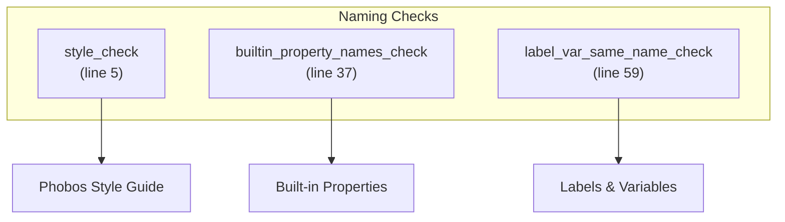
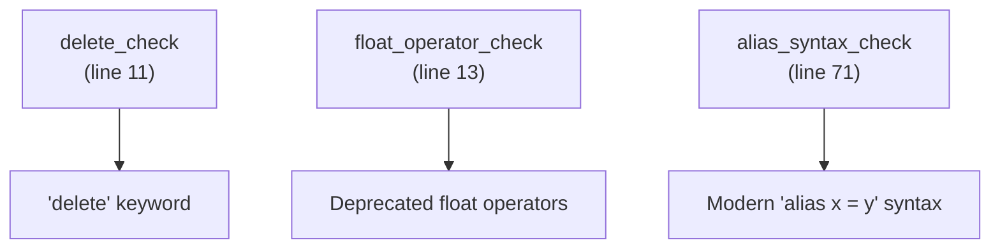
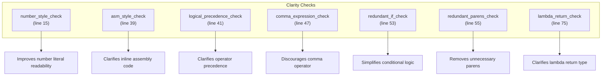
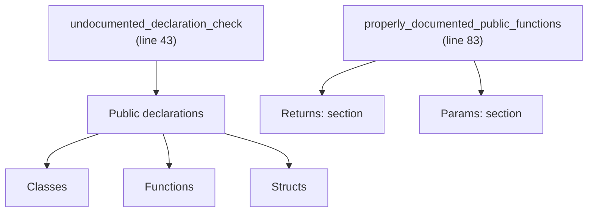
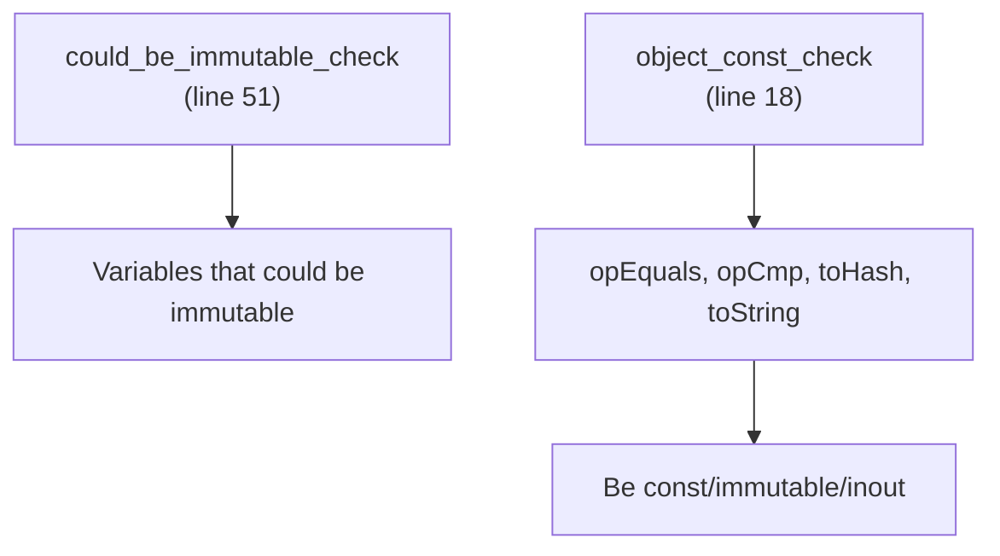
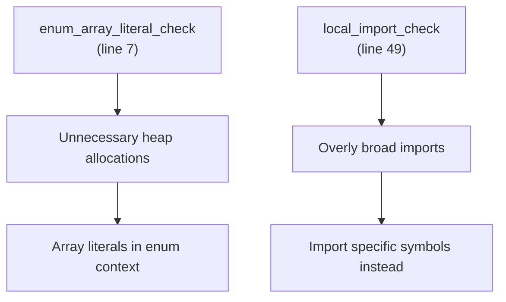
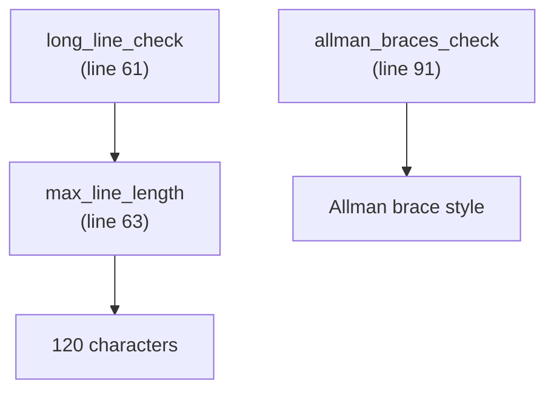
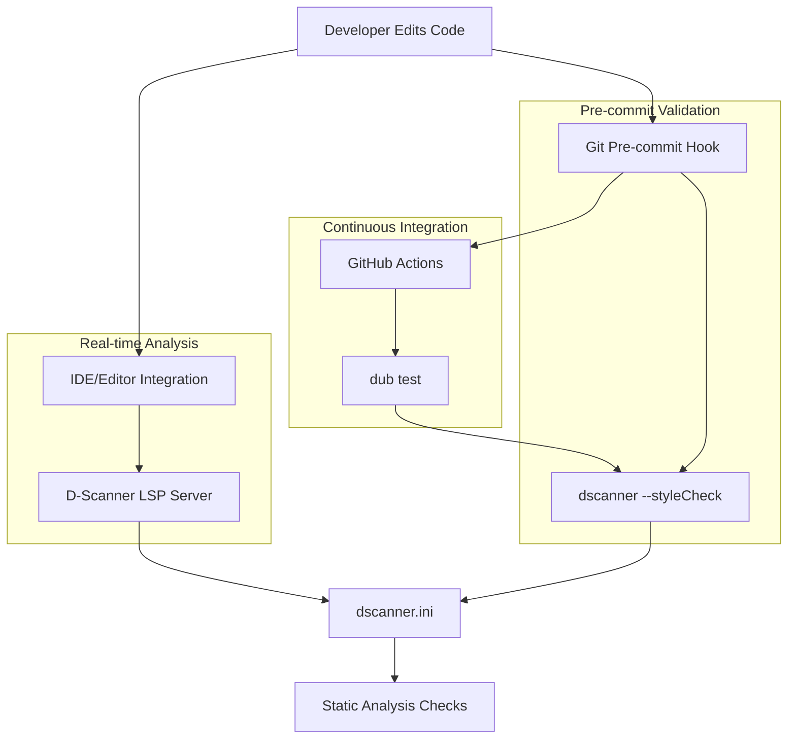

# Static Analysis with D-Scanner

Relevant source files

* [dscanner.ini](../dscanner.ini)
* [serpent-style/dscanner.ini](../serpent-style/dscanner.ini)

This document describes the static analysis configuration for libmoss using D-Scanner, a tool that performs automated code quality checks on D language source files. This page focuses on the specific checks enabled in the project and their configuration. For information about the pre-commit hooks that invoke D-Scanner, see [Git Hooks and Pre-commit Checks](5.3-git-hooks-and-pre-commit-checks). For CI integration, see [Continuous Integration](5.5-continuous-integration). For overall code style standards, see [Code Style Standards](5.1-code-style-standards).

## Overview

D-Scanner is configured via the `dscanner.ini` file, which exists both at the repository root and in the `serpent-style/` submodule. The project enables 43 distinct static analysis checks covering naming conventions, deprecated feature detection, code clarity, documentation requirements, and potential bugs. One check (`opequals_tohash_check`) is explicitly disabled, and another (`imports_sortedness`) is disabled to allow flexible import organization.

The configuration follows the INI format with all checks defined under the `[analysis.config.StaticAnalysisConfig]` section.

**Sources:** [dscanner.ini1-96](../dscanner.ini#L1-L96) [serpent-style/dscanner.ini1-96](../serpent-style/dscanner.ini#L1-L96)

## D-Scanner Configuration Architecture

```mermaid
flowchart TD

ROOT["dscanner.ini<br>(root)"]
STYLE["serpent-style/dscanner.ini<br>(submodule)"]
SECTION["[analysis.config.StaticAnalysisConfig]"]
NAMING["Naming & Style Checks"]
DEPRECATED["Deprecated Feature Checks"]
BUG["Bug Detection Checks"]
CLARITY["Code Clarity Checks"]
DOC["Documentation Checks"]
IMMUTABILITY["Immutability Checks"]
PERFORMANCE["Performance Checks"]
N1["style_check"]
N2["builtin_property_names_check"]
N3["label_var_same_name_check"]
D1["delete_check"]
D2["float_operator_check"]
D3["alias_syntax_check"]
B1["backwards_range_check"]
B2["constructor_check"]
B3["vcall_in_ctor"]
B4["auto_ref_assignment_check"]
C1["logical_precedence_check"]
C2["redundant_if_check"]
C3["redundant_parens_check"]
C4["mismatched_args_check"]
DC1["undocumented_declaration_check"]
DC2["properly_documented_public_functions"]
I1["could_be_immutable_check"]
I2["object_const_check"]
P1["enum_array_literal_check"]
P2["local_import_check"]

ROOT --> SECTION
STYLE --> SECTION
SECTION --> NAMING
SECTION --> DEPRECATED
SECTION --> BUG
SECTION --> CLARITY
SECTION --> DOC
SECTION --> IMMUTABILITY
SECTION --> PERFORMANCE
NAMING --> N1
NAMING --> N2
NAMING --> N3
DEPRECATED --> D1
DEPRECATED --> D2
DEPRECATED --> D3
BUG --> B1
BUG --> B2
BUG --> B3
BUG --> B4
CLARITY --> C1
CLARITY --> C2
CLARITY --> C3
CLARITY --> C4
DOC --> DC1
DOC --> DC2
IMMUTABILITY --> I1
IMMUTABILITY --> I2
PERFORMANCE --> P1
PERFORMANCE --> P2

subgraph subGraph2 ["Check Categories"]
    NAMING
    DEPRECATED
    BUG
    CLARITY
    DOC
    IMMUTABILITY
    PERFORMANCE
end

subgraph subGraph1 ["Analysis Configuration Section"]
    SECTION
end

subgraph subGraph0 ["Configuration Files"]
    ROOT
    STYLE
end
```



**Sources:** [dscanner.ini2-96](../dscanner.ini#L2-L96)

## Enabled Static Analysis Checks

The following table categorizes all enabled checks by their primary purpose:

| Check Name | Line | Purpose Category | Description |
| --- | --- | --- | --- |
| `style_check` | 5 | Naming & Style | Validates names against Phobos style guide |
| `enum_array_literal_check` | 7 | Performance | Detects array literals causing unnecessary allocation |
| `exception_check` | 9 | Bug Detection | Identifies poor exception handling practices |
| `delete_check` | 11 | Deprecated Features | Detects deprecated `delete` keyword usage |
| `float_operator_check` | 13 | Deprecated Features | Finds deprecated floating point operators |
| `number_style_check` | 15 | Code Clarity | Checks number literal readability |
| `object_const_check` | 18 | Immutability | Ensures opEquals, opCmp, toHash, toString are const/immutable/inout |
| `backwards_range_check` | 20 | Bug Detection | Detects `..` expressions where left > right |
| `if_else_same_check` | 22 | Bug Detection | Finds if/else blocks with identical code |
| `constructor_check` | 24 | Bug Detection | Identifies constructor problems |
| `unused_variable_check` | 26 | Dead Code | Detects unused variables and parameters |
| `unused_label_check` | 28 | Dead Code | Finds unused labels |
| `duplicate_attribute` | 30 | Code Quality | Detects duplicate attributes |
| `length_subtraction_check` | 34 | Bug Detection | Warns about subtraction from `.length` properties |
| `builtin_property_names_check` | 37 | Naming & Style | Prevents conflicts with built-in property names |
| `asm_style_check` | 39 | Code Clarity | Checks for confusing inline asm code |
| `logical_precedence_check` | 41 | Code Clarity | Detects confusing logical operator precedence |
| `undocumented_declaration_check` | 43 | Documentation | Requires documentation for public declarations |
| `function_attribute_check` | 45 | Code Quality | Checks function attribute placement |
| `comma_expression_check` | 47 | Code Clarity | Warns about comma operator usage |
| `local_import_check` | 49 | Performance | Detects overly broad local imports |
| `could_be_immutable_check` | 51 | Immutability | Identifies variables that could be immutable |
| `redundant_if_check` | 53 | Code Clarity | Finds redundant if statement expressions |
| `redundant_parens_check` | 55 | Code Clarity | Detects unnecessary parentheses |
| `mismatched_args_check` | 57 | Bug Detection | Checks argument/parameter name mismatches |
| `label_var_same_name_check` | 59 | Naming & Style | Prevents labels with same name as variables |
| `long_line_check` | 61 | Code Formatting | Enforces maximum line length |
| `max_line_length` | 63 | Code Formatting | Sets line length limit to 120 characters |
| `auto_ref_assignment_check` | 65 | Bug Detection | Prevents assignment to auto-ref parameters |
| `incorrect_infinite_range_check` | 67 | Bug Detection | Validates infinite range definitions |
| `useless_assert_check` | 69 | Bug Detection | Detects assertions that are always true |
| `alias_syntax_check` | 71 | Deprecated Features | Requires modern alias syntax |
| `static_if_else_check` | 73 | Bug Detection | Suggests `else static if` where appropriate |
| `lambda_return_check` | 75 | Code Clarity | Checks lambda syntax clarity |
| `auto_function_check` | 77 | Bug Detection | Validates auto functions have return statements |
| `explicitly_annotated_unittests` | 81 | Testing | Requires explicit unittest annotations |
| `properly_documented_public_functions` | 83 | Documentation | Enforces Returns/Params documentation |
| `final_attribute_check` | 85 | Code Quality | Detects useless `final` attribute usage |
| `vcall_in_ctor` | 87 | Bug Detection | Warns about virtual calls in constructors |
| `useless_initializer` | 89 | Code Quality | Identifies unnecessary initializers |
| `allman_braces_check` | 91 | Code Formatting | Enforces Allman brace style |
| `redundant_attributes_check` | 93 | Code Quality | Detects redundant attributes |
| `unused_result` | 95 | Bug Detection | Warns about ignored function return values |

**Sources:** [dscanner.ini5-95](../dscanner.ini#L5-L95)

## Disabled Checks

Two checks are explicitly disabled:

| Check Name | Line | Reason for Disabling |
| --- | --- | --- |
| `opequals_tohash_check` | 32 | Allows defining `opEquals` or `toHash` independently |
| `imports_sortedness` | 79 | Allows flexible import organization |

**Sources:** [dscanner.ini32](../dscanner.ini#L32-L32) [dscanner.ini79](../dscanner.ini#L79-L79)

## Check Category Details

### Naming and Style Checks



The `style_check` validates variable, class, struct, interface, union, and function names against the Phobos style guide conventions. The `builtin_property_names_check` prevents defining methods or properties that conflict with D's built-in properties like `.length`, `.sizeof`, etc. The `label_var_same_name_check` prevents using the same identifier for both a label and a variable within the same scope.

**Sources:** [dscanner.ini3-5](../dscanner.ini#L3-L5) [dscanner.ini35-37](../dscanner.ini#L35-L37) [dscanner.ini58-59](../dscanner.ini#L58-L59)

### Deprecated Feature Detection



These checks detect usage of deprecated D language features that should be replaced with modern alternatives. The `delete_check` identifies usage of the deprecated `delete` keyword for manual memory deallocation. The `float_operator_check` finds deprecated floating point comparison operators. The `alias_syntax_check` enforces the modern `alias NewName = OldName` syntax instead of the old `alias OldName NewName` form.

**Sources:** [dscanner.ini10-13](../dscanner.ini#L10-L13) [dscanner.ini70-71](../dscanner.ini#L70-L71)

### Bug Detection Checks

These checks identify common programming errors that may lead to runtime failures or unexpected behavior:

| Check | Target Issue | Example Problem |
| --- | --- | --- |
| `backwards_range_check` | Range expressions | `5..0` creates empty range |
| `if_else_same_check` | Duplicated logic | if/else blocks with identical code |
| `constructor_check` | Constructor issues | Problems in class constructors |
| `unused_variable_check` | Dead code | Unused variables and parameters |
| `length_subtraction_check` | Underflow risk | `.length - n` may underflow for unsigned types |
| `mismatched_args_check` | Parameter confusion | Argument names don't match parameter names |
| `auto_ref_assignment_check` | Invalid mutation | Assignment to auto-ref parameters |
| `incorrect_infinite_range_check` | Range definition | Incorrect infinite range implementations |
| `useless_assert_check` | Ineffective testing | Assertions that are always true |
| `static_if_else_check` | Compile-time logic | `else if` should be `else static if` |
| `auto_function_check` | Missing return | `auto` function without return statement |
| `vcall_in_ctor` | Virtual call issues | Virtual function calls in constructors |
| `unused_result` | Ignored return value | Function result not used |

**Sources:** [dscanner.ini19-20](../dscanner.ini#L19-L20) [dscanner.ini21-28](../dscanner.ini#L21-L28) [dscanner.ini33-34](../dscanner.ini#L33-L34) [dscanner.ini56-57](../dscanner.ini#L56-L57) [dscanner.ini64-77](../dscanner.ini#L64-L77) [dscanner.ini86-87](../dscanner.ini#L86-L87) [dscanner.ini94-95](../dscanner.ini#L94-L95)

### Code Clarity Checks



These checks improve code readability by detecting confusing constructs. The `number_style_check` validates that numeric literals use appropriate separators (e.g., `1_000_000` instead of `1000000`). The `logical_precedence_check` detects expressions where operator precedence might be unclear. The `comma_expression_check` discourages use of the comma operator, which is often confusing. The `redundant_if_check` and `redundant_parens_check` identify unnecessary code constructs.

**Sources:** [dscanner.ini14-15](../dscanner.ini#L14-L15) [dscanner.ini38-47](../dscanner.ini#L38-L47) [dscanner.ini52-55](../dscanner.ini#L52-L55) [dscanner.ini74-75](../dscanner.ini#L74-L75)

### Documentation Requirements



The `undocumented_declaration_check` requires that all public declarations have documentation comments. The `properly_documented_public_functions` check goes further, requiring that public functions include structured documentation with `Returns:` and `Params:` sections where applicable. These checks ensure that the library's public API is comprehensively documented.

**Sources:** [dscanner.ini42-43](../dscanner.ini#L42-L43) [dscanner.ini82-83](../dscanner.ini#L82-L83)

### Immutability and Const Correctness



The `could_be_immutable_check` identifies variables that are never modified after initialization and could be declared with the `immutable` qualifier. The `object_const_check` ensures that object comparison and hashing methods (`opEquals`, `opCmp`, `toHash`, `toString`) are properly marked as `const`, `immutable`, or `inout`, preventing them from inadvertently modifying object state.

**Sources:** [dscanner.ini16-18](../dscanner.ini#L16-L18) [dscanner.ini50-51](../dscanner.ini#L50-L51)

### Performance and Optimization



The `enum_array_literal_check` detects array literals that cause unnecessary heap allocation, particularly in enum contexts. The `local_import_check` identifies local imports that import more symbols than necessary, encouraging specific symbol imports (`import std.stdio : writeln;`) over broad imports.

**Sources:** [dscanner.ini6-7](../dscanner.ini#L6-L7) [dscanner.ini48-49](../dscanner.ini#L48-L49)

### Code Quality and Redundancy

The following checks identify code that is technically valid but represents poor practice:

* `duplicate_attribute` - Detects duplicate attributes on declarations
* `function_attribute_check` - Validates function attribute placement
* `final_attribute_check` - Identifies useless `final` attribute usage
* `useless_initializer` - Detects unnecessary explicit initializers
* `redundant_attributes_check` - Finds redundant attributes that can be removed

**Sources:** [dscanner.ini29-30](../dscanner.ini#L29-L30) [dscanner.ini44-45](../dscanner.ini#L44-L45) [dscanner.ini84-85](../dscanner.ini#L84-L85) [dscanner.ini88-89](../dscanner.ini#L88-L89) [dscanner.ini92-93](../dscanner.ini#L92-L93)

### Code Formatting Checks



The `long_line_check` enforces a maximum line length defined by `max_line_length`, which is set to 120 characters. The `allman_braces_check` enforces the Allman brace style (opening brace on new line).

**Sources:** [dscanner.ini60-63](../dscanner.ini#L60-L63) [dscanner.ini90-91](../dscanner.ini#L90-L91)

### Testing Requirements

The `explicitly_annotated_unittests` check requires that unittest blocks include explicit annotations (such as `@("TestName")`), improving test identification and documentation.

**Sources:** [dscanner.ini80-81](../dscanner.ini#L80-L81)

## Integration with Development Workflow



The `dscanner.ini` configuration is used in three contexts:

1. **Real-time**: Language server protocol (LSP) integration provides immediate feedback in editors
2. **Pre-commit**: Git hooks run D-Scanner before allowing commits (see [Git Hooks and Pre-commit Checks](5.3-git-hooks-and-pre-commit-checks))
3. **CI**: GitHub Actions runs D-Scanner as part of the test suite (see [Continuous Integration](5.5-continuous-integration))

**Sources:** [dscanner.ini1-96](../dscanner.ini#L1-L96)

## Configuration File Structure

The configuration uses INI format with a single section header followed by key-value pairs:

```
[analysis.config.StaticAnalysisConfig]
check_name="enabled"
another_check="disabled"
max_line_length="120"
```

Each check can be set to:

* `"enabled"` - Check is active
* `"disabled"` - Check is inactive

Some checks accept numeric configuration values, such as `max_line_length`, which is set to `"120"`.

**Sources:** [dscanner.ini1-96](../dscanner.ini#L1-L96)

## Synchronization Between Root and Submodule

The repository maintains two identical copies of `dscanner.ini`:

* [dscanner.ini1-96](../dscanner.ini#L1-L96) at repository root
* [serpent-style/dscanner.ini1-96](../serpent-style/dscanner.ini#L1-L96) in the serpent-style submodule

Both files contain identical configuration, ensuring consistent static analysis rules across the libmoss codebase and any projects that use the serpent-style system. The serpent-style submodule serves as a centralized location for shared code quality standards. For more information about the serpent-style subsystem, see [serpent-style Subsystem](7.2-serpent-style-subsystem).

**Sources:** [dscanner.ini1-96](../dscanner.ini#L1-L96) [serpent-style/dscanner.ini1-96](../serpent-style/dscanner.ini#L1-L96)