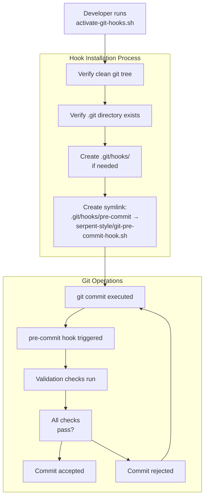
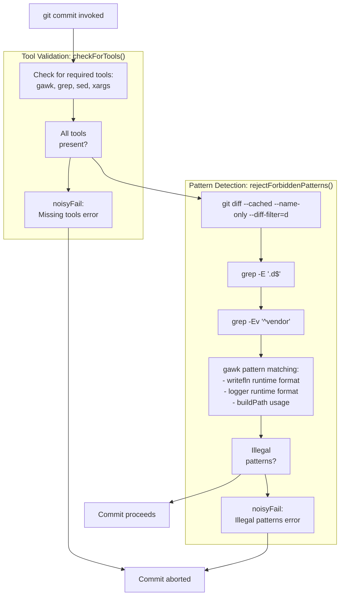
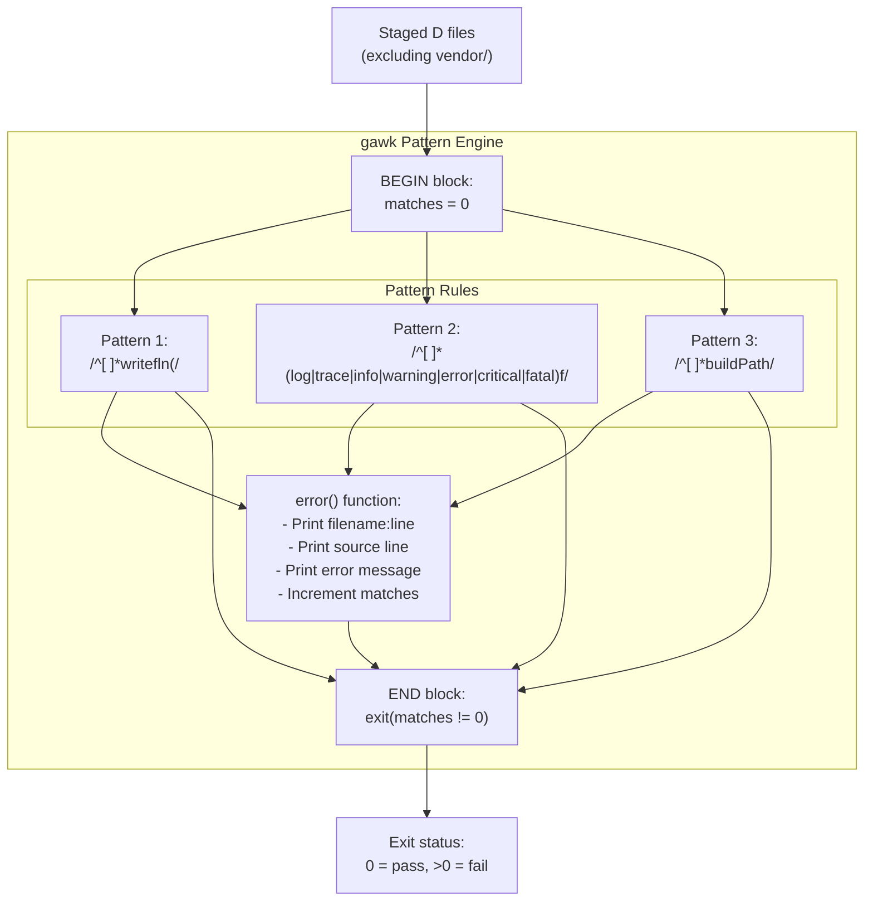
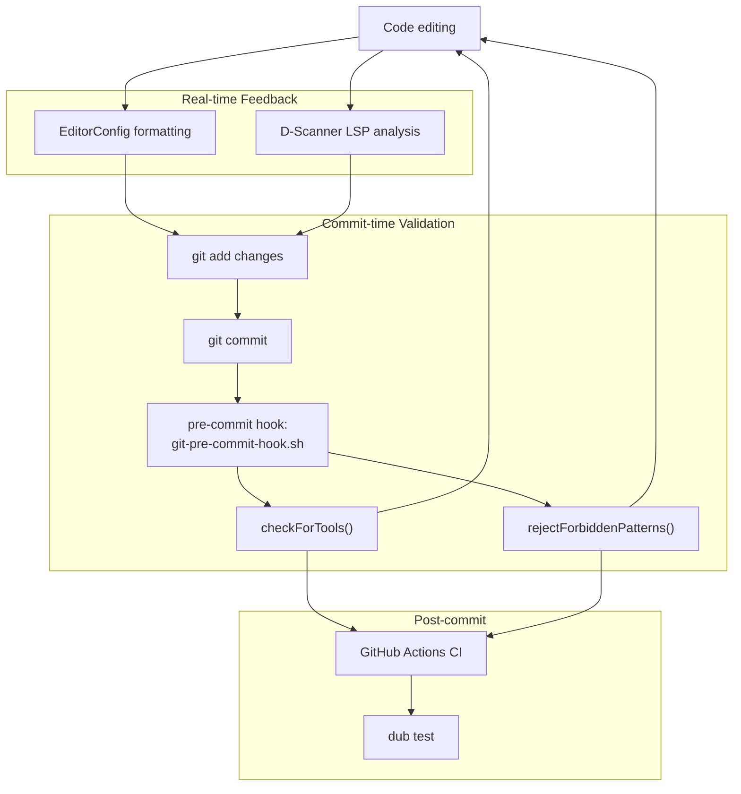

# Git Hooks and Pre-commit Checks

Relevant source files

* [serpent-style/activate-git-hooks.sh](../serpent-style/activate-git-hooks.sh)
* [serpent-style/git-pre-commit-hook.sh](../serpent-style/git-pre-commit-hook.sh)
* [serpent-style/setup.sh](../serpent-style/setup.sh)

## Purpose and Scope

This document explains the git hook system used by libmoss to enforce code quality standards automatically at commit time. The pre-commit hook performs pattern validation on D language files to prevent common coding mistakes from entering the repository.

For information about code formatting tools and standards enforced by these hooks, see [Code Formatting Tools](5.4-code-formatting-tools). For details about the static analysis tools used during development, see [Static Analysis with D-Scanner](5.2-static-analysis-with-d-scanner).

## Hook System Architecture

The git hook system in libmoss is provided by the `serpent-style` subsystem and consists of two main components: an activation script and the pre-commit hook implementation itself. The hooks are designed to validate staged changes before they are committed to the repository.



**Sources:** [serpent-style/activate-git-hooks.sh14-23](../serpent-style/activate-git-hooks.sh#L14-L23) [serpent-style/git-pre-commit-hook.sh1-125](../serpent-style/git-pre-commit-hook.sh#L1-L125)

## Hook Installation

### Activation Process

The git hooks are activated using the `activate-git-hooks.sh` script located in the `serpent-style` directory. This script performs validation checks before installing the hook to ensure the repository is in a clean state.

**Prerequisites Verification:**

| Check | Purpose | Implementation |
| --- | --- | --- |
| Git tree cleanliness | Ensures no uncommitted changes exist | `git status --untracked-files=no --porcelain` |
| `.git` directory presence | Confirms script runs from repository root | `test -e .git` |

**Installation Steps:**

1. **Directory Creation:** The script ensures `.git/hooks` exists with mode `00755` [serpent-style/activate-git-hooks.sh19-21](../serpent-style/activate-git-hooks.sh#L19-L21)
2. **Symlink Creation:** Creates a relative symlink from `.git/hooks/pre-commit` to `serpent-style/git-pre-commit-hook.sh` [serpent-style/activate-git-hooks.sh23](../serpent-style/activate-git-hooks.sh#L23-L23)
3. **Status Display:** Shows final git status to confirm successful installation [serpent-style/activate-git-hooks.sh25](../serpent-style/activate-git-hooks.sh#L25-L25)

The relative symlink (`ln -rsvf`) prevents dangling symlinks even if the repository directory is moved.

**Sources:** [serpent-style/activate-git-hooks.sh1-26](../serpent-style/activate-git-hooks.sh#L1-L26) [serpent-style/setup.sh46-50](../serpent-style/setup.sh#L46-L50)

### Alternative Setup via setup.sh

The `serpent-style/setup.sh` script also performs hook installation as part of a broader setup process that includes linking configuration files and setting up REUSE-compliant license directories. This script performs the same hook installation steps but within a larger initialization workflow [serpent-style/setup.sh46-52](../serpent-style/setup.sh#L46-L52)

**Sources:** [serpent-style/setup.sh1-55](../serpent-style/setup.sh#L1-L55)

## Pre-commit Hook Execution Flow

The pre-commit hook executes automatically when `git commit` is invoked. It performs dependency checks and pattern validation on staged D language files.



**Sources:** [serpent-style/git-pre-commit-hook.sh38-124](../serpent-style/git-pre-commit-hook.sh#L38-L124)

### Tool Dependency Validation

The `checkForTools()` function verifies that all required command-line utilities are available before executing validation checks [serpent-style/git-pre-commit-hook.sh38-65](../serpent-style/git-pre-commit-hook.sh#L38-L65)

**Required Tools:**

| Tool | Purpose |
| --- | --- |
| `gawk` | Pattern matching and validation logic |
| `grep` | File filtering by extension and path |
| `sed` | Text stream processing |
| `xargs` | Argument passing to gawk |

If any tool is missing, the hook calls `noisyFail()` with formatted error output including ANSI color codes for visibility [serpent-style/git-pre-commit-hook.sh19-36](../serpent-style/git-pre-commit-hook.sh#L19-L36)

**Sources:** [serpent-style/git-pre-commit-hook.sh38-65](../serpent-style/git-pre-commit-hook.sh#L38-L65)

### File Selection Pipeline

The hook only processes D language source files that are:

1. **Staged for commit:** Uses `git diff --cached` to get only staged changes
2. **Not deleted:** `--diff-filter=d` excludes deleted files
3. **D language files:** `grep -E "${D_FILES}"` where `D_FILES='\.d$'`
4. **Not vendor code:** `grep -Ev '^vendor'` excludes the vendor directory

This pipeline ensures that third-party code in the `vendor/` directory is never validated, as it is consumed as-is [serpent-style/git-pre-commit-hook.sh67-76](../serpent-style/git-pre-commit-hook.sh#L67-L76)

**Sources:** [serpent-style/git-pre-commit-hook.sh17](../serpent-style/git-pre-commit-hook.sh#L17-L17) [serpent-style/git-pre-commit-hook.sh67-76](../serpent-style/git-pre-commit-hook.sh#L67-L76)

## Forbidden Pattern Detection

The core validation logic uses `gawk` to scan D source files for forbidden coding patterns. Each pattern represents a code construct that should be avoided for performance or safety reasons.

### Pattern Matching Architecture



**Sources:** [serpent-style/git-pre-commit-hook.sh77-121](../serpent-style/git-pre-commit-hook.sh#L77-L121)

### Forbidden Patterns

#### Pattern 1: Runtime Format Strings in writefln

**Pattern:** `/^[ ]*writefln\(/`

**Rationale:** The D language provides compile-time format string checking via template instantiation. Using `writefln()` without the template form allows runtime format strings, which bypass compile-time validation and can cause runtime errors.

**Violation Example:**

```
writefln("Value: %s", value);  // Rejected
```

**Correct Usage:**

```
writefln!"Value: %s"(value);   // Accepted
```

The pattern matches lines starting with optional spaces followed by `writefln(` [serpent-style/git-pre-commit-hook.sh94-97](../serpent-style/git-pre-commit-hook.sh#L94-L97)

**Sources:** [serpent-style/git-pre-commit-hook.sh94-97](../serpent-style/git-pre-commit-hook.sh#L94-L97)

#### Pattern 2: Runtime Format Strings in Logger Functions

**Pattern:** `/^[ ]*(log|trace|info|warning|error|critical|fatal)f/`

**Rationale:** Similar to `writefln`, logger functions with runtime format strings (indicated by the `f` suffix) bypass compile-time validation. The recommended approach uses `format!` templates.

**Violation Example:**

```
infof("Processing %s", filename);    // Rejected
```

**Correct Usage:**

```
info(format!"Processing %s"(filename)); // Accepted
```

The pattern matches logging function names followed by `f`, indicating format string variants [serpent-style/git-pre-commit-hook.sh99-102](../serpent-style/git-pre-commit-hook.sh#L99-L102)

**Sources:** [serpent-style/git-pre-commit-hook.sh99-102](../serpent-style/git-pre-commit-hook.sh#L99-L102)

#### Pattern 3: buildPath Performance Issues

**Pattern:** `/^[ ]*buildPath/`

**Rationale:** The `buildPath` function from the D standard library has been identified as slow for path construction. The alternatives `.join` or `joinPath` provide better performance.

**Violation Example:**

```
auto path = buildPath(dir, filename);  // Rejected
```

**Correct Usage:**

```
auto path = [dir, filename].join;      // Accepted
auto path = dir.joinPath(filename);    // Accepted
```

The pattern matches any line starting with optional spaces followed by `buildPath` [serpent-style/git-pre-commit-hook.sh104-107](../serpent-style/git-pre-commit-hook.sh#L104-L107)

**Sources:** [serpent-style/git-pre-commit-hook.sh104-107](../serpent-style/git-pre-commit-hook.sh#L104-L107)

### Error Reporting Format

When a forbidden pattern is detected, the `error()` function within the gawk script produces formatted output:

```
filename.d:42:
>    writefln("Invalid format string", value);<
>> Use writefln! instead of writefln() (compile time format string check)
```

The format includes:

1. **Location:** `FILENAME:FNR:` - file path and line number
2. **Source Line:** `>source code<` - the offending line surrounded by markers
3. **Explanation:** `>> message` - guidance on how to fix the issue

This structure provides developers with precise information to locate and correct violations [serpent-style/git-pre-commit-hook.sh81-86](../serpent-style/git-pre-commit-hook.sh#L81-L86)

**Sources:** [serpent-style/git-pre-commit-hook.sh81-86](../serpent-style/git-pre-commit-hook.sh#L81-L86)

## Error Handling and User Feedback

### noisyFail Function

The `noisyFail()` function provides consistent, visually prominent error reporting using ANSI color codes:

| Color Code | Purpose |
| --- | --- |
| `\033<FileRef file-url="libmoss/1;31m` | Bold red for "ERROR#LNaN-LNaN" NaN file-path="1;31m` |

**Sources:** [serpent-style/git-pre-commit-hook.sh19-36](../serpent-style/git-pre-commit-hook.sh#L19-L36)

### Pattern Match Summary

After processing all files, the gawk script's `END` block reports the total number of violations found:

```
Found N illegal Dlang patterns.
```

If `matches != 0`, the script exits with a non-zero status, triggering the `noisyFail()` call with a comprehensive rejection message [serpent-style/git-pre-commit-hook.sh110-120](../serpent-style/git-pre-commit-hook.sh#L110-L120)

**Sources:** [serpent-style/git-pre-commit-hook.sh109-115](../serpent-style/git-pre-commit-hook.sh#L109-L115)

## Bypassing the Hook

While not recommended for normal development, the pre-commit hook can be bypassed using git's `--no-verify` flag:

```
git commit --no-verify -m "Emergency fix"
```

This should only be used in exceptional circumstances, as it defeats the purpose of automated validation and may introduce code quality issues into the repository.

## Integration with Development Workflow

The pre-commit hook integrates with other quality assurance systems described in the Development Guide:



The hook serves as the second validation layer after real-time editor feedback but before CI pipeline execution. This layered approach catches issues progressively earlier in the development cycle.

**Sources:** [serpent-style/git-pre-commit-hook.sh1-125](../serpent-style/git-pre-commit-hook.sh#L1-L125)

## Troubleshooting

### Hook Not Executing

**Symptom:** Commits succeed without validation

**Causes and Solutions:**

| Cause | Verification | Solution |
| --- | --- | --- |
| Hook not installed | `ls -la .git/hooks/pre-commit` | Run `serpent-style/activate-git-hooks.sh` |
| Symlink broken | Check symlink target exists | Re-run activation script |
| Hook not executable | `test -x .git/hooks/pre-commit` | `chmod +x serpent-style/git-pre-commit-hook.sh` |

### Missing Tool Dependencies

**Symptom:** Hook fails with "Missing tools" error

**Solution:** Install missing utilities using your distribution's package manager:

```
# Debian/Ubuntu
sudo apt-get install gawk grep sed coreutils

# Fedora/RHEL
sudo dnf install gawk grep sed coreutils

# Arch Linux
sudo pacman -S gawk grep sed coreutils
```

### False Positives

**Symptom:** Valid code is rejected

The pattern matching uses simple regex and may occasionally match commented-out code. The patterns specifically avoid matching lines with leading comment markers by checking for whitespace-only prefixes (`/^[ ]*pattern/`), but inline comments after code may still trigger false positives [serpent-style/git-pre-commit-hook.sh89-90](../serpent-style/git-pre-commit-hook.sh#L89-L90)

**Workaround:** If a pattern must be used (e.g., in documentation), stage the file separately and commit with detailed explanation in the commit message.

**Sources:** [serpent-style/git-pre-commit-hook.sh38-65](../serpent-style/git-pre-commit-hook.sh#L38-L65) [serpent-style/git-pre-commit-hook.sh88-107](../serpent-style/git-pre-commit-hook.sh#L88-L107)