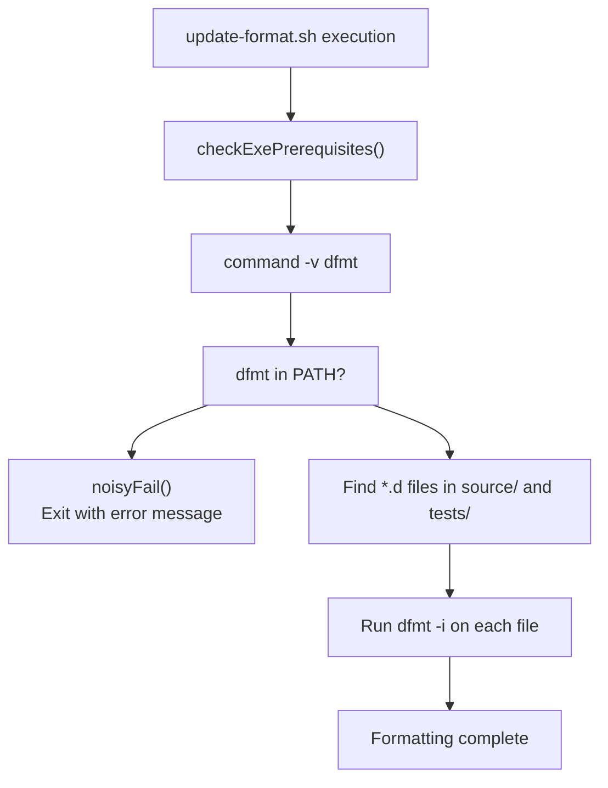
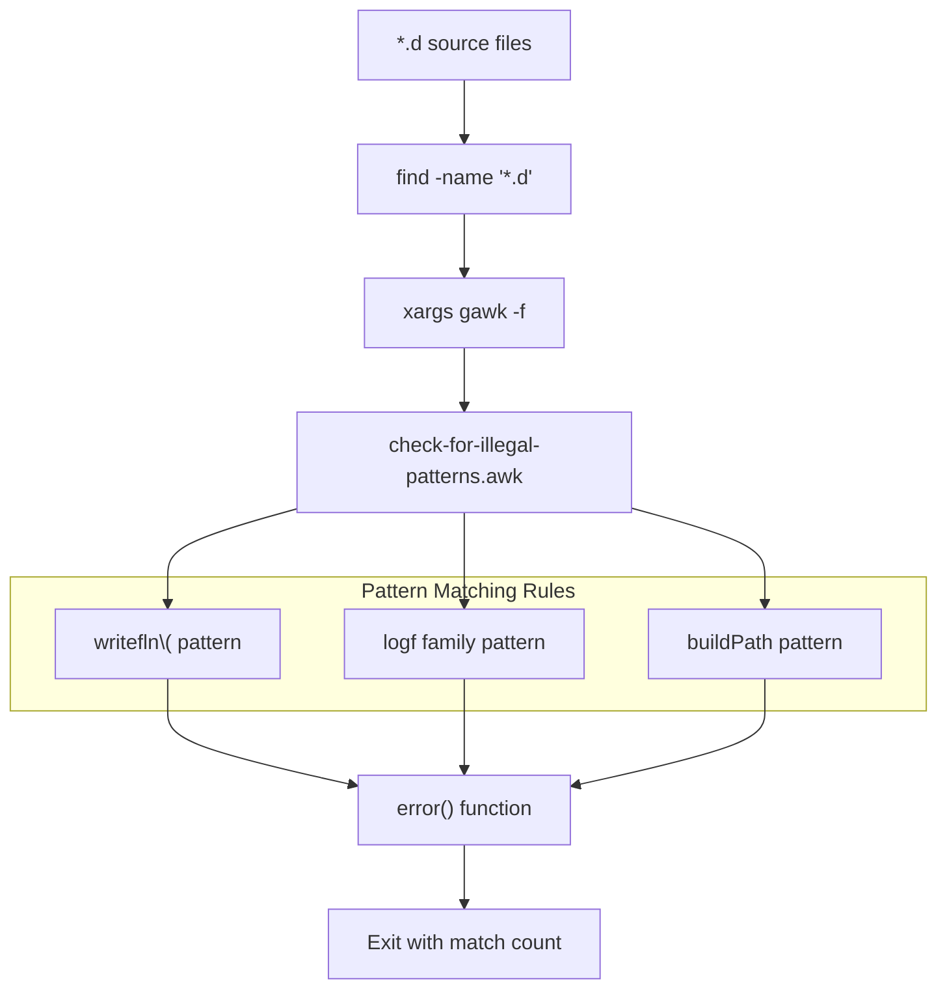
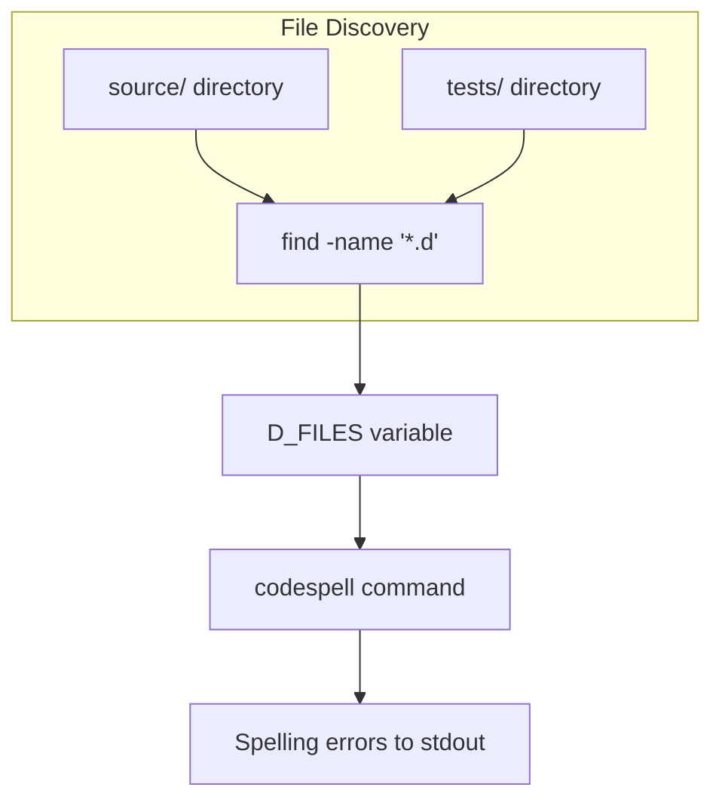
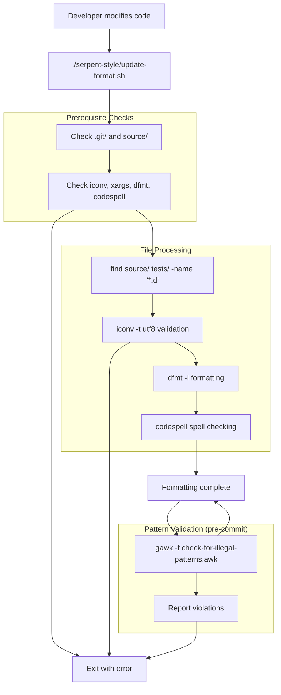
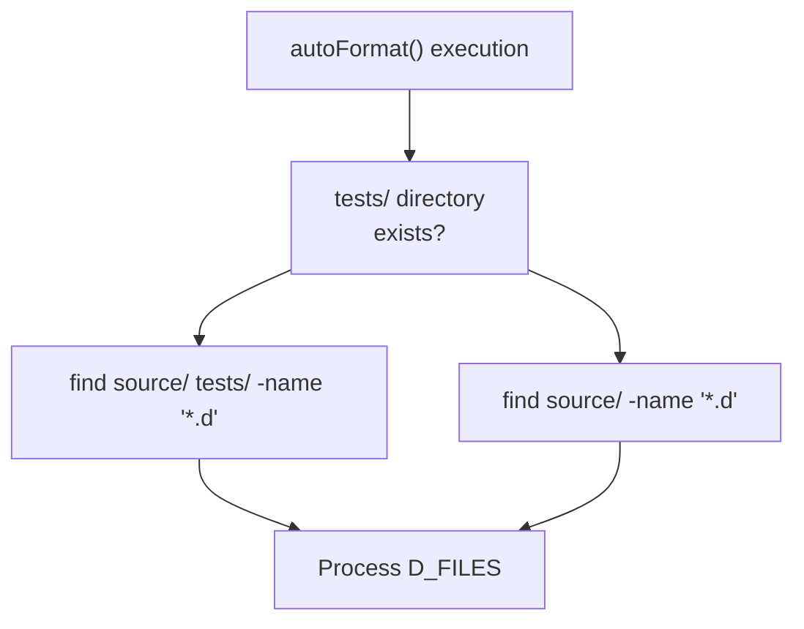

# Code Formatting Tools

Relevant source files

* [serpent-style/README.md](../serpent-style/README.md)
* [serpent-style/check-for-illegal-patterns.awk](../serpent-style/check-for-illegal-patterns.awk)
* [serpent-style/update-format.sh](../serpent-style/update-format.sh)

## Purpose and Scope

This page documents the automated code formatting tools used in libmoss to enforce consistent code style. These tools automatically format D source files, detect illegal code patterns, and check spelling. For the underlying style rules and EditorConfig integration, see [Code Style Standards](5.1-code-style-standards). For git hook integration that invokes these tools, see [Git Hooks and Pre-commit Checks](5.3-git-hooks-and-pre-commit-checks).

The formatting toolchain consists of three primary components:

* **dfmt**: D language source code formatter
* **Illegal pattern detection**: AWK-based scanning for prohibited code constructs
* **codespell**: Spell-checking for source code and comments

All formatting tools are coordinated through the `update-format.sh` script located in the `serpent-style/` submodule.

---

## dfmt Integration

### Overview

`dfmt` is the D language code formatter that enforces formatting rules defined in `.editorconfig`. The tool is mandatory for development and must be available in the system `$PATH`.

**Tool Verification Flow**



**Sources:** [serpent-style/update-format.sh57-63](../serpent-style/update-format.sh#L57-L63) [serpent-style/README.md31-40](../serpent-style/README.md#L31-L40)

### Execution Details

The `autoFormat()` function in `update-format.sh` orchestrates the formatting process:

| Step | Operation | Command |
| --- | --- | --- |
| 1 | Locate D files | `find source/ tests/ -name '*.d' -type f` |
| 2 | UTF-8 validation | `xargs -n1 iconv -t utf8` |
| 3 | Format files | `xargs -n1 dfmt -i` |

The `-i` flag to `dfmt` performs in-place modification of source files [serpent-style/update-format.sh89](../serpent-style/update-format.sh#L89-L89)

**Sources:** [serpent-style/update-format.sh76-96](../serpent-style/update-format.sh#L76-L96)

---

## update-format.sh Script

### Script Architecture

The `update-format.sh` script serves as the primary entry point for all code formatting operations. It performs prerequisite validation before executing formatting tasks.

```mermaid
flowchart TD

Main["Main execution"]
CheckDir["checkDirPrerequisites()"]
CheckExe["checkExePrerequisites()"]
AutoFormat["autoFormat()"]
GitCheck["Verify .git/ exists"]
SourceCheck["Verify source/ exists"]
IconvCheck["command -v iconv"]
XargsCheck["command -v xargs"]
DfmtCheck["command -v dfmt"]
CodespellCheck["command -v codespell"]
FindDFiles["find source/ tests/ -name '*.d'"]
Utf8Test["xargs iconv -t utf8"]
RunDfmt["xargs dfmt -i"]
RunCodespell["codespell D_FILES"]

Main --> CheckDir
CheckDir --> GitCheck
CheckDir --> SourceCheck
CheckDir --> CheckExe
CheckExe --> IconvCheck
CheckExe --> XargsCheck
CheckExe --> DfmtCheck
CheckExe --> CodespellCheck
CheckExe --> AutoFormat
AutoFormat --> FindDFiles

subgraph autoFormat() ["autoFormat()"]
    FindDFiles
    Utf8Test
    RunDfmt
    RunCodespell
    FindDFiles --> Utf8Test
    Utf8Test --> RunDfmt
    RunDfmt --> RunCodespell
end

subgraph checkExePrerequisites() ["checkExePrerequisites()"]
    IconvCheck
    XargsCheck
    DfmtCheck
    CodespellCheck
end

subgraph checkDirPrerequisites() ["checkDirPrerequisites()"]
    GitCheck
    SourceCheck
end
```

**Sources:** [serpent-style/update-format.sh1-102](../serpent-style/update-format.sh#L1-L102)

### Prerequisite Validation

The script validates both directory structure and required executables:

**Directory Prerequisites** [serpent-style/update-format.sh27-39](../serpent-style/update-format.sh#L27-L39):

* `.git/` directory must exist (ensures execution from repository root)
* `source/` directory must exist (ensures D source files are present)

**Executable Prerequisites** [serpent-style/update-format.sh41-71](../serpent-style/update-format.sh#L41-L71):

| Tool | Purpose | Error Handling |
| --- | --- | --- |
| `iconv` | UTF-8 character set validation | Suggests glibc with locale support |
| `xargs` | Batch file processing | Suggests GNU findutils installation |
| `dfmt` | D code formatting | Suggests git clone from dlang-community |
| `codespell` | Spell checking | Suggests package manager installation |

All failures invoke `noisyFail()` [serpent-style/update-format.sh8-25](../serpent-style/update-format.sh#L8-L25) which prints a formatted error message and exits with status 1.

**Sources:** [serpent-style/update-format.sh27-71](../serpent-style/update-format.sh#L27-L71)

---

## Illegal Pattern Detection

### Pattern Scanning System

The `check-for-illegal-patterns.awk` script scans D source files for prohibited code constructs. This validation occurs during pre-commit hooks (see [Git Hooks and Pre-commit Checks](5.3-git-hooks-and-pre-commit-checks)).



**Sources:** [serpent-style/check-for-illegal-patterns.awk1-43](../serpent-style/check-for-illegal-patterns.awk#L1-L43)

### Prohibited Patterns

The script enforces three specific pattern restrictions:

**Pattern 1: Runtime Format Strings in writefln** [serpent-style/check-for-illegal-patterns.awk22-24](../serpent-style/check-for-illegal-patterns.awk#L22-L24)

* **Pattern:** `/^[ ]*writefln\(/`
* **Reason:** Compile-time format string validation
* **Fix:** Use `writefln!` template syntax instead

**Pattern 2: Runtime Format Strings in Logging** [serpent-style/check-for-illegal-patterns.awk27-29](../serpent-style/check-for-illegal-patterns.awk#L27-L29)

* **Pattern:** `/^[ ]*(log|trace|info|warning|error|critical|fatal)f/`
* **Reason:** Compile-time format string validation
* **Fix:** Use `info(format!` with template syntax

**Pattern 3: buildPath Usage** [serpent-style/check-for-illegal-patterns.awk32-34](../serpent-style/check-for-illegal-patterns.awk#L32-L34)

* **Pattern:** `/^[ ]*buildPath/`
* **Reason:** Performance (buildPath is slow)
* **Fix:** Use `.join` or `joinPath` instead

### Error Reporting

The `error()` function [serpent-style/check-for-illegal-patterns.awk8-13](../serpent-style/check-for-illegal-patterns.awk#L8-L13) reports violations with:

* File path and line number (`FILENAME ":" FNR ":"`)
* Complete line content surrounded by `>` and `<`
* Error message explaining the violation and fix

The script exits with status equal to the number of matches found [serpent-style/check-for-illegal-patterns.awk37-42](../serpent-style/check-for-illegal-patterns.awk#L37-L42)

**Sources:** [serpent-style/check-for-illegal-patterns.awk1-43](../serpent-style/check-for-illegal-patterns.awk#L1-L43)

---

## Spell Checking with codespell

### Integration

`codespell` performs spell-checking on D source files and comments. It is invoked as the final step in `autoFormat()` [serpent-style/update-format.sh90-91](../serpent-style/update-format.sh#L90-L91)



**Sources:** [serpent-style/update-format.sh90-91](../serpent-style/update-format.sh#L90-L91) [serpent-style/README.md42-48](../serpent-style/README.md#L42-L48)

### Tool Requirements

Like `dfmt`, `codespell` must be available in `$PATH`. The prerequisite check [serpent-style/update-format.sh65-70](../serpent-style/update-format.sh#L65-L70) verifies its presence and suggests installation via package manager if missing.

**Sources:** [serpent-style/update-format.sh65-70](../serpent-style/update-format.sh#L65-L70)

---

## Tool Integration Flow

### Complete Formatting Pipeline

The following diagram shows how all formatting tools integrate within the development workflow:



**Sources:** [serpent-style/update-format.sh99-101](../serpent-style/update-format.sh#L99-L101) [serpent-style/check-for-illegal-patterns.awk1-43](../serpent-style/check-for-illegal-patterns.awk#L1-L43)

### Invocation Methods

The formatting tools are invoked in two contexts:

| Context | Trigger | Tools Executed |
| --- | --- | --- |
| Manual formatting | `./serpent-style/update-format.sh` | dfmt, codespell |
| Pre-commit validation | git commit | dfmt check, pattern check, codespell |
| Initial setup | `./serpent-style/setup.sh` | One-time format conversion |

The pre-commit hook integration is documented in [Git Hooks and Pre-commit Checks](5.3-git-hooks-and-pre-commit-checks).

**Sources:** [serpent-style/README.md12-19](../serpent-style/README.md#L12-L19) [serpent-style/update-format.sh1-102](../serpent-style/update-format.sh#L1-L102)

---

## File Discovery Logic

### Source File Location

The `autoFormat()` function locates D source files using conditional logic [serpent-style/update-format.sh78-83](../serpent-style/update-format.sh#L78-L83):



This ensures the script works correctly for projects both with and without test directories.

**Sources:** [serpent-style/update-format.sh78-83](../serpent-style/update-format.sh#L78-L83)