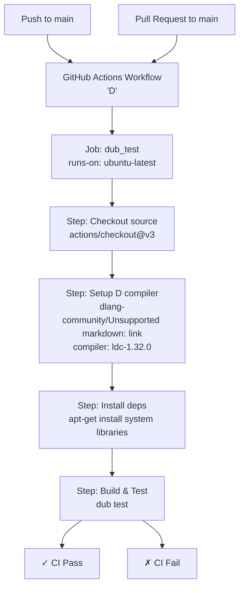
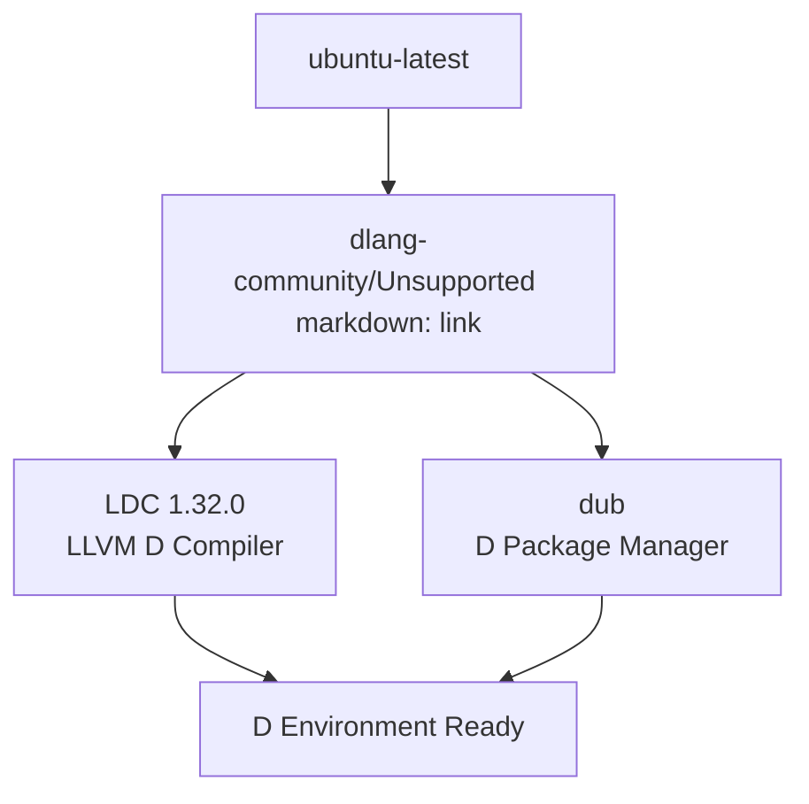
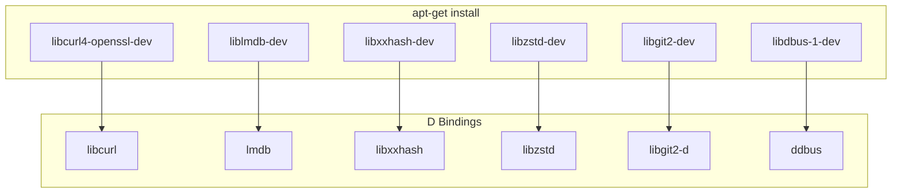
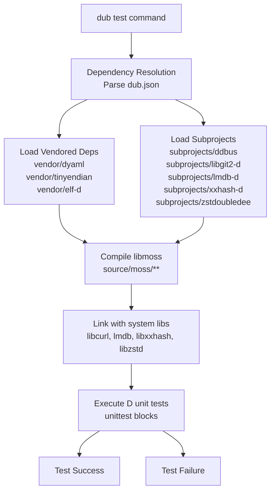
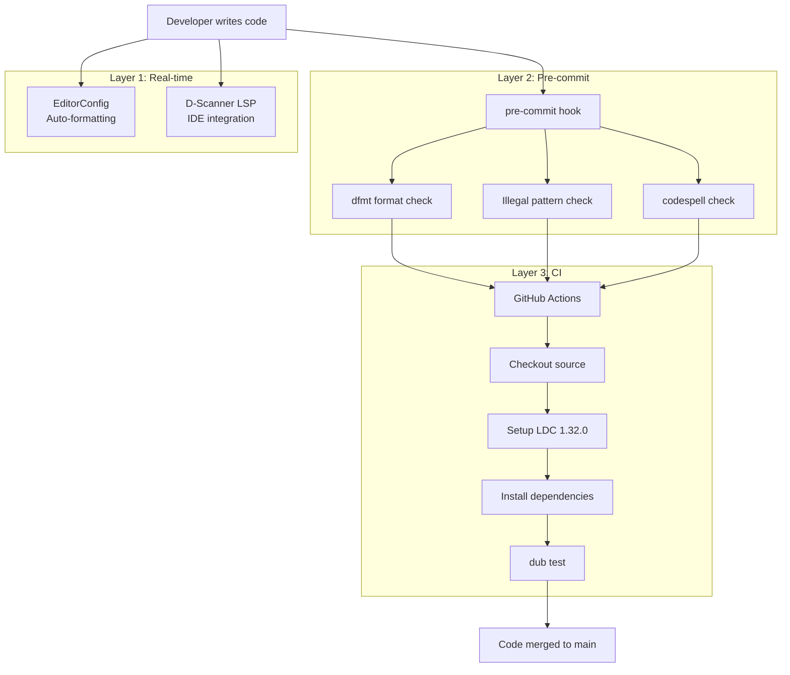
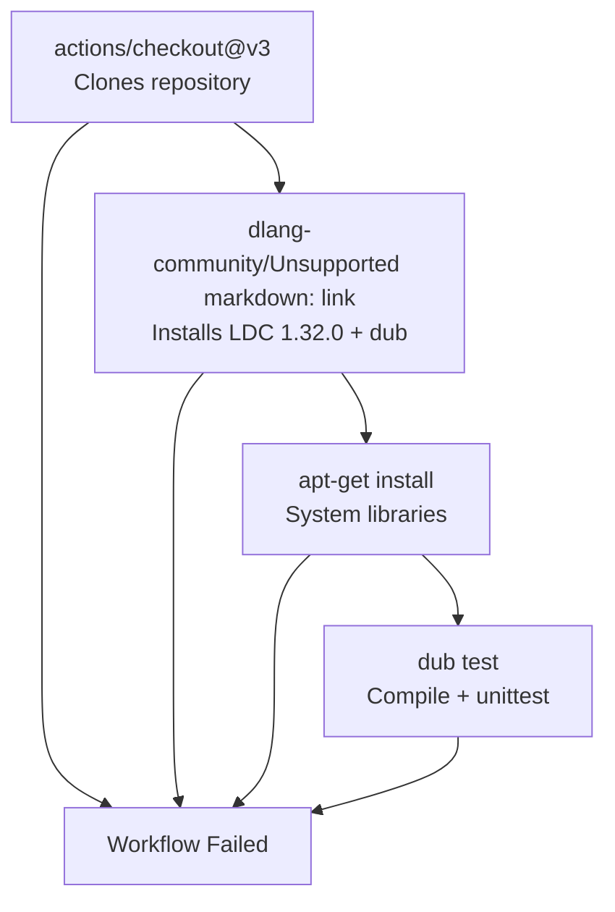

# Continuous Integration

Relevant source files

* [.github/workflows/d.yml](../.github/workflows/d.yml)
* [dub.json](../dub.json)

This page documents the continuous integration (CI) system implemented via GitHub Actions. The CI pipeline provides automated validation of all code changes through compilation and testing on a standardized environment. This serves as the final quality gate before code is merged, complementing the pre-commit validation described in [Git Hooks and Pre-commit Checks](5.3-git-hooks-and-pre-commit-checks).

For information about the static analysis and formatting tools that are validated locally before CI runs, see [Static Analysis with D-Scanner](5.2-static-analysis-with-d-scanner) and [Code Formatting Tools](5.4-code-formatting-tools).

## CI Pipeline Overview

The libmoss repository uses GitHub Actions to provide automated continuous integration. The pipeline is triggered on two events:

* **Push to main branch**: Validates that merged code continues to build and pass tests
* **Pull requests to main**: Prevents merging of code that fails to build or test

The CI configuration is defined in a single workflow file located at [.github/workflows/d.yml1-30](../.github/workflows/d.yml#L1-L30)

**Workflow Structure**



Sources: [.github/workflows/d.yml1-30](../.github/workflows/d.yml#L1-L30)

## Build Environment Configuration

The CI environment is precisely specified to ensure reproducible builds across all contributors and CI runs.

### Compiler Configuration

The workflow uses a specific LDC (LLVM D Compiler) version that is newer than the minimum required version:

| Configuration | Value | Source |
| --- | --- | --- |
| CI Compiler Version | `ldc-1.32.0` | [.github/workflows/d.yml21](../.github/workflows/d.yml#L21-L21) |
| Minimum Compiler Version | `ldc >= 1.31.0` | [dub.json11](../dub.json#L11-L11) |
| Operating System | `ubuntu-latest` | [.github/workflows/d.yml12](../.github/workflows/d.yml#L12-L12) |

The compiler is installed via the `dlang-community/setup-dlang` action, which downloads and configures the specified LDC version.

**Environment Setup Workflow**



Sources: [.github/workflows/d.yml19-21](../.github/workflows/d.yml#L19-L21)

### System Dependencies

The CI workflow installs all required system libraries via `apt-get`. These correspond to the C libraries that the D bindings wrap:



Sources: [.github/workflows/d.yml24-25](../.github/workflows/d.yml#L24-L25) [dub.json40-45](../dub.json#L40-L45)

**System Library Installation Details**

| Package | Purpose | Required By |
| --- | --- | --- |
| `libcurl4-openssl-dev` | HTTP/network operations | moss-fetcher (HTTP mode) |
| `liblmdb-dev` | Lightning Memory-Mapped Database | moss-db |
| `libxxhash-dev` | Fast hash algorithm | moss-deps |
| `libzstd-dev` | Zstandard compression | moss-format (binary mode) |
| `libgit2-dev` | Git operations | moss-fetcher (Git mode) |
| `libdbus-1-dev` | D-Bus IPC | moss-core |

The installation command at [.github/workflows/d.yml24-25](../.github/workflows/d.yml#L24-L25) installs all dependencies regardless of build configuration, ensuring that the full test suite can run all optional components.

## Build and Test Execution

The build and test phase is executed via the DUB package manager using a single command:

```
dub test
```

This command performs the following operations:

**DUB Test Workflow**



Sources: [.github/workflows/d.yml28-29](../.github/workflows/d.yml#L28-L29) [dub.json14-45](../dub.json#L14-L45)

The `dub test` command executes all `unittest` blocks embedded in the D source code. Unlike some language ecosystems that separate tests into different files, D's built-in `unittest` feature allows test code to be co-located with implementation code.

## Integration with Development Workflow

The CI pipeline functions as the final validation stage in a multi-layered quality assurance strategy:

**Quality Gates Hierarchy**



Sources: [.github/workflows/d.yml1-30](../.github/workflows/d.yml#L1-L30)

This three-layer approach ensures:

1. **Real-time feedback** during development via editor integration
2. **Local validation** before code leaves the developer's machine via pre-commit hooks (see [Git Hooks and Pre-commit Checks](5.3-git-hooks-and-pre-commit-checks))
3. **Centralized validation** in a clean, reproducible environment via CI

The CI layer is particularly important because it validates code in an environment independent of the developer's local setup, catching issues related to:

* Missing system dependencies
* Platform-specific compilation issues
* Test failures that only manifest on Ubuntu
* Problems with the DUB dependency resolution

## Workflow Triggers and Branch Protection

The workflow is configured to run on two distinct triggers:

**Trigger Configuration**

```
on:
  push:
    branches: [ "main" ]
  pull_request:
    branches: [ "main" ]
```

| Trigger Type | Branches | Purpose |
| --- | --- | --- |
| `push` | `main` | Validates that merged code continues to build |
| `pull_request` | `main` | Validates proposed changes before merge |

Sources: [.github/workflows/d.yml3-7](../.github/workflows/d.yml#L3-L7)

This configuration enables the repository to use GitHub's branch protection rules, which can require CI success before allowing merges to the main branch. While the workflow file itself doesn't enforce this, it provides the necessary automation to support a protected main branch policy.

## CI Job Execution Details

The single job `dub_test` executes sequentially through four steps:

**Step-by-Step Execution**

| Step | Action | Details | File Reference |
| --- | --- | --- | --- |
| 1 | Checkout source | Uses `actions/checkout@v3` to clone repository | [.github/workflows/d.yml15-16](../.github/workflows/d.yml#L15-L16) |
| 2 | Setup D compiler | Uses `dlang-community/setup-dlang@v1.3.0` with `ldc-1.32.0` | [.github/workflows/d.yml18-21](../.github/workflows/d.yml#L18-L21) |
| 3 | Install deps | Runs `apt-get install` for system libraries | [.github/workflows/d.yml23-25](../.github/workflows/d.yml#L23-L25) |
| 4 | Build & Test | Executes `dub test` command | [.github/workflows/d.yml27-29](../.github/workflows/d.yml#L27-L29) |

Each step must succeed for the subsequent step to execute. If any step fails, the entire workflow is marked as failed, and the failure is reported in the GitHub interface.

**CI Dependency Chain**



Sources: [.github/workflows/d.yml14-29](../.github/workflows/d.yml#L14-L29)

## Testing Strategy

The CI pipeline relies on D's built-in `unittest` feature rather than an external testing framework. When `dub test` is executed, DUB compiles the library with the `-unittest` flag enabled, which includes all `unittest` blocks in the compilation and executes them.

**Test Execution Model**

* Tests are embedded directly in source files as `unittest` blocks
* DUB automatically discovers and compiles all unittest blocks
* Tests run in-process after compilation
* Any assertion failure or uncaught exception causes the test run to fail

This approach is idiomatic for D projects and allows test code to access private members and implementation details of the modules being tested.

## CI Output and Reporting

GitHub Actions provides real-time log output for each workflow run. Developers and reviewers can view:

* Compiler output during the `dub test` step
* Any unittest failures with stack traces
* Timing information for each step
* Overall workflow success/failure status

The workflow status is also displayed directly on pull requests, making it immediately visible whether a proposed change passes CI validation.

## Comparison with Local Development

The CI environment differs from local development in several ways:

| Aspect | Local Development | CI Environment |
| --- | --- | --- |
| Compiler Version | Any LDC >= 1.31.0 | Exactly LDC 1.32.0 |
| Operating System | Any supported OS | Ubuntu (latest) |
| Build System | DUB or Meson | DUB only |
| Component Selection | Configurable via Meson options | All components enabled |
| Dependency Installation | Manual or OS-specific | Automated via apt-get |

Sources: [.github/workflows/d.yml12-21](../.github/workflows/d.yml#L12-L21) [dub.json11](../dub.json#L11-L11)

The CI environment uses DUB exclusively because it provides simpler, more portable automation compared to Meson. The dual build system support (see [Build System Architecture](2.1-build-system-architecture)) allows local developers to use either approach, while CI standardizes on DUB for consistency.