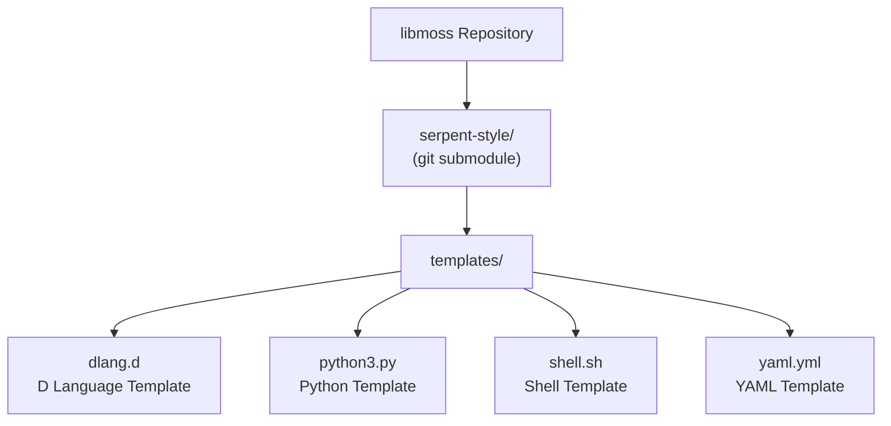
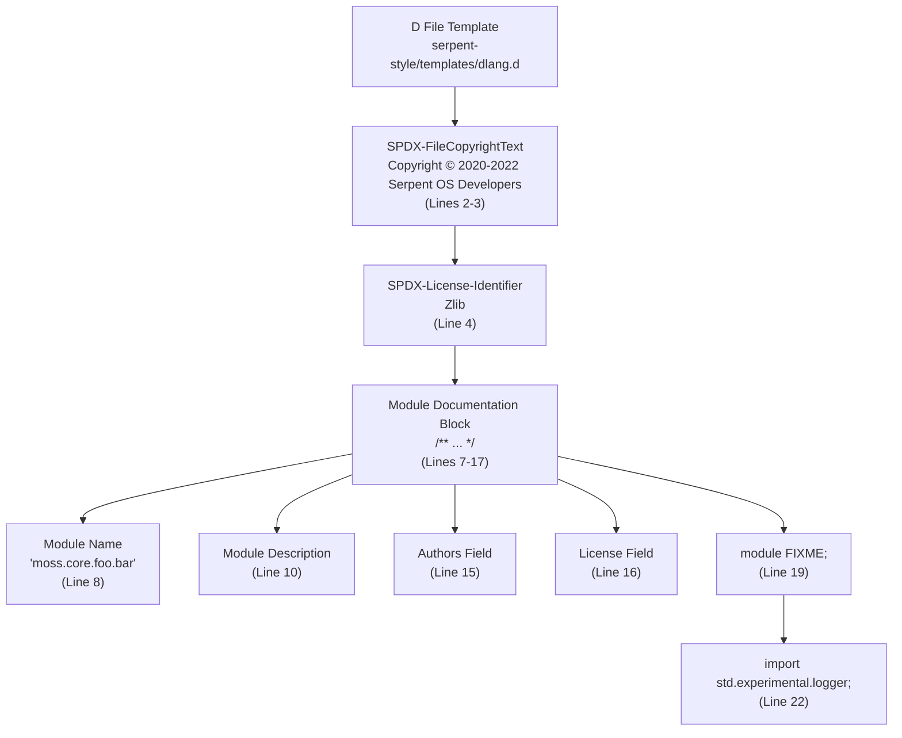
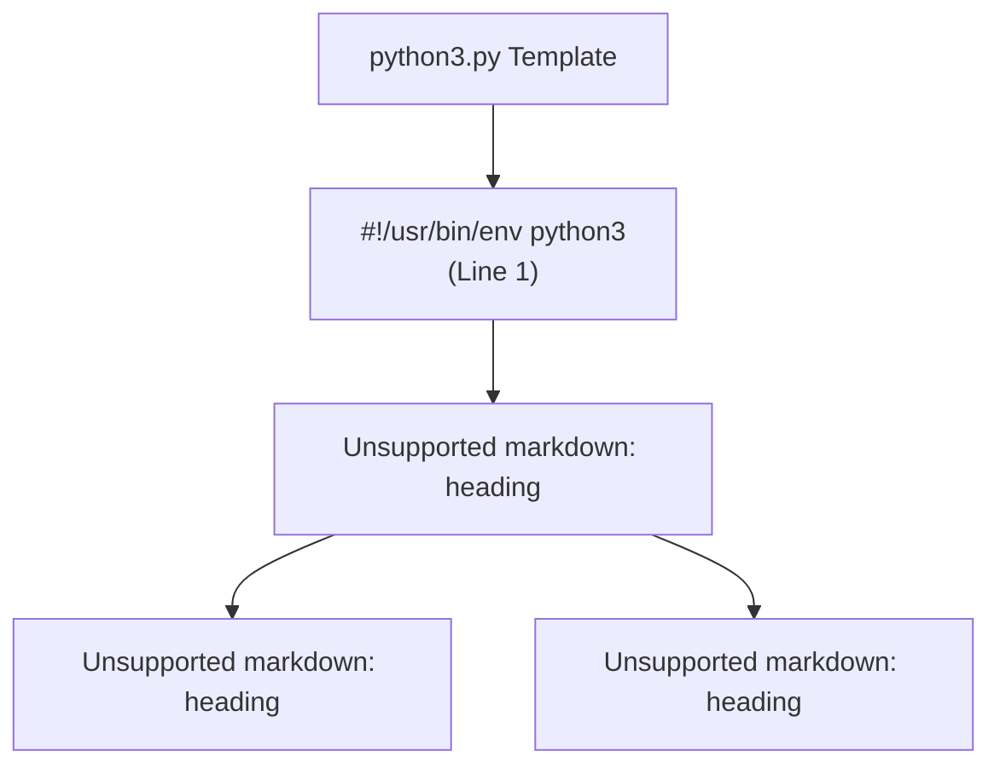
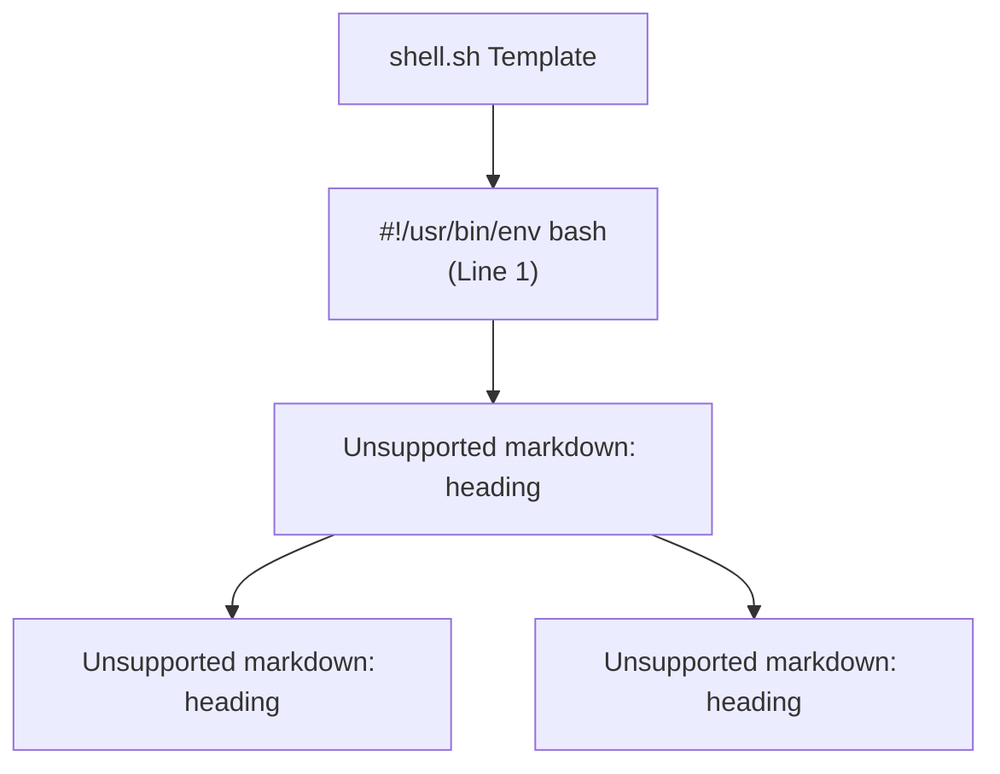
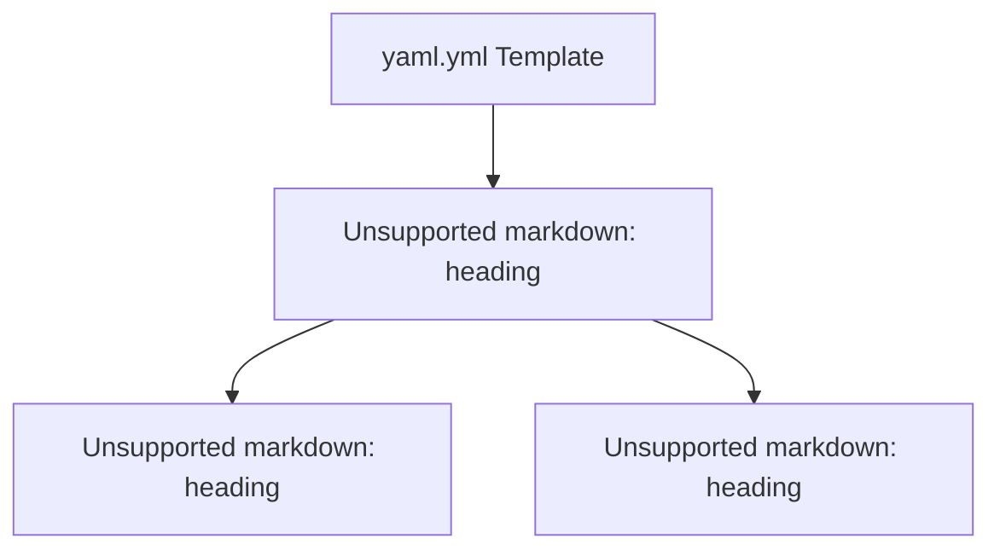
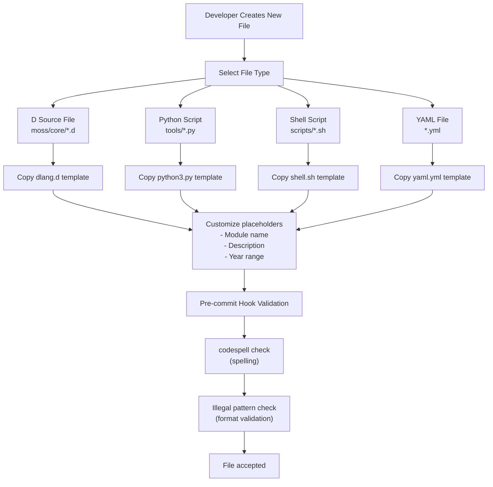
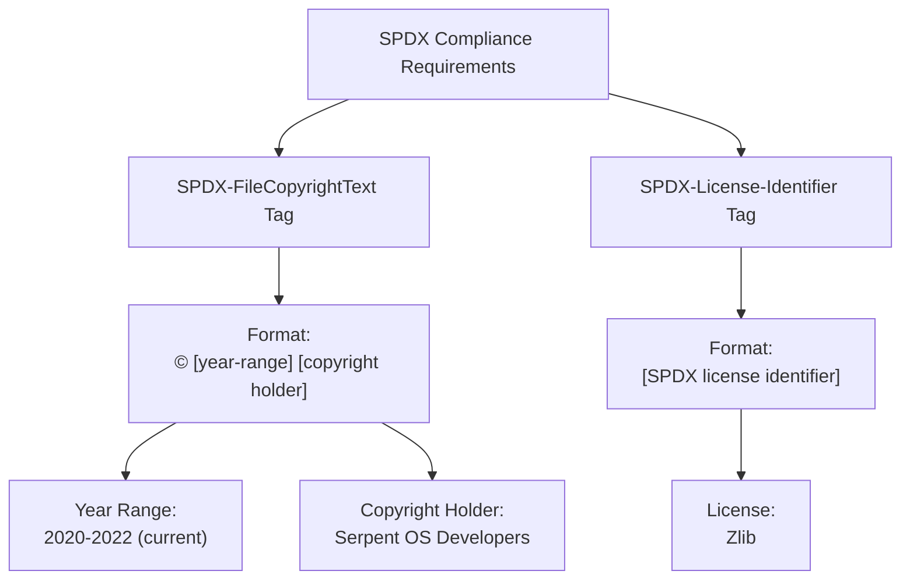

# File Templates

Relevant source files

* [serpent-style/templates/dlang.d](../serpent-style/templates/dlang.d)
* [serpent-style/templates/python3.py](../serpent-style/templates/python3.py)
* [serpent-style/templates/shell.sh](../serpent-style/templates/shell.sh)
* [serpent-style/templates/yaml.yml](../serpent-style/templates/yaml.yml)

## Purpose and Scope

This document describes the standard file templates used in the libmoss repository for maintaining consistent file headers, copyright notices, and boilerplate code across all source files. These templates are located in the `serpent-style/templates/` directory and define the required structure for D language files, Python scripts, shell scripts, and YAML configuration files.

For information about code formatting and style enforcement, see [Code Style Standards](5.1-code-style-standards). For details about the serpent-style subsystem that contains these templates, see [serpent-style Subsystem](7.2-serpent-style-subsystem).

## Template Overview

The libmoss project provides four standardized file templates to ensure consistent file structure and licensing information across the codebase. All templates include SPDX licensing headers and copyright attribution in accordance with the project's licensing requirements (see [Licensing and Legal](8-licensing-and-legal)).

### Available Templates

| Template File | File Type | Purpose | Shebang Required |
| --- | --- | --- | --- |
| `dlang.d` | D Language | D source and module files | No |
| `python3.py` | Python | Python scripts and tools | Yes |
| `shell.sh` | Shell | Bash shell scripts | Yes |
| `yaml.yml` | YAML | Configuration and data files | No |

**Template Location**

Sources: [serpent-style/templates/dlang.d1-23](../serpent-style/templates/dlang.d#L1-L23) [serpent-style/templates/python3.py1-7](../serpent-style/templates/python3.py#L1-L7) [serpent-style/templates/shell.sh1-7](../serpent-style/templates/shell.sh#L1-L7) [serpent-style/templates/yaml.yml1-6](../serpent-style/templates/yaml.yml#L1-L6)

## D Language Template

The D language template (`dlang.d`) provides the standard structure for all D source files in the libmoss project. This template includes copyright notices, licensing information, and module documentation headers that must be present in every D file.

### Template Structure

Sources: [serpent-style/templates/dlang.d1-23](../serpent-style/templates/dlang.d#L1-L23)

### Key Elements

**SPDX Copyright Header** ([serpent-style/templates/dlang.d1-5](../serpent-style/templates/dlang.d#L1-L5))

The template begins with an SPDX-compliant copyright block enclosed in a C-style comment:

* `SPDX-FileCopyrightText` identifies copyright holders
* `SPDX-License-Identifier` specifies the Zlib license
* These tags enable automated license compliance tools

**Module Documentation** ([serpent-style/templates/dlang.d7-17](../serpent-style/templates/dlang.d#L7-L17))

The DDoc comment block provides structured documentation:

* **Module Name**: Placeholder text instructs developers to use the format `moss.core.foo.bar`
* **Module Description**: Detailed explanation of the module's purpose
* **Special Note**: For `package.d` files containing only imports, the description 'Module namespace imports.' is sufficient
* **Authors**: Copyright attribution
* **License**: License identifier (Zlib)

**Module Declaration** ([serpent-style/templates/dlang.d19](../serpent-style/templates/dlang.d#L19-L19))

The `module FIXME;` declaration serves as a reminder to replace `FIXME` with the actual module name matching the file path.

**Logger Import** ([serpent-style/templates/dlang.d21-22](../serpent-style/templates/dlang.d#L21-L22))

The template includes `std.experimental.logger` by default with a comment emphasizing that developers should use `trace`/`info` logging levels instead of `writeln`/`writefln` for output.

Sources: [serpent-style/templates/dlang.d1-23](../serpent-style/templates/dlang.d#L1-L23)

## Python Template

The Python template (`python3.py`) defines the standard header for Python scripts and utilities in the project. It focuses on executable script metadata and licensing.

### Template Structure

Sources: [serpent-style/templates/python3.py1-7](../serpent-style/templates/python3.py#L1-L7)

### Key Elements

**Shebang Line** ([serpent-style/templates/python3.py1](../serpent-style/templates/python3.py#L1-L1))

The template begins with `#!/usr/bin/env python3`, which:

* Makes the script directly executable on Unix-like systems
* Uses `/usr/bin/env` to locate `python3` in the user's PATH
* Ensures compatibility across different Python installation locations

**SPDX Headers in Comments** ([serpent-style/templates/python3.py2-6](../serpent-style/templates/python3.py#L2-L6))

Similar to the D template, but using Python's `#` comment syntax:

* `SPDX-FileCopyrightText: © 2020-2022 Serpent OS Developers`
* `SPDX-License-Identifier: Zlib`

The template ends with an empty comment line, providing a clean separation before the actual script code begins.

Sources: [serpent-style/templates/python3.py1-7](../serpent-style/templates/python3.py#L1-L7)

## Shell Script Template

The shell script template (`shell.sh`) provides the standard header for Bash shell scripts used in build automation, testing, or maintenance tasks.

### Template Structure

Sources: [serpent-style/templates/shell.sh1-7](../serpent-style/templates/shell.sh#L1-L7)

### Key Elements

**Shebang Line** ([serpent-style/templates/shell.sh1](../serpent-style/templates/shell.sh#L1-L1))

The template specifies `#!/usr/bin/env bash`, which:

* Makes the script executable on Unix-like systems
* Explicitly requires Bash (not just any POSIX shell)
* Uses `env` for portability across different system configurations

**SPDX Headers** ([serpent-style/templates/shell.sh2-6](../serpent-style/templates/shell.sh#L2-L6))

Identical to the Python template structure, using shell comment syntax:

* Copyright notice with © symbol
* Zlib license identifier
* Trailing empty comment line

Sources: [serpent-style/templates/shell.sh1-7](../serpent-style/templates/shell.sh#L1-L7)

## YAML Template

The YAML template (`yaml.yml`) defines the standard header for YAML configuration files, GitHub Actions workflows, and other YAML-based data files.

### Template Structure

Sources: [serpent-style/templates/yaml.yml1-6](../serpent-style/templates/yaml.yml#L1-L6)

### Key Elements

**No Shebang** ([serpent-style/templates/yaml.yml1](../serpent-style/templates/yaml.yml#L1-L1))

Unlike executable scripts, YAML files begin directly with the comment block since they are data files rather than executable programs.

**SPDX Headers in YAML Comments** ([serpent-style/templates/yaml.yml1-6](../serpent-style/templates/yaml.yml#L1-L6))

Using YAML's `#` comment syntax:

* Leading and trailing empty comment lines
* `SPDX-FileCopyrightText` on line 2
* `SPDX-License-Identifier` on line 4
* Final empty comment line for separation

Sources: [serpent-style/templates/yaml.yml1-6](../serpent-style/templates/yaml.yml#L1-L6)

## Template Usage in Development Workflow

These templates integrate with the libmoss development workflow to ensure consistency across all contributed files.

### Template Application Flow

Sources: [serpent-style/templates/dlang.d1-23](../serpent-style/templates/dlang.d#L1-L23) [serpent-style/templates/python3.py1-7](../serpent-style/templates/python3.py#L1-L7) [serpent-style/templates/shell.sh1-7](../serpent-style/templates/shell.sh#L1-L7) [serpent-style/templates/yaml.yml1-6](../serpent-style/templates/yaml.yml#L1-L6)

### Required Customizations

When using a template, developers must customize the following elements:

| Template | Placeholder | Replacement |
| --- | --- | --- |
| `dlang.d` | `FIXME` (line 19) | Actual module name (e.g., `moss.core.foo.bar`) |
| `dlang.d` | Module Name (line 8) | Same as module declaration |
| `dlang.d` | Module Description (line 10) | Detailed description of module purpose |
| All templates | Copyright year range | Update if needed to reflect current year |

For D language files specifically:

* Replace the `FIXME` module declaration with the appropriate module path
* Update the module documentation to accurately describe the module's purpose
* For `package.d` files containing only imports, use "Module namespace imports." as the description
* Remove or retain the logger import based on whether logging is needed

### Integration with Quality Tools

The file templates work in conjunction with the project's quality enforcement tools:

1. **Pre-commit Hooks** (see [Git Hooks and Pre-commit Checks](5.3-git-hooks-and-pre-commit-checks)): Validate that files contain required headers
2. **Codespell**: Checks spelling in copyright notices and documentation blocks
3. **Pattern Checking**: Ensures SPDX identifiers are present and correctly formatted
4. **D-Scanner** (see [Static Analysis with D-Scanner](5.2-static-analysis-with-d-scanner)): Validates module documentation structure in D files

Sources: [serpent-style/templates/dlang.d1-23](../serpent-style/templates/dlang.d#L1-L23) [serpent-style/templates/python3.py1-7](../serpent-style/templates/python3.py#L1-L7) [serpent-style/templates/shell.sh1-7](../serpent-style/templates/shell.sh#L1-L7) [serpent-style/templates/yaml.yml1-6](../serpent-style/templates/yaml.yml#L1-L6)

## SPDX Compliance

All templates implement SPDX (Software Package Data Exchange) specification for machine-readable licensing information.

### SPDX Tag Structure

Sources: [serpent-style/templates/dlang.d2-4](../serpent-style/templates/dlang.d#L2-L4) [serpent-style/templates/python3.py3-5](../serpent-style/templates/python3.py#L3-L5) [serpent-style/templates/shell.sh3-5](../serpent-style/templates/shell.sh#L3-L5) [serpent-style/templates/yaml.yml2-4](../serpent-style/templates/yaml.yml#L2-L4)

### SPDX Benefits

The SPDX-compliant headers in all templates provide:

1. **Machine Readability**: Automated tools can parse and verify licensing information
2. **Legal Clarity**: Unambiguous copyright and license attribution
3. **Supply Chain Compliance**: Enables automated license scanning in CI/CD pipelines
4. **REUSE Compliance**: Adheres to the REUSE Software specification for licensing clarity

The consistent format across all file types ensures that licensing information is:

* Always present in every source file
* Located in a predictable location (file header)
* Formatted identically regardless of programming language
* Compatible with automated compliance tools

Sources: [serpent-style/templates/dlang.d1-5](../serpent-style/templates/dlang.d#L1-L5) [serpent-style/templates/python3.py1-7](../serpent-style/templates/python3.py#L1-L7) [serpent-style/templates/shell.sh1-7](../serpent-style/templates/shell.sh#L1-L7) [serpent-style/templates/yaml.yml1-6](../serpent-style/templates/yaml.yml#L1-L6)