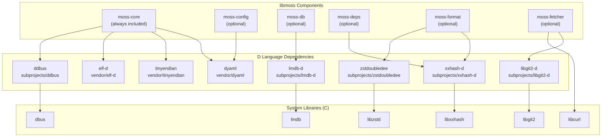
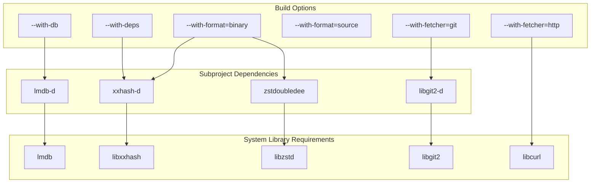
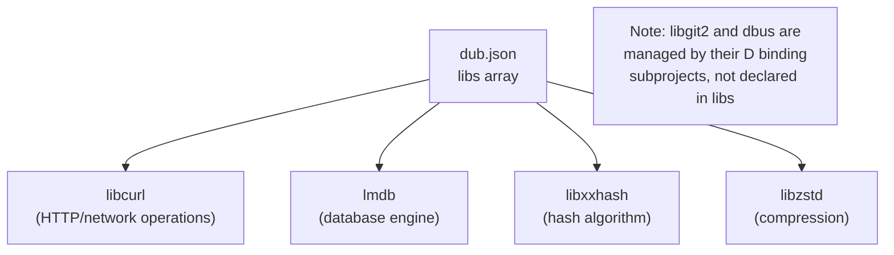

# External Dependencies

Relevant source files

* [dub.json](../dub.json)
* [meson.build](../meson.build)

This document provides a comprehensive overview of the external dependencies required by libmoss, including both D language packages and underlying system libraries. Dependencies in libmoss are categorized by their integration method (vendored vs. subproject), their programming language (D bindings vs. C libraries), and their conditional inclusion based on build options.

For detailed information about specific D packages, see [D Language Dependencies](6.1-d-language-dependencies). For system library requirements, see [System Library Dependencies](6.2-system-library-dependencies). For an explanation of how dependencies are managed and integrated, see [Vendored vs Subproject Dependencies](6.3-vendored-vs-subproject-dependencies).

## Dependency Architecture Overview

libmoss employs a three-tier dependency architecture where D language bindings wrap high-performance C libraries, and some pure D libraries provide additional functionality. The conditional inclusion of dependencies based on build configuration (see [Component Selection](2.2-component-selection)) minimizes the footprint for consumers who don't need all features.

**Dependency Architecture Layers**



Sources: [dub.json14-45](../dub.json#L14-L45) [meson.build14-95](../meson.build#L14-L95)

## Dependency Declaration and Configuration

Dependencies are declared in two primary configuration files that serve different build systems:

| Configuration File | Purpose | Dependency Management |
| --- | --- | --- |
| `dub.json` | DUB package manager configuration | Declares all D dependencies with path specifications |
| `meson.build` | Meson build system configuration | Conditionally configures subprojects based on build options |

The `dub.json` file declares all dependencies unconditionally, while `meson.build` implements the actual conditional compilation logic. This dual-declaration approach ensures compatibility with both the D ecosystem (via DUB) and the broader build ecosystem (via Meson).

Sources: [dub.json1-46](../dub.json#L1-L46) [meson.build1-118](../meson.build#L1-L118)

## Conditional Dependency Loading

Dependencies are loaded conditionally based on the build options specified in `meson_options.txt` (see [Component Selection](2.2-component-selection)). The following diagram illustrates the relationship between build options and their corresponding dependencies:

**Build Option to Dependency Mapping**



Sources: [meson.build14-95](../meson.build#L14-L95)

### Subproject Configuration Logic

The Meson build system implements conditional subproject configuration using the following pattern:

```
if with_moss_db
    lmdb = subproject('lmdb-d', default_options: ['default_library=static'])
    link_lmdb = lmdb.get_variable('link_liblmdb')
endif
```

This pattern is repeated for each optional dependency:

| Build Option Variable | Subproject Name | Linked Variable | Lines |
| --- | --- | --- | --- |
| `with_moss_db` | `lmdb-d` | `link_liblmdb` | [meson.build71-77](../meson.build#L71-L77) |
| `with_moss_fetcher_git` | `libgit2-d` | `link_libgit2` | [meson.build62-68](../meson.build#L62-L68) |
| `with_moss_format_binary` or `with_moss_deps` | `xxhash-d` | `link_libxxhash` | [meson.build80-86](../meson.build#L80-L86) |
| `with_moss_format_binary` | `zstdoubledee` | `link_libzstdoubledee` | [meson.build89-95](../meson.build#L89-L95) |

The only unconditionally loaded subproject is `ddbus`, which is always configured at [meson.build55-59](../meson.build#L55-L59)

Sources: [meson.build55-95](../meson.build#L55-L95)

## D Language Binding Layer

libmoss uses D language bindings to interface with high-performance C libraries. These bindings provide idiomatic D interfaces while maintaining the performance characteristics of the underlying C implementations.

| D Binding Package | Underlying C Library | Purpose | Repository Location |
| --- | --- | --- | --- |
| `ddbus` | `dbus` | D-Bus IPC communication | `subprojects/ddbus` |
| `libgit2-d` | `libgit2` | Git repository operations | `subprojects/libgit2-d` |
| `lmdb-d` | `lmdb` | Lightning Memory-Mapped Database | `subprojects/lmdb-d` |
| `xxhash-d` | `libxxhash` | Fast hashing algorithm | `subprojects/xxhash-d` |
| `zstdoubledee` | `libzstd` | Zstandard compression | `subprojects/zstdoubledee` |

Pure D dependencies (no C library backing):

| Package | Purpose | Repository Location |
| --- | --- | --- |
| `dyaml` | YAML parsing and serialization | `vendor/dyaml` |
| `tinyendian` | Endianness conversion utilities | `vendor/tinyendian` |
| `elf-d` | ELF file format parsing | `vendor/elf-d` |

Sources: [dub.json14-38](../dub.json#L14-L38)

## System Library Requirements

The following C libraries must be installed on the build system. These are declared in the `libs` array in `dub.json`:

**System Library Declarations in dub.json**



Sources: [dub.json40-45](../dub.json#L40-L45)

The `libs` array at [dub.json40-45](../dub.json#L40-L45) declares the following system libraries:

* **`libcurl`**: HTTP and network protocol support for moss-fetcher (HTTP mode)
* **`lmdb`**: Lightning Memory-Mapped Database engine for moss-db
* **`libxxhash`**: xxHash algorithm implementation for moss-deps and moss-format
* **`libzstd`**: Zstandard compression library for moss-format (binary mode)

Additional system libraries (`libgit2` and `dbus`) are managed through their respective D binding subprojects and are not explicitly declared in the `libs` array.

Sources: [dub.json40-45](../dub.json#L40-L45)

## Compiler Requirements

libmoss specifies a minimum compiler version in the `toolchainRequirements` section:

```
"toolchainRequirements": {
    "ldc": ">=1.31.0"
}
```

The library requires **LDC (LLVM D Compiler) version 1.31.0 or later**. LDC is preferred over other D compilers (DMD, GDC) for its optimization capabilities and LLVM backend integration. The CI system uses LDC 1.32.0 as documented in [Continuous Integration](5.5-continuous-integration).

Sources: [dub.json10-12](../dub.json#L10-L12)

## Dependency Management Strategies

libmoss employs two distinct strategies for managing D dependencies:

1. **Vendored Dependencies**: Copied directly into the `vendor/` directory

   * `dyaml` at `vendor/dyaml`
   * `tinyendian` at `vendor/tinyendian`
   * `elf-d` at `vendor/elf-d`
2. **Subproject Dependencies**: Managed as separate build subprojects in `subprojects/`

   * `ddbus` at `subprojects/ddbus`
   * `libgit2-d` at `subprojects/libgit2-d`
   * `lmdb-d` at `subprojects/lmdb-d`
   * `xxhash-d` at `subprojects/xxhash-d`
   * `zstdoubledee` at `subprojects/zstdoubledee`

The distinction between these approaches and the rationale for each is detailed in [Vendored vs Subproject Dependencies](6.3-vendored-vs-subproject-dependencies).

Sources: [dub.json15-38](../dub.json#L15-L38) [meson.build55-95](../meson.build#L55-L95)

## Dependency Version Control

All dependencies use path-based specifications rather than version-based specifications in `dub.json`. This approach provides:

* **Reproducible builds**: Exact dependency versions are locked via Git submodules or vendored copies
* **Build isolation**: No dependency on external package registries during compilation
* **Custom modifications**: Ability to apply local patches without upstream coordination

The path-based specification pattern:

```
"dependency-name": {
    "path": "vendor/dependency-name"
}
```

or

```
"dependency-name": {
    "path": "subprojects/dependency-name"
}
```

This ensures all dependencies are self-contained within the repository tree, eliminating external network dependencies during the build process.

Sources: [dub.json14-38](../dub.json#L14-L38)