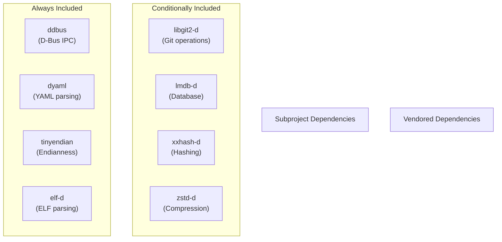
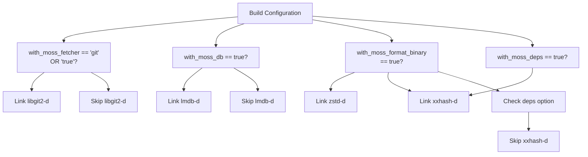
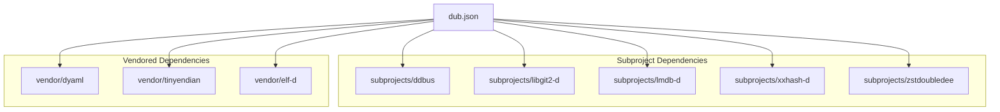
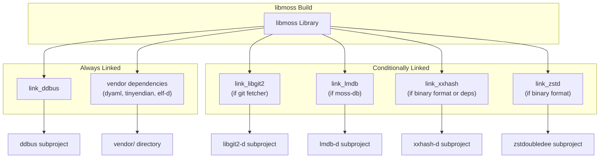

# D Language Dependencies

Relevant source files

* [dub.json](../dub.json)
* [meson.build](../meson.build)

## Purpose and Scope

This document details all D language package dependencies used by libmoss. These dependencies provide either pure D implementations of functionality or D bindings to underlying C libraries. For information about the underlying system libraries (libcurl, lmdb, etc.), see [System Library Dependencies](6.2-system-library-dependencies). For the distinction between vendored and subproject dependency management strategies, see [Vendored vs Subproject Dependencies](6.3-vendored-vs-subproject-dependencies).

The D language dependencies are declared in [dub.json14-39](../dub.json#L14-L39) and conditionally configured in the Meson build system based on enabled components. This page documents each dependency's purpose, when it is included, and which libmoss components require it.

---

## Dependency Overview

libmoss uses eight D language packages, which fall into three categories:

1. **Always-included dependencies**: Required for core functionality regardless of build configuration
2. **Conditionally-included dependencies**: Only linked when specific components are enabled
3. **Vendored vs. subproject dependencies**: Management strategy differs based on stability and maintenance needs

### Dependency Classification



**Sources**: [dub.json14-39](../dub.json#L14-L39) [meson.build54-95](../meson.build#L54-L95)

---

## Always-Included Dependencies

These dependencies are linked into libmoss regardless of which components are enabled via build options. They provide foundational functionality required by `moss-core` or are lightweight enough that conditional inclusion provides no benefit.

### ddbus

**Purpose**: Provides D bindings for D-Bus IPC (Inter-Process Communication)

**Location**: `subprojects/ddbus` (managed as Meson subproject)

**Configuration**:

* Declared in [dub.json21-23](../dub.json#L21-L23)
* Configured in [meson.build54-59](../meson.build#L54-L59) with `default_library=static`
* Always included via the `link_ddbus` dependency variable

**Usage**: Enables libmoss components to communicate with system services via D-Bus, particularly for system integration and service management functionality.

### dyaml

**Purpose**: Pure D YAML parser and emitter

**Location**: `vendor/dyaml` (vendored dependency)

**Configuration**:

* Declared in [dub.json15-17](../dub.json#L15-L17)
* Managed via `vendor/` directory Meson build in [meson.build98](../meson.build#L98-L98)
* Always included

**Usage**: Critical for the `moss-config` component's configuration file parsing. Even when `moss-config` is disabled, dyaml remains included as the overhead is minimal and it may be used by core functionality.

### tinyendian

**Purpose**: Provides endianness conversion utilities

**Location**: `vendor/tinyendian` (vendored dependency)

**Configuration**:

* Declared in [dub.json18-20](../dub.json#L18-L20)
* Managed via `vendor/` directory Meson build
* Always included

**Usage**: Handles byte order conversions for binary format processing, ensuring cross-platform compatibility when reading and writing binary data structures.

### elf-d

**Purpose**: Pure D library for parsing ELF (Executable and Linkable Format) files

**Location**: `vendor/elf-d` (vendored dependency)

**Configuration**:

* Declared in [dub.json33-35](../dub.json#L33-L35)
* Managed via `vendor/` directory Meson build
* Always included

**Usage**: Enables inspection of ELF binaries, used for dependency analysis, symbol resolution, and binary metadata extraction in package management operations.

**Sources**: [dub.json15-35](../dub.json#L15-L35) [meson.build54-98](../meson.build#L54-L98)

---

## Conditionally-Included Dependencies

These dependencies are only linked when specific libmoss components are enabled via build options. This reduces binary size and compilation time for consumers that don't require all functionality.

### Conditional Inclusion Logic



**Sources**: [meson.build62-95](../meson.build#L62-L95)

### libgit2-d

**Purpose**: D bindings for libgit2, enabling Git repository operations

**Location**: `subprojects/libgit2-d` (Meson subproject)

**Declaration**: [dub.json24-26](../dub.json#L24-L26)

**Configuration**: [meson.build62-68](../meson.build#L62-L68)

```
if with_moss_fetcher_git
    libgit2 = subproject('libgit2-d',
        default_options: [
            'default_library=static'
        ])
    link_libgit2 = libgit2.get_variable('link_libgit2')
endif
```

**Required By**: `moss-fetcher` component when Git fetcher support is enabled

**Build Options**: Included when `--with-fetcher=git` or `--with-fetcher=true`

### lmdb-d

**Purpose**: D bindings for LMDB (Lightning Memory-Mapped Database)

**Location**: `subprojects/lmdb-d` (Meson subproject)

**Declaration**: [dub.json27-29](../dub.json#L27-L29)

**Configuration**: [meson.build70-77](../meson.build#L70-L77)

```
if with_moss_db
    lmdb = subproject('lmdb-d',
        default_options: [
            'default_library=static'
        ])
    link_lmdb = lmdb.get_variable('link_liblmdb')
endif
```

**Required By**: `moss-db` component

**Build Options**: Included when `--with-db=true`

**Usage**: Provides high-performance embedded database functionality for storing package metadata, state information, and transaction logs.

### xxhash-d

**Purpose**: D bindings for xxHash, an extremely fast hashing algorithm

**Location**: `subprojects/xxhash-d` (Meson subproject)

**Declaration**: [dub.json30-32](../dub.json#L30-L32)

**Configuration**: [meson.build79-86](../meson.build#L79-L86)

```
if with_moss_format_binary or with_moss_deps
    xxhash = subproject('xxhash-d',
        default_options: [
            'default_library=static'
        ])
    link_xxhash = xxhash.get_variable('link_libxxhash')
endif
```

**Required By**:

* `moss-format` component (binary format only)
* `moss-deps` component

**Build Options**: Included when `--with-format=binary` or `--with-format=true` or `--with-deps=true`

**Usage**: Provides fast content hashing for package integrity verification and dependency tracking.

### zstd-d

**Purpose**: D bindings for Zstandard compression library

**Location**: `subprojects/zstdoubledee` (Meson subproject)

**Declaration**: [dub.json36-38](../dub.json#L36-L38) (note: path is `subprojects/zstdoubledee`)

**Configuration**: [meson.build88-95](../meson.build#L88-L95)

```
if with_moss_format_binary
    zstdoubledee = subproject('zstdoubledee',
        default_options: [
            'default_library=static'
        ])
    link_zstd = zstdoubledee.get_variable('link_libzstdoubledee')
endif
```

**Required By**: `moss-format` component (binary format only)

**Build Options**: Included when `--with-format=binary` or `--with-format=true`

**Usage**: Handles compression and decompression of binary package archives, providing excellent compression ratios with fast decompression speeds.

**Sources**: [dub.json24-38](../dub.json#L24-L38) [meson.build62-95](../meson.build#L62-L95)

---

## Component Dependency Matrix

The following table shows which D language dependencies are required by each libmoss component:

| Component | ddbus | dyaml | tinyendian | elf-d | libgit2-d | lmdb-d | xxhash-d | zstd-d |
| --- | --- | --- | --- | --- | --- | --- | --- | --- |
| **moss-core** | ✓ | ✓ | ✓ | ✓ | — | — | — | — |
| **moss-config** | ✓ | ✓ | ✓ | ✓ | — | — | — | — |
| **moss-db** | ✓ | ✓ | ✓ | ✓ | — | ✓ | — | — |
| **moss-deps** | ✓ | ✓ | ✓ | ✓ | — | — | ✓ | — |
| **moss-format (binary)** | ✓ | ✓ | ✓ | ✓ | — | — | ✓ | ✓ |
| **moss-format (source)** | ✓ | ✓ | ✓ | ✓ | — | — | — | — |
| **moss-fetcher (http)** | ✓ | ✓ | ✓ | ✓ | — | — | — | — |
| **moss-fetcher (git)** | ✓ | ✓ | ✓ | ✓ | ✓ | — | — | — |

**Legend**: ✓ = Always required, — = Not required

**Note**: All components inherit the always-included dependencies (ddbus, dyaml, tinyendian, elf-d) from moss-core.

**Sources**: [dub.json14-39](../dub.json#L14-L39) [meson.build14-95](../meson.build#L14-L95)

---

## Dependency Declaration and Configuration

### DUB Configuration

All D language dependencies are declared in the `dependencies` section of `dub.json`. Each dependency specifies a local path using the `path` property, indicating that these are not fetched from the DUB registry but are managed locally within the repository:



**Sources**: [dub.json14-39](../dub.json#L14-L39)

### Meson Subproject Integration

The Meson build system manages D language dependencies through its subproject mechanism. Each subproject is configured with `default_library=static` to ensure static linking and avoid runtime library dependencies:

**Subproject Loading Pattern**:

```
// Example from meson.build for ddbus
ddbus = subproject('ddbus',
    default_options: [
        'default_library=static'
    ])
link_ddbus = ddbus.get_variable('link_ddbus')
```

This pattern is repeated for all subproject dependencies, with conditional loading based on build options for the optional dependencies.

**Vendor Directory Handling**: The vendored dependencies (dyaml, tinyendian, elf-d) are managed through a consolidated Meson build file in the `vendor/` directory, invoked at [meson.build98](../meson.build#L98-L98) with `subdir('vendor')`.

**Sources**: [meson.build54-98](../meson.build#L54-L98)

---

## Dependency Linking Summary



The Meson build system obtains link dependencies through the `get_variable()` method on subproject objects, which returns the appropriate dependency object for linking. The vendor directory dependencies are handled through the consolidated vendor Meson build.

**Sources**: [meson.build54-98](../meson.build#L54-L98)