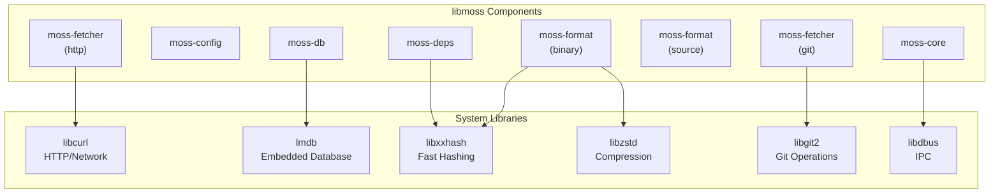
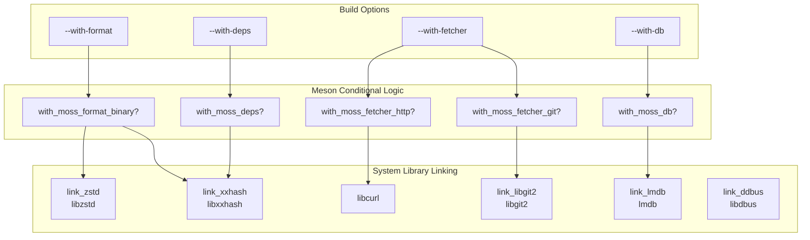
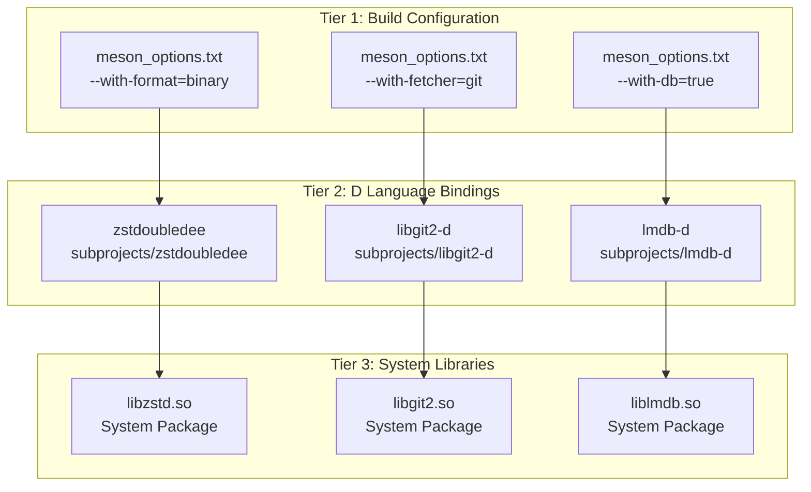

# System Library Dependencies

Relevant source files

* [.github/workflows/d.yml](../.github/workflows/d.yml)
* [dub.json](../dub.json)
* [meson.build](../meson.build)

## Purpose and Scope

This document explains the C system library dependencies required by libmoss. These are native libraries that provide high-performance implementations of networking, database, hashing, compression, version control, and inter-process communication functionality. Unlike the D language bindings documented in [D Language Dependencies](6.1-d-language-dependencies), these are external system libraries that must be installed on the build system and target deployment environment.

For information about vendored dependencies and subproject management, see [Vendored vs Subproject Dependencies](6.3-vendored-vs-subproject-dependencies).

## System Library Overview

libmoss requires six core system libraries, each serving a specific functional domain. The dependency on each library is conditional based on which libmoss components are enabled during the build process.



**Diagram: System Library Usage by Component**

Sources: [meson.build1-118](../meson.build#L1-L118) [dub.json40-45](../dub.json#L40-L45) [.github/workflows/d.yml24-25](../.github/workflows/d.yml#L24-L25)

### Dependency Matrix

| System Library | Purpose | Used By Components | Required Build Option | D Binding |
| --- | --- | --- | --- | --- |
| `libcurl` | HTTP networking | moss-fetcher (http) | `--with-fetcher=http` | Direct C linkage |
| `lmdb` | Embedded ACID database | moss-db | `--with-db` | lmdb-d |
| `libxxhash` | xxHash algorithm | moss-deps, moss-format (binary) | `--with-deps` or `--with-format=binary` | xxhash-d |
| `libzstd` | Zstandard compression | moss-format (binary) | `--with-format=binary` | zstd-d |
| `libgit2` | Git protocol operations | moss-fetcher (git) | `--with-fetcher=git` | libgit2-d |
| `libdbus` | D-Bus IPC | moss-core (always) | Always required | ddbus |

Sources: [dub.json40-45](../dub.json#L40-L45) [meson.build54-95](../meson.build#L54-L95) [.github/workflows/d.yml24-25](../.github/workflows/d.yml#L24-L25)

## Individual Library Documentation

### libcurl

**Library:** `libcurl` (libcurl4-openssl-dev on Debian/Ubuntu)

**Purpose:** Provides HTTP/HTTPS networking capabilities for downloading packages, metadata, and other remote resources. libcurl is a mature, feature-rich library supporting multiple protocols with SSL/TLS support.

**Usage in libmoss:** The moss-fetcher component uses libcurl for implementing HTTP-based fetching when the http fetcher backend is enabled. It is linked directly without a D language wrapper.

**Build Integration:**

* Declared in [dub.json40-44](../dub.json#L40-L44) as `"libcurl"` in the `libs` array
* Always linked when building with DUB
* Required when `with_moss_fetcher_http` is true in Meson builds
* Installed in CI via [.github/workflows/d.yml25](../.github/workflows/d.yml#L25-L25): `libcurl4-openssl-dev`

**Package Names:**

* Debian/Ubuntu: `libcurl4-openssl-dev`
* Fedora/RHEL: `libcurl-devel`
* Arch Linux: `curl`

Sources: [dub.json40-44](../dub.json#L40-L44) [.github/workflows/d.yml25](../.github/workflows/d.yml#L25-L25)

### lmdb

**Library:** `lmdb` (Lightning Memory-Mapped Database)

**Purpose:** Provides an ultra-fast, embedded, ACID-compliant key-value database engine using memory-mapped files. LMDB is particularly efficient for read-heavy workloads and supports MVCC (Multi-Version Concurrency Control).

**Usage in libmoss:** The moss-db component wraps lmdb to provide database functionality for package metadata, state management, and other persistent data storage needs. Access is mediated through the lmdb-d D binding.

**Build Integration:**

* Declared in [dub.json42](../dub.json#L42-L42) as `"lmdb"` in the `libs` array
* Conditionally linked via [meson.build71-77](../meson.build#L71-L77) when `with_moss_db` is true
* The lmdb-d subproject ([meson.build72-76](../meson.build#L72-L76)) provides D language bindings
* Installed in CI via [.github/workflows/d.yml25](../.github/workflows/d.yml#L25-L25): `liblmdb-dev`

**Code References:**

* Subproject dependency: [meson.build72-76](../meson.build#L72-L76)
* D binding path: [dub.json27-29](../dub.json#L27-L29) - `subprojects/lmdb-d`

**Package Names:**

* Debian/Ubuntu: `liblmdb-dev`
* Fedora/RHEL: `lmdb-devel`
* Arch Linux: `lmdb`

Sources: [dub.json27-42](../dub.json#L27-L42) [meson.build71-77](../meson.build#L71-L77) [.github/workflows/d.yml25](../.github/workflows/d.yml#L25-L25)

### libxxhash

**Library:** `libxxhash` (Extremely fast non-cryptographic hash)

**Purpose:** Implements the xxHash algorithm, which provides extremely fast hashing optimized for modern CPUs. Used for content identification, deduplication, and integrity verification where cryptographic security is not required.

**Usage in libmoss:** Both moss-deps and moss-format (binary) use libxxhash for efficient content hashing. The moss-deps component uses it for dependency tracking, while moss-format uses it for package content verification.

**Build Integration:**

* Declared in [dub.json43](../dub.json#L43-L43) as `"libxxhash"` in the `libs` array
* Conditionally linked via [meson.build80-86](../meson.build#L80-L86) when `with_moss_format_binary` or `with_moss_deps` is true
* The xxhash-d subproject ([meson.build81-85](../meson.build#L81-L85)) provides D language bindings
* Installed in CI via [.github/workflows/d.yml25](../.github/workflows/d.yml#L25-L25): `libxxhash-dev`

**Code References:**

* Subproject dependency: [meson.build81-85](../meson.build#L81-L85)
* D binding path: [dub.json30-32](../dub.json#L30-L32) - `subprojects/xxhash-d`
* Conditional logic: [meson.build80](../meson.build#L80-L80) - linked when binary format or deps enabled

**Package Names:**

* Debian/Ubuntu: `libxxhash-dev`
* Fedora/RHEL: `xxhash-devel`
* Arch Linux: `xxhash`

Sources: [dub.json30-43](../dub.json#L30-L43) [meson.build80-86](../meson.build#L80-L86) [.github/workflows/d.yml25](../.github/workflows/d.yml#L25-L25)

### libzstd

**Library:** `libzstd` (Zstandard compression)

**Purpose:** Provides fast, high-ratio compression developed by Facebook. Zstandard offers compression ratios comparable to zlib with significantly faster decompression speeds, making it ideal for package distribution.

**Usage in libmoss:** The moss-format component uses libzstd for compressing binary package formats. This enables efficient storage and transmission of package data while maintaining fast decompression during installation.

**Build Integration:**

* Declared in [dub.json44](../dub.json#L44-L44) as `"libzstd"` in the `libs` array
* Conditionally linked via [meson.build89-95](../meson.build#L89-L95) when `with_moss_format_binary` is true
* The zstdoubledee subproject ([meson.build90-94](../meson.build#L90-L94)) provides D language bindings
* Installed in CI via [.github/workflows/d.yml25](../.github/workflows/d.yml#L25-L25): `libzstd-dev`

**Code References:**

* Subproject dependency: [meson.build90-94](../meson.build#L90-L94) - `subprojects/zstdoubledee`
* D binding path: [dub.json36-38](../dub.json#L36-L38) - `subprojects/zstdoubledee`
* Conditional logic: [meson.build89](../meson.build#L89-L89) - linked only for binary format

**Package Names:**

* Debian/Ubuntu: `libzstd-dev`
* Fedora/RHEL: `libzstd-devel`
* Arch Linux: `zstd`

Sources: [dub.json36-44](../dub.json#L36-L44) [meson.build89-95](../meson.build#L89-L95) [.github/workflows/d.yml25](../.github/workflows/d.yml#L25-L25)

### libgit2

**Library:** `libgit2` (Git protocol implementation)

**Purpose:** Provides a portable, pure C implementation of the Git core methods. Enables programmatic interaction with Git repositories without spawning external processes.

**Usage in libmoss:** The moss-fetcher component uses libgit2 to implement Git-based fetching when the git fetcher backend is enabled. This allows direct cloning and fetching of source repositories.

**Build Integration:**

* Conditionally linked via [meson.build62-68](../meson.build#L62-L68) when `with_moss_fetcher_git` is true
* The libgit2-d subproject ([meson.build63-67](../meson.build#L63-L67)) provides D language bindings
* Installed in CI via [.github/workflows/d.yml25](../.github/workflows/d.yml#L25-L25): `libgit2-dev`
* **Not** listed in dub.json libs array (managed via subproject only)

**Code References:**

* Subproject dependency: [meson.build63-67](../meson.build#L63-L67)
* D binding path: [dub.json24-26](../dub.json#L24-L26) - `subprojects/libgit2-d`
* Conditional logic: [meson.build62](../meson.build#L62-L62) - linked only when git fetcher enabled

**Package Names:**

* Debian/Ubuntu: `libgit2-dev`
* Fedora/RHEL: `libgit2-devel`
* Arch Linux: `libgit2`

Sources: [dub.json24-26](../dub.json#L24-L26) [meson.build62-68](../meson.build#L62-L68) [.github/workflows/d.yml25](../.github/workflows/d.yml#L25-L25)

### libdbus

**Library:** `libdbus` (D-Bus message bus)

**Purpose:** Provides low-level access to the D-Bus inter-process communication system. D-Bus is a message bus system for application-to-application communication and system service interaction on Linux.

**Usage in libmoss:** The ddbus binding (which wraps libdbus) is always required by moss-core, enabling IPC functionality. This suggests libmoss components communicate with system services or other moss components via D-Bus.

**Build Integration:**

* Always linked via [meson.build55-59](../meson.build#L55-L59) - the ddbus subproject has no conditional wrapper
* Installed in CI via [.github/workflows/d.yml25](../.github/workflows/d.yml#L25-L25): `libdbus-1-dev`
* **Not** listed in dub.json libs array (managed via ddbus subproject)

**Code References:**

* Subproject dependency: [meson.build55-59](../meson.build#L55-L59)
* D binding path: [dub.json21-23](../dub.json#L21-L23) - `subprojects/ddbus`
* Unconditional requirement: [meson.build55](../meson.build#L55-L55) - no conditional logic

**Package Names:**

* Debian/Ubuntu: `libdbus-1-dev`
* Fedora/RHEL: `dbus-devel`
* Arch Linux: `dbus`

Sources: [dub.json21-23](../dub.json#L21-L23) [meson.build55-59](../meson.build#L55-L59) [.github/workflows/d.yml25](../.github/workflows/d.yml#L25-L25)

## Build System Integration

The build system manages system library dependencies through multiple configuration files, with different behavior between DUB and Meson build systems.



**Diagram: Conditional Library Linking Based on Build Options**

Sources: [meson.build14-95](../meson.build#L14-L95)

### DUB Configuration

In [dub.json40-45](../dub.json#L40-L45) four system libraries are unconditionally declared in the `libs` array:

```
"libs": [
    "libcurl",
    "lmdb",
    "libxxhash",
    "libzstd"
]
```

This means when building with DUB alone, all four libraries are always linked. The DUB build system does not support conditional library linking based on feature flags. Libraries `libgit2` and `libdbus` are not listed here because they are managed through their respective D binding subprojects.

Sources: [dub.json40-45](../dub.json#L40-L45)

### Meson Configuration

The Meson build system provides fine-grained control over which system libraries are linked based on enabled components:

**Conditional Library Resolution:**

| Build Option | Meson Variable | Linked Libraries | Code Reference |
| --- | --- | --- | --- |
| `--with-db=true` | `with_moss_db` | lmdb | [meson.build71-77](../meson.build#L71-L77) |
| `--with-format=binary` | `with_moss_format_binary` | libxxhash, libzstd | [meson.build80-95](../meson.build#L80-L95) |
| `--with-deps=true` | `with_moss_deps` | libxxhash | [meson.build80-86](../meson.build#L80-L86) |
| `--with-fetcher=http` | `with_moss_fetcher_http` | libcurl | Implicit |
| `--with-fetcher=git` | `with_moss_fetcher_git` | libgit2 | [meson.build62-68](../meson.build#L62-L68) |
| Always enabled | N/A | libdbus (via ddbus) | [meson.build55-59](../meson.build#L55-L59) |

Sources: [meson.build14-95](../meson.build#L14-L95)

### CI Environment Setup

The GitHub Actions workflow demonstrates the complete set of system library dependencies required for a full build. The installation command in [.github/workflows/d.yml24-25](../.github/workflows/d.yml#L24-L25) installs all six libraries:

```
sudo apt-get install libcurl4-openssl-dev liblmdb-dev libxxhash-dev \
                     libzstd-dev libgit2-dev libdbus-1-dev
```

This ensures all optional components can be built and tested in the continuous integration environment.

Sources: [.github/workflows/d.yml24-25](../.github/workflows/d.yml#L24-L25)

## Dependency Resolution Pattern

The relationship between build options, D bindings, and system libraries follows a consistent three-tier pattern:



**Diagram: Three-Tier Dependency Resolution**

This pattern ensures:

1. **Build-time flexibility**: Components can be enabled/disabled without code changes
2. **Type-safe bindings**: D language wrappers provide memory safety and idiomatic APIs
3. **Performance**: Native C libraries provide optimized implementations
4. **Maintainability**: D bindings are managed as separate subprojects

Sources: [meson.build62-95](../meson.build#L62-L95) [dub.json24-38](../dub.json#L24-L38)

## Version Requirements

The system libraries must meet minimum version requirements, though these are not explicitly specified in the build files. The CI environment uses Ubuntu's latest LTS release packages ([.github/workflows/d.yml12](../.github/workflows/d.yml#L12-L12) specifies `ubuntu-latest`), which provides:

* libcurl: 7.x or later
* lmdb: 0.9.x or later
* libxxhash: 0.8.x or later
* libzstd: 1.4.x or later
* libgit2: 1.1.x or later
* libdbus: 1.12.x or later

These versions are known to work with libmoss. Older versions may have compatibility issues with the D bindings.

Sources: [.github/workflows/d.yml12-25](../.github/workflows/d.yml#L12-L25)