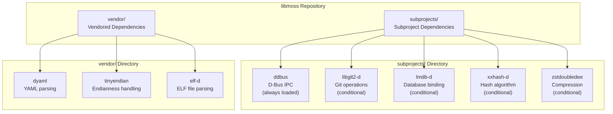
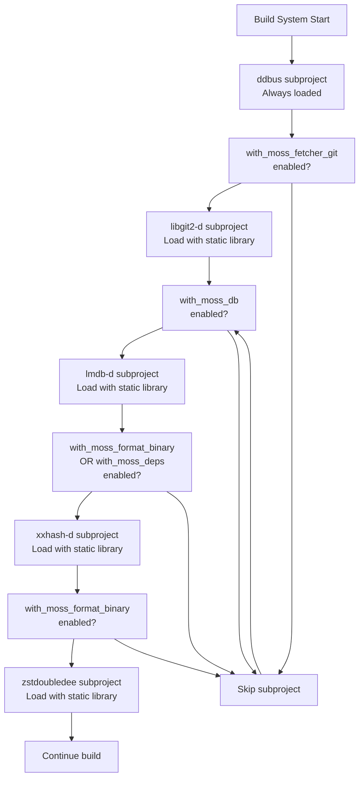
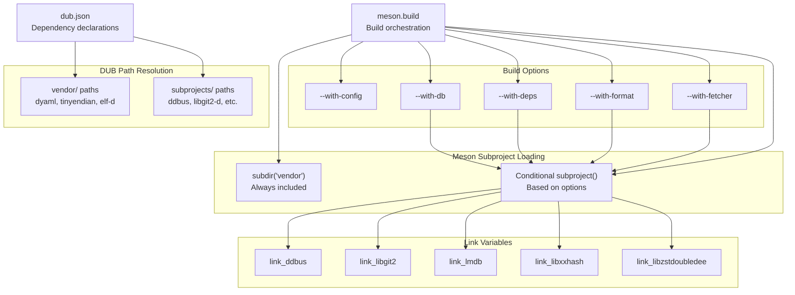

# Vendored vs Subproject Dependencies

Relevant source files

* [.gitattributes](../.gitattributes)
* [dub.json](../dub.json)
* [meson.build](../meson.build)

## Purpose and Scope

This document explains the distinction between vendored dependencies and subproject dependencies in libmoss, how each type is managed, and how they integrate with the build system. It covers the directory structure, dependency classification, and conditional loading strategies.

For information about the actual dependencies themselves and their purposes, see [D Language Dependencies](6.1-d-language-dependencies) and [System Library Dependencies](6.2-system-library-dependencies).

## Dependency Directory Structure

libmoss organizes its D language dependencies into two distinct directories based on their management strategy:

| Directory | Management Strategy | Dependencies |
| --- | --- | --- |
| `vendor/` | Vendored (copied into repository) | dyaml, tinyendian, elf-d |
| `subprojects/` | Meson subprojects (separate builds) | ddbus, libgit2-d, lmdb-d, xxhash-d, zstdoubledee |

Both directories are marked as linguist-vendored in [.gitattributes1-2](../.gitattributes#L1-L2) to exclude them from language statistics on GitHub.

**Sources:** [.gitattributes1-2](../.gitattributes#L1-L2) [dub.json14-39](../dub.json#L14-L39)

## Dependency Classification Diagram



**Sources:** [dub.json14-39](../dub.json#L14-L39) [meson.build54-95](../meson.build#L54-L95)

## Vendored Dependencies

### Definition

Vendored dependencies are third-party libraries that are copied directly into the repository's `vendor/` directory. These dependencies are committed to version control as part of the libmoss source tree.

### Vendored Dependency List

The following dependencies are vendored in libmoss:

| Dependency | Path | Purpose |
| --- | --- | --- |
| dyaml | `vendor/dyaml` | YAML parsing and serialization |
| tinyendian | `vendor/tinyendian` | Endianness conversion utilities |
| elf-d | `vendor/elf-d` | ELF binary file format parsing |

### DUB Configuration

In DUB, vendored dependencies are declared with local path references in [dub.json15-20](../dub.json#L15-L20) and [dub.json33-35](../dub.json#L33-L35):

```
"dyaml": {
    "path": "vendor/dyaml"
},
"tinyendian": {
    "path": "vendor/tinyendian"
},
"elf-d": {
    "path": "vendor/elf-d"
}
```

### Meson Configuration

Vendored dependencies are built through their own `meson.build` files within the `vendor/` directory. The main build file includes them via [meson.build98](../meson.build#L98-L98):

```
subdir('vendor')
```

The vendored dependencies are always included regardless of build options because they provide core functionality.

**Sources:** [dub.json15-20](../dub.json#L15-L20) [dub.json33-35](../dub.json#L33-L35) [meson.build98](../meson.build#L98-L98)

## Subproject Dependencies

### Definition

Subproject dependencies are third-party libraries managed through Meson's subproject system. Located in the `subprojects/` directory, each subproject is built independently with its own build configuration and can be conditionally loaded based on feature flags.

### Subproject Dependency List

The following dependencies are managed as subprojects:

| Subproject | Path | Conditional | Load Condition |
| --- | --- | --- | --- |
| ddbus | `subprojects/ddbus` | No | Always loaded |
| libgit2-d | `subprojects/libgit2-d` | Yes | `with-fetcher=git` or `with-fetcher=true` |
| lmdb-d | `subprojects/lmdb-d` | Yes | `with-db=true` |
| xxhash-d | `subprojects/xxhash-d` | Yes | `with-format=binary` or `with-deps=true` |
| zstdoubledee | `subprojects/zstdoubledee` | Yes | `with-format=binary` |

### DUB Configuration

In DUB, subprojects are declared similarly to vendored dependencies but point to the `subprojects/` directory in [dub.json21-38](../dub.json#L21-L38):

```
"ddbus": {
    "path": "subprojects/ddbus"
},
"libgit2-d": {
    "path": "subprojects/libgit2-d"
},
"lmdb-d": {
    "path": "subprojects/lmdb-d"
},
"xxhash-d": {
    "path": "subprojects/xxhash-d"
},
"zstd-d": {
    "path": "subprojects/zstdoubledee"
}
```

### Meson Subproject Loading

Meson loads subprojects conditionally based on build configuration. Each subproject is configured with `default_library=static` to produce static libraries.

**Sources:** [dub.json21-38](../dub.json#L21-L38) [meson.build54-95](../meson.build#L54-L95)

## Conditional Subproject Loading



**Sources:** [meson.build54-95](../meson.build#L54-L95)

## Subproject Loading Implementation

### ddbus - Always Loaded

The `ddbus` subproject provides D-Bus IPC functionality and is always loaded in [meson.build54-59](../meson.build#L54-L59):

```
# ddbus binding
ddbus = subproject('ddbus',
    default_options: [
        'default_library=static'
    ])
link_ddbus = ddbus.get_variable('link_ddbus')
```

### libgit2-d - Git Fetcher Conditional

The `libgit2-d` subproject is only loaded when Git fetcher support is enabled in [meson.build61-68](../meson.build#L61-L68):

```
# libgit2 binding
if with_moss_fetcher_git
    libgit2 = subproject('libgit2-d',
        default_options: [
            'default_library=static'
        ])
    link_libgit2 = libgit2.get_variable('link_libgit2')
endif
```

### lmdb-d - Database Conditional

The `lmdb-d` subproject is only loaded when the database component is enabled in [meson.build70-77](../meson.build#L70-L77):

```
# lmdb binding
if with_moss_db
    lmdb = subproject('lmdb-d',
        default_options: [
            'default_library=static'
        ])
    link_lmdb = lmdb.get_variable('link_liblmdb')
endif
```

### xxhash-d - Format or Deps Conditional

The `xxhash-d` subproject is loaded when either binary format support or dependency management is enabled in [meson.build79-86](../meson.build#L79-L86):

```
# xxhash binding
if with_moss_format_binary or with_moss_deps
    xxhash = subproject('xxhash-d',
        default_options: [
            'default_library=static'
        ])
    link_xxhash = xxhash.get_variable('link_libxxhash')
endif
```

### zstdoubledee - Binary Format Conditional

The `zstdoubledee` subproject is only loaded when binary format support is enabled in [meson.build88-95](../meson.build#L88-L95):

```
# zstd binding
if with_moss_format_binary
    zstdoubledee = subproject('zstdoubledee',
        default_options: [
            'default_library=static'
        ])
    link_zstd = zstdoubledee.get_variable('link_libzstdoubledee')
endif
```

**Sources:** [meson.build54-95](../meson.build#L54-L95)

## Build System Integration



**Sources:** [dub.json14-39](../dub.json#L14-L39) [meson.build54-98](../meson.build#L54-L98)

## Management Strategies

### When to Vendor Dependencies

Dependencies are vendored in the `vendor/` directory when they meet these criteria:

1. **Stability**: The dependency has a stable API that rarely changes
2. **Core Functionality**: Required for fundamental library operations regardless of build options
3. **Pure D Code**: Pure D libraries without complex build requirements

Examples:

* `dyaml`: Stable YAML parser used by moss-config
* `tinyendian`: Small utility library with minimal maintenance burden
* `elf-d`: ELF parsing library with stable interface

### When to Use Subprojects

Dependencies are managed as subprojects in the `subprojects/` directory when they meet these criteria:

1. **Optional Features**: Only needed when specific components are enabled
2. **C Library Bindings**: Wrap external C libraries and require coordinated building
3. **Active Development**: May receive updates that benefit from independent versioning
4. **Build Complexity**: Have their own build systems that integrate via Meson subprojects

Examples:

* `libgit2-d`: Only needed for Git fetcher, wraps libgit2
* `lmdb-d`: Only needed for database component, wraps LMDB
* `zstdoubledee`: Only needed for binary format compression, wraps zstd

**Sources:** [dub.json14-39](../dub.json#L14-L39) [meson.build54-95](../meson.build#L54-L95)

## Static Library Generation

All subprojects are configured to produce static libraries through the `default_library=static` option. This ensures:

1. **Self-contained Builds**: libmoss can be built without system-installed versions of D bindings
2. **Version Control**: Exact versions of dependencies are used regardless of system state
3. **Simplified Distribution**: No runtime dependency on shared D binding libraries

The static library configuration is specified in every subproject call, as seen in [meson.build56-57](../meson.build#L56-L57):

```
default_options: [
    'default_library=static'
]
```

Each subproject exposes a link variable (e.g., `link_ddbus`, `link_libgit2`) that is retrieved using `get_variable()` and later used in the source directory build configuration.

**Sources:** [meson.build54-95](../meson.build#L54-L95)

## Summary Table

| Aspect | Vendored Dependencies | Subproject Dependencies |
| --- | --- | --- |
| **Location** | `vendor/` | `subprojects/` |
| **Examples** | dyaml, tinyendian, elf-d | ddbus, libgit2-d, lmdb-d, xxhash-d, zstdoubledee |
| **Loading** | Always included | Conditionally loaded based on build options |
| **Management** | Copied into repository | Meson subproject system |
| **Build Type** | Integrated via `subdir('vendor')` | Static libraries via `subproject()` |
| **Use Case** | Core utilities, stable APIs | Optional features, C library bindings |
| **Update Strategy** | Manual copy and commit | Independent subproject versioning |

**Sources:** [dub.json14-39](../dub.json#L14-L39) [meson.build54-98](../meson.build#L54-L98) [.gitattributes1-2](../.gitattributes#L1-L2)