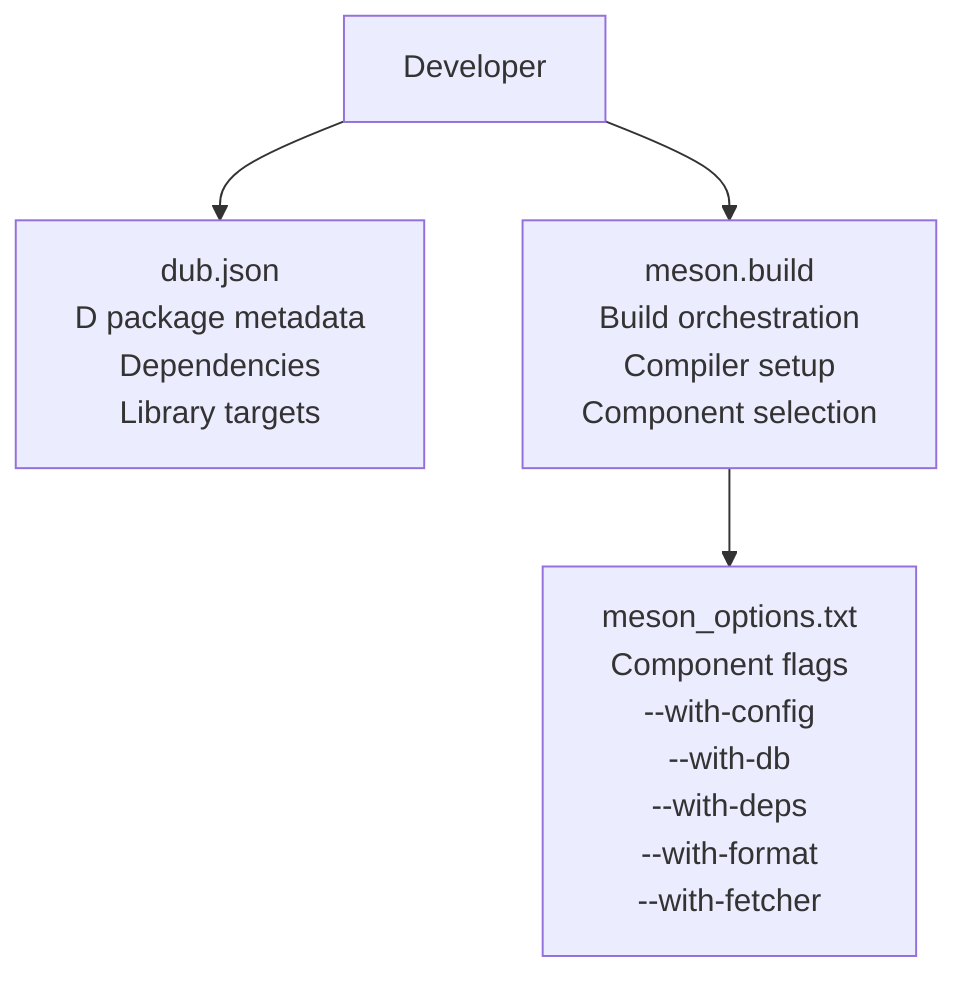
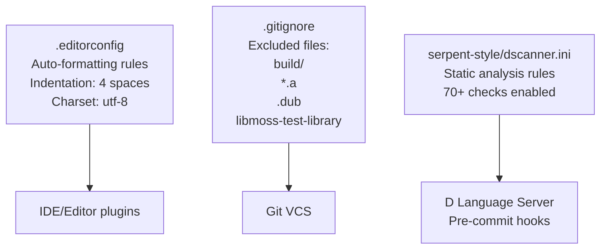
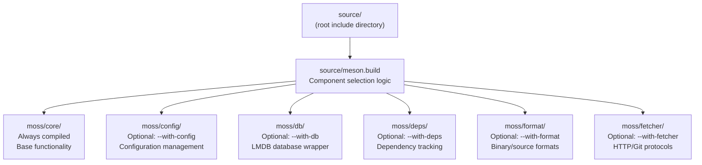
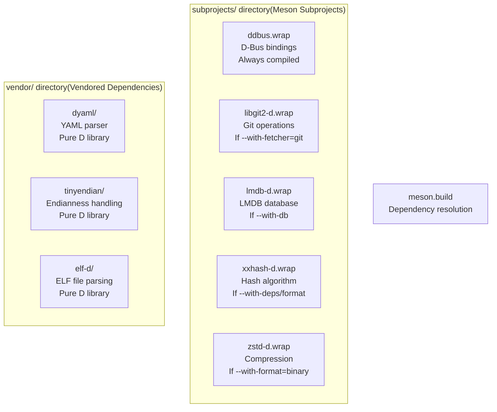
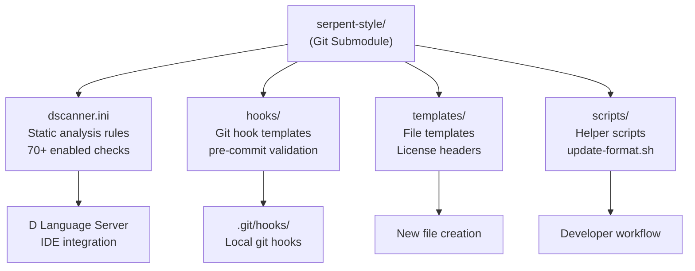
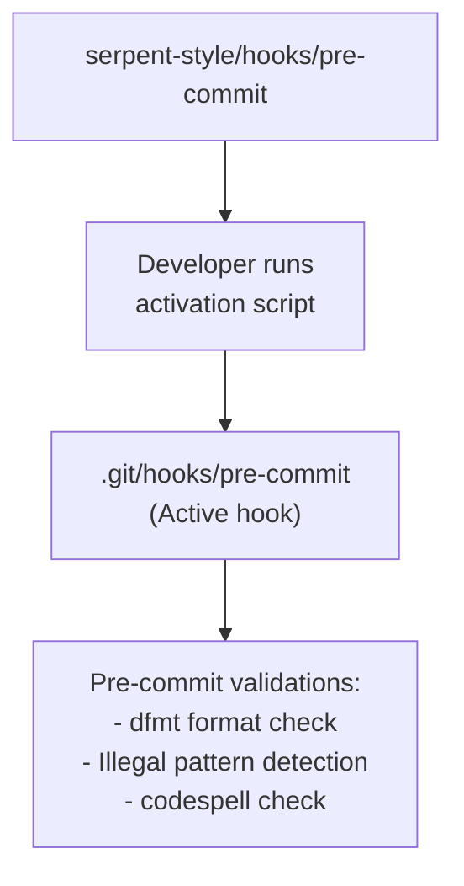
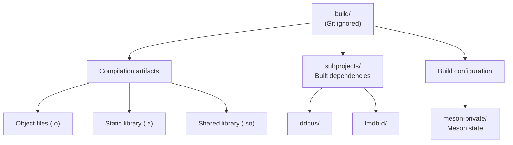
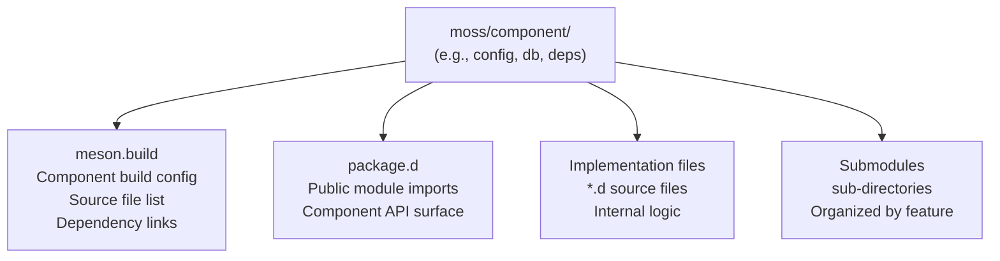

# Project Structure

Relevant source files

* [.gitignore](../.gitignore)
* [README.md](../README.md)
* [source/meson.build](../source/meson.build)

This document describes the physical organization of the libmoss repository, including the directory layout, key configuration files, and how different subsystems are organized on disk. For detailed information about the source code organization within components, see [Source Directory Organization](7.1-source-directory-organization). For information about the serpent-style subsystem and its role in code quality enforcement, see [serpent-style Subsystem](7.2-serpent-style-subsystem).

## Repository Overview

The libmoss repository follows a structured layout that separates core functionality, build configuration, development tooling, and external dependencies into distinct directories. The repository is designed to support multiple build systems (DUB and Meson) while maintaining a modular architecture that allows selective component compilation.

### Top-Level Directory Structure

```mermaid
flowchart TD

ROOT["libmoss/ (repository root)"]
SOURCE["source/<br>Main source code"]
SERPENT["serpent-style/<br>Code style enforcement<br>(git submodule)"]
VENDOR["vendor/<br>Vendored dependencies"]
SUBPROJECTS["subprojects/<br>Meson subprojects"]
BUILD["build/<br>Build artifacts<br>(ignored)"]
DUB["dub.json<br>DUB configuration"]
MESON["meson.build<br>Meson build root"]
MESON_OPT["meson_options.txt<br>Build options"]
EDITOR[".editorconfig<br>Editor formatting"]
GITIGNORE[".gitignore<br>Git ignore rules"]
README["README.md<br>Project documentation"]
LICENSE["LICENSE<br>Zlib license"]

ROOT --> SOURCE
ROOT --> SERPENT
ROOT --> VENDOR
ROOT --> SUBPROJECTS
ROOT --> BUILD
ROOT --> DUB
ROOT --> MESON
ROOT --> MESON_OPT
ROOT --> EDITOR
ROOT --> GITIGNORE
ROOT --> README
ROOT --> LICENSE
```



**Sources:** [.gitignore1-4](../.gitignore#L1-L4) [README.md1-9](../README.md#L1-L9)

The repository root contains four primary categories of content:

| Category | Directories | Purpose |
| --- | --- | --- |
| **Source Code** | `source/` | All D language source code for libmoss components |
| **Build Configuration** | `dub.json`, `meson.build`, `meson_options.txt` | Dual build system configuration files |
| **Dependencies** | `vendor/`, `subprojects/` | External code dependencies (vendored and subprojects) |
| **Development Tools** | `serpent-style/` | Code quality enforcement infrastructure |
| **Build Artifacts** | `build/` | Generated build outputs (git-ignored) |

**Sources:** [.gitignore1-4](../.gitignore#L1-L4)

## Key Configuration Files

### Build System Entry Points

The repository maintains configuration files for both DUB and Meson build systems at the root level:



**Sources:** High-level architecture diagrams (Diagram 4: Build System Configuration Flow)

| File | Purpose | Primary Responsibility |
| --- | --- | --- |
| `dub.json` | DUB package configuration | Defines package metadata, D dependencies, and library targets |
| `meson.build` | Meson build root | Orchestrates compilation, manages subprojects, enforces compiler requirements |
| `meson_options.txt` | Build-time options | Declares boolean flags for selective component compilation |

For detailed information on how these files coordinate the build process, see [Build System Architecture](2.1-build-system-architecture).

### Development Configuration Files



**Sources:** [.gitignore1-4](../.gitignore#L1-L4)

The `.gitignore` file explicitly excludes build artifacts and temporary files from version control:

* `build/` - Meson build directory containing compiled objects and libraries
* `*.a` - Static library archives generated during compilation
* `.dub` - DUB package cache directory
* `libmoss-test-library` - Test executable artifact

**Sources:** [.gitignore1-4](../.gitignore#L1-L4)

For comprehensive documentation of `.editorconfig` and `dscanner.ini` rules, see [Code Style Standards](5.1-code-style-standards) and [Static Analysis with D-Scanner](5.2-static-analysis-with-d-scanner).

## Source Code Directory Layout

The `source/` directory contains all D language source code, organized by component. The Meson build system iterates through enabled components to compile them selectively:



**Sources:** [source/meson.build1-39](../source/meson.build#L1-L39)

### Component Selection Logic

The `source/meson.build` file implements the component selection logic that determines which parts of the library are compiled:

[source/meson.build11-32](../source/meson.build#L11-L32) defines the conditional component inclusion:

* Line 12: `moss-core` is always included in the `components` array
* Lines 14-16: `moss-config` is added if `with_moss_config` option is enabled
* Lines 18-20: `moss-db` is added if `with_moss_db` option is enabled
* Lines 22-24: `moss-deps` is added if `with_moss_deps` option is enabled
* Lines 26-28: `moss-fetcher` is added if either HTTP or Git fetcher is enabled
* Lines 30-32: `moss-format` is added if either binary or source format is enabled

**Sources:** [source/meson.build11-32](../source/meson.build#L11-L32)

The iteration through components occurs at [source/meson.build37-39](../source/meson.build#L37-L39):

```
foreach component : components
    subdir('moss' / component)
endforeach
```

This loop enters each enabled component's subdirectory and processes its respective `meson.build` file.

**Sources:** [source/meson.build37-39](../source/meson.build#L37-L39)

### Include Directory Setup

The `source/` directory serves as the root include directory for D import statements at [source/meson.build35](../source/meson.build#L35-L35):

```
root_includedir = include_directories('.')
```

This allows D source files to use import statements like `import moss.core.util;` which map directly to the file path `source/moss/core/util.d`.

**Sources:** [source/meson.build35](../source/meson.build#L35-L35)

For detailed documentation of what each component directory contains and its public API, see [Library Components](3-library-components).

## Dependency Management Structure

The libmoss repository manages external dependencies through two distinct mechanisms, each stored in separate directories:



### Vendored Dependencies

The `vendor/` directory contains complete source code copies of selected D libraries. These are directly included in the libmoss source tree:

| Library | Location | Purpose | Compilation |
| --- | --- | --- | --- |
| `dyaml` | `vendor/dyaml/` | YAML parsing for configuration files | Always compiled |
| `tinyendian` | `vendor/tinyendian/` | Cross-platform endianness conversion | Always compiled |
| `elf-d` | `vendor/elf-d/` | ELF binary format parsing | Compiled with format component |

Vendored dependencies are typically pure D libraries with stable APIs that are unlikely to require frequent updates.

### Meson Subprojects

The `subprojects/` directory contains `.wrap` files that instruct Meson to download and build external dependencies:

| Subproject | Wrap File | Underlying Library | Conditional Compilation |
| --- | --- | --- | --- |
| `ddbus` | `subprojects/ddbus.wrap` | D-Bus IPC library | Always required |
| `libgit2-d` | `subprojects/libgit2-d.wrap` | D bindings to libgit2 | Only if Git fetcher enabled |
| `lmdb-d` | `subprojects/lmdb-d.wrap` | D bindings to LMDB | Only if database component enabled |
| `xxhash-d` | `subprojects/xxhash-d.wrap` | D bindings to xxHash | If deps or format component enabled |
| `zstd-d` | `subprojects/zstd-d.wrap` | D bindings to zstd | If binary format enabled |

Meson automatically downloads these subprojects during the build configuration phase and compiles them as needed based on enabled build options.

For comprehensive documentation of all external dependencies and their purposes, see [External Dependencies](6-external-dependencies).

## Development Infrastructure

### serpent-style Subsystem

The `serpent-style/` directory is a git submodule containing shared code quality enforcement tools and configuration files:



The `serpent-style/` submodule is shared across multiple Serpent OS projects to ensure consistent code quality standards. It contains:

* **`dscanner.ini`**: Configuration for the D-Scanner static analysis tool with over 70 checks enabled
* **`hooks/`**: Git hook scripts for pre-commit validation (format checking, pattern detection, spell checking)
* **`templates/`**: Standard file headers for D, Python, shell, and YAML files with proper licensing
* **`scripts/`**: Utility scripts like `update-format.sh` for batch code formatting

For detailed documentation of the serpent-style infrastructure, see [serpent-style Subsystem](7.2-serpent-style-subsystem).

### Git Hooks Directory

The `.git/hooks/` directory (not tracked in version control) contains active git hooks that are installed from the `serpent-style/hooks/` templates:



When a developer activates the git hooks, the pre-commit script from `serpent-style/hooks/` is copied to `.git/hooks/pre-commit`. This script executes three validation checks before allowing a commit:

1. **Format Validation**: Runs `dfmt` to verify code formatting compliance
2. **Pattern Detection**: Scans for forbidden patterns like runtime format strings
3. **Spell Checking**: Runs `codespell` to detect common spelling errors

For detailed documentation of the git hook activation process and validation checks, see [Git Hooks and Pre-commit Checks](5.3-git-hooks-and-pre-commit-checks).

## Build Output Structure

The `build/` directory (excluded from version control via `.gitignore`) contains all generated build artifacts when using Meson:



**Sources:** [.gitignore1](../.gitignore#L1-L1)

The `.gitignore` file excludes the entire `build/` directory at [.gitignore1](../.gitignore#L1-L1) to prevent build artifacts from being committed to version control.

Typical contents of the `build/` directory include:

* **Object Files**: Compiled `.o` files for each D source file in enabled components
* **Library Archives**: Static library files (`.a` format) excluded at [.gitignore2](../.gitignore#L2-L2)
* **Shared Libraries**: Shared object files (`.so` format) for dynamic linking
* **Subproject Builds**: Compiled outputs from Meson subprojects in `build/subprojects/`
* **Meson State**: Build configuration and dependency tracking in `build/meson-private/`

**Sources:** [.gitignore1-2](../.gitignore#L1-L2)

The DUB build system uses a different structure, storing artifacts in the `.dub/` directory, which is also excluded from version control at [.gitignore3](../.gitignore#L3-L3)

**Sources:** [.gitignore3](../.gitignore#L3-L3)

## Component-Specific Directory Structure

Each component under `source/moss/` follows a consistent internal organization pattern:



Each component directory contains:

1. **`meson.build`**: Component-specific build configuration declaring source files and dependencies
2. **`package.d`**: Public module that re-exports the component's public API
3. **Implementation Files**: D source files (`.d` extension) implementing component functionality
4. **Submodules**: Subdirectories for organizing related functionality within the component

For example, the `moss-config` component is structured as:

* `moss/config/meson.build` - Build configuration for the config component
* `moss/config/package.d` - Re-exports public configuration types and functions
* `moss/config/io/` - Submodule for configuration I/O operations
* `moss/config/schema/` - Submodule for YAML schema validation

For detailed documentation of each component's internal structure and API, see the component-specific sections under [Library Components](3-library-components).

## File Naming Conventions

The libmoss repository follows D language conventions for file naming and organization:

| File Type | Naming Pattern | Example | Purpose |
| --- | --- | --- | --- |
| D Source Files | `lowercase_snake.d` | `source/moss/core/util.d` | Implementation files |
| Package Files | `package.d` | `source/moss/config/package.d` | Module aggregation |
| Build Files | `meson.build` | `source/meson.build` | Build configuration |
| Configuration | `lowercase.ext` | `dub.json`, `.editorconfig` | Tool configuration |
| Documentation | `UPPERCASE.md` | `README.md`, `LICENSE` | Project documentation |

D source files use `snake_case` naming when multiple words are needed, though single-word names are preferred. The special filename `package.d` indicates a package module that aggregates and re-exports other modules in the same directory.

## Repository Metadata Files

The repository root contains several metadata and documentation files:

| File | Purpose | Key Information |
| --- | --- | --- |
| `README.md` | Project overview | Project status, brief description |
| `LICENSE` | Legal terms | Zlib license text |
| `CODEOWNERS` | Review assignments | Maintainer list for pull request reviews |
| `.gitignore` | VCS exclusions | Build artifacts, temporary files |
| `.editorconfig` | Editor settings | Indentation, charset, line endings |

**Sources:** [README.md1-9](../README.md#L1-L9)

The `README.md` file notably indicates at [README.md1](../README.md#L1-L1) that "This project is no longer active", providing important context about the project's maintenance status.

**Sources:** [README.md1](../README.md#L1-L1)

For detailed documentation of licensing terms, see [License Terms](8.1-license-terms). For information about the code review process and maintainer assignments, see [Code Ownership](8.2-code-ownership).