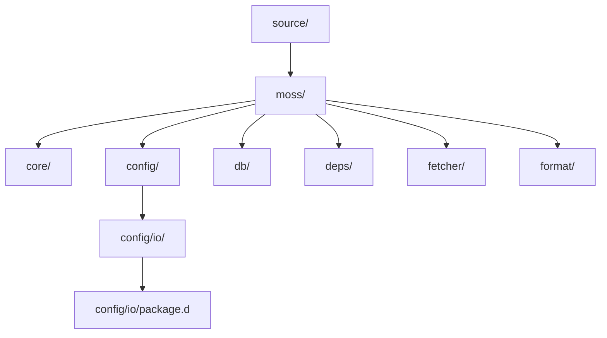
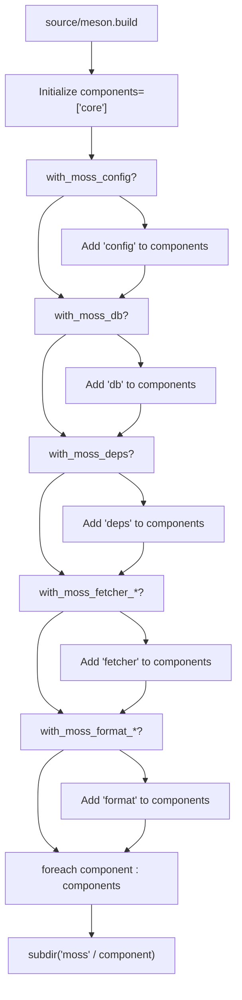
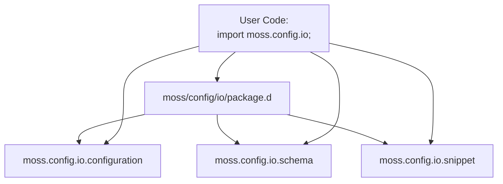
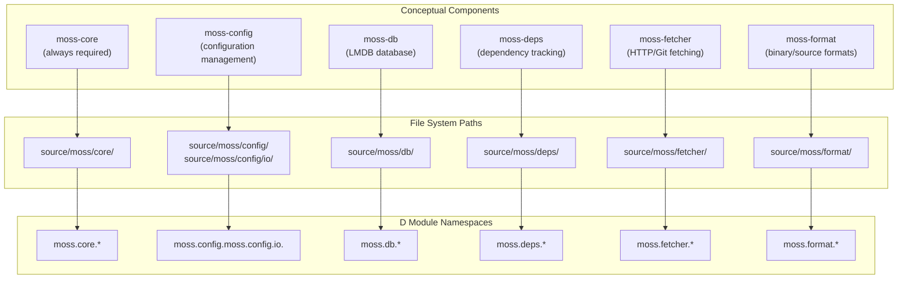
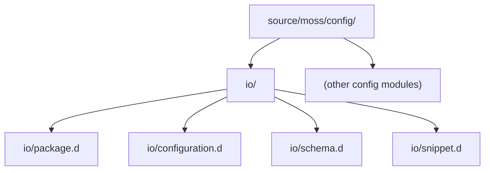
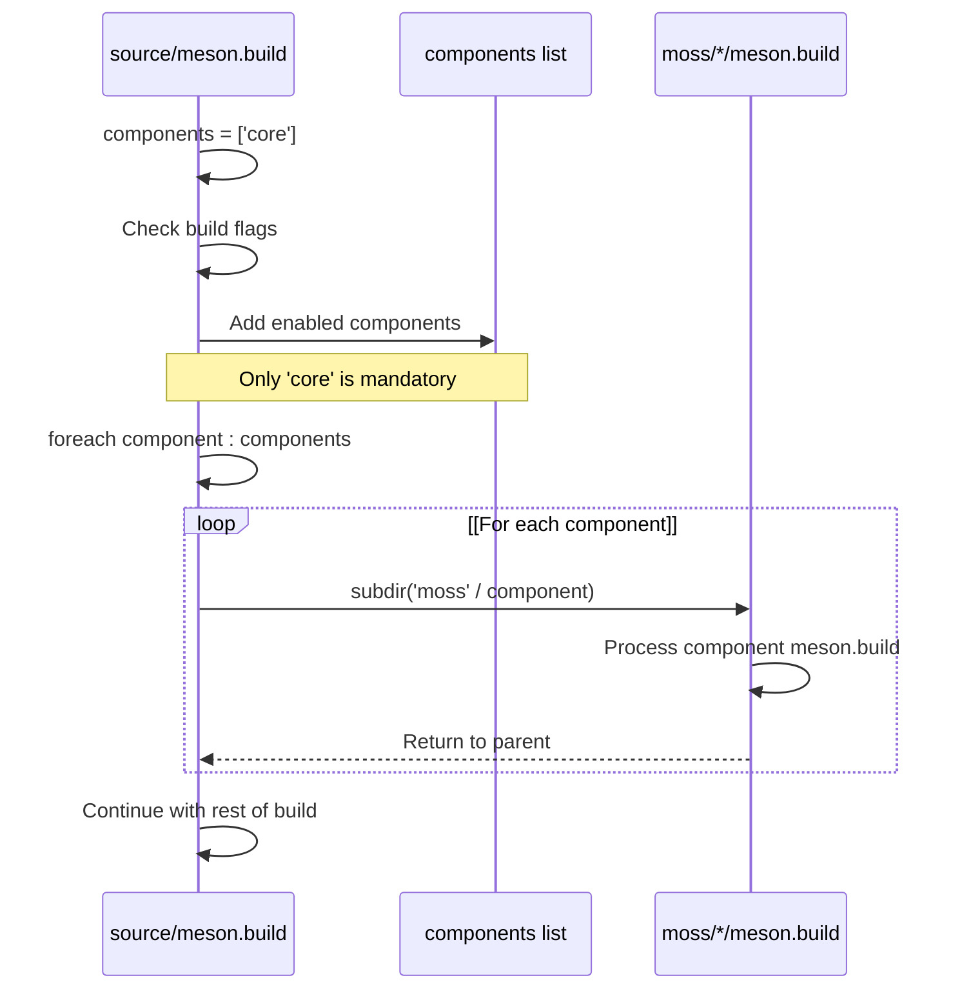

# Source Directory Organization

Relevant source files

* [source/meson.build](../source/meson.build)
* [source/moss/config/io/package.d](../source/moss/config/io/package.d)

## Purpose and Scope

This page documents the organization of source code within the `source/` directory of the libmoss repository. It explains how the modular component architecture (introduced in [Library Components](3-library-components)) is reflected in the directory structure, how D modules are organized using `package.d` files, and how the build system selectively includes components based on configuration flags.

For information about the build configuration that controls which components are included, see [Component Selection](2.2-component-selection). For details about the broader project structure beyond the source directory, see [Project Structure](7-project-structure).

---

## Directory Hierarchy

The source code follows a strict hierarchical organization where all D source files reside under the `source/` directory, which serves as the root include path for the D compiler.

**Directory Structure Overview**

Sources: [source/meson.build1-40](../source/meson.build#L1-L40)

The `source/` directory is configured as the root include directory [source/meson.build35](../source/meson.build#L35-L35) meaning all D module paths start from this point. All library code resides under the `moss/` namespace, with each component occupying its own subdirectory.

---

## Component-to-Directory Mapping

Each of the six libmoss components corresponds to a specific subdirectory under `source/moss/`. The build system uses these directory names to locate and compile component source files.

| Component | Directory Path | Module Namespace | Build Flag |
| --- | --- | --- | --- |
| moss-core | `source/moss/core/` | `moss.core.*` | Always included |
| moss-config | `source/moss/config/` | `moss.config.*` | `with_moss_config` |
| moss-db | `source/moss/db/` | `moss.db.*` | `with_moss_db` |
| moss-deps | `source/moss/deps/` | `moss.deps.*` | `with_moss_deps` |
| moss-fetcher | `source/moss/fetcher/` | `moss.fetcher.*` | `with_moss_fetcher_http` or `with_moss_fetcher_git` |
| moss-format | `source/moss/format/` | `moss.format.*` | `with_moss_format_binary` or `with_moss_format_source` |

**Build System Component Selection**

Sources: [source/meson.build2-39](../source/meson.build#L2-L39)

The build system starts with only `moss-core` in the components list [source/meson.build12](../source/meson.build#L12-L12) and conditionally adds other components based on build options [source/meson.build14-32](../source/meson.build#L14-L32) For each enabled component, the build system processes the corresponding subdirectory using `subdir('moss' / component)` [source/meson.build38](../source/meson.build#L38-L38)

---

## Module Namespace Organization

Within each component directory, D modules are organized using `package.d` files to provide clean namespace imports. This pattern allows consumers to import entire subsystems with a single import statement.

**Package.d Pattern**

Sources: [source/moss/config/io/package.d1-20](../source/moss/config/io/package.d#L1-L20)

The `package.d` file serves as a module aggregator. For example, in `moss.config.io`, the package module re-exports three submodules [source/moss/config/io/package.d17-19](../source/moss/config/io/package.d#L17-L19):

* `moss.config.io.configuration` - Main configuration class
* `moss.config.io.schema` - YAML schema validation
* `moss.config.io.snippet` - Configuration snippet handling

This allows users to write `import moss.config.io;` instead of importing each module individually, while still maintaining logical separation of functionality in separate source files.

---

## Code Entity to File Path Mapping

Understanding how conceptual components map to actual file paths and module names is essential for navigating the codebase.

**Component Implementation Mapping**

Sources: [source/meson.build2-39](../source/meson.build#L2-L39) [source/moss/config/io/package.d15](../source/moss/config/io/package.d#L15-L15)

This three-layer mapping demonstrates how:

1. Build-time components (controlled by Meson options)
2. Map to file system directories (under `source/moss/`)
3. Which expose D module namespaces (imported by consumers)

---

## Subdirectory Structure Within Components

Each component directory may contain its own internal organization with subdirectories for logical grouping. The `moss.config` component illustrates this pattern with its `io/` subdirectory.

**Example: moss-config Internal Structure**

Sources: [source/moss/config/io/package.d15-19](../source/moss/config/io/package.d#L15-L19)

The `io/` subdirectory groups configuration input/output functionality:

* `package.d` [source/moss/config/io/package.d15](../source/moss/config/io/package.d#L15-L15) declares the module namespace
* `configuration.d` implements the main Configuration class
* `schema.d` provides YAML schema validation
* `snippet.d` handles configuration snippets

This pattern allows components to scale by organizing related modules into logical subdirectories while maintaining clean import paths through `package.d` aggregation.

---

## Build System Iteration

The Meson build system processes component directories through a simple iteration pattern that enables the modular architecture.

**Component Processing Flow**

Sources: [source/meson.build12-39](../source/meson.build#L12-L39)

The iteration [source/meson.build37-39](../source/meson.build#L37-L39) uses the `/` operator to construct paths dynamically, calling `subdir('moss' / component)` for each enabled component. This means for a component like `'config'`, it executes `subdir('moss/config')`, which processes the `meson.build` file in that directory.

The mandatory `core` component is always included [source/meson.build12](../source/meson.build#L12-L12) ensuring the fundamental library functionality is always available regardless of build configuration.

---

## Key Organizational Principles

The source directory organization follows these design principles:

1. **Namespace Consistency**: Directory paths directly mirror D module namespaces (e.g., `source/moss/config/io/` → `moss.config.io`)
2. **Component Isolation**: Each component is self-contained within its directory, with no cross-component file dependencies at the directory structure level
3. **Package Aggregation**: `package.d` files provide convenient namespace imports without forcing monolithic file structures
4. **Build-Driven Organization**: Directory structure aligns with build-time component selection, enabling clean conditional compilation
5. **Flat Component Root**: All six components exist as direct children of `source/moss/`, maintaining a shallow, predictable hierarchy

Sources: [source/meson.build1-40](../source/meson.build#L1-L40) [source/moss/config/io/package.d1-20](../source/moss/config/io/package.d#L1-L20)