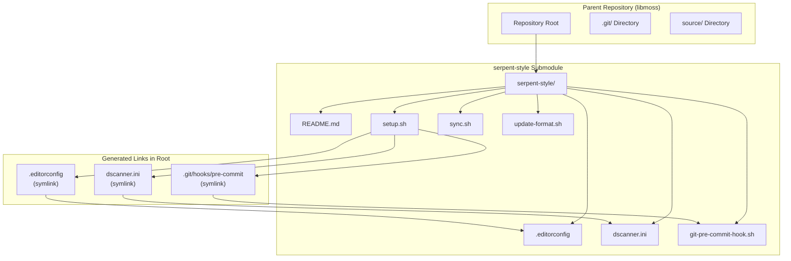
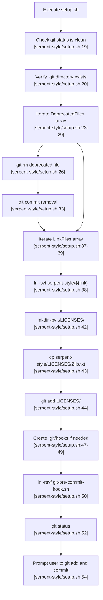
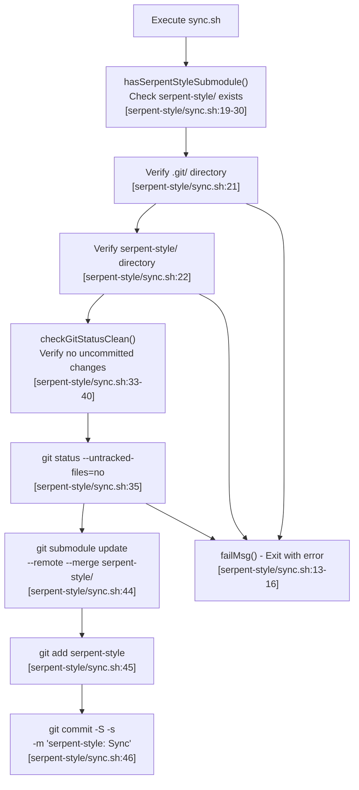
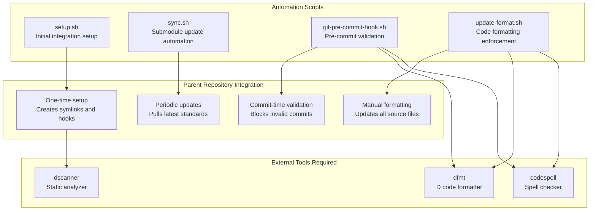
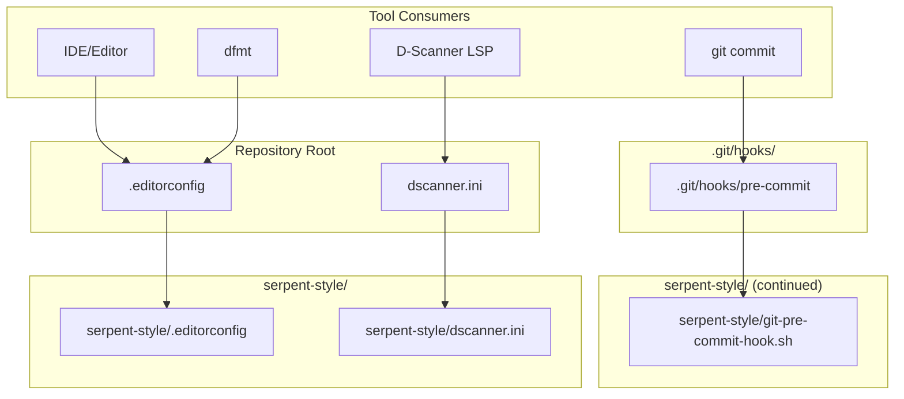

# serpent-style Subsystem

Relevant source files

* [serpent-style/README.md](../serpent-style/README.md)
* [serpent-style/setup.sh](../serpent-style/setup.sh)
* [serpent-style/sync.sh](../serpent-style/sync.sh)

## Purpose and Scope

The `serpent-style` subsystem is a git submodule that provides centralized code style enforcement and development tooling configuration for libmoss and other Serpent OS projects. This subsystem delivers standardized configuration files, automation scripts, and git hooks that ensure consistent code formatting, static analysis, and pre-commit validation across all projects that include it.

For detailed information about the code style standards enforced by this subsystem, see [Code Style Standards](5.1-code-style-standards). For information about the static analysis checks configured through this subsystem, see [Static Analysis with D-Scanner](5.2-static-analysis-with-d-scanner). For details on the git hooks installed by this subsystem, see [Git Hooks and Pre-commit Checks](5.3-git-hooks-and-pre-commit-checks). For the formatting tools utilized, see [Code Formatting Tools](5.4-code-formatting-tools).

This page documents the subsystem's architecture, setup process, synchronization mechanism, and integration points with the parent repository.

**Sources:** [serpent-style/README.md1-75](../serpent-style/README.md#L1-L75)

## Submodule Architecture

The serpent-style subsystem is implemented as a git submodule hosted at `https://gitlab.com/serpent-os/core/serpent-style.git`. When added to a parent project like libmoss, it creates a `serpent-style/` directory containing all necessary configuration files and scripts.



**Diagram: serpent-style Submodule Integration Architecture**

The submodule approach ensures that all Serpent OS projects reference a single authoritative source for code style configuration. When the upstream serpent-style repository is updated, all projects can synchronize to the latest standards using the `sync.sh` script.

**Sources:** [serpent-style/README.md1-10](../serpent-style/README.md#L1-L10) [serpent-style/setup.sh1-55](../serpent-style/setup.sh#L1-L55)

## Setup Process

### Initial Submodule Addition

The serpent-style submodule is added to a parent project using the standard git submodule command:

```
git submodule add https://gitlab.com/serpent-os/core/serpent-style.git
```

This creates the `serpent-style/` directory and registers it in `.gitmodules`.

### Setup Script Execution

The `setup.sh` script ([serpent-style/setup.sh1-55](../serpent-style/setup.sh#L1-L55)) orchestrates the complete integration of serpent-style into the parent project. It must be executed from the repository root.



**Diagram: setup.sh Execution Flow**

### Setup Script Operations

The `setup.sh` script performs the following operations in sequence:

| Operation | Description | Files Affected |
| --- | --- | --- |
| **Validation** | Ensures git tree is clean and script runs from repository root | `.git/` directory check |
| **Deprecation** | Removes obsolete files like `scripts/update_format.sh` and old `LICENSE` | Files in `DeprecatedFiles` array |
| **Symlink Creation** | Creates symbolic links for `.editorconfig` and `dscanner.ini` in root | `.editorconfig`, `dscanner.ini` |
| **License Provisioning** | Copies REUSE-compatible license files to `LICENSES/` directory | `LICENSES/Zlib.txt` |
| **Hook Installation** | Installs pre-commit hook in `.git/hooks/` | `.git/hooks/pre-commit` |

The script uses `ln -svf` for creating symlinks ([serpent-style/setup.sh38](../serpent-style/setup.sh#L38-L38)), which forces symlink creation and provides verbose output. For the git hook, it uses `ln -rsvf` ([serpent-style/setup.sh50](../serpent-style/setup.sh#L50-L50)), where the `-r` flag creates relative symlinks to avoid dangling references.

**Sources:** [serpent-style/setup.sh1-55](../serpent-style/setup.sh#L1-L55) [serpent-style/README.md11-20](../serpent-style/README.md#L11-L20)

## Synchronization Mechanism

### sync.sh Script

The `sync.sh` script ([serpent-style/sync.sh1-47](../serpent-style/sync.sh#L1-L47)) provides an automated mechanism for updating the serpent-style submodule to the latest upstream version and committing the change with a standardized commit message.



**Diagram: sync.sh Synchronization Workflow**

### Synchronization Operations

The synchronization process consists of several validation and update stages:

**Validation Functions:**

* **`hasSerpentStyleSubmodule()`** ([serpent-style/sync.sh19-30](../serpent-style/sync.sh#L19-L30)): Verifies that the current directory is a git repository with a `serpent-style/` submodule present. Calls `failMsg()` if validation fails.
* **`checkGitStatusClean()`** ([serpent-style/sync.sh33-40](../serpent-style/sync.sh#L33-L40)): Ensures the git working tree has no uncommitted changes using `git status --untracked-files=no --porcelain`. This prevents the sync operation from overwriting local modifications.

**Update Process:**

The actual synchronization ([serpent-style/sync.sh44-46](../serpent-style/sync.sh#L44-L46)) executes three git commands in sequence:

1. `git submodule update --remote --merge serpent-style/` - Updates the submodule to the latest commit from the remote repository
2. `git add serpent-style` - Stages the submodule pointer update
3. `git commit -S -s -m "serpent-style: Sync"` - Creates a signed, signed-off commit with a standardized message

**Sources:** [serpent-style/sync.sh1-47](../serpent-style/sync.sh#L1-L47)

## File Assets Provided

### Configuration Files

The serpent-style submodule provides several configuration files that are symlinked into the parent repository:

| File | Purpose | Consumer | Location After Setup |
| --- | --- | --- | --- |
| `.editorconfig` | Editor formatting rules and indentation standards | IDE/Editor plugins, `dfmt` | Root directory (symlink) |
| `dscanner.ini` | Static analysis rules and LSP configuration | D-Scanner, LSP servers | Root directory (symlink) |

The `.editorconfig` file ([serpent-style/.editorconfig](../serpent-style/.editorconfig)) contains language-specific formatting rules parsed by both text editors and the `dfmt` code formatter. This ensures consistent indentation, line endings, and whitespace handling across all development environments.

The `dscanner.ini` file ([serpent-style/dscanner.ini](../serpent-style/dscanner.ini)) configures static analysis checks performed by D-Scanner, enabling LSP integration for real-time code analysis in IDEs.

**Sources:** [serpent-style/README.md21-41](../serpent-style/README.md#L21-L41) [serpent-style/setup.sh10-39](../serpent-style/setup.sh#L10-L39)

### Automation Scripts



**Diagram: Automation Scripts and Their Integration Points**

The four main scripts serve distinct purposes in the development workflow:

**`setup.sh`** ([serpent-style/setup.sh1-55](../serpent-style/setup.sh#L1-L55)): One-time initialization script that integrates serpent-style into the parent repository. Creates symlinks, installs hooks, and provisions license files. Must be run after adding the submodule.

**`sync.sh`** ([serpent-style/sync.sh1-47](../serpent-style/sync.sh#L1-L47)): Synchronization script that updates the submodule to the latest upstream version. Typically run periodically to adopt new style standards or tool configurations.

**`git-pre-commit-hook.sh`** ([serpent-style/git-pre-commit-hook.sh](../serpent-style/git-pre-commit-hook.sh)): Pre-commit hook that validates code formatting and spell-checking before allowing commits. Installed at `.git/hooks/pre-commit` by `setup.sh`.

**`update-format.sh`** ([serpent-style/update-format.sh](../serpent-style/update-format.sh)): Manual formatting script that applies `dfmt` formatting to all source files and runs `codespell` checks. Can be executed on-demand to reformat the entire codebase.

**Sources:** [serpent-style/README.md11-49](../serpent-style/README.md#L11-L49) [serpent-style/setup.sh1-55](../serpent-style/setup.sh#L1-L55) [serpent-style/sync.sh1-47](../serpent-style/sync.sh#L1-L47)

### Tool Dependencies

The serpent-style subsystem requires two external command-line tools to be present in the user's `$PATH`:

**`dfmt`** - D code formatter that parses the `.editorconfig` file and applies formatting rules. Projects using serpent-style scripts will exit with an error if `dfmt` is not installed. More information: <https://github.com/dlang-community/dfmt>

**`codespell`** - Spell-checking tool used to catch common typos in code and comments. Scripts will fail if `codespell` is not found. More information: <https://pypi.org/project/codespell/>

**Sources:** [serpent-style/README.md31-48](../serpent-style/README.md#L31-L48)

## Integration Points with Parent Repository

### Symlink Architecture

The serpent-style subsystem integrates with the parent repository through a symlink-based architecture. This approach allows configuration files to remain in the submodule while being accessible from expected locations:



**Diagram: Symlink Architecture and Tool Integration**

This architecture provides several benefits:

1. **Single Source of Truth**: Configuration files exist only in the serpent-style submodule
2. **Automatic Updates**: When the submodule is updated via `sync.sh`, all projects automatically use new configurations
3. **No Duplication**: Parent repositories don't maintain copies of configuration files
4. **Tool Compatibility**: Tools expect configuration files in standard locations (root directory, `.git/hooks/`)

**Sources:** [serpent-style/setup.sh36-50](../serpent-style/setup.sh#L36-L50) [serpent-style/README.md11-20](../serpent-style/README.md#L11-L20)

### Deprecated Asset Management

The `setup.sh` script includes logic to remove deprecated files from parent repositories ([serpent-style/setup.sh9-34](../serpent-style/setup.sh#L9-L34)):

```
DeprecatedFiles=("scripts/update_format.sh", "LICENSE")
```

When `setup.sh` detects these files, it:

1. Removes them using `git rm`
2. Creates a signed commit with message "serpent-style: Remove deprecated assets"

This ensures clean migration from older project structures that may have maintained their own copies of formatting scripts or license files. The `LICENSE` file is deprecated because serpent-style promotes REUSE-compliant licensing with individual license files in the `LICENSES/` directory.

**Sources:** [serpent-style/setup.sh9-34](../serpent-style/setup.sh#L9-L34)

### Comment Formatting Standards

While `dfmt` handles code formatting, it cannot parse or format comments. The serpent-style subsystem documents expected comment formatting conventions ([serpent-style/README.md50-74](../serpent-style/README.md#L50-L74)):

**Documentation Comments:**

* Multi-line: Use `/** ... */` with leading asterisks on each line
* Single sentence: Use `/** ... */` on multiple lines with proper punctuation
* Avoid: Single-line `/** ... */` format (frowned upon)

**Regular Comments:**

* Use `/* ... */` for single-line comments without punctuation
* Avoid: Double-slash `//` comments (reserved for FIXME/TODO annotations)

These standards ensure readable and maintainable comments across all Serpent OS projects.

**Sources:** [serpent-style/README.md50-74](../serpent-style/README.md#L50-L74)

### REUSE Compliance

The setup script provisions REUSE-compliant licensing by creating a `LICENSES/` directory and copying license text files ([serpent-style/setup.sh41-44](../serpent-style/setup.sh#L41-L44)):

```
mkdir -pv ./LICENSES/
cp -vf serpent-style/LICENSES/Zlib.txt ./LICENSES/
git add LICENSES/
```

This follows the REUSE specification for machine-readable licensing information, replacing traditional single-file LICENSE approaches. Each source file uses SPDX headers to reference license files in the `LICENSES/` directory.

**Sources:** [serpent-style/setup.sh41-44](../serpent-style/setup.sh#L41-L44)