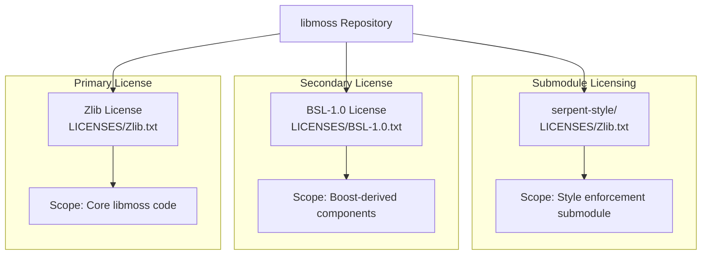
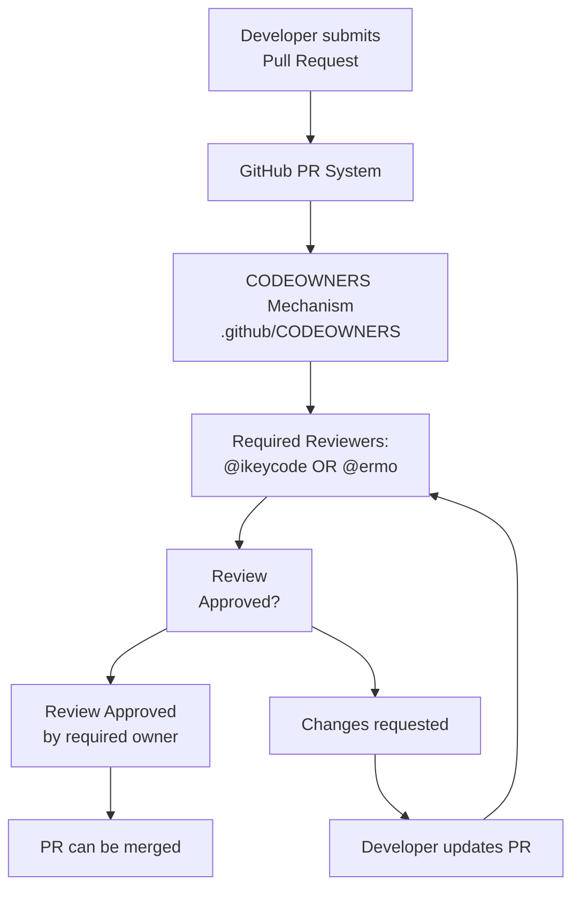
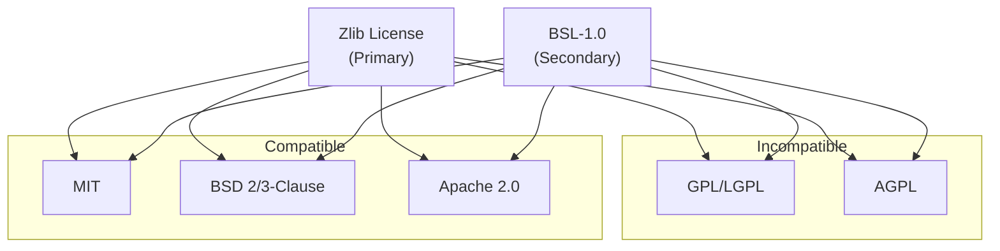

# Licensing and Legal

Relevant source files

* [.github/CODEOWNERS](../.github/CODEOWNERS)
* [LICENSES/BSL-1.0.txt](../LICENSES/BSL-1.0.txt)
* [LICENSES/Zlib.txt](../LICENSES/Zlib.txt)
* [serpent-style/LICENSES/Zlib.txt](../serpent-style/LICENSES/Zlib.txt)

This document covers the licensing terms, copyright information, and code ownership policies for the libmoss repository. It explains the dual-license structure, the specific terms of each license, and the code review process enforced through GitHub's CODEOWNERS mechanism.

For information about project structure and organization, see [Project Structure](7-project-structure). For development contribution guidelines, see [Development Guide](5-development-guide).

---

## Licensing Overview

The libmoss repository employs a dual-license structure to accommodate different types of contributed code and dependencies. The project maintains separate license files in the `LICENSES/` directory following the REUSE specification pattern.

### License Structure Diagram



**Sources:** [LICENSES/Zlib.txt1-20](../LICENSES/Zlib.txt#L1-L20) [LICENSES/BSL-1.0.txt1-23](../LICENSES/BSL-1.0.txt#L1-L23) [serpent-style/LICENSES/Zlib.txt1-20](../serpent-style/LICENSES/Zlib.txt#L1-L20)

---

## Zlib License

The primary license for libmoss is the Zlib license, a permissive free software license. This license applies to the majority of the codebase developed by Serpent OS contributors.

### Key Terms

| Aspect | Details |
| --- | --- |
| **Copyright Holder** | Serpent OS Developers |
| **Copyright Period** | 2020-2022 |
| **License File** | `LICENSES/Zlib.txt` |
| **Type** | Permissive, attribution required |

### Permissions Granted

The Zlib license grants the following permissions without fee:

1. **Use** - Software may be used for any purpose, including commercial applications
2. **Modify** - Source code may be altered and redistributed
3. **Redistribute** - Both original and modified versions may be distributed

### Restrictions and Requirements

The license imposes three specific restrictions:

**Restriction 1: Attribution Required**

```
The origin of this software must not be misrepresented; you must not
claim that you wrote the original software.
```

[LICENSES/Zlib.txt11-12](../LICENSES/Zlib.txt#L11-L12)

**Restriction 2: Modified Version Marking**

```
Altered source versions must be plainly marked as such, and must not be
misrepresented as being the original software.
```

[LICENSES/Zlib.txt16-17](../LICENSES/Zlib.txt#L16-L17)

**Restriction 3: License Notice Preservation**

```
This notice may not be removed or altered from any source distribution.
```

[LICENSES/Zlib.txt19](../LICENSES/Zlib.txt#L19-L19)

### Warranty Disclaimer

The software is provided "as-is" with no warranty of any kind. The copyright holders and authors are not liable for damages arising from the use of the software. This is a standard limitation of liability clause in permissive open-source licenses.

**Sources:** [LICENSES/Zlib.txt1-20](../LICENSES/Zlib.txt#L1-L20)

---

## Boost Software License (BSL-1.0)

The BSL-1.0 license is used for components that derive from or are compatible with Boost libraries. This license is slightly more permissive than Zlib in certain aspects.

### License Characteristics

| Aspect | Details |
| --- | --- |
| **License File** | `LICENSES/BSL-1.0.txt` |
| **Version** | 1.0 (August 17, 2003) |
| **Type** | Permissive, minimal restrictions |

### Granted Rights

The BSL-1.0 grants broad permissions to any person or organization obtaining the software:

* **Use** - Execute and run the software
* **Reproduce** - Make copies of the software
* **Display and Distribute** - Show and share the software
* **Transmit** - Transfer the software to others
* **Prepare Derivative Works** - Create modified versions
* **Sublicense** - Grant these same rights to third parties

### License Notice Requirement

The BSL-1.0 has a single core requirement:

```
The copyright notices in the Software and this entire statement, including
the above license grant, this restriction and the following disclaimer,
must be included in all copies of the Software, in whole or in part, and
all derivative works of the Software
```

[LICENSES/BSL-1.0.txt10-14](../LICENSES/BSL-1.0.txt#L10-L14)

### Machine Code Exception

The license includes an important exception for compiled binaries:

```
unless such copies or derivative works are solely in the form of
machine-executable object code generated by a source language processor.
```

[LICENSES/BSL-1.0.txt14-15](../LICENSES/BSL-1.0.txt#L14-L15)

This means that distributed compiled binaries do not need to include the full license text, simplifying binary distribution for end-users.

**Sources:** [LICENSES/BSL-1.0.txt1-23](../LICENSES/BSL-1.0.txt#L1-L23)

---

## Copyright Information

### Primary Copyright Holder

The primary copyright for libmoss is held collectively by:

```
Copyright © 2020-2022 Serpent OS Developers
```

[LICENSES/Zlib.txt1](../LICENSES/Zlib.txt#L1-L1)

This indicates that contributions to the project are made by various developers within the Serpent OS project, and copyright is attributed to the developer community as a whole rather than to individual contributors.

### Submodule Copyright

The `serpent-style` submodule maintains its own copyright notice:

```
Copyright © 2020-2022 Serpent OS Developers
```

[serpent-style/LICENSES/Zlib.txt1](../serpent-style/LICENSES/Zlib.txt#L1-L1)

This submodule is licensed under the same Zlib license terms as the main repository, ensuring consistency across the project's style enforcement tooling.

### Copyright Period

The copyright date range `2020-2022` reflects the initial development period. Projects typically do not update copyright years for every minor change; the range represents the period when substantial original work was completed.

**Sources:** [LICENSES/Zlib.txt1](../LICENSES/Zlib.txt#L1-L1) [serpent-style/LICENSES/Zlib.txt1](../serpent-style/LICENSES/Zlib.txt#L1-L1)

---

## Code Ownership and Review

The repository implements a code ownership policy through GitHub's CODEOWNERS mechanism. This ensures that changes undergo appropriate technical review before merging.

### CODEOWNERS Configuration

The `.github/CODEOWNERS` file defines the review requirements:

```
* @ikeycode @ermo
```

[.github/CODEOWNERS1](../.github/CODEOWNERS#L1-L1)

This configuration applies to all files in the repository (`*` wildcard) and requires review from either `@ikeycode` or `@ermo` before pull requests can be merged.

### Code Review Workflow



### Code Owner Responsibilities

The designated code owners (`@ikeycode` and `@ermo`) are responsible for:

1. **Technical Review** - Evaluating code quality, design decisions, and implementation correctness
2. **Style Compliance** - Ensuring adherence to the serpent-style guidelines (see [Code Style Standards](5.1-code-style-standards))
3. **API Stability** - Reviewing changes to public APIs for backward compatibility
4. **Security Assessment** - Identifying potential security issues in contributed code
5. **Documentation** - Verifying that significant changes include appropriate documentation updates

### Review Process Integration

The CODEOWNERS mechanism integrates with the broader quality assurance workflow:

| Quality Gate | Automation Level | Owner Involvement |
| --- | --- | --- |
| **Pre-commit Hooks** | Fully automated | None required |
| **CI Testing** | Fully automated | None required |
| **CODEOWNERS Review** | Manual approval required | Required |
| **Merge** | Semi-automated (requires approval) | Must be approved |

This ensures that while automated tools catch common issues (formatting, static analysis, tests), human review catches design issues, API concerns, and architectural decisions that cannot be automatically validated.

**Sources:** [.github/CODEOWNERS1-2](../.github/CODEOWNERS#L1-L2)

---

## License Compliance for Contributors

### Contributor License Agreement

libmoss does not require a formal Contributor License Agreement (CLA). By submitting code to the repository, contributors implicitly agree that their contributions will be licensed under the same terms as the project (Zlib or BSL-1.0 as appropriate).

### File Headers

While not universally enforced across all files, the project's style templates include license headers. For example, the D language template includes provisions for SPDX license identifiers, which is the recommended practice for clearly indicating file-level licensing.

### Third-Party Code

When incorporating third-party code:

1. **License Compatibility** - Ensure the third-party license is compatible with Zlib and BSL-1.0
2. **Attribution** - Maintain original copyright notices and license information
3. **LICENSES Directory** - Add the third-party license text to `LICENSES/` if introducing a new license
4. **Documentation** - Document the third-party dependency in the appropriate wiki pages (see [External Dependencies](6-external-dependencies))

### Acceptable Compatible Licenses

The following licenses are generally compatible with libmoss's licensing:

* **MIT License** - Fully compatible, similar attribution requirements
* **BSD 2-Clause/3-Clause** - Compatible, reasonable restrictions
* **Apache 2.0** - Compatible for dependencies (though patent grant differs from Zlib)
* **Public Domain** - No restrictions
* **Unlicense** - Effectively public domain

**Incompatible Licenses:**

* **GPL/LGPL** - Copyleft requirements conflict with permissive structure
* **AGPL** - Network copyleft not compatible
* **Proprietary** - Closed-source code cannot be included

**Sources:** [LICENSES/Zlib.txt1-20](../LICENSES/Zlib.txt#L1-L20) [LICENSES/BSL-1.0.txt1-23](../LICENSES/BSL-1.0.txt#L1-L23)

---

## Summary

### License Quick Reference

| Component | License | File Path |
| --- | --- | --- |
| Core libmoss code | Zlib | `LICENSES/Zlib.txt` |
| Boost-derived components | BSL-1.0 | `LICENSES/BSL-1.0.txt` |
| serpent-style submodule | Zlib | `serpent-style/LICENSES/Zlib.txt` |

### Key Takeaways

1. **Dual License Structure** - libmoss uses Zlib as primary license, BSL-1.0 for Boost compatibility
2. **Permissive Terms** - Both licenses allow commercial use, modification, and redistribution
3. **Attribution Required** - Both licenses require preservation of copyright notices
4. **Code Ownership** - All changes must be reviewed by `@ikeycode` or `@ermo` via CODEOWNERS
5. **No CLA Required** - Contributors retain copyright but grant usage rights under project licenses

### License Compatibility Matrix



**Sources:** [LICENSES/Zlib.txt1-20](../LICENSES/Zlib.txt#L1-L20) [LICENSES/BSL-1.0.txt1-23](../LICENSES/BSL-1.0.txt#L1-L23) [.github/CODEOWNERS1-2](../.github/CODEOWNERS#L1-L2)