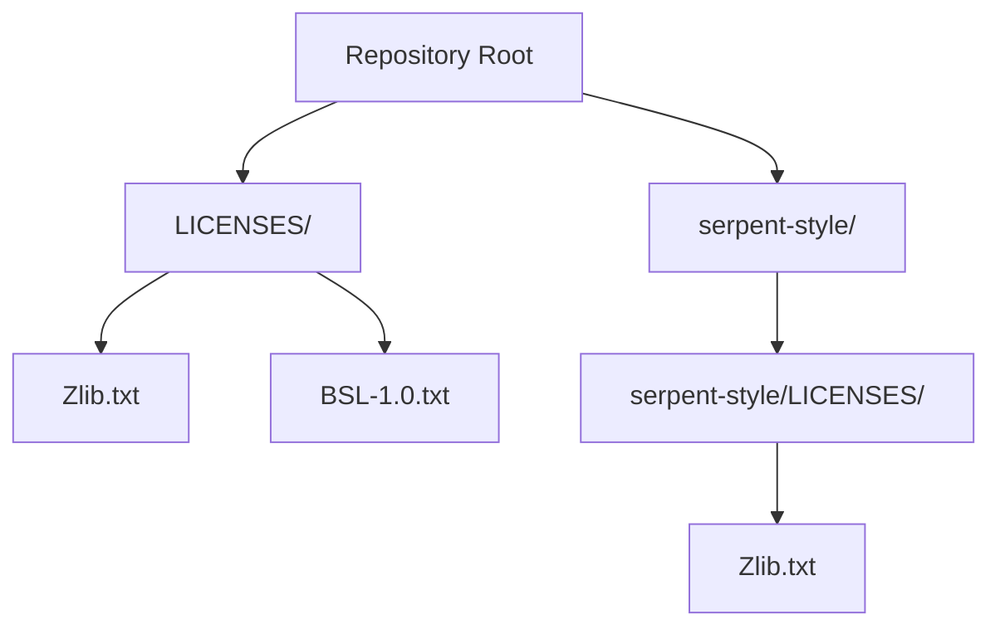
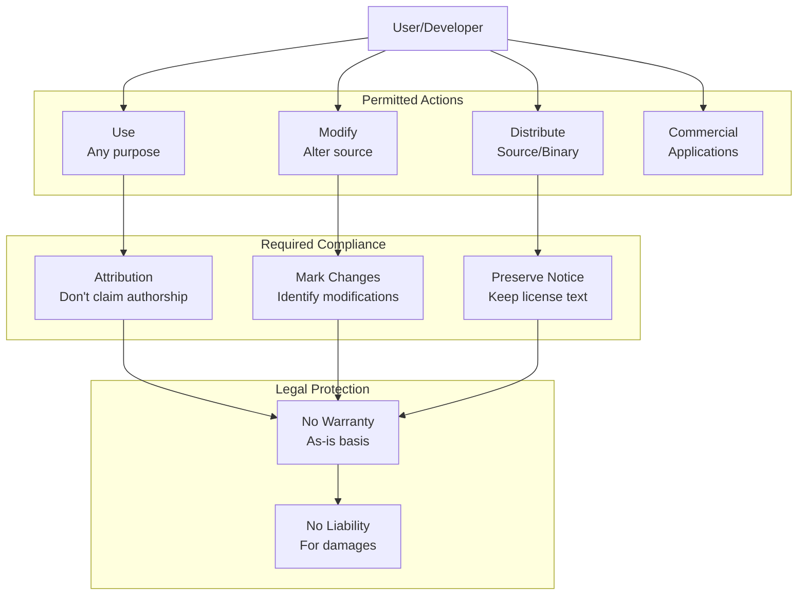
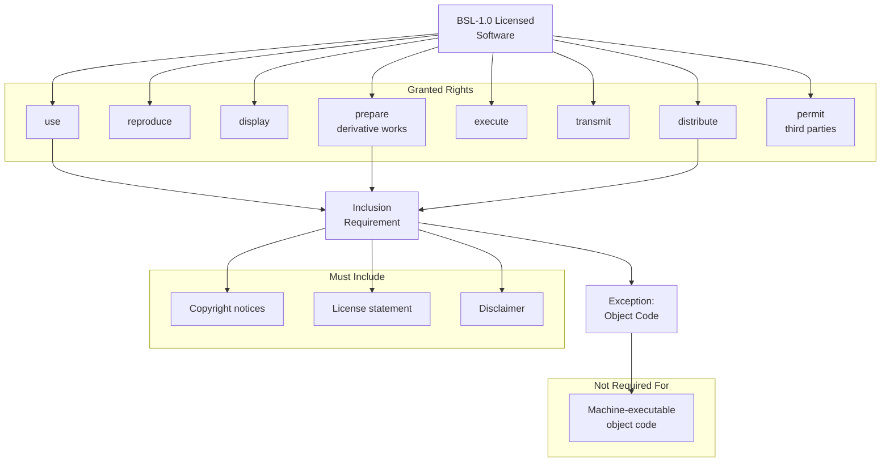
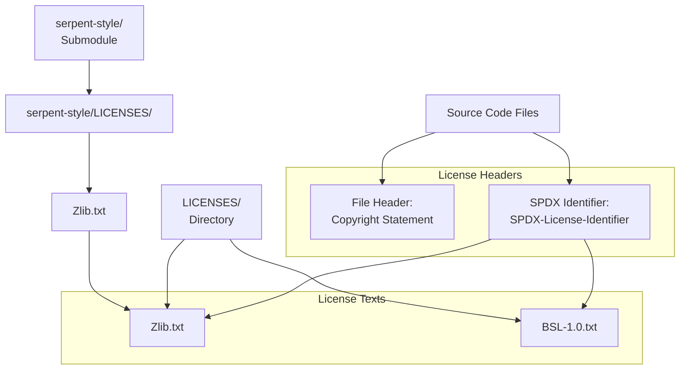

# License Terms

Relevant source files

* [LICENSES/BSL-1.0.txt](../LICENSES/BSL-1.0.txt)
* [LICENSES/Zlib.txt](../LICENSES/Zlib.txt)
* [serpent-style/LICENSES/Zlib.txt](../serpent-style/LICENSES/Zlib.txt)

## Purpose and Scope

This document details the licensing terms governing the libmoss codebase. It covers the two licenses used in the project (Zlib and BSL-1.0), their specific terms and conditions, and the location of license files within the repository structure. For information about code ownership and review processes, see [Code Ownership](8.2-code-ownership).

---

## Licensing Overview

The libmoss project employs a dual-license structure using two permissive open-source licenses:

| License | File Location | Primary Use |
| --- | --- | --- |
| **Zlib** | [LICENSES/Zlib.txt](../LICENSES/Zlib.txt) | Primary codebase license |
| **BSL-1.0** (Boost Software License) | [LICENSES/BSL-1.0.txt](../LICENSES/BSL-1.0.txt) | Secondary/component license |

Both licenses are highly permissive, allowing commercial use, modification, and redistribution with minimal restrictions.

**License File Structure**



Sources: [LICENSES/Zlib.txt](../LICENSES/Zlib.txt) [LICENSES/BSL-1.0.txt](../LICENSES/BSL-1.0.txt) [serpent-style/LICENSES/Zlib.txt](../serpent-style/LICENSES/Zlib.txt)

---

## Zlib License

The Zlib license is the primary license for the libmoss codebase. The copyright is held by Serpent OS Developers for the years 2020-2022.

### License Text Location

* Main repository: [LICENSES/Zlib.txt1-20](../LICENSES/Zlib.txt#L1-L20)
* Serpent-style submodule: [serpent-style/LICENSES/Zlib.txt1-20](../serpent-style/LICENSES/Zlib.txt#L1-L20)

### Copyright Holders

```
Copyright © 2020-2022 Serpent OS Developers
```

[LICENSES/Zlib.txt1](../LICENSES/Zlib.txt#L1-L1)

### Key Terms and Conditions

The Zlib license grants the following permissions with minimal restrictions:

**Permissions Granted:**

* Use for any purpose, including commercial applications [LICENSES/Zlib.txt7-8](../LICENSES/Zlib.txt#L7-L8)
* Modification and alteration of the source code [LICENSES/Zlib.txt8](../LICENSES/Zlib.txt#L8-L8)
* Redistribution in both source and binary forms [LICENSES/Zlib.txt8-9](../LICENSES/Zlib.txt#L8-L9)

**Restrictions:**

1. **Origin Attribution**: Users must not misrepresent the origin of the software or claim authorship of the original work [LICENSES/Zlib.txt11-12](../LICENSES/Zlib.txt#L11-L12)
2. **Modification Marking**: Altered source versions must be clearly marked as modified and not misrepresented as the original software [LICENSES/Zlib.txt16-17](../LICENSES/Zlib.txt#L16-L17)
3. **Notice Preservation**: The license notice must not be removed or altered from any source distribution [LICENSES/Zlib.txt19](../LICENSES/Zlib.txt#L19-L19)

**Warranty Disclaimer:**
The software is provided "as-is" without any express or implied warranty. The authors are not liable for any damages arising from the use of the software [LICENSES/Zlib.txt3-5](../LICENSES/Zlib.txt#L3-L5)

### License Permissions Flow



Sources: [LICENSES/Zlib.txt3-19](../LICENSES/Zlib.txt#L3-L19)

---

## BSL-1.0 (Boost Software License)

The Boost Software License Version 1.0 is also included in the repository, dated August 17th, 2003.

### License Text Location

[LICENSES/BSL-1.0.txt1-23](../LICENSES/BSL-1.0.txt#L1-L23)

### Key Terms and Conditions

**Permissions Granted:**
The BSL-1.0 grants broad permissions to any person or organization obtaining the software [LICENSES/BSL-1.0.txt3-8](../LICENSES/BSL-1.0.txt#L3-L8):

* Use
* Reproduce
* Display
* Distribute
* Execute
* Transmit
* Prepare derivative works
* Permit third parties to do the same

**Requirements:**

The license imposes a single inclusion requirement [LICENSES/BSL-1.0.txt10-15](../LICENSES/BSL-1.0.txt#L10-L15):

```
The copyright notices in the Software and this entire statement, including
the above license grant, this restriction and the following disclaimer,
must be included in all copies of the Software, in whole or in part, and
all derivative works of the Software...
```

**Exception**: The inclusion requirement does not apply to machine-executable object code generated by a source language processor [LICENSES/BSL-1.0.txt13-15](../LICENSES/BSL-1.0.txt#L13-L15)

**Warranty Disclaimer:**
Similar to the Zlib license, BSL-1.0 provides the software "AS IS" without warranties of any kind [LICENSES/BSL-1.0.txt17-23](../LICENSES/BSL-1.0.txt#L17-L23) including:

* No warranty of merchantability
* No warranty of fitness for purpose
* No warranty of title
* No warranty of non-infringement
* No liability for damages

### BSL-1.0 Permission Structure



Sources: [LICENSES/BSL-1.0.txt3-15](../LICENSES/BSL-1.0.txt#L3-L15)

---

## License Comparison

The following table compares the key characteristics of both licenses used in libmoss:

| Feature | Zlib | BSL-1.0 |
| --- | --- | --- |
| **Permissiveness** | Very permissive | Very permissive |
| **Commercial Use** | ✓ Explicitly allowed | ✓ Allowed |
| **Modification** | ✓ Allowed | ✓ Allowed (derivative works) |
| **Redistribution** | ✓ Allowed | ✓ Allowed |
| **Attribution** | Required (don't claim authorship) | Required (include notices) |
| **Mark Modifications** | ✓ Required | Not explicitly required |
| **Binary Distribution** | Notice required | Notice not required for object code |
| **Copyleft** | ✗ No copyleft | ✗ No copyleft |
| **Patent Grant** | Not addressed | Not addressed |
| **Warranty** | Disclaimed | Disclaimed |
| **Liability** | Disclaimed | Disclaimed |

Sources: [LICENSES/Zlib.txt1-20](../LICENSES/Zlib.txt#L1-L20) [LICENSES/BSL-1.0.txt1-23](../LICENSES/BSL-1.0.txt#L1-L23)

---

## Practical Implications

### For Users of libmoss

**What You Can Do:**

* Use libmoss in proprietary commercial software
* Modify the source code to suit your needs
* Redistribute modified or unmodified versions
* Integrate libmoss into larger projects with different licenses

**What You Must Do:**

* Retain the license text in source distributions (both licenses)
* Do not claim you wrote the original software (Zlib requirement)
* Mark any modifications clearly in source code (Zlib requirement)
* Include copyright notices in source distributions (BSL-1.0 requirement)

**What You Don't Have to Do:**

* Release your modifications publicly
* Use the same license for your project
* Include license text in compiled binaries (BSL-1.0 exception)
* Provide warranty or support

### License File References in Code



Sources: [LICENSES/Zlib.txt](../LICENSES/Zlib.txt) [LICENSES/BSL-1.0.txt](../LICENSES/BSL-1.0.txt) [serpent-style/LICENSES/Zlib.txt](../serpent-style/LICENSES/Zlib.txt)

---

## License File Locations Summary

### Main Repository Licenses

The primary license files are located in the `LICENSES/` directory at the repository root:

* **Zlib License**: [LICENSES/Zlib.txt](../LICENSES/Zlib.txt)
* **BSL-1.0 License**: [LICENSES/BSL-1.0.txt](../LICENSES/BSL-1.0.txt)

### Submodule Licenses

The `serpent-style` git submodule contains its own copy of the Zlib license:

* **Zlib License (serpent-style)**: [serpent-style/LICENSES/Zlib.txt](../serpent-style/LICENSES/Zlib.txt)

This duplication ensures that the serpent-style submodule can be used independently while maintaining proper license attribution.

Sources: [LICENSES/Zlib.txt](../LICENSES/Zlib.txt) [LICENSES/BSL-1.0.txt](../LICENSES/BSL-1.0.txt) [serpent-style/LICENSES/Zlib.txt](../serpent-style/LICENSES/Zlib.txt)