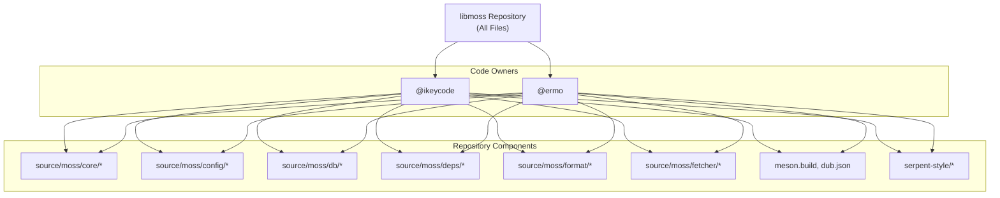
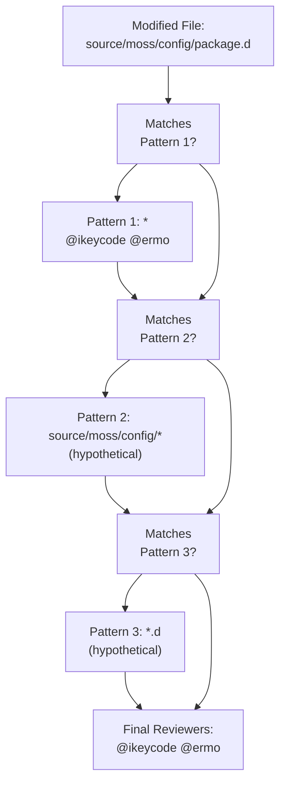
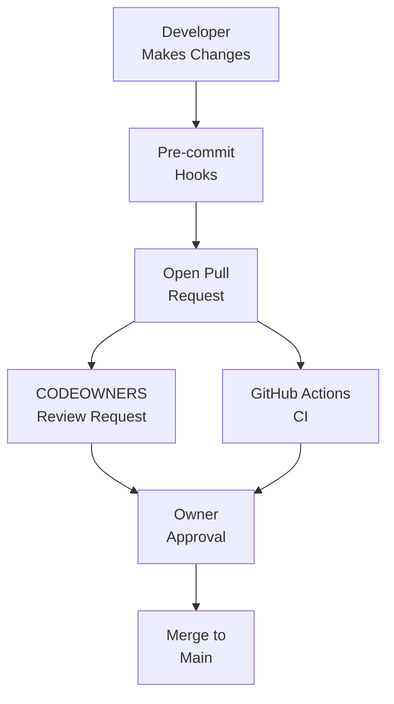

# Code Ownership

Relevant source files

* [.github/CODEOWNERS](../.github/CODEOWNERS)

## Purpose and Scope

This page documents the code ownership and review process for the libmoss repository. It explains the `.github/CODEOWNERS` file mechanism, identifies the current code owners, and describes how ownership affects the pull request review workflow. For information about the project's license terms, see [License Terms](8.1-license-terms).

## CODEOWNERS Mechanism

The libmoss repository uses GitHub's `CODEOWNERS` feature to enforce mandatory code review. This mechanism automatically requests reviews from designated individuals when pull requests modify files matching specific patterns.

The CODEOWNERS file is located at [.github/CODEOWNERS1-2](../.github/CODEOWNERS#L1-L2) and uses a simple pattern-matching syntax where each line specifies a file pattern followed by GitHub usernames prefixed with `@`.

### File Format

The CODEOWNERS file syntax follows these rules:

| Element | Description | Example |
| --- | --- | --- |
| **Pattern** | File path pattern using glob syntax | `*`, `source/moss/config/*`, `*.d` |
| **Owner** | GitHub username with `@` prefix | `@ikeycode`, `@ermo` |
| **Separator** | Whitespace between pattern and owners | (space) |
| **Comment** | Lines starting with `#` | `# Configuration files` |

Multiple owners can be specified for a single pattern by listing them space-separated on the same line.

**Sources:** [.github/CODEOWNERS1-2](../.github/CODEOWNERS#L1-L2)

## Current Ownership Structure

The libmoss repository implements a flat ownership model where all files are owned by the same individuals, regardless of component or subsystem.

### Ownership Configuration



**Diagram: Repository-Wide Ownership Model**

The pattern `*` at [.github/CODEOWNERS1](../.github/CODEOWNERS#L1-L1) indicates that any file in any directory requires review from both `@ikeycode` and `@ermo`.

**Sources:** [.github/CODEOWNERS1-2](../.github/CODEOWNERS#L1-L2)

### Owner Responsibilities

| Owner | GitHub Username | Review Scope |
| --- | --- | --- |
| **Primary Owner** | `@ikeycode` | All repository files and directories |
| **Secondary Owner** | `@ermo` | All repository files and directories |

Both owners have equal authority and responsibility across the entire codebase. This flat structure ensures that critical changes receive review from both maintainers regardless of which subsystem is affected.

**Sources:** [.github/CODEOWNERS1-2](../.github/CODEOWNERS#L1-L2)

## Pull Request Review Workflow

GitHub integrates CODEOWNERS into the pull request lifecycle by automatically requesting reviews and enforcing approval requirements.

### Review Request Flow

```mermaid
sequenceDiagram
  participant Contributor
  participant GitHub
  participant CODEOWNERS[".github/CODEOWNERS"]
  participant ikeycode["@ikeycode"]
  participant ermo["@ermo"]
  participant CODEOWNERS
  participant ikeycode
  participant ermo

  Contributor->>GitHub: Opens Pull Request
  GitHub->>CODEOWNERS: Reads ownership rules
  CODEOWNERS-->>GitHub: Returns "* @ikeycode @ermo"
  GitHub->>ikeycode: Requests review
  GitHub->>ermo: Requests review
  note over GitHub: PR marked as "Changes requested"
  loop [At least one owner approves]
    ikeycode->>GitHub: Approves PR
    GitHub-->>Contributor: PR ready to merge (if passing CI)
    ikeycode->>GitHub: Approves PR
    ermo->>GitHub: Approves PR
    GitHub-->>Contributor: PR ready to merge (if passing CI)
  end
```

**Diagram: Automated Review Request Sequence**

**Sources:** [.github/CODEOWNERS1-2](../.github/CODEOWNERS#L1-L2)

### Merge Requirements

For a pull request to be eligible for merging:

1. **Automated Review Request**: GitHub automatically requests reviews from `@ikeycode` and `@ermo` when a PR is opened
2. **Approval Requirement**: At least one code owner must approve the changes
3. **CI Validation**: All continuous integration checks must pass (see [Continuous Integration](5.5-continuous-integration))
4. **Code Quality Gates**: Pre-commit hooks and formatting checks must pass (see [Git Hooks and Pre-commit Checks](5.3-git-hooks-and-pre-commit-checks))

The CODEOWNERS mechanism operates alongside other quality gates but focuses specifically on human review approval.

**Sources:** [.github/CODEOWNERS1-2](../.github/CODEOWNERS#L1-L2)

## Ownership Pattern Matching

While the current configuration uses a simple wildcard pattern, the CODEOWNERS format supports more granular control through multiple patterns.

### Pattern Evaluation Order

CODEOWNERS patterns are evaluated from bottom to top, with later patterns overriding earlier ones for matching files:



**Diagram: Pattern Matching and Override Logic**

In the current configuration at [.github/CODEOWNERS1](../.github/CODEOWNERS#L1-L1) only a single pattern exists, so all files match uniformly.

**Sources:** [.github/CODEOWNERS1-2](../.github/CODEOWNERS#L1-L2)

### Potential Pattern Extensions

While not currently implemented, the CODEOWNERS file could be extended to provide component-specific ownership:

| Pattern Example | Purpose | Owners |
| --- | --- | --- |
| `source/moss/config/*` | Configuration subsystem | Component specialists |
| `source/moss/format/*` | Format handling subsystem | Format experts |
| `meson.build` | Build system files | Build maintainers |
| `serpent-style/*` | Style enforcement | Style guide owners |

The flat `*` pattern at [.github/CODEOWNERS1](../.github/CODEOWNERS#L1-L1) currently overrides such specialization, ensuring centralized review by the project maintainers.

**Sources:** [.github/CODEOWNERS1-2](../.github/CODEOWNERS#L1-L2)

## Modifying Code Ownership

Changes to the CODEOWNERS file itself follow the same review process as any other file in the repository.

### Modification Process

1. **Edit CODEOWNERS**: Modify [.github/CODEOWNERS1-2](../.github/CODEOWNERS#L1-L2)
2. **Commit Changes**: Commit the modified file
3. **Open Pull Request**: Submit PR with ownership changes
4. **Required Review**: Current owners (`@ikeycode` and `@ermo`) must approve
5. **Merge**: Once approved, ownership changes take effect immediately

The CODEOWNERS file does not require repository administrator privileges to modify, but changes must pass the existing review workflow.

**Sources:** [.github/CODEOWNERS1-2](../.github/CODEOWNERS#L1-L2)

### Common Modification Scenarios

| Scenario | Implementation | Pattern |
| --- | --- | --- |
| **Add owner to all files** | Append username to line 1 | `* @ikeycode @ermo @newowner` |
| **Component-specific owner** | Add pattern before `*` | `source/moss/db/* @dbexpert` |
| **Remove owner** | Delete username from line 1 | `* @ikeycode` |
| **Exclude directory** | No explicit exclusion syntax | Not supported in CODEOWNERS |

Note that GitHub's CODEOWNERS format does not support negative patterns (exclusions). All ownership must be expressed as positive pattern matches.

**Sources:** [.github/CODEOWNERS1-2](../.github/CODEOWNERS#L1-L2)

## Integration with Development Workflow

The CODEOWNERS mechanism integrates with multiple aspects of the development workflow documented elsewhere in this wiki.

### Workflow Touchpoints



**Diagram: CODEOWNERS in Complete Development Workflow**

The code ownership review occurs in parallel with automated CI validation (see [Continuous Integration](5.5-continuous-integration)) but serves a different purpose. While CI verifies mechanical correctness (compilation, tests, formatting), CODEOWNERS ensures human review of design decisions, API changes, and architectural implications.

**Sources:** [.github/CODEOWNERS1-2](../.github/CODEOWNERS#L1-L2)

### Relationship to Other Quality Gates

| Quality Gate | Purpose | Enforced By | Documentation |
| --- | --- | --- | --- |
| **Code Formatting** | Ensure consistent style | `serpent-style/hooks/pre-commit` | [Git Hooks and Pre-commit Checks](5.3-git-hooks-and-pre-commit-checks) |
| **Static Analysis** | Detect code issues | D-Scanner via `dscanner.ini` | [Static Analysis with D-Scanner](5.2-static-analysis-with-d-scanner) |
| **Continuous Integration** | Verify builds and tests | GitHub Actions | [Continuous Integration](5.5-continuous-integration) |
| **Code Ownership** | Human design review | `.github/CODEOWNERS` | This page |

Each gate serves a complementary role in maintaining code quality. CODEOWNERS specifically addresses the aspects that cannot be automated: design coherence, API compatibility, and strategic direction.

**Sources:** [.github/CODEOWNERS1-2](../.github/CODEOWNERS#L1-L2)